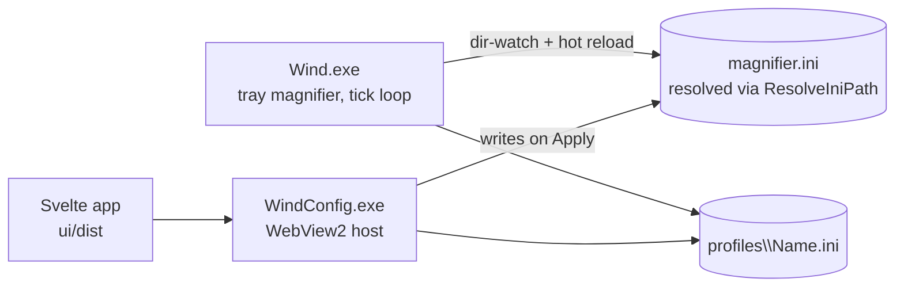
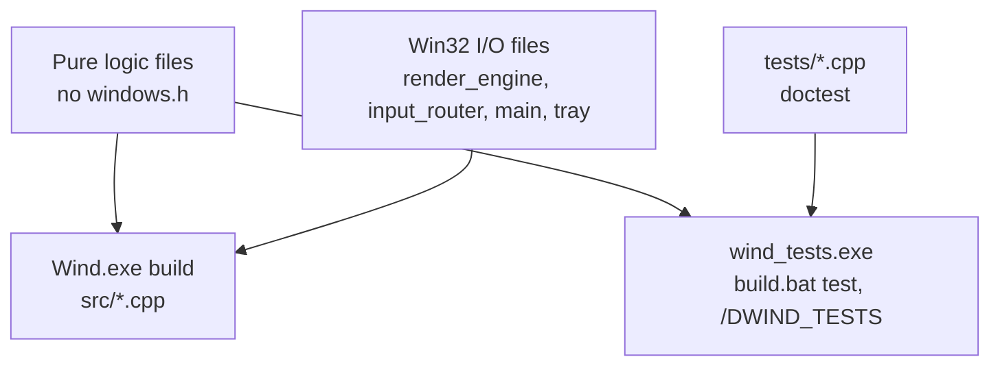

# 01. Overview

Wind is a lightweight standalone fullscreen magnifier for Windows: a replacement for the built-in
Magnify.exe that keeps zoom smooth and sub-pixel, keeps the screen fully interactive while zoomed,
and keeps tracking the mouse even when a game hides, clips, or center-locks the cursor. It ships as
two cooperating binaries, `Wind.exe` (the always-running tray magnifier) and `WindConfig.exe` (an
on-demand settings app), whose only communication channel is the `magnifier.ini` file. This chapter
covers what Wind promises the user, why the code is split the way it is, and what every file in
`src/` does.

## What Wind is

The elevator pitch lives in `README.md`: Wind magnifies the whole screen with smooth continuous
zoom, either by capturing the desktop itself (DXGI Desktop Duplication scaled on the GPU with
Direct3D 11 onto a click-through overlay) or by magnifying inside the compositor (the DWM
fullscreen transform) when a game is in front. A hybrid model picks between those two per zoom-in
and re-picks live when the foreground changes; a third model drives the native Windows Magnifier
for DRM-protected video that blanks under screen capture. The engines and the pick are the subject
of [Engines and the hybrid pick](03-engines.md); this chapter only needs the fact that they exist
and that they all sit behind one interface, `IMagnifierModel` (`src/magnifier_model.h`), driven by
one paced tick loop (`RunTick` in `src/main.cpp`, covered in [The tick loop](02-tick-loop.md)).

Wind targets the primary monitor by default (`multiMonitor=1` follows the cursor's monitor per
zoom-in), covers the desktop, normal apps, and borderless/windowed-fullscreen games.
Exclusive-fullscreen games are explicitly out of scope.

## Product rules

These are commitments, not implementation details. Code that violates one is a bug even if it
"works". They are stated here once so later chapters can refer back instead of re-arguing them.

**The cursor keeps a constant on-screen size at every zoom level.** In every model, in every zoom
mode Wind will ever grow, the pointer must not scale with the magnification. A cursor that grows
with the level is a bug, not a look. The `cursorScaleWithZoom` ini key ships 0; scaling is the
opt-in exception the user owns (`src/config.h`). The render engine satisfies this by drawing the
decoded real cursor (`src/cursor_decode.cpp`) at a fixed sprite size; the transform engine's sprite
lives in desktop space where DWM magnifies it, which is a tracked open item
(`spriteBand16`, the screen-space sprite experiment in `src/transform_model.cpp`), not a design
choice.

**The screen stays interactive while zoomed.** Wind is not a screenshot viewer. Clicks pass through
to the app under the drawn cursor: the render overlay is click-through
(`WS_EX_LAYERED | WS_EX_TRANSPARENT`, `src/render_engine.cpp`) and clicks are routed by syncing
`SetCursorPos` under the drawn cursor each tick, so a click lands exactly on what the user sees.
Hover, tooltips, drags, and text selection all keep working (the drag-follow rule in
`src/drag_follow.h` exists precisely to protect drags from the cursor weld).

**Hold-to-zoom.** The zoom binds are hold gestures: hold zoom-in to ramp in, hold zoom-out to ramp
back, release to stay at the current level. Both held is ambiguous, so the level freezes
(`ZoomController` in `src/zoom_controller.h`, pure and unit-tested). Quick zoom toggles between 1x
and a remembered level (`QuickZoomToggle`, same file). Binds ship unbound; first launch runs a
guided setup that captures the user's choice.

**One shared `maxLevel`.** The zoom ceiling is a single setting across all models. There is no
per-model cap: the historical 12x transform cap turned out to be guarding the NVIDIA MPO 16-bit
overflow bug, which is now handled at its root (the pan wall in `src/cursor_mapper.cpp`, keyed to
MPO boot state via `src/mpo_boot.h`; see [The transform engine](05-transform-engine.md)).

**No driver, no injection.** Wind reads mouse motion at the HID level via Raw Input and swallows
bound keys with ordinary `WH_MOUSE_LL`/`WH_KEYBOARD_LL` hooks (`src/input_router.cpp`). It never
installs a kernel filter driver and never injects into other processes, which keeps it anti-cheat
safe. The accepted cost is documented in `src/inspect_focus.h` and CLAUDE.md: LL hooks cannot
suppress Raw Input, so a bound key still reaches a raw-input game. Game-inspect (issue #144) works
around that for Inspect mode by stealing foreground to an invisible helper window rather than by
blocking input. See [The input pipeline](06-input.md).

**Follow the mouse even when a game owns it.** The lens must keep panning when a game clips,
recenters, or hides the cursor. `LockDetector` (`src/lock_detector.h`) decides free vs game-locked
per tick; locked sessions pan from raw mickeys instead of the OS cursor. Two recent extensions
refine the decision: `lockApps` (issue #221, `src/config.h`) is an exe list whose sessions run the
locked regime outright, no heuristics, and `warpLock` adds warp-anchor/box/seed tells for
pointer-warping mouselook engines (`LockDetector::warpLocked`); the list is the feature, the knob
adds the smart tells globally. Details in [The cursor system](07-cursor.md).

## Two binaries, one ini

**The magnifier core and the settings app are separate processes with zero runtime coupling; the
ini file is the entire IPC surface.**

`Wind.exe` is the perf-critical core: the tick loop, the input hooks, the engines, the tray icon.
It runs from login to logout and must never hitch. `WindConfig.exe` is a thin C++ WebView2 host
(`src/config_ui/main.cpp`) that loads a built Svelte app from `ui/dist/` and talks to the core only
by writing `magnifier.ini`. The core dir-watches the ini and hot-reloads it; there is no pipe, no
shared memory, no window messages between the two. That buys three things: the settings app can
crash, restart, or be rewritten without touching the magnifier loop; the config process runs
non-admin and non-elevated by design; and the ini stays a plain, hand-editable text file that is
also the profile snapshot format (`src/profiles.h`, [Config and profiles](08-config-profiles.md)).

Two refinements keep this simple channel honest. First, the ini path is never hardcoded:
`wind::ResolveIniPath()` (`src/config_path.h`) probes whether the exe directory is writable, so a
dev build keeps the ini next to the exe while a Program Files install transparently falls back to
`%LOCALAPPDATA%\Wind\magnifier.ini`. Second, the core does not treat every ini write as a
core-relevant change: `StripUiOnlyKeys` (`src/config.cpp`) strips UI-only keys before the reload
fingerprint is compared in `RunTick`, so a Settings-side theme toggle or advanced-row flip does not
disturb a live zoom session (a Max field report of a collapsed zoom is what motivated the guard).

The bridge message set between the Svelte app and the host (`getConfig`, `setConfig`, the profile
messages, and friends) is owned by `HandleWebMessage` in `src/config_ui/main.cpp` and covered in
[The settings UI](09-settings-ui.md).

## The pure/Win32 split

**Everything that can be expressed without `<windows.h>` is, and only those files compile into the
test binary.**

The magnifier cannot be driven headlessly: verifying a zoom needs a desktop, a GPU, and usually a
game. The project's answer is to force every decision that can rot into a pure function with no
`<windows.h>` include, and to unit-test those. `build.bat test` compiles `tests/*.cpp` against
exactly the pure sources (`src/transform.cpp`, `src/zoom_controller.cpp`, `src/config.cpp`,
`src/profiles.cpp`, `src/cursor_mapper.cpp`, `src/lock_detector.cpp`, `src/cursor_lock.cpp`,
`src/mouse_ballistics.cpp`, `src/crosshair.cpp`, `src/config_ui/ini_edit.cpp`, `src/logging.cpp`)
with `/DWIND_TESTS`, links no Win32 libraries, and runs the doctest binary; exit 0 is the pass
signal. Header-only pure logic (`engine_pick.h`, `drag_follow.h`, `hook_geometry.h`,
`tx_cadence.h`, `inspect_focus.h`, `installer_state.h`, and the rest) rides along via includes.

The reason this split is enforced so hard is stated in `src/engine_pick.h`'s own header comment:
the most regression-prone predicates in the app used to live inline in two `RunTick` sites that had
to stay identical by hand. Extracting them into pure files means the hybrid pick, the drag-follow
truth table, the lock heuristics, the transform clamps (the TDR class), and the installer's upgrade
rules are all pinned by tests that run in seconds on any machine, while the Win32 shell around them
stays thin. The convention is absolute: a pure file that grows a `<windows.h>` include breaks the
desktop-free test build and is a review reject. The whole build story is in
[Build, test, release](11-build-test-release.md).

## Repo map

Top level: `src/` (the core and the config host), `ui/` (the Svelte settings app: `ui/src/` with
`App.svelte`, `Settings.svelte`, `Onboarding.svelte`, `settings-schema.js`, plus Playwright tests
in `ui/tests/`), `tests/` (doctest suites for the pure files), `tools/` (deploy, release, and a
large fleet of PowerShell measurement probes, see
[Instrumentation and field method](12-instrumentation.md)), `installer/` (the NSIS setup),
`third_party/` (doctest, the WebView2 SDK), and `docs/` (specs, findings, this book).

### Every file in `src/`

| File | Role |
|---|---|
| `band_window.h` | `CreateBandedWindow`: requested z-band cascades 16 then unbanded, logging every refusal (issue #162) |
| `com_util.h` | `SafeRelease` COM helper shared by renderer and PNG dump |
| `comp_pin.cpp/.h` | Composition pin and the MPO-buster ghost window that demotes a game off its hardware overlay plane (issue #191) |
| `config.cpp/.h` | `Config` struct, `ParseConfig`, `StripUiOnlyKeys`, `IsForbiddenBindVk`; the parse half is pure and tested |
| `config_path.h` | `ResolveIniPath`: writable-dir probe with `%LOCALAPPDATA%\Wind` fallback |
| `crosshair.cpp/.h` | Pure Inspect crosshair sprite pixels (one source for both engines) |
| `cursor_blanker.cpp/.h` | Swaps system cursor shapes for blanks so the raw pointer vanishes under the transform sprite |
| `cursor_decode.cpp/.h` | `HCURSOR` to 32bpp BGRA decode, including invert-style (I-beam) cursors |
| `cursor_lock.cpp/.h` | Pure Inspect-mode on/off toggle state |
| `cursor_mapper.cpp/.h` | Pure centered-lens mapper: integrates per-tick deltas into a float lens center, owns the pan wall |
| `cursor_sprite.cpp/.h` | The transform model's layered-window cursor sprite (banded via `band_window.h`) |
| `drag_follow.h` | `ShouldDragFollow`: pure decision to suspend the weld during a button-hold (issue #169) |
| `engine_pick.h` | Pure hybrid engine-pick predicate, shared by zoom-in pick and mid-zoom switch |
| `hdr_info.cpp/.h` | OS query for the live SDR white level per display (issue #160) |
| `hdr_scale.h` | Pure HDR-to-SDR tonemap scale, fold-in rule, and re-read throttle |
| `hook_geometry.h` | Pure free-cursor source-rect formula, measured to match native Magnifier (issue #206) |
| `hook_transform.cpp/.h` | Inline transform writes from the mouse hook; single-writer contract (issue #206) |
| `input_router.cpp/.h` | The dedicated hook thread: LL mouse/keyboard hooks, Raw Input state, key swallowing |
| `inspect_focus.h` | `ShouldGameInspect`: pure decision to engage game-inspect foreground stealing (issue #144) |
| `installer_state.h` | Pure version/upgrade rules shared between the NSIS script and the tests |
| `launch_quiesce.h` | Pure predicate: may a fresh fullscreen cover arm the launch quiesce (issues #199, #209) |
| `lock_detector.cpp/.h` | `LockDetector` + `ClipRectConfines`: free vs game-locked, with hysteresis and the `warpLock` tells |
| `logging.cpp/.h` | Pure log formatting/rotation rules plus the Win32 rolling-log, crash-dump, and diagnostics-zip backend |
| `mag_host.cpp/.h` | `MagApiAcquire`/`MagApiRelease`: the refcounted, process-scoped Magnification runtime |
| `mag_thread.cpp/.h` | Magnification owner-thread marshalling; thread affinity measured, opt-in hook ownership (issue #206) |
| `magnifier_model.h` | `IMagnifierModel` interface + `PresentExtras`, the per-tick contract between `RunTick` and every engine |
| `magnify_model.cpp/.h` | The native-Magnifier driver model (DRM-safe path, issue #146) |
| `main.cpp` | `wWinMain`, `RunTick`, session state, Inspect mode, hot reload, teardown/restore paths |
| `mouse_ballistics.cpp/.h` | Pure model of Windows pointer ballistics for Inspect-mode speed matching |
| `mpo_boot.h` | Records the MPO state in force at OS boot so restart prompts compare against the truth (issue #164) |
| `png_dump.cpp/.h` | GPU texture to PNG via WIC; selftest-only |
| `profiles.cpp/.h` | Pure profile logic: global-key rules, name validation, switch/mirror text transforms (issue #178) |
| `profiles_io.h` | Win32 profile I/O shared by both exes |
| `render_engine.cpp/.h` | The own renderer: DXGI Desktop Duplication capture + D3D11 scale to a click-through overlay |
| `render_model.cpp/.h` | Adapts `RenderEngine` to `IMagnifierModel` |
| `render_shaders.h` | HLSL sources: magnify/sharpen/tonemap PS, cursor quad, single-pass edge outline |
| `resource.h` / `wind.rc` | App/tray icon resources |
| `shell_desktop.h` | Pure test: is this window class the shell desktop (Win+D reads as a game otherwise, issue #172) |
| `transform.cpp/.h` | Pure transform math: anchored offsets, TDR-safe clamps, input-transform rects, foreign-writer detection |
| `transform_model.cpp/.h` | The transform engine: sessions, the weld, keep-alive, `txMaxStepPct` rate limit (default 25, i.e. 2.5% per tick) |
| `tray.cpp/.h` | Tray icon, balloon, and menu handling |
| `tx_cadence.h` | Pure transform write-cadence gates, traced against native Magnifier (issue #204) |
| `version.h` | The single source of the version; bumping it cuts a release |
| `webview2_probe.h` | Pure rule: is the WebView2 runtime actually installed ("0.0.0.0" leftovers lie) |
| `zoom_controller.cpp/.h` | Pure hold-to-zoom state machine + quick-zoom toggle arithmetic |
| `config_ui/main.cpp` | The WebView2 settings host; `HandleWebMessage` owns the bridge message set |
| `config_ui/ini_edit.cpp/.h` | Pure in-place ini text editing (preserves comments, order, unknown keys) |
| `config_ui/mpo.h` | Reads MPO state; writes it via an elevated `reg.exe` (the host itself stays non-elevated) |
| `config_ui/wind_watchdog.h` | Pure decision: close the settings window when the magnifier is genuinely gone |

Reading the table column of "pure" files against the `build.bat test` list above shows the pattern:
`.h`-only files with a "Pure" role are header-only logic pulled in by the test suites; `.cpp` pure
files are compiled in explicitly; everything else touches Win32 and exists only in the app build.

## Where the truth lives

`CLAUDE.md` at the repo root is the compressed working-notes version of this same knowledge and can
lag the code; this book is the readable version and can too. The code wins over both. Historical
design specs live under `docs/superpowers/specs/` (the original magnifier design is
`../superpowers/specs/2026-05-24-magnifier-design.md`) and field investigations live under `docs/`
(for example `../POINTER-HITTEST-FINDINGS.md`, `../HITCH-FINDINGS.md`,
`../WOBBLE-CAPTURE-2026-08-21.md`). Each later chapter links the evidence it stands on.

## Pointers

Key sources for this chapter:

- `README.md`, `CLAUDE.md` (repo root): the product pitch and the compressed notes
- `src/main.cpp` (`RunTick`), `src/magnifier_model.h`: the loop and the engine contract
- `src/zoom_controller.h`, `src/lock_detector.h`, `src/drag_follow.h`, `src/engine_pick.h`: the
  pure decisions behind the product rules
- `src/config_path.h`, `src/config.cpp` (`StripUiOnlyKeys`), `src/config_ui/main.cpp`: the
  two-binary ini channel
- `build.bat` (`:test`): the authoritative pure-file list

Related chapters: [The tick loop](02-tick-loop.md), [Engines and the hybrid pick](03-engines.md),
[Config and profiles](08-config-profiles.md), [The settings UI](09-settings-ui.md),
[Build, test, release](11-build-test-release.md).
