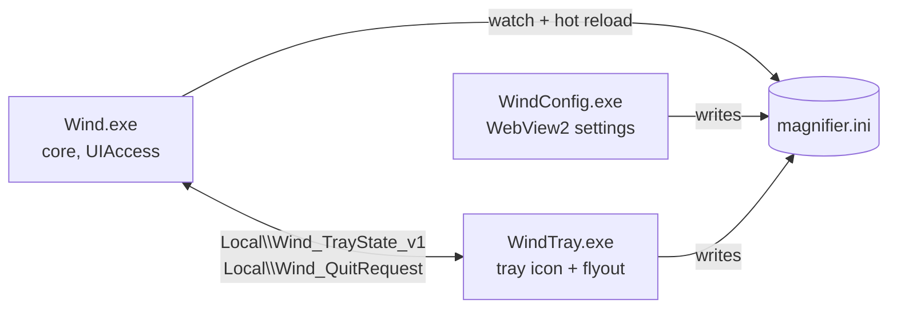

# 01. Overview

Wind is a fullscreen magnifier for Windows. It zooms smoothly at sub-pixel precision, keeps the
screen interactive while zoomed, and keeps tracking the mouse when a game hides, clips or
centre-locks the cursor. It ships as three binaries that share settings only through
`magnifier.ini`.

## Product rules

These are commitments. Code that breaks one is a bug even if it works.

- **The cursor grows with the zoom, in every engine.** `cursorConstantSize=1` is the render-only
  opt-in for a desktop-size cursor. See [07](07-cursor.md).
- **The screen stays interactive while zoomed.** Clicks, hover, drags and text selection reach the
  app under the drawn cursor. See [04](04-render-engine.md) and [07](07-cursor.md).
- **Zoom is a hold gesture.** Hold zoom-in to ramp in, hold zoom-out to ramp back, release to stay.
  Both held freezes the level. Quick zoom toggles between 1x and a remembered level
  (`src/zoom_controller.h`). Binds ship unbound; first launch runs a guided setup.
- **One shared `maxLevel`**, the same for every engine.
- **No driver, no injection into other processes.** Mouse motion comes from Raw Input, binds are
  swallowed with ordinary LL hooks. The cost: a bound key still reaches a raw-input game
  ([06](06-input.md)).
- **Follow the mouse when a game owns it.** The view keeps panning when a game clips, recentres or
  hides the cursor ([07](07-cursor.md)).
- **Tracking never moves the pointer.** Caret, focus and edge-mode views detach from the pointer;
  the next real mouse move places the pointer in the view ([07](07-cursor.md)).
- **Scope.** Primary monitor by default (`multiMonitor=1` follows the cursor's monitor per
  zoom-in); desktop, apps and borderless or windowed games. Exclusive fullscreen is out of scope.

## Three binaries

```mermaid
flowchart LR
  W[Wind.exe\ncore, UIAccess] -->|watch + hot reload| INI[(magnifier.ini)]
  C[WindConfig.exe\nWebView2 settings] -->|writes| INI
  T[WindTray.exe\ntray icon + flyout] -->|writes| INI
  W <-->|Local\\Wind_TrayState_v1\nLocal\\Wind_QuitRequest| T
```

| Binary | Role | Chapter |
|---|---|---|
| `Wind.exe` | The always-running core: tick loop, hooks, engines. Must never hitch | [02](02-tick-loop.md) |
| `WindConfig.exe` | On-demand settings: a C++ WebView2 host around the Svelte app in `ui/` | [09](09-settings-ui.md) |
| `WindTray.exe` | Tray icon and flyout, a separate non-UIAccess process | below |

**Settings travel only through `magnifier.ini`.** Engine-shaped keys (`model`) need a restart; the
rest hot-reload. See [08](08-config-profiles.md).

**The tray is a separate process because Wind.exe is UIAccess.** Windows stacks a UIAccess
process's popups above almost everything, including the magnified cursor and the Snipping Tool
overlay; an ordinary process's popups do not.

- Wind starts `WindTray.exe` with `ShellExecuteExW` (never `CreateProcess`, which would pass on the
  UIAccess token) and its PID, restarts it if it dies (at most 3 launches a minute,
  `src/tray_host.cpp`), and the tray exits with its Wind.
- The shared block `Local\Wind_TrayState_v1` (`src/tray_ipc.h`) carries status and a frame-pacing
  ring one way and `menuOpen` back (it pauses the cursor re-park while the user aims at the
  flyout). Quit sets `Local\Wind_QuitRequest`.
- The flyout is a Direct2D window, not a menu (`src/tray_app/flyout_*`). Its content is chosen in
  Settings > Tray menu and stored in the global `tray*` keys (`src/tray_items.*`). Details in
  [09](09-settings-ui.md).
- The flyout's engine dropdown writes `model` to the live ini, drops `session.keep` and restarts
  Wind without a prompt (`src/tray_app/engine_dropdown.cpp`).
- `WindTray.exe --render-test out.png [--palette <id>]` renders the flyout headless for visual
  checks.

## The pure/Win32 split

**Everything that can be written without `<windows.h>` is, and only those files compile into the
test binary.** The magnifier cannot be driven headlessly, so every decision that can regress (the
engine pick, drag-follow, lock heuristics, transform clamps, installer upgrade rules) is a pure
function with doctest coverage. A pure file that grows a `<windows.h>` include breaks the test
build. See [11](11-build-test-release.md).

## Source map

| Area | Files |
|---|---|
| Loop and session state | `main.cpp` (`wWinMain`, `RunTick`), `idle_policy.h`, `sched_priority.h`, `tick_stats.h` |
| Engine contract and pick | `magnifier_model.h`, `engine_pick.h`, `shell_desktop.h`, `launch_quiesce.h` |
| Render engine | `render_engine.*`, `render_model.*`, `render_shaders.h`, `hdr_info.*`, `hdr_scale.h`, `band_window.h`, `png_dump.*` |
| Transform engine | `transform_model.*`, `transform.*`, `mag_host.*`, `mag_thread.*`, `tx_cadence.h`, `tx_warm.h`, `comp_pin.*`, `mpo_boot.h`, `hook_transform.*`, `hook_geometry.h` |
| Colour | `color_filter.*`, `color_matrix.h`, `cursor_tint.*` |
| Input | `input_router.*`, `keybind_rules.h`, `pointer_binds.h`, `mouse_ballistics.*`, `keyboard_pan.h`, `typing_key.h` |
| Cursor and lock | `cursor_mapper.*`, `lock_detector.*`, `drag_follow.h`, `gain_learner.h`, `cursor_sprite.*`, `cursor_blanker.*`, `cursor_decode.*`, `sprite_layer.h`, `crosshair.*`, `cursor_lock.*`, `inspect_focus.h` |
| Tracking | `focus_track.*`, `view_target.h`, `view_glide.h`, `detached_view.h`, `edge_pan.h`, `caret_rect.h`, `track_filter.h`, `java_bridge*` |
| Zoom | `zoom_controller.*` |
| Config and profiles | `config.*`, `config_path.h`, `profiles.*`, `profiles_io.h` |
| Tray | `tray_host.*`, `tray_ipc.h`, `tray_items.*`, `tray_status.h`, `tray_app/` |
| Settings host | `config_ui/` (`main.cpp`, `ini_edit.*`, `mpo.h`, `wind_watchdog.h`, `webview_recover.h`) |
| Logging and diagnostics | `logging.*`, `test_telemetry.h`, `wobble_cage.*` |
| Installer support | `installer_state.h`, `webview2_probe.h`, `version.h` |

Other top-level folders: `ui/` (Svelte settings app and Playwright tests), `tests/` (doctest),
`tools/` (deploy, release and measurement scripts, [12](12-instrumentation.md)), `installer/`
(NSIS), `third_party/` (doctest, WebView2 SDK).
