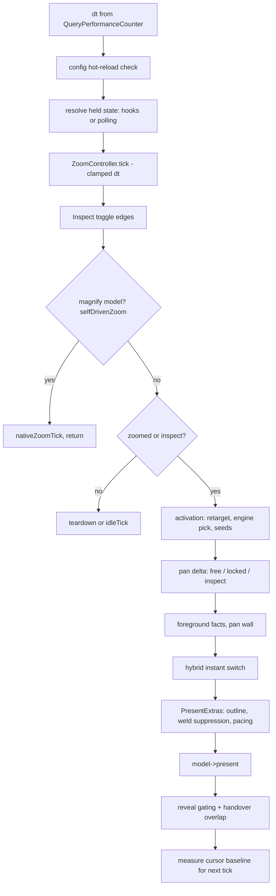

# 02. The tick loop

Everything Wind does at runtime happens inside one function: `RunTick` in `src/main.cpp`. There is
no per-engine thread, no render thread separate from an input-processing thread, no timers firing
independent work: one paced loop samples input, advances the zoom, resolves a pan, and asks the
current engine to present, every display refresh. This chapter walks the phases of a tick in the
order the code runs them, then covers how the loop is paced and which work deliberately lives on
the one other thread Wind owns (the input-hook thread).

## Why one loop

A magnifier's job is to keep a view glued to a hand. Splitting that across threads means the view
and the cursor sample different instants, and every place Wind ever did that produced a visible
beat (the wobble history in [../WOBBLE-CAPTURE-2026-08-21.md](../WOBBLE-CAPTURE-2026-08-21.md) and
issue #205 is exactly this class). So the rule is: all state that feeds the view is read and
written on the tick thread, in one pass, and the tick itself is pure of pacing. `RunTick` never
sleeps or waits; the caller paces it (see [Pacing](#pacing)). That is also why it is safe to call
from a `WM_TIMER` handler during a modal loop (the tray menu keeps ticking via the `WM_TIMER`
branch in `WndProc`, `src/main.cpp`), and why the one sanctioned exception, the hook-write fast
path, needed a whole ownership layer to exist (see [Threads](#threads-hooks-vs-the-magnification-runtime)).

## The phases of a tick

**A tick from timestamp to present, in source order (`RunTick`, src/main.cpp).**

### Timing

The tick opens with a `QueryPerformanceCounter` read and computes `dt`, the real elapsed time
since the previous tick. Raw `dt` feeds the diagnostics (which must see true hitches) and the
config-poll fallback; the copy fed to the zoom is clamped to 50 ms (`kMaxZoomDt` in `RunTick`) so
a single long tick, a cold first capture, an alt-tab, cannot jump the zoom level mid-ramp. The
ramp always eases at a steady rate regardless of frame-time spikes.

### Config hot-reload

Wind has no IPC with the settings app. `WindConfig.exe` writes `magnifier.ini` and the core
notices. The noticing is deliberately cheap:

- At startup, `wWinMain` arms a `FindFirstChangeNotificationW` on the ini's parent directory
  (`LAST_WRITE` + `FILE_NAME`, so both in-place saves and write-temp-then-rename saves fire it).
- `RunTick` polls that watch handle with a zero-timeout `WaitForSingleObject`, and only about four
  times a second (`t.sinceCheck >= 0.25`): `WaitForSingleObject` is a kernel transition, and at
  144 Hz zoomed that would be ~144 pointless syscalls a second for a file that changes when a
  human clicks Apply. ~250 ms of reload latency is imperceptible (issue #70). If the watch handle
  is unavailable or dies, the loop falls back to a ~1 s timed poll.
- When the directory changed, `ConfigMTime` (src/main.cpp) stats the ini; only a changed mtime
  proceeds to a reload. The old design stat'ed the file at 1 Hz unconditionally, and under
  AV/disk contention that single stat caused a ~1 s frametime spike on the render thread.

Then comes the guard that is easy to miss and important to keep: **the UI-only-change
fingerprint**. A reload is not free; the tail of the reload path constructs a fresh
`ZoomController(1.0, maxLevel)`, which collapses any active zoom to 1x. The settings app also
writes keys the core never reads, `uiTheme`, `showAdvanced`, `onboarded`, and a theme toggle
mid-zoom used to collapse the user's zoom for no reason. So `RunTick` runs the ini text through
`wind::StripUiOnlyKeys` (src/config.cpp), which drops exactly those three keys line by line, and
compares the result against the fingerprint of the last applied config (`t.lastCoreIni`). If the
stripped text is identical, the write was UI-only and the whole reload is skipped. The
fingerprint is seeded from the current ini at startup (`wWinMain`, before the loop starts),
because an empty fingerprint means "unknown" and would force the first settings write of a
session to reload, which is exactly how the first theme flip of a session still collapsed the
zoom in the field before the seed was added.

When a real reload happens, `RunTick` does more than swap the `Config` struct: it re-binds the
mouse hook's button mapping and the keyboard hook's swallowed-key set (`g_input.setButtons` /
`setKeys`, otherwise the hook keeps eating the OLD key and ignores the new one), re-registers the
hide-cursor and quick-zoom hotkeys, pushes the hot `txIdleReleaseMs` into whichever transform
model exists, invalidates the foreground predicate cache, and rebuilds the `ZoomController` and
`CursorMapper` while preserving the mapper's center so the view does not jump. Note the asymmetry:
most knobs are hot, but engine-shaped settings (`model=`, `txHookWrite`) need a restart, because
they decide things that were fixed at initialization (which models exist, which thread owns the
Magnification runtime).

### Input resolution

The effective held state for zoom is `mouse side-button held OR keyboard bind held`. The mouse
half comes from the hook thread via atomics (`g_input.state().inHeld`). The keyboard half is
subtler: a bound key is *swallowed* by the `WH_KEYBOARD_LL` hook so it never double-fires into
the focused app, and a swallowed key never appears in `GetAsyncKeyState`. So while the hook is
active it is the **authority** for bound-key down-state (`g_input.keyPressed`), and only when it
is not (install failure, `WIND_NOHOOK`, or a `noSwallowApps` suspension) does `RunTick` fall back
to polling. Two related mechanisms live right here in the tick:

- **Hook suspension** (`noSwallowApps`): an LL keyboard hook taxes the whole system's input
  pipeline; holding an auto-repeating key stalls the mouse stream into a foreground game on every
  repeat, purely because the hook exists. Since an LL hook cannot block Raw Input anyway (games
  read raw), swallowing buys nothing there, so users can name apps where the hook is dropped.
  Foreground is probed at ~10 Hz, not per tick, because foreground changes are human-speed events.
- **The hook watchdog** (issue #156): Windows silently evicts an LL hook whose callback misses
  `LowLevelHooksTimeout`, with no error and a still-valid handle. The tell costs nothing: a live
  hook swallows every bound key, so `GetAsyncKeyState` seeing a bound key held while the hook
  reports it up means the hook is dead. A 250 ms dwell filters the ordinary press-before-callback
  race, then `g_input.requestKbHookReinstall()` heals it.

With the held state resolved, the tick pushes the live zoom profile into the controller
(`t.zoom.setProfile`, free hot-reload, does not reset the level), sets the direction, and calls
`t.zoom.tick(dt)` with the clamped dt. One exception: while the launch quiesce holds transform
writes for a still-loading game (issue #199, `QuiesceHoldActive`), the controller is frozen too,
otherwise the level accrues invisibly and lands as one discrete jump when writes resume, exactly
the 30-50 ms game-frame class the quiesce exists to avoid. Quick zoom (hotkey or
modifier+zoom-key edge) then snaps the level via the pure `ApplyQuickZoom`, and the recenter key
is edge-detected.

### Inspect handling

The Inspect toggle (`cursorLockVk`) is edge-detected here, and the toggle edge is where the
game-inspect tells are snapshotted: whether the cursor was showing at that instant and whether
*we* were the ones hiding it, read together so the pair describes the same moment (they feed
`wind::ShouldGameInspect`, src/inspect_focus.h). The actual entry work, freezing the real cursor
with a 1 px `ClipCursor`, baselining the ballistics-cooked accumulator, deferring the foreground
steal, happens later in the active block on the `inspectEnter` edge. Inspect is a large enough
subsystem that it gets its own treatment in [The cursor system](07-cursor.md); what matters for
the loop shape is that Inspect keeps the overlay active at 1x (`active = zoomed || inspect`) and
swaps the pan-delta source (next section).

### The magnify-model bypass

If the current model reports `selfDrivenZoom()` (only the magnify model does,
src/magnify_model.cpp), the tick drains the raw accumulator, calls
`t.model->nativeZoomTick(direction, cfg)`, and returns. The entire level pipeline, controller,
mapper, quick zoom, Inspect, overlay, is bypassed: Windows Magnifier owns the zoom and Wind only
injects wheel notches. See [The magnify model](10-magnify-model.md).

### Pan delta resolution: three regimes

While active, the tick resolves one pan delta `(dx, dy)` for the mapper, from one of three
sources depending on who currently owns the truth about the pointer:

| Regime | Source of truth | Delta |
|---|---|---|
| Free (desktop) | The OS cursor itself | `GetCursorPos - lastSetVirtual`, scaled by `cursorSensitivity` |
| Locked (game holds the mouse) | Raw Input mickeys | `rawDx/rawDy * cursorSensitivity` |
| Inspect (cursor frozen) | Ballistics-cooked mickeys | `drainCooked` with a sub-pixel carry |

The free regime is the "oracle": Windows already applied pointer acceleration to the real cursor,
so reading its own movement since we last placed it auto-matches the user's normal cursor feel
without reimplementing ballistics. The locked regime exists because a game clipping or recentering
the pointer destroys that oracle, so panning integrates raw mickeys instead; the switch is decided
by `LockDetector` (src/lock_detector.cpp) fed with whether the current clip rect *meaningfully*
confines (`wind::ClipRectConfines`, under 90% of the monitor in either dimension; a machine-wide
work-area clip is desktop-like, issue #169). Two newer levers force the locked path without
heuristics: `lockApps` (issue #221) locks outright whenever a listed exe is foreground, and
`warpLock=1` adds the motion-based tells globally (warp-anchor detection inside the detector, plus
the zoom-in seed on the activation edge: covering foreground with an app-hidden cursor is
mouselook with near-certainty, so the session starts locked and pans from the first tick). Every
lock edge logs which tell engaged (`"lock"` category, wind-core.log) so field reports are
diagnosable. Crucially, a forced lock goes **through the detector** (`t.detector.seedLock()`),
not a tick-local flag, because downstream gates read `t.detector.locked()`.

Inside the free regime, `wind::ShouldDragFollow` (src/drag_follow.h) suspends the per-tick weld
while a physical mouse button is held and follows the pointer 1:1 unscaled; the weld fighting a
drag was the #169 window-drag flicker. And when `txFreeCursor` is on in a transform session, the
mapper is simply **reset to the real cursor position each tick** (the #205 native-Magnifier
model: the view is a pure function of the pointer, no integration, no feedback loop to
oscillate), with the mapper fed zero delta.

One defensive clamp bounds any single tick's pan to the monitor span, so a stray cursor jump can
never teleport the lens.

### Foreground facts and the pan wall

`GetForegroundWindow`, `ForegroundCoversMonitor`, and the borderless-style check are read **once
per tick** into locals (`fgTick`, `fsCover`, `fgBorderless`); split reads can disagree mid-tick
and the queries add up at 144 Hz. Those facts feed the MPO pan wall (`t.mapper.setMaxSourceLeft`
/ `setMaxSourceTop`, bounding `|src*level|` to the 16-bit-safe range whenever a transform session
runs on an MPO-exposed machine, issues #148/#191, see [The transform engine](05-transform-engine.md)),
the device-lost churny backstop's timestamp, the launch-quiesce cover tracking, and the perf
levers below.

### Engine machinery: activation pick and the instant switch

On the idle-to-active edge (`enterActive`), the tick first retargets to the cursor's monitor if
`multiMonitor` is on (before the pick, so the pick evaluates the session's monitor, and
re-reading `DetectRefreshHz` for the new panel so pacing tracks it, issue #74), then, in hybrid,
runs the pure engine predicate `ShouldPickTransform` (src/engine_pick.h) to choose transform or
render for the session. The same predicate runs again every zoomed tick as the **instant switch**:
if the foreground changes mid-zoom, the engine is re-picked and handed over with the controller
and mapper untouched, so level and lens position carry across. The switch is sticky (the
candidate must be stable for 350 ms) because engine flapping rebuilds DWM's magnification context
each flip, a stall every time; and it is frozen entirely while a transient overlay holds
foreground (`IsOverlayFg`) or the game-inspect focus stealer does. The full pick logic and the
handover choreography live in [Engines and the hybrid pick](03-engines.md).

### Present and its per-tick overrides

The tick then fills a `PresentExtras` (src/magnifier_model.h): the outline visibility (with the
low-zoom dwell and the idle-hide fade both computed here from `dt`), the cursor mode, weld
suppression (`suppressCursorSync` when drag-follow or free cursor is active), transform-write
pausing (around an Inspect click's injected input, and for the launch quiesce), and the game
pacing flags. Then `t.model->present(r, lvl, cfg, mon, ex)` runs the engine. Two opt-in game
modes can skip the present on some ticks: the reduced-push mode (`gameFpsCap` with vsync)
presents every Nth vblank and blocks skip ticks on `WaitForVBlank` so the loop stays
vblank-locked, and the timer-paced mode (engaged by `lowGpuPriority` or `gameFpsCap` without
vsync) decouples presents from ticks entirely. Both are opt-in because they trade present cadence
for headroom, and pan smoothness outranks game fps by product rule; skipped ticks still sample
input and advance the mapper.

### Reveal gating

For the render model, activation does not show the overlay; it arms evidence. The alpha flip is
gated on the session's first Present having actually **executed on the GPU** (`revealFrameDone`,
a fenced event query; issue #140: under GPU load the CPU-side alpha flip wins the race and DWM
composites the surface's retained previous-session frame), and a fullscreen app additionally
needs a captured frame composited after the alpha-1 prime (`frameCompositedSincePrime`, issue
#90: Desktop Duplication cannot see a game on an independent-flip plane until the prime forces a
composite). The desktop path spins a 3 ms budget so the common idle-GPU case still reveals in the
same tick; `revealPending` (~250 ms of ticks) is only the fallback cap so nothing can wedge. A
non-render model reveals immediately. During a hybrid handover, the outgoing engine rests a few
ticks **after** the incoming one is live (`restAfterReveal` / `restOverlapTicks`), so the
crossover never composites a bare unmagnified frame.

### Baseline bookkeeping

The last thing the active path does is set `t.lastSetVirtual`, the baseline the next tick's free
delta is measured against, and the rule here is the issue #169 invariant: **the baseline is
measured, never assumed**. If the engine reports the weld/park really ran this frame
(`parkedLastFrame` / `weldedLastFrame`), the baseline is the park point; otherwise it is this
tick's start-of-tick cursor read. Assuming the park landed when it was deduped or suppressed made
the next delta include the pointer-to-center gap, the mapper integrated the gap, and the loop
oscillated proportionally to hand speed, the window-drag flicker. And it is never a fresh
post-present read: `Present` blocks about a frame, and a read taken after it swallows the hand
motion that happened during the block, which shipped once as a "slowed cursor" bug.

### Teardown and idle

On the active-to-idle edge the overlay deactivates, the cursor is restored, Inspect residue
(clip, swallowed clicks, foreground steal) is cleaned, and pending reveals are canceled. While
fully idle, the tick still calls `idleTick()` on the model (and on hybrid's transform half),
which is how the transform releases its magnification context ~1.2 s after a zoom ends; a live
context makes DWM composite magnification-aware and taxes every cursor change any app makes (the
1x hitching in [../HITCH-FINDINGS.md](../HITCH-FINDINGS.md)).

The tick closes with the stuck-input diagnostics (edge-logged held-state timeline, issue #167)
and, under `diagnostics=1`, the 2 s frame-pacing stats window.

## Pacing

`RunTick` never paces itself; the main loop in `wWinMain` (src/main.cpp) does, and the pace
depends on the state:

- **Idle / 1x**: a high-resolution waitable timer (`CREATE_WAITABLE_TIMER_HIGH_RESOLUTION`) at
  the detected refresh rate. `DetectRefreshHz` (src/main.cpp) reads `EnumDisplaySettingsW` for
  the current monitor's real rate, never assumes the dev box's 144 Hz, and is re-queried on
  retarget so a mixed-refresh setup paces the panel it is actually on (#74). The timer interval
  is recomputed only when the paced Hz actually changes.
- **Zoomed, render model, vsync (default)**: `Present(1,0)` blocks to the refresh and paces the
  loop by itself; the timer is skipped to avoid double-pacing.
- **Zoomed, render model, `dwmFlush=1`**: present immediately, then `DwmFlush()` after the tick
  aligns 1:1 with DWM's composite (targets the blt-model phase-mismatch microstutter, see
  [The render engine](04-render-engine.md)).
- **Zoomed, transform model**: always `DwmFlush` paced. The transform has no blocking present to
  pace it (it submits via `MagSetFullscreenTransform`), and an unpaced loop floods DWM's
  desktop-transform queue until the view lags seconds behind input; `DwmFlush` also lands the
  sprite update and the transform write in the same composite, which is what keeps the cursor
  from beating against the panning view.
- **Game pacing modes**: pace themselves inside `RunTick` (vblank waits or the present
  accumulator) and are excluded from the timer wait.

Device-lost recovery also lives in the main loop, not the tick: when the render engine reports a
removed D3D device, the loop restores the cursor first, cleans Inspect state, marks the churny
backstop if a transform game session was live within 30 s, and rebuilds on a 500 ms backoff.

## Threads: hooks vs. the Magnification runtime

Wind has exactly two threads that matter, and the split is principled:

**The hook thread** (src/input_router.cpp) exists because `WH_MOUSE_LL` / `WH_KEYBOARD_LL`
callbacks must return fast or Windows evicts the hook, and because they stall the *system's*
input pipeline while running. They cannot share the tick thread: a tick blocked in `Present(1,0)`
would hold every keystroke and mouse move on the machine hostage for a frame. The hook thread
does minimal work (set atomics, count mickeys, swallow bound keys) and the tick thread reads the
results.

**Magnification API calls are thread-affine.** This was measured, not assumed (the transcript is
in the header comment of src/mag_thread.h): only the thread that called `MagInitialize` can
drive the transform; a write from any other thread returns FALSE and changes nothing. By default
that owning thread is the tick thread, which is why every Magnification call in the codebase
either runs on the tick thread or goes through `wind::MagThreadInvoke`.

The exception is the opt-in hook-write fast path (`txHookWrite`, issue #206). Waiting for the
next tick to notice a cursor move costs a uniform 0.42-7.13 ms (one tick); native Magnifier
writes from inside its mouse hook at 0.58 ms median. To match that, `src/mag_thread.*` lets the
hook thread claim runtime ownership at startup (`SetMagThreadClaimEnabled` in `wWinMain`, then
`MagThreadClaim` when the hook thread's message loop starts, which logs
`"runtime owner = thread N (hook thread)"` under the `magthread` category, your tell in
wind-core.log for which mode a session ran in). Then `src/hook_transform.*` publishes a small
armed-state struct from the tick thread each frame, and `MouseProc` writes the transform inline
from the event's own coordinates. The contract is **single writer**: while armed, the hook owns
position writes completely and the tick thread's present suppresses its own transform write
(`ex.suppressTransformWrite`), triggering ramps and hold-still refreshes through the same
function on the owner thread (`RequestHookTransformWrite`), one formula, one code path. Two
writers sampling the cursor at different instants is the tick-rate wobble #205 eliminated. This
is only safe because the free-cursor model made the view a pure function of the pointer; there
is no mapper state for the hook to race.

Ownership is off by default and decided once at startup: with `txHookWrite=0` nothing writes
from the hook, and routing ~288 calls a second through a marshalled round trip on the thread
that carries system-wide mouse input would be pure cost (measured 0.02 ms inline vs 0.2-0.5 ms
marshalled). Thread affinity means ownership can never move after `MagInitialize`, so the knob
needs a restart. With no owner claimed (unit tests, failed hook install), `MagThreadInvoke` runs
inline on the caller, degrading exactly to the old single-threaded behavior.

## Pointers

- `src/main.cpp`: `RunTick`, `wWinMain` (pacing loop, device-lost recovery), `DetectRefreshHz`,
  `ConfigMTime`, `TickState`
- `src/config.cpp`: `wind::StripUiOnlyKeys`, `LoadConfig`
- `src/mag_thread.h` / `.cpp`: Magnification runtime thread ownership and marshalling
- `src/hook_transform.h` / `.cpp`: the armed hook-write state and the single-writer contract
- `src/input_router.cpp`: the hook thread the tick reads from
- `src/engine_pick.h`, `src/drag_follow.h`, `src/lock_detector.cpp`, `src/inspect_focus.h`: the
  pure decision helpers the tick calls
- Field evidence: [../WOBBLE-CAPTURE-2026-08-21.md](../WOBBLE-CAPTURE-2026-08-21.md),
  [../HITCH-FINDINGS.md](../HITCH-FINDINGS.md),
  [../POINTER-HITTEST-FINDINGS.md](../POINTER-HITTEST-FINDINGS.md)
- Related chapters: [Engines and the hybrid pick](03-engines.md),
  [The render engine](04-render-engine.md), [The transform engine](05-transform-engine.md),
  [The input pipeline](06-input.md), [The cursor system](07-cursor.md),
  [Config and profiles](08-config-profiles.md)
