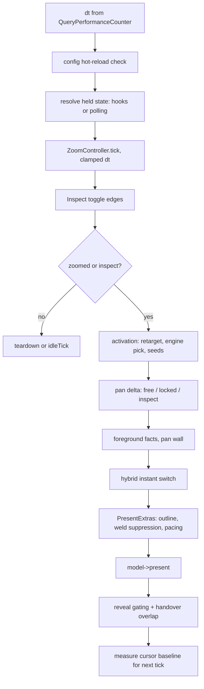

# 02. The tick loop

Everything Wind does at runtime happens in one function, `RunTick` in `src/main.cpp`. Each tick
samples input, advances the zoom, resolves a pan and asks the current engine to present. This
chapter lists the phases in source order, then covers pacing, idle sleep and the threads that sit
beside the loop.

## Why one loop

All state that feeds the view is read and written on the tick thread, in one pass. Splitting it
across threads makes the view and the cursor sample different instants, which shows as a visible
beat (the wobble class in [../NATIVE-MAGNIFIER-STOMP.md](../NATIVE-MAGNIFIER-STOMP.md)).

`RunTick` never sleeps or waits; the caller paces it (see [Pacing](#pacing)). That is also why it
is safe to call from the `WM_TIMER` branch in `WndProc` during a modal loop.

## The phases of a tick

```mermaid
flowchart TD
  DT[dt from QueryPerformanceCounter] --> CFG[config hot-reload check]
  CFG --> HELD[resolve held state: hooks or polling]
  HELD --> ZOOM[ZoomController.tick, clamped dt]
  ZOOM --> INS[Inspect toggle edges]
  INS --> ACT{zoomed or inspect?}
  ACT -- no --> IDLE[teardown or idleTick]
  ACT -- yes --> ENTER[activation: retarget, engine pick, seeds]
  ENTER --> PAN[pan delta: free / locked / inspect]
  PAN --> FG[foreground facts, pan wall]
  FG --> SWITCH[hybrid instant switch]
  SWITCH --> EX[PresentExtras: outline, weld suppression, pacing]
  EX --> PRESENT[model->present]
  PRESENT --> REVEAL[reveal gating + handover overlap]
  REVEAL --> BASE[measure cursor baseline for next tick]
```

1. **Timing.** `dt` is the real time since the previous tick. Diagnostics see the raw value; the
   zoom gets a copy clamped to 50 ms (`kMaxZoomDt`), so one long tick cannot jump the level.
2. **Config hot-reload.** See [below](#config-hot-reload).
3. **Input resolution.** Zoom is held when a mouse bind OR a keyboard bind is held. While the
   keyboard hook is active it is the authority for bound-key state (`g_input.keyPressed`), because
   a swallowed key never shows in `GetAsyncKeyState`. Without the hook (install failure,
   `WIND_NOHOOK`, a `noSwallowApps` suspension) the tick polls. The hook watchdog and the
   suspension rules are in [06](06-input.md).
4. **Zoom.** The tick pushes the zoom profile into `ZoomController` (no level reset), sets the
   direction and calls `tick(dt)`. While the launch quiesce holds transform writes for a loading
   game (`QuiesceHoldActive`), the controller is frozen too, or the level would land as one jump
   when writes resume. Quick zoom then snaps the level via the pure `ApplyQuickZoom`.
5. **Inspect edges.** The toggle edge snapshots whether the cursor was showing and whether Wind was
   hiding it (`t.cursorHiddenByUs`, which a transform session reads back from
   `TransformModel::pointerHidden()` after each present, since the model also hides and restores the
   pointer on its own); both feed `ShouldGameInspect` (`src/inspect_focus.h`). Inspect keeps the overlay
   active at 1x (`active = zoomed || inspect`). Details in [07](07-cursor.md).
6. **Pan delta.** One of three regimes, see [below](#pan-delta-three-regimes).
7. **Foreground facts and the pan wall.** `GetForegroundWindow`, `ForegroundCoversMonitor` and the
   borderless check are read once per tick into locals (`fgTick`, `fsCover`, `fgBorderless`), so
   no two reads in one tick disagree. They feed the MPO pan wall
   (`setMaxSourceLeft`/`setMaxSourceTop`, see [05](05-transform-engine.md)), the churny backstop,
   the launch quiesce and the game pacing levers.
8. **Activation pick and instant switch.** On the idle-to-active edge the tick retargets to the
   cursor's monitor when `multiMonitor=1` (and re-reads its refresh rate), then runs the engine
   pick. The same pick runs every zoomed tick; a changed result hands over with controller and
   mapper untouched. The switch needs a stable candidate for 350 ms and is frozen while a
   transient overlay or the game-inspect focus stealer holds foreground. See [03](03-engines.md).
9. **Present.** The tick fills `PresentExtras` (`src/magnifier_model.h`): outline visibility and
   fades, cursor mode, `suppressCursorSync` (drag-follow, free cursor or a detached tracking view),
   transform write pauses (Inspect clicks, launch quiesce) and the game pacing flags, then calls
   `model->present`. The opt-in game pacing modes (`gameFpsCap`, `lowGpuPriority`) can skip
   presents; skipped ticks still sample input and advance the mapper.
10. **Reveal gating.** The render overlay is shown only after the session's first Present has run
    on the GPU (`revealFrameDone`), and for a fullscreen app also after a frame composited behind
    the alpha-1 prime (`frameCompositedSincePrime`). A 3 ms spin keeps the idle-GPU case in the
    same tick; ~250 ms is the fallback cap. During a hybrid handover the outgoing engine rests a
    few ticks after the incoming one is live (`restAfterReveal`), so no bare frame is composited.
    Details in [04](04-render-engine.md).
11. **Baseline.** `t.lastSetVirtual`, the point the next free delta is measured from, is measured,
    never assumed: the park point when the engine reports the park or weld really ran
    (`parkedLastFrame`/`weldedLastFrame`), otherwise this tick's start-of-tick cursor read. Never
    a post-present read: `Present` blocks about a frame, and a later read swallows the hand motion
    made during the block. Assuming the park landed made the loop oscillate with hand speed
    (the window-drag flicker, issue #169).

**Teardown and idle.** On the active-to-idle edge the overlay deactivates, the cursor is restored,
Inspect residue (clip, swallowed clicks, foreground steal) is cleaned and pending reveals are
cancelled. While idle the tick still calls `idleTick()` on the model, which is how the transform
releases its magnification context ~1.2 s after a zoom ends. The tick ends with the stuck-input
timeline and, under `diagnostics=1`, the 2 s frame-pacing window.

## Config hot-reload

There is no settings IPC. `WindConfig.exe` writes `magnifier.ini` and the core notices:

- `wWinMain` arms `FindFirstChangeNotificationW` on the ini's directory (`LAST_WRITE` +
  `FILE_NAME`, so rename-based saves fire it too).
- `RunTick` polls the handle with a zero timeout about four times a second. Per-tick polling is a
  kernel transition 144 times a second for a file a human changes. Without a watch handle the loop
  falls back to a ~1 s timed poll.
- Only a changed mtime (`ConfigMTime`) proceeds to a reload.
- An unreadable ini (another process mid-replace) keeps the running settings: the mtime is not
  taken and `t.configRetry` re-checks on the next poll. See [08](08-config-profiles.md).

**UI-only writes never reload.** A reload rebuilds `ZoomController`, which collapses an active zoom
to 1x. `StripUiOnlyKeys` (`src/config.cpp`) drops `uiTheme`, `uiPalette`, `showAdvanced` and
`onboarded`, and the result is compared with the fingerprint of the last applied config
(`t.lastCoreIni`). An identical fingerprint skips the reload. The fingerprint is seeded at startup;
an empty one would make the first Settings write of a session reload.

A real reload re-binds the hook's buttons and swallowed keys (`g_input.setButtons`/`setKeys`),
re-registers the hotkeys, invalidates the foreground cache, and rebuilds `ZoomController` and `CursorMapper` with the mapper's centre kept.
Engine-shaped keys (`model`) need a restart: they decide which models exist.

## Pan delta: three regimes

| Regime | Source of truth | Delta |
|---|---|---|
| Free (desktop) | The OS cursor | `GetCursorPos - lastSetVirtual`, times `cursorSensitivity` |
| Locked (game holds the mouse) | Raw Input mickeys | `rawDx/rawDy * cursorSensitivity` |
| Inspect (cursor frozen) | Ballistics-cooked mickeys | `drainCooked` with a sub-pixel carry |

- **Free** reads the cursor's own movement since Wind last placed it, so Windows' pointer
  acceleration is already applied.
- **Locked** applies when `LockDetector` says a game owns the pointer, see [07](07-cursor.md). A
  forced lock (`lockApps`, the `warpLock` zoom-in seed) goes through the detector
  (`seedLock()`), because downstream gates read `t.detector.locked()`.
- **Tracking** overrides the result afterwards: caret, focus or mouse-edge mode can detach the view
  from the pointer (`t.viewDetached`), see [07](07-cursor.md).
- `ShouldDragFollow` (`src/drag_follow.h`) suspends the render engine's weld while a mouse button is
  held and follows the pointer 1:1.
- In a free transform session (not Inspect, not locked) the mapper is reset to the real cursor each
  tick and fed zero delta: the view is a pure function of the pointer, nothing welds, and the free
  tick only feeds the gain learner.
- One clamp bounds any single tick's pan to the monitor span.

## Pacing

The main loop in `wWinMain` paces the tick:

| State | Pacing |
|---|---|
| Idle at 1x | Sleeps, see [Idle](#idle-the-loop-sleeps-at-1x) |
| Active, no blocking present | High-resolution waitable timer at the detected refresh rate |
| Render, vsync (default) | `Present(1,0)` blocks to the refresh; the timer is skipped |
| Render, `dwmFlush=1` | `Present(0,0)`, then `DwmFlush()` after the tick |
| Transform | Always `DwmFlush`; an unpaced loop floods DWM's transform queue until the view lags |
| Game pacing modes | Paced inside `RunTick` (vblank waits or the present accumulator) |

`DetectRefreshHz` reads the current monitor's real rate and is re-read on retarget. **Tick counts
are refresh-rate dependent**, so every tick-tuned constant derives from the detected rate:
`LockDetector::setTickRate`, `CursorMapper::setTickRate`, and `TicksAtHz` for the small windows in
`RunTick` (`clickReleaseTicks`, `clickPauseTicks`, `restOverlapTicks`). A bare tick count tuned at
144 Hz behaves differently at 60 or 240 Hz.

Device-lost recovery lives in the main loop: restore the cursor, clean Inspect state, mark the
churny backstop if a transform game session was live in the last 30 s, rebuild on a 500 ms backoff.

## Idle: the loop sleeps at 1x

At 1x with nothing in flight the loop sleeps in `MsgWaitForMultipleObjectsEx` on the input
router's wake event and the quit event (100 ms timeout, mask
`QS_POSTMESSAGE | QS_SENDMESSAGE | QS_HOTKEY`). The rule is `IdleNow` (pure, `src/idle_policy.h`).
Measured: Wind's CPU at 1x went from 37.5 to 3.1 ms per second, and a zoom starts 3–6 ms after the
waking wheel notch.

- **Anything that must react at 1x needs a wake.** The LL hooks `SetEvent` on edges only (a bound
  key's first down and up, a button bind changing, a wheel step); a window message must be in the
  mask; or `IdleNow` must keep the loop awake.
- **Never add `QS_RAWINPUT`/`QS_INPUT` to the mask**: every mouse move system-wide would wake it.
  Raw Input is drained after the wake, and motion accumulated while asleep is zeroed.
- The loop stays awake while a zoom or key is held, wheel steps or a quick zoom are pending, an
  engine rest, reveal, glide or pan runs, for 500 ms after a session, and whenever input could only
  be seen by polling (hook missing, suspended or evicted).
- The wake tick clamps the motion dt to one frame and skips the pacing ring and diagnostics.

## Priority under background load

The tick thread runs at `THREAD_PRIORITY_HIGHEST` and the process opts out of power throttling
(`src/sched_priority.h`). At normal priority a busy machine queued the tick behind other threads
(139–737 ms stalls mid-zoom). One step above normal stays below DWM, so the tick never delays
composition. It does not help when the GPU is the bottleneck.

## Threads

- **Hook thread** (`src/input_router.cpp`). LL hook callbacks must return fast or Windows evicts the
  hook, and they stall system input while running, so they cannot share a thread that blocks in
  `Present`. The hook thread sets atomics, counts mickeys and swallows bound keys. See
  [06](06-input.md).
- **Focus-tracker thread** (`FocusTracker`, `src/focus_track.cpp`). WinEvents, `GetGUIThreadInfo`
  and UI Automation can block and want their own message loop and COM apartment. The tick only
  calls `setActive()` and reads `snapshot()`. See [07](07-cursor.md).
- **Magnification runtime owner.** Magnification calls are thread-affine: only the thread that
  called `MagInitialize` can drive the transform. That is the tick thread, and every Magnification
  call is made on it. See [05](05-transform-engine.md).
