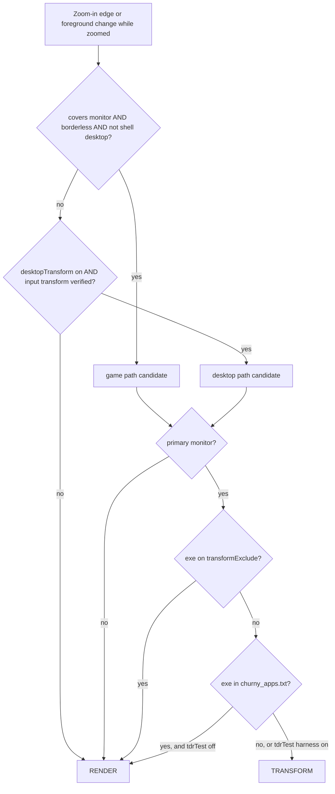
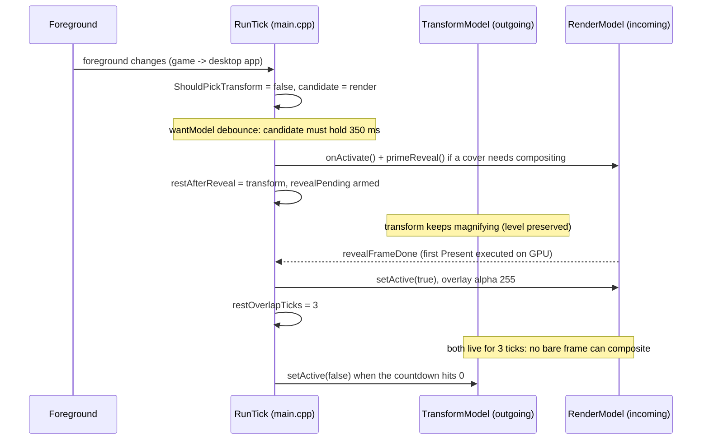

# 03. Engines and the hybrid pick

Wind can put a magnified view on screen in three fundamentally different ways: its own
capture-and-scale overlay (render), a magnification transform executed inside the DWM compositor
(transform), or the native Windows Magnifier driven by injected input (magnify). The shipped
default, `model=hybrid` ("Auto" in the settings UI), holds the first two alive at once and picks
between them per zoom session with a pure, unit-tested predicate. This chapter explains the common
model interface, what each engine is for, exactly how the pick decides, and the handover choreography
that lets hybrid swap engines mid-zoom without ever compositing a bare unmagnified frame.

## The model interface

Every engine implements `wind::IMagnifierModel` (`src/magnifier_model.h`). The tick loop
(`RunTick` in `src/main.cpp`, chapter [02](02-tick-loop.md)) never talks to a concrete engine for
its steady-state work; it drives whatever `TickState::model` currently points at:

- `initialize` / `shutdown`: bring up or tear down the engine's resources for a monitor
  (`MonitorTarget`). In hybrid, both engines are initialized at startup and stay initialized.
- `setActive(bool)`: reveal or hide the magnified view. For render this flips the overlay's layer
  alpha; for transform it enables or disables the DWM transform.
- `onActivate()`: called on the idle-to-active edge so the engine grabs a live frame rather than a
  stale cached one (render: `invalidateCapture` + reveal priming).
- `present(...)`: the per-tick draw. It takes the mapper's `MapResult`, the level, the config, the
  monitor, and `PresentExtras`, a struct of per-tick overrides RunTick computes (outline fade,
  Inspect crosshair, drag-follow weld suppression, game pacing flags). The transform model ignores
  almost all of it by design; the comments in `magnifier_model.h` say which engine reads which field.
- `idleTick()`: called every tick while idle. This exists for one load-bearing reason: the
  transform model releases its Magnification context here, because a live context keeps DWM in
  magnification-aware compositing where every cursor change any app makes costs a re-composite
  (issue #148, see [05](05-transform-engine.md)). In hybrid, RunTick ticks both the active model
  and the idle transform half (`t.mTransform->idleTick()` in the idle branch of RunTick).
- `retarget(MonitorTarget)`: render-only, for `multiMonitor` follow. Others return false.
- `selfDrivenZoom()` / `nativeZoomTick(dir, cfg)`: the magnify model returns true and RunTick then
  bypasses the entire level pipeline (ZoomController, mapper, overlay) and just reports the held
  zoom direction each tick. See chapter [10](10-magnify-model.md).
- `supportsInspect()`: magnify returns false (the native Magnifier owns the view and cursor, so
  Wind's freeze-and-reticle Inspect mode cannot run there).

`model=` in `magnifier.ini` selects the engine at launch (restart to switch, not hot-swapped).
Missing or unknown values fall back to `hybrid` (`Config::model` in `src/config.h`).

## The four models

| Model | What it is | What it is for |
|---|---|---|
| `hybrid` (default, "Auto") | Not a class: `TickState` holds both a `RenderModel` (`mRender`) and a `TransformModel` (`mTransform`) and points `model` at one of them per session | The product default; picks the right engine per situation |
| `render` | Own DXGI Desktop Duplication capture + D3D11 scale onto a click-through, capture-excluded fullscreen overlay (`src/render_engine.*`) | The desktop engine: centered cursor, sub-pixel pan, unlimited levels. Chapter [04](04-render-engine.md) |
| `transform` | The DWM fullscreen magnification transform (`MagSetFullscreenTransform` and the private channel), zero presents of our own (`src/transform_model.cpp`) | The game engine: the only path that stays compositor-smooth over a heavy game's present load (revived for issue #148). Chapter [05](05-transform-engine.md) |
| `magnify` | Launches and drives the native Windows Magnifier via injected Ctrl+Alt+wheel notches | The DRM-safe fallback: protected video (Netflix) blanks under Desktop Duplication. Chapter [10](10-magnify-model.md) |

Hybrid's construction lives in `wWinMain` (`src/main.cpp`): when `cfg.model == "hybrid"` it builds
a `RenderModel` plus a second `TransformModel`, initializes both, and stores them in
`TickState::mRender` / `TickState::mTransform`. If the transform half fails to initialize, Wind
logs a warning and runs render-only; every pick site guards on `t.mTransform` being non-null, so a
pure `model=render` or `model=magnify` run simply never enters the pick code.

## The pure pick: ShouldPickTransform

The decision itself is a header-only pure function, `wind::ShouldPickTransform` in
`src/engine_pick.h`, taking an `EnginePickInputs` struct. It was extracted precisely because it is
the most regression-prone predicate in the app (issues #148 and #172 both bit here) and because it
runs at two call sites in `RunTick` that previously had to be kept identical by hand. Being pure
(no `<windows.h>`) it compiles into the doctest binary and is unit-tested.

The inputs, and who computes them in `main.cpp`:

| Field | Meaning | Source in RunTick |
|---|---|---|
| `coversMonitor` | The foreground window covers the session's target monitor | `ForegroundCoversMonitor(t.mon)` (per tick, cheap user32 reads; also matches maximized windows) |
| `borderless` | The foreground has no `WS_CAPTION` | `GetWindowLongPtrW(fgw, GWL_STYLE)` |
| `primaryMonitor` | The target monitor is the primary | `t.mon.x == 0 && t.mon.y == 0` |
| `shellDesktop` | The foreground is the shell desktop window class (Win+D reads as a borderless cover, issue #172) | `RefreshFgCache` -> `IsShellDesktopFg` |
| `excluded` | The exe is on `transformExclude` | `RefreshFgCache` -> `IsTransformExcluded` |
| `churny` | The exe was learned into `churny_apps.txt` | `RefreshFgCache` -> `IsChurnyFg` |
| `tdrHarness` | `cfg.tdrTest > 0`: the #148 field harness bypasses the churny veto | config |
| `desktopTransformOptIn` | The `desktopTransform` knob is on (issue #185) | config |
| `inputTransformOk` | `MagSetInputTransform` was verified available (needs UIAccess) | `TransformModel::inputTransformAvailable()`, probed at init |

The logic is four lines:

```cpp
const bool game    = in.coversMonitor && in.borderless && !in.shellDesktop;
const bool desktop = in.desktopTransformOptIn && in.inputTransformOk;
return (game || desktop) && in.primaryMonitor &&
       !in.excluded && (in.tdrHarness || !in.churny);
```

Reading it as intent: the transform is picked for the **game path** (a borderless cover that is
not the shell desktop, i.e. a real fullscreen game or F11 video) or the **desktop path** (the user
opted in via `desktopTransform` AND the source-rect input transform verifiably works, because
without it pointer-input frameworks like Explorer and Settings get hard hover dead zones under a
welded cursor, root-caused in [../POINTER-HITTEST-FINDINGS.md](../POINTER-HITTEST-FINDINGS.md)).
Either path additionally requires the primary monitor (no cross-adapter transform chase), and both
are vetoed by the exclusion list and the learned churny list. Everything that fails the predicate
gets the render engine, including the documented trap that a maximized desktop app covers the
monitor but keeps its caption, so it correctly stays on render.

**The hybrid pick, as ShouldPickTransform evaluates it (src/engine_pick.h):**



## Where the pick runs

The predicate is evaluated at exactly two places in `RunTick` (`src/main.cpp`), both feeding the
same `EnginePickInputs`:

**1. The zoom-in edge.** On the idle-to-active transition (`enterActive`), after the optional
multi-monitor retarget. The ordering is deliberate and commented at the site: retarget runs
*before* the pick so the predicate evaluates the session's actual monitor; the old order evaluated
the previous session's monitor and could hand a secondary-monitor session the transform engine.
The winning engine becomes `t.model` for the session, so every later teardown call routes to the
engine that activated. A transform session also records the foreground exe into `t.transformExe`
for the device-lost backstop (below). This same edge is where a few session-scoped tells are
seeded, for example the `warpLock` lock seeding for mouselook games (chapter [07](07-cursor.md)).

**2. The mid-zoom instant switch.** While zoomed, hybrid re-evaluates the predicate every tick so
a foreground change (alt-tab from the desktop into a game at 8x) swaps engines mid-session. The
ZoomController and CursorMapper are untouched, so the level and lens position carry across the
swap. Three dampers keep this from thrashing:

- **Per-HWND cache** (`RefreshFgCache`, `TickState::fgCache*`): the exe-derived inputs (shell
  class, exclusion, churny) are re-resolved only when the foreground *window* changes. Opening the
  foreground process and building exe-name strings 144 times a second answered a question that only
  changes on a window change; `coversMonitor` and `borderless` stay per-tick because they are cheap
  and genuinely dynamic.
- **350 ms stickiness** (`t.wantModel` / `t.wantSinceMs`): the candidate engine must hold for
  350 ms before the swap fires. Field evidence: the engine flapped render-transform-render inside
  one session on one-frame foreground wobbles, and every flip releases and rebuilds DWM's
  magnification context, a visible stall each time. A real alt-tab still switches.
- **Overlay freeze** (`IsOverlayFg`): while a transient system surface (Snipping Tool,
  ScreenSketch, TextInputHost; the hard-coded `kOverlayExes` list) holds foreground, the whole
  pick block is skipped, not just the swap. That leaves `wantModel` untouched, so the overlay never
  becomes the settled candidate and handing foreground back is a no-op instead of a second
  handover (the taskbar-flyout ping-pong, issue #180). The game-inspect focus stealer is likewise
  ignored (`fgIsStealer`). Inspect sessions are never switched under at all.

Note a subtlety the code comments call out: CLAUDE.md summarizes the mid-zoom switch as
"instant", and it is from the user's point of view, but the code applies the 350 ms settle first.
The code is the truth here.

## The handover rule: restAfterReveal

Swapping engines mid-zoom means one magnification source must stop and another must start, and the
two travel *different DWM channels* (a transform rest is a compositor write; the overlay reveal is
a layer-alpha flip). If the outgoing engine rests on the same tick the incoming one goes live, DWM
can composite one frame in the gap, and the user sees the bare unmagnified desktop flash at, say, a
9x crossover (the field report that produced this design). The fix is an overlap:
`TickState::restAfterReveal` keeps the *outgoing* engine alive until the incoming one is verifiably
on screen, plus `restOverlapTicks = 3` extra ticks, and only then calls `setActive(false)` on it.
The overlap's worst case is a roughly 14 ms over-zoom pulse of still-magnified content, never a
bare desktop.

The two directions differ in when the overlap countdown arms:

- **transform to render**: the render overlay's reveal is evidence-gated (issue #140: the first
  Present must have executed on the GPU; over a fullscreen app, additionally a post-prime composite
  must appear in the capture, issue #90; chapter [04](04-render-engine.md)). So the transform keeps
  magnifying while `revealPending` counts down, and `restOverlapTicks` is armed only at the moment
  the reveal actually fires (`rm->setActive(true)` in the reveal block).
- **render to transform**: the transform is activated the same tick (`t.model->setActive(true)`),
  the overlay stays up for the same short overlap, then drops.

A rapid double-switch settles the previous handover first (the pending `restAfterReveal` is rested
immediately before the new one is queued), and every teardown path (zoom-out to idle, device-lost
recovery, shutdown) clears a pending `restAfterReveal` so an engine is never left running.

**Mid-zoom instant switch, transform to render (alt-tab from a game to the desktop at 8x):**



## The vetoes: transformExclude and the churny backstop

**transformExclude** (`Config::transformExclude`, hybrid-only) lists exe names that must never get
the transform engine even when fullscreen and borderless. The default is the browser set
(`zen.exe, firefox.exe, chrome.exe, msedge.exe, brave.exe, opera.exe, opera_gx.exe, vivaldi.exe`):
fullscreen browser video is indistinguishable from a game by the foreground test, but it wants the
render engine's constant-size cursor and desktop-style behavior; the transform path exists for
games. Matching goes through the shared `FgExeInList` helper in `main.cpp` (bare file name,
case-insensitive, exact) so it behaves identically to `noSwallowApps` and the overlay list. A
config hot-reload clears the per-HWND cache (`t.fgCacheHwnd = nullptr`) so an edited exclusion
list takes effect without a foreground change.

**churny_apps.txt** (`%LOCALAPPDATA%\Wind\churny_apps.txt`) is the learned veto. Rig-proven for
issue #148: a fullscreen app that churns its cursor *shape* (ordinary `SetCursor` hover logic,
which real games do whenever the mouse moves) makes per-tick fullscreen-transform writes reset the
GPU driver within seconds, at any write rate. Wind cannot stop another process's SetCursor traffic,
so hybrid learns instead. The persistence and matching live in `main.cpp` (`LoadChurnyApps`,
`MarkChurnyApp`, `IsChurnyFg`). The primary writer today is the **device-lost backstop**: every
transform game session records its exe (`t.transformExe`) and timestamps the session
(`t.lastTransformGameMs`); if the render device later reports device-lost (`RenderModel`'s
`deviceLost()` in the main loop's recovery block) within 30 seconds of a transform game session,
that reset is attributed to the session's app, `MarkChurnyApp` records it, and every future zoom-in
over that exe picks render. One crash per exotic app, ever, then never again. The `tdrTest` ini
knob (`pin.tdrHarness`) exists solely to force transform past this list for field experiments; the
bisection evidence behind the whole TDR class is in [../HITCH-FINDINGS.md](../HITCH-FINDINGS.md).

## Pointers

Key sources:

- `src/engine_pick.h`: `EnginePickInputs`, `ShouldPickTransform` (pure, doctested)
- `src/magnifier_model.h`: `IMagnifierModel`, `PresentExtras`
- `src/main.cpp`: the zoom-in pick (the `enterActive` block in `RunTick`), the mid-zoom instant
  switch, `RefreshFgCache`, the churny registry, the reveal gate and `restAfterReveal` handling,
  hybrid construction in `wWinMain`
- `src/config.h`: `model`, `transformExclude`, `desktopTransform`, `tdrTest`

Related chapters: [02. The tick loop](02-tick-loop.md), [04. The render engine](04-render-engine.md),
[05. The transform engine](05-transform-engine.md), [07. The cursor system](07-cursor.md),
[10. The magnify model](10-magnify-model.md). History:
[../superpowers/specs/2026-05-25-own-renderer-design.md](../superpowers/specs/2026-05-25-own-renderer-design.md),
[../POINTER-HITTEST-FINDINGS.md](../POINTER-HITTEST-FINDINGS.md),
[../HITCH-FINDINGS.md](../HITCH-FINDINGS.md).
