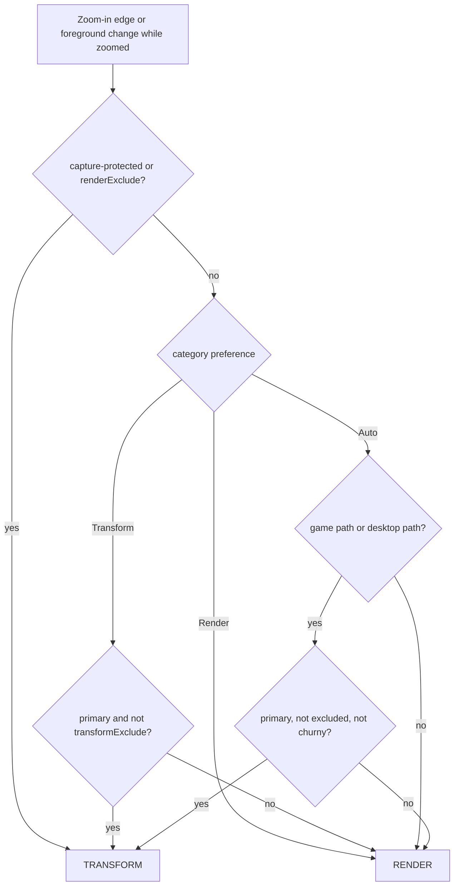

# 03. Engines and the hybrid pick

Wind has three engines: Auto (`hybrid`, the default), Render and Transform. Auto holds the other
two alive and picks one per zoom session with a pure, unit-tested predicate. This chapter covers
the model interface, what each engine is for, how the pick decides and how a mid-zoom handover
avoids a bare frame.

## Where pixels can be scaled

Magnification means taking screen pixels, scaling them and presenting them. There are three places
that can happen:

1. **In DWM.** The DWM fullscreen transform. Wind's Transform engine and the built-in Magnifier
   both use it. It scales protected video and stays smooth over a heavy game, because no extra
   window covers the game.
2. **In the app's own window.** Capture the desktop (DXGI Desktop Duplication) and draw it scaled
   into an overlay. Wind's Render engine. Sub-pixel pan and a cursor drawn in the same frame, but
   protected video captures black and the overlay forces a game onto composited presentation.
3. **Inside the game's render pipeline.** A `Present()` hook in the game process. Wind does not do
   this: it is injection, per-game, and an anti-cheat risk.

## The model interface

Every engine implements `wind::IMagnifierModel` (`src/magnifier_model.h`). `RunTick` drives
whatever `TickState::model` points at:

| Method | Purpose |
|---|---|
| `initialize` / `shutdown` | Bring up or tear down the engine for a `MonitorTarget`. In Auto both engines stay initialized. |
| `setActive(bool)` | Show or hide the magnified view (render: layer alpha; transform: enable/disable the DWM transform). |
| `onActivate()` | Idle-to-active edge: grab a live frame, not a cached one. |
| `present(...)` | The per-tick draw, with the mapper's `MapResult`, the level, config, monitor and `PresentExtras`. |
| `idleTick()` | Every idle tick. The transform releases its Magnification context here, see [05](05-transform-engine.md). |
| `retarget(MonitorTarget)` | Render only, for `multiMonitor`. |

`model` in `magnifier.ini` takes `hybrid`, `render` or `transform` and is read once at launch, so
changing it restarts Wind. Anything else, including an old `model=magnify`, reads as `hybrid`.

| Model | What it is | For |
|---|---|---|
| `hybrid` ("Auto") | `TickState` holds a `RenderModel` (`mRender`) and a `TransformModel` (`mTransform`) and points `model` at one per session | The default |
| `render` | DXGI Desktop Duplication + D3D11 onto a click-through, capture-excluded overlay (`src/render_engine.*`) | Sub-pixel pan, cursor in the same frame, shell coverage. [04](04-render-engine.md) |
| `transform` | The DWM fullscreen transform, no presents of its own (`src/transform_model.cpp`) | Games and protected video. [05](05-transform-engine.md) |

If the transform half fails to initialize, Auto logs a warning and runs render only; every pick
site checks `t.mTransform`.

## The pick

`wind::ShouldPickTransform` (`src/engine_pick.h`) is header-only, has no `<windows.h>` and is
doctested. It runs at the zoom-in edge and every zoomed tick, with the same `EnginePickInputs`.
In order:

1. **Protected content forces Transform.** `captureProtected` (the foreground or a child window
   has display-affinity capture protection: Netflix, Apple TV, PlayReady) or an exe on
   `renderExclude`. On Render such a window is a black rectangle, so this beats every other rule.
2. **The per-category preference applies next.** `ClassifyWindow` sorts the foreground into Game,
   Acrylic, Desktop or Other, and `engineGame`, `engineAcrylic`, `engineDesktop` and `engineOther`
   (each Auto, Transform or Render) choose for it. Render is honoured outright; Transform still
   needs the primary monitor and an exe not on `transformExclude`.
3. **Auto rule.** Transform when the session is on the primary monitor, the exe is not on
   `transformExclude` or in `churny_apps.txt` (unless `tdrTest` is on), and either:
   - **game path**: the foreground covers the monitor, is borderless and is not the shell desktop
     (Win+D reads as a borderless cover, issue #172); or
   - **desktop path**: `desktopTransform=1` (the default) and the source-rect input transform was
     verified at init (`inputTransformAvailable`, needs UIAccess). Without it pointer frameworks
     get hover dead zones ([../POINTER-HITTEST-FINDINGS.md](../POINTER-HITTEST-FINDINGS.md)).

   Everything else gets Render. A maximized desktop app covers the monitor but keeps its caption,
   so it stays on Render.

```mermaid
flowchart TD
    A[Zoom-in edge or foreground change while zoomed] --> D{capture-protected or renderExclude?}
    D -- yes --> T[TRANSFORM]
    D -- no --> PR{category preference}
    PR -- Render --> R[RENDER]
    PR -- Transform --> PX{primary and not transformExclude?}
    PX -- yes --> T
    PX -- no --> R
    PR -- Auto --> B{game path or desktop path?}
    B -- no --> R
    B -- yes --> P{primary, not excluded, not churny?}
    P -- yes --> T
    P -- no --> R
```

## Where the pick runs

**Zoom-in edge.** On `enterActive`, after the multi-monitor retarget, so the pick evaluates the
session's own monitor. The winner becomes `t.model` for the session; a transform session records
its exe in `t.transformExe` for the churny backstop.

**Mid-zoom switch.** While zoomed the pick re-runs every tick, so alt-tabbing from the desktop into
a game at 8x swaps engines with level and lens kept. Three dampers:

- **Per-HWND cache** (`RefreshFgCache`): exe-derived inputs (shell class, exclusion, churny,
  capture protection) are re-resolved only when the foreground window changes. `coversMonitor`
  and `borderless` stay per tick.
- **350 ms settle** (`t.wantModel`/`t.wantSinceMs`): the candidate must hold for 350 ms. Each flip
  rebuilds DWM's magnification context, a visible stall.
- **Overlay freeze** (`IsOverlayFg`): while Snipping Tool, ScreenSketch or TextInputHost
  (`kOverlayExes`) or the game-inspect focus stealer holds foreground, the pick is skipped, so
  handing foreground back is not a second handover. Inspect sessions are never switched.

## Handover: restAfterReveal

The outgoing and incoming engines use different DWM channels (a transform write versus an overlay
alpha flip). Resting the old engine on the same tick the new one goes live can composite one bare
unmagnified frame. So `TickState::restAfterReveal` keeps the outgoing engine alive until the
incoming one is verifiably on screen, plus `restOverlapTicks` (3), then rests it. The worst case is
a ~14 ms still-magnified overlap, never a bare desktop.

- **Transform to Render**: the overlay reveal is evidence-gated ([04](04-render-engine.md)), so the
  overlap countdown arms when the reveal fires.
- **Render to Transform**: the transform activates the same tick; the overlay drops after the
  overlap.

A rapid second switch rests the pending engine first, and every teardown path clears
`restAfterReveal`.

## Vetoes

- **`transformExclude`** lists exes that never get Transform. Default: the common browsers
  (`zen.exe`, `firefox.exe`, `chrome.exe`, `msedge.exe`, `brave.exe`, `opera.exe`,
  `opera_gx.exe`, `vivaldi.exe`), because fullscreen browser video passes the game test. Matching
  is `FgExeInList`: bare file name, case-insensitive, exact, the same as `noSwallowApps`.
- **`churny_apps.txt`** (`%LOCALAPPDATA%\Wind`) is learned. A render device-lost within 30 s of a
  transform game session marks that session's exe (`MarkChurnyApp`), and later zoom-ins over it
  pick Render: one crash per app, not two. `tdrTest` bypasses the list for field tests. Evidence:
  [../HITCH-FINDINGS.md](../HITCH-FINDINGS.md).

## Why Wind does not drive the built-in Magnifier

Wind once had a third engine that launched `Magnify.exe` and drove it with injected input, as a
fallback for protected video. The `captureProtected` rule above made it unnecessary and it was
removed. The approaches measured on the way, so nobody repeats them:

| Approach | Result |
|---|---|
| Injected Win+Plus/Minus bursts | About half the chords dropped; each survivor animated, so zoom lagged and kept going after release |
| Injected Win+wheel | Ignored entirely |
| Injected Ctrl+Alt+wheel notches every 60 ms | Works 1:1 (the shipped design), but Wind holds no zoom state, so no quick zoom, Inspect, tracking or game cursor handling |
| Streaming the `Magnification` registry value per tick | Read at ~280 ms animation boundaries; faster writes snap ~40% at each boundary |
| `MagSetFullscreenTransform` during ramps while Magnify.exe runs | Magnifier overwrites the transform within ~7 ms of a wake, and its registry handler animates from a stale level |

Registry facts from the same probes: `Magnification` values above 1600 are ignored, not clamped,
and a same-value write fires no change notification. A running Magnify.exe also fights Wind's
transform; see [../NATIVE-MAGNIFIER-STOMP.md](../NATIVE-MAGNIFIER-STOMP.md).
