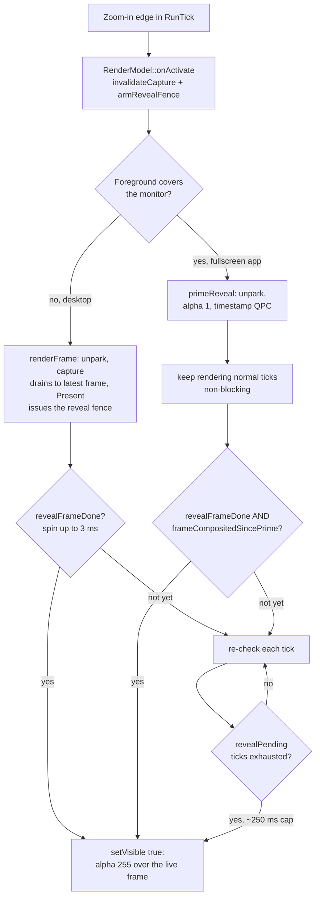

# 04. The render engine

The render engine is Wind's own magnifier: it captures the desktop with DXGI Desktop Duplication,
scales a sub-pixel source rectangle on the GPU with Direct3D 11, and presents the result onto a
fullscreen, click-through, capture-excluded overlay window. It is the default engine for desktop
sessions and the fallback for everything the transform engine cannot handle. Almost every design
decision in `src/render_engine.cpp` exists because the obvious alternative was tried and failed in
a measurable way; this chapter treats those hard-won rules as first-class architecture, not trivia.

## The shape of the thing

`RenderEngine` (src/render_engine.h) is a PIMPL class; all D3D/DXGI headers stay inside
`src/render_engine.cpp`. The tick loop never talks to it directly: `RenderModel`
(src/render_model.cpp) adapts it to the `IMagnifierModel` interface from
[the engines chapter](03-engines.md), and `RunTick` in `src/main.cpp` owns the activation and
reveal choreography, because parts of it need information the engine does not have (whether the
foreground window covers the monitor, which tick is the idle-to-active edge).

Per frame the flow is: `renderFrame(RenderFrameParams)` captures the desktop if it changed,
draws three passes into the back buffer (magnify, edge outline, cursor sprite), and presents. The
magnified view is a float source rect (`srcLeft`/`srcTop` plus `level`), so panning is sub-pixel
smooth; the pure math that produces the rect lives in `src/cursor_mapper` and `src/transform`,
covered in [the tick loop](02-tick-loop.md).

The original design spec is
[2026-05-25-own-renderer-design.md](../superpowers/specs/2026-05-25-own-renderer-design.md)
(issue #4). Where this chapter and the spec disagree, the code has moved on and this chapter
follows the code.

## The overlay window

`RenderEngine::initialize` creates one borderless popup (`WindRenderOverlay` class) covering the
target monitor. Every extended style on it is load-bearing:

| Style / attribute | Why |
|---|---|
| `WS_EX_LAYERED` + `SetLayeredWindowAttributes(.., LWA_ALPHA)` | True cross-process click-through, and the alpha channel is the show/hide mechanism (below). `WS_EX_TRANSPARENT` + `HTTRANSPARENT` alone only forwards clicks to same-thread windows; other apps' clicks were eaten. |
| `WS_EX_TRANSPARENT` + `HTTRANSPARENT` in `OverlayProc` | Belt and braces for the hit-test path. |
| `WS_EX_TOPMOST`, `WS_EX_NOACTIVATE`, `WS_EX_TOOLWINDOW` | Stay above app overlays, never steal focus, never appear in alt-tab. |
| `SetWindowDisplayAffinity(WDA_EXCLUDEFROMCAPTURE)` | THE number one gotcha. Without it, Desktop Duplication captures our own presented frame, we magnify our own output, and the image degenerates into a black feedback loop. The window stays visible on screen but invisible to DDA, so we always capture the real desktop beneath. |
| `DwmSetWindowAttribute(DWMWA_EXCLUDED_FROM_PEEK)` | Aero Peek is a compositor effect, not a window, so no z-band beats it; excluded, the overlay keeps magnifying during a taskbar-thumbnail peek (issue #141). |

Because the overlay is capture-excluded, external screenshots cannot verify it. Verification is
done from inside the process: `WIND_SELFTEST=1 Wind.exe` dumps `wind_selftest.png` via
`RenderEngine::dumpFrame`, which renders without presenting so the PNG matches the drawn frame.

## The present path: blt, and only blt

The swapchain (`RenderEngine::State::buildPresent`) is deliberately old-fashioned:
`DXGI_SWAP_EFFECT_DISCARD`, one buffer, windowed, on the layered HWND, with
`IDXGIDevice1::SetMaximumFrameLatency(1)` capping latency. A blt-model present composites through
the window's DWM redirection surface, which means it can never tear: DWM always composites it at
vblank.

A DirectComposition flip-model path was built and abandoned twice (issues #11 and #69), and the
conclusion is a standing rule: DWM promotes a fullscreen dcomp visual to an independent-flip / MPO
plane that scans out unsynced, and on a VRR/G-SYNC display it tears exactly on loop hitches.
Forcing it back onto the composited path with `DwmFlush` stopped the tear but chained the present
rate to the VRR-floated composite rate (~68 Hz on a 23-143 Hz panel). Net: dcomp is never a win on
this layered click-through overlay. Do not re-attempt it.

The blt path's one artifact is a phase-mismatch microstutter against DWM's composition clock,
tamed by the `dwmFlush` ini knob (Config in src/config.h, applied in the pacing section of
`RunTick`): `dwmFlush=0` (default) presents with `Present(1,0)` and lets vsync pace the loop;
`dwmFlush=1` presents immediately and then calls `DwmFlush()` after the tick to align 1:1 with
composition. Both are hot-reloadable. `RenderFrameParams.syncOverride` can also force
`Present(N,0)`; the game half-rate mode uses N=2 so every frame gets two vblanks of slack, which
turns an irregular hitch into a steady cadence (steadiness is what reads as smooth, issue #148).

## Parking: the overlay's geometry alone taxes games

The overlay window is created shown and stays shown for the process lifetime, but while Wind is
idle it is **parked**: moved just past the right edge of the virtual desktop
(`RenderEngine::setParked`). The reason is one of the most expensive lessons in the codebase: a
fullscreen topmost layered window stacked over a fullscreen game keeps DWM from granting the game
its independent-flip plane **by geometry alone, even at alpha 0**. A game ran DWM-composited for
its entire session just because Wind sat idle in the tray, and it looked model-independent and
sticky because every model creates the overlay at startup. PresentMon on RDR2, same session, no
game restart, before/after parking: 3% to 99.8% "Hardware: Independent Flip", mean frametime
12.28 ms to 7.26 ms, p99 18.3 ms to 9.5 ms.

Parking is a **move**, never `SW_HIDE` (that reintroduces the stale-frame flash below) and never a
resize to 1x1 (shrinking makes DWM reallocate the redirection surface, and the fresh allocation is
undefined until presented into, which showed as a one-frame black flash per zoom over a game). A
move leaves the surface and the swapchain untouched. Each park/unpark is a `SetWindowPos` over the
game, i.e. a synchronous DWM z-order transaction that hitches it, so two per zoom session is the
floor; do not add more. The park lands past the virtual desktop's right edge specifically so it
cannot sit on another monitor and demote a fullscreen app there. `WIND_NOPARK=1` disables parking
for A/B measurement.

## Show and hide by alpha, never SW_HIDE

`RenderEngine::setVisible` flips `SetLayeredWindowAttributes` between alpha 0 and 255. A layered
window that is hidden with `SW_HIDE` and later re-shown makes DWM cache and re-display the frame
from when it was last visible, flashing the previous zoom session's content on the next zoom-in
(worst right after an alt-tab). So the window is created shown at alpha 0 and its visibility only
ever changes through the alpha byte.

On hide, `setVisible(false)` also presents one black **scrub frame**, strictly *after* the alpha-0
flip: the redirection surface otherwise retains the session's last magnified frame forever, and any
residual reveal race in a future zoom-in could only ever flash black instead of stale content.
Scrub-then-hide (the other order) flashed black on every zoom-out, because DWM composited the black
frame while the overlay was still visible. The scrub is skipped when the previous present is still
in flight on a starved GPU (checked via the present fence), because a blocking `Present` on the
teardown path could wedge the cursor restore; the reveal gate protects the next zoom-in anyway.

## The reveal gate

Presenting the live frame before flipping the alpha is necessary but not sufficient (issue #140).
The `Present` blt into the redirection surface is **GPU work**; the alpha flip is a **CPU call**
DWM honors at its next composite. Under GPU load the flip wins the race and DWM shows the
surface's retained frame, i.e. the previous session's last present. Two independent mechanisms
close the race, both owned by `RunTick` in `src/main.cpp` with the primitives in `RenderEngine`:

1. **The present fence.** `RenderModel::onActivate` calls `armRevealFence()`; the session's first
   `Present` then issues a D3D event query (`revealFence` in `renderFrame`).
   `revealFrameDone()` reports true only once that Present has executed on the GPU, so the surface
   provably holds this session's content. On an ordinary desktop zoom-in `RunTick` spins a 3 ms
   budget on it so the common idle-GPU case still reveals within the same tick (the instant feel is
   kept); a loaded GPU defers to per-tick checks.
2. **The composite evidence gate**, for fullscreen apps only. A game on an independent-flip/MPO
   plane is invisible to Desktop Duplication (issue #90), so `RunTick` calls `primeReveal()`:
   alpha 1, visually imperceptible, but enough to make DWM de-promote the game and composite it.
   `frameCompositedSincePrime()` then reports true once `capture()` has copied a desktop frame
   whose `LastPresentTime` is newer than the prime's QPC timestamp, which is hard evidence the game
   is actually in the capture. A fixed tick deferral was tried first and flashed the pre-alt-tab
   window under GPU load.

Both gates are non-blocking; the smooth-zoom ramp runs undisturbed while they pend. A fallback cap
(`revealPending`, about a quarter second of ticks) guarantees the reveal can never wedge.

**The zoom-in reveal sequence, from idle to visible overlay:**

## The capture path

`RenderEngine::State::capture` has two regimes, and the split matters:

- **Steady state** polls `AcquireNextFrame` with a 0 ms timeout, once. A static screen returns
  `WAIT_TIMEOUT` immediately and the engine re-pans its cached copy (`desktopCopy`), so panning is
  never gated on a desktop change; an earlier 8 ms wait here stalled every pan frame into
  microstutter. A frame whose `LastPresentTime` is zero means only the pointer moved, and since the
  cursor is drawn from `GetCursorInfo` rather than the captured image, nothing is copied at all.
- **Fresh grabs** (zoom-in, via `invalidateCapture()`, which drops the duplication so the next
  `AcquireNextFrame` returns the whole desktop) block briefly to land the first frame and then
  **drain to the latest one**: the first frame after (re)creating a duplication can be a
  transitional composite, the window *underneath* the current one, and taking it flashed that
  window on reveal. The drain is bounded (about 3 ms per extra attempt, 100 ms wall-clock budget),
  and giving up frameless just retries next tick.

Steady-state copies are minimized by `copyChangedRegions`: only the dirty rects DDA reports are
patched into `desktopCopy`, falling back to a full `CopyResource` whenever a partial update is not
provably safe (no previous frame, move/scroll rects present, missing metadata, out-of-range rect).
On a near-full repaint (dirty area over half the screen, i.e. a game) the copy can additionally be
**cropped to the magnified view**: `cropCapture=0` by default because on the desktop a
window-switch repaint would leave stale pixels outside the view, but `gameCrop=1` (default) forces
it while the foreground covers the monitor, where every pixel is dirty again next frame so
staleness cannot survive. At 4K FP16 that crop cuts the per-frame copy roughly by zoom squared.

Rotated (portrait) outputs are not supported by the copy/UV math; `recreateDupl` detects and logs
them loudly rather than magnifying garbage.

## Staying on top, and the band trade-off

If an always-on-top app overlay (RTSS, Task Manager) sits above us, it draws a second, unmagnified
copy over the view. `renderFrame` therefore re-asserts `HWND_TOPMOST`, but **only when actually
displaced**: `overlayDisplaced` walks the windows above the overlay (one cheap `GetWindow` syscall
in the common already-on-top case, ignoring cloaked and non-overlapping windows), because a
per-frame `SetWindowPos` synchronizes with DWM and caused constant microstutter. A 1 s
unconditional backstop self-heals missed cases, and is itself skipped while a fullscreen game is
foreground (`RenderFrameParams.fsGame`), since that transaction hitches the game once a second and
nothing the displaced check misses can displace us over a fullscreen app.

Above ordinary topmost sits the z-order **band** question (issue #162). Both bandable windows go
through `wind::CreateBandedWindow` (src/band_window.h), which cascades the requested band to 16 to
unbanded and logs any refusal, because a silently refused band (band 17 is rejected outright by
`CreateWindowInBand` on Windows 26200) once masqueraded as a fix. The shipped default is
`zorderBand=0`, unbanded, and it is a deliberate trade: band 16 covers the Start menu and taskbar
flyouts, but the Snipping Tool's capture overlay then composites over *us*, showing the unmagnified
screen with no cursor at all (we hide the OS pointer and draw a replacement, so covering the
replacement leaves nothing). Band 0 makes snipping work; the shell surfaces are the price. Do not
restore 16 without re-testing both halves. Diagnostic trap: `ScreenClippingHost.exe` holds
foreground with no visible top-level window, so a z-order walk "proves" we are at index 0 while we
are plainly covered; never verify band problems that way.

## HDR: scRGB in, SDR out, never cache the slider

On an HDR desktop the duplication is created with `DuplicateOutput1` requesting FP16 scRGB
(`recreateDupl`, gated on the `hdrTonemap` config and on `GetHdrEnabled` for the *target* device;
the DXGI color space is not trusted because some monitors report HDR10 with Windows HDR off). The
magnify shader then tonemaps: scRGB encodes 80 nits as 1.0, and Windows' "SDR content brightness"
slider sets the white level SDR content composites at, so the shader divides by
`ScrRgbScale = 80 / sdrWhiteNits` to land SDR white back on 1.0 before the sRGB encode. DWM applies
the same white level again when compositing our BGRA8 overlay, making the round trip exact, **but
only while our scale tracks the live slider** (issue #160). The white level was once sampled per
device build; any later slider move left a permanent brightness step of actual/cached on every
zoom-in and zoom-out. Now it is re-read on every duplication rebuild (i.e. every zoom-in) and on a
4 Hz throttle while rendering (`refreshSdrWhite`; the DisplayConfig query measures ~0.007 ms), and
a failed query keeps the last known good value, because snapping to a default would itself be a
visible step. The pure math and the throttle predicate live in `src/hdr_scale.h`
(`ScRgbScale`, `AcceptSdrWhiteNits`, `ShouldRefreshSdrWhite`), unit-tested without `<windows.h>`.
`ensureDesktopCopy` recreates `desktopCopy` to match whatever format the capture actually delivers,
so a runtime HDR toggle can never mismatch the copy (which used to black-screen the magnify pass).
This is render-model-only: the transform and magnify engines magnify inside DWM and never convert
color.

## Drawing: three passes, and the cursor

`State::render` draws the magnified desktop as one full-screen opaque triangle (skipping the clear
whenever a desktop copy exists, saving a 4K clear per frame), then the edge outline, then the
cursor. The outline is deliberately **one** full-screen quad whose pixel shader colors only the
border band and discards the interior; an earlier four-quads-in-a-loop version dropped individual
edges on some GPUs. The frame is inset 6 px from the screen edge because at non-integer DPI
(observed at 4K 225% on an RTX 5090) DWM can mis-composite the layered blt present with a small
down-left offset that clips a flush left/bottom band off the panel; that is a driver/DWM artifact,
not draw code, so do not chase it as a render bug.

The cursor sprite comes from `GetCursorInfo` + `DecodeCursorBGRA` (it works while the OS cursor is
hidden), cached per `HCURSOR` with a 5 s staleness bound because the OS recycles handles, and drawn
with an invert blend for I-beam-style cursors. `cursorMode` 0 (auto) draws only when the focused
app shows its own cursor, so a game that hid its pointer never gets one painted back. In Inspect
mode the 48x48 crosshair from `BuildCrosshairBGRA` (src/crosshair.cpp, shared with the transform
engine) replaces it. The engine also keeps the hidden OS pointer parked under the drawn cursor via
`SetCursorPos` so clicks land where the user sees the pointer, reports `parkedLastFrame()` so the
pan oracle can measure rather than assume its baseline, and suspends the park entirely while a
mouse button is held (`suppressCursorSync`, drag-follow). The full story of the weld, the oracle
invariants, and issue #169 belongs to [the cursor system](07-cursor.md).

## Surviving games: priority, gating, and the fps cap

Issue #148 produced a small toolkit for coexisting with a GPU-saturating game, all wired through
`RunTick` (the "game" tell is `ForegroundCoversMonitor`, which also matches maximized windows,
which is exactly why none of these engage by default on the desktop path):

- **`gpuPriority`** (ini, restart): -1 / 0 / +1 via `IDXGIDevice::SetGPUThreadPriority(+/-7)` plus
  a best-effort `D3DKMTSetProcessSchedulingPriorityClass` (`ApplyProcessGpuPriority`; the raise can
  be denied without privileges, logged, non-fatal). +1 makes Wind's small per-frame job jump a
  saturated game's queue so the zoomed view hits every vblank; -1 yields to the game and accepts
  that the view can freeze in heavy scenes. The legacy `lowGpuPriority=1` still means
  `gpuPriority=-1` via `EffectiveGpuPriority` (src/config.h).
- **The present-fence gate** (`gatePresent`): with low priority a saturated game starved Wind's
  GPU work for minutes, and a blocking vsync `Present` then wedged the whole main thread, input,
  teardown, and the cursor restore included. When the gate is engaged, `renderFrame` skips the
  entire frame while the previous present has not executed on the GPU (an event query after every
  Present); cursor sync and the topmost check still run, so clicks stay live.
- **`gameFpsCap`** (ini, hot): the reduced-push mode. Measured under a game, DWM services the
  redirected window's presents at only ~78/s while compositing at 144/s; pushing 144 presents/s
  builds a standing queue and every Present waits a queue's worth with jitter. The cap presents
  every Nth vblank (N = ceil(hz/cap)), below the service rate, so the queue stays empty; skipped
  ticks block on `RenderEngine::waitVBlank` (`IDXGIOutput::WaitForVBlank`) to stay vblank-locked,
  and input sampling plus panning still run every tick. Activation and reveal-pending ticks always
  present, because the reveal gate needs frames reaching the redirection surface.

`debugPerf` splits CPU time building the frame from time blocked inside `Present` (where GPU
contention shows) and counts gate skips; [instrumentation](12-instrumentation.md) covers how those
counters are read in the field.

## Multi-monitor retarget and device loss

`retarget` re-points the engine at the monitor the cursor is on at zoom-in (`multiMonitor=1`). It
validates first, mutates second: the target output must be on our D3D device's adapter
(`selectOutput` by GDI device name; a cross-GPU monitor returns false and the caller keeps the
current one), and the swapchain `ResizeBuffers`, the only fallible step, runs before the window is
moved, with a best-effort RTV restore on failure. On commit it adopts the new geometry, moves the
overlay (respecting the parked state), and forces a fresh capture on the new output. The pipeline
works in local monitor pixels; the `(originX, originY)` offset is applied only at the
`GetCursorPos`/`SetCursorPos` boundary.

A TDR or driver update surfaces as `DXGI_ERROR_DEVICE_REMOVED/RESET` from `Present` or
`AcquireNextFrame`; the engine latches `deviceLost()` and becomes a no-op until the caller paces
`recoverDeviceLost()`, which releases every device-dependent resource and rebuilds the whole set
through the same `buildDeviceResources` that `initialize` uses, so the two paths cannot drift. The
HWND, geometry, and zoom state survive. Teardown (`shutdown`, plus the
`SetUnhandledExceptionFilter` crash net `CursorRestoreFilter`) always restores the OS cursor and
releases any `ClipCursor`, because leaving a user cursorless is the one failure mode Wind never
accepts. Cursor hiding itself goes through `wind::MagApiAcquire`/`MagApiRelease` (src/mag_host.h),
the shared Magnification-runtime refcount both engines must use; see
[the engines chapter](03-engines.md) for why independent init/uninit pairs break each other.

## Pointers

- `src/render_engine.h` / `src/render_engine.cpp`: the engine itself, every rule above.
- `src/render_model.h` / `src/render_model.cpp`: the `IMagnifierModel` adapter; `onActivate` arms
  the reveal machinery.
- `src/main.cpp` (`RunTick`): reveal choreography, pacing modes, the game-survival lever wiring.
- `src/hdr_scale.h`, `src/hdr_info.cpp`: the pure tonemap math and the OS white-level query.
- `src/band_window.h`: `CreateBandedWindow` and the band cascade.
- `src/crosshair.cpp`, `src/cursor_decode.*`: the Inspect crosshair and cursor decoding.
- Spec: [own renderer design](../superpowers/specs/2026-05-25-own-renderer-design.md) (issue #4).
- Evidence files: [HITCH-FINDINGS](../HITCH-FINDINGS.md),
  [PERFORMANCE-FINDINGS](../PERFORMANCE-FINDINGS.md),
  [WOBBLE-CAPTURE-2026-08-21](../WOBBLE-CAPTURE-2026-08-21.md).
- Related chapters: [Engines and the hybrid pick](03-engines.md),
  [The transform engine](05-transform-engine.md), [The cursor system](07-cursor.md),
  [Instrumentation](12-instrumentation.md).
