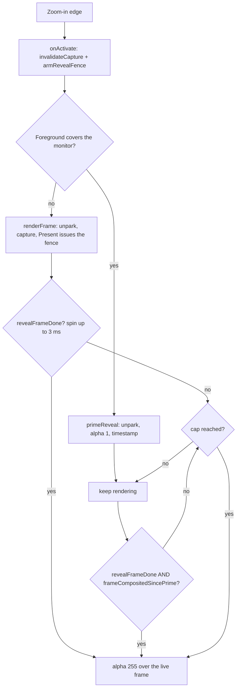

# 04. The render engine

The render engine captures the desktop with DXGI Desktop Duplication, scales a sub-pixel source
rectangle on the GPU with Direct3D 11 and presents it onto a fullscreen, click-through,
capture-excluded overlay. In Auto it is the engine for everything the transform is refused: other
monitors, `transformExclude` apps, learned churny apps, and desktop sessions without a verified
input transform (no UIAccess). Protected content never uses it: Desktop Duplication returns black
for it ([03](03-engines.md)).

## Structure

`RenderEngine` (`src/render_engine.h`) is a PIMPL class; D3D and DXGI headers stay in
`src/render_engine.cpp`. `RenderModel` (`src/render_model.cpp`) adapts it to `IMagnifierModel`.
`RunTick` owns activation and reveal, because they need facts the engine does not have (does the
foreground cover the monitor, is this the idle-to-active edge).

Per frame, `renderFrame(RenderFrameParams)` captures if the desktop changed, draws three passes
(magnify, outline, cursor) and presents. The view is a float source rect (`srcLeft`/`srcTop` plus
`level`), so panning is sub-pixel.

## The overlay window

`RenderEngine::initialize` creates one borderless popup (`WindRenderOverlay`) over the target
monitor. Every style is required:

| Style / attribute | Why |
|---|---|
| `WS_EX_LAYERED` + `SetLayeredWindowAttributes(.., LWA_ALPHA)` | Cross-process click-through, and the alpha byte is the show/hide switch. `WS_EX_TRANSPARENT` + `HTTRANSPARENT` alone forward clicks only to same-thread windows. |
| `WS_EX_TRANSPARENT` + `HTTRANSPARENT` in `OverlayProc` | The hit-test path. |
| `WS_EX_TOPMOST`, `WS_EX_NOACTIVATE`, `WS_EX_TOOLWINDOW` | Above app overlays, never takes focus, not in alt-tab. |
| `SetWindowDisplayAffinity(WDA_EXCLUDEFROMCAPTURE)` | **Required.** Without it Desktop Duplication captures Wind's own output and the view degenerates into a black feedback loop. |
| `DwmSetWindowAttribute(DWMWA_EXCLUDED_FROM_PEEK)` | Keeps the view during a taskbar-thumbnail Aero Peek. |

Because the overlay is capture-excluded, external screenshots cannot see it. Verify from inside the
process: `WIND_SELFTEST=1 Wind.exe` writes `wind_selftest.png` (`RenderEngine::dumpFrame`).

## Present: blt model only

The swapchain is `DXGI_SWAP_EFFECT_DISCARD`, one buffer, windowed, on the layered HWND, with
`SetMaximumFrameLatency(1)`. A blt present composites through DWM's redirection surface and never
tears.

**Do not use a DirectComposition flip-model path.** It was built twice (issues #11, #69). DWM
promotes the fullscreen visual to an independent-flip plane that tears on loop hitches on a VRR
display; forcing it back onto composition with `DwmFlush` tied the present rate to the floating
VRR composite rate (~68 Hz on a 23–143 Hz panel). RTSS is a quick tell: its overlay shows over blt
and vanishes over dcomp.

The blt path's one artifact is a phase-mismatch microstutter, tuned by `dwmFlush`: `0` (default)
presents with `Present(1,0)`; `1` presents immediately and calls `DwmFlush()` after the tick. Both
are hot. The game half-rate mode uses `Present(2,0)` (`syncOverride`) to turn irregular hitches
into a steady cadence.

## Parking

**The overlay is parked whenever Wind is not rendering**: moved past the right edge of the virtual
desktop (`setParked`). A shown fullscreen topmost layered window keeps a fullscreen game off its
independent-flip plane by geometry alone, even at alpha 0. Measured on RDR2 with PresentMon:
parking raised Independent Flip from 3% to 99.8% and cut mean frame time from 12.28 to 7.26 ms.

- Park by **moving**. `SW_HIDE` brings back the stale-frame flash (next section). Resizing to 1x1
  makes DWM reallocate the redirection surface, which shows one black frame per zoom.
- Each park or unpark is a synchronous DWM z-order transaction over the game, so two per session
  is the floor. Do not add more.
- The park position is past the virtual desktop's right edge so it cannot cover another monitor.
- `WIND_NOPARK=1` disables parking for A/B tests.

## Show and hide by alpha

`setVisible` flips the layer alpha between 0 and 255. A layered window hidden with `SW_HIDE` and
shown again makes DWM show the frame it had when last visible, which flashed the previous session.
The window is created shown at alpha 0 and only the alpha changes.

On hide, one black **scrub frame** is presented strictly after the alpha-0 flip, so the surface
never keeps the last session's content. The other order flashed black on every zoom-out. The scrub
is skipped while the previous present is still in flight on a starved GPU, because a blocking
`Present` on the teardown path could delay the cursor restore.

## The reveal gate

Presenting before flipping the alpha is not enough (issue #140). The blt is GPU work; the alpha
flip is a CPU call DWM honours at its next composite. Under GPU load the flip wins and DWM shows
the surface's retained frame. Two gates close the race:

1. **Present fence.** `onActivate` arms it; the session's first `Present` issues a D3D event query.
   `revealFrameDone()` is true once that Present executed on the GPU. On the desktop `RunTick`
   spins up to 3 ms so an idle GPU still reveals in the same tick.
2. **Composite evidence** (fullscreen apps only). A game on an independent-flip plane is invisible
   to Desktop Duplication (issue #90). `primeReveal()` sets alpha 1, which makes DWM composite the
   game, and `frameCompositedSincePrime()` turns true once a captured frame is newer than the
   prime. A fixed tick delay flashed the pre-alt-tab window under GPU load.

Both are non-blocking; the zoom ramp runs while they pend. `revealPending` (~250 ms of ticks) is
the fallback cap.

```mermaid
flowchart TD
  A[Zoom-in edge] --> B[onActivate: invalidateCapture + armRevealFence]
  B --> C{Foreground covers the monitor?}
  C -- no --> D[renderFrame: unpark, capture, Present issues the fence]
  C -- yes --> P[primeReveal: unpark, alpha 1, timestamp]
  P --> D2[keep rendering]
  D --> E{revealFrameDone? spin up to 3 ms}
  D2 --> F{revealFrameDone AND frameCompositedSincePrime?}
  E -- yes --> G[alpha 255 over the live frame]
  F -- yes --> G
  E -- no --> H{cap reached?}
  F -- no --> H
  H -- yes --> G
  H -- no --> D2
```

## Capture

- **Steady state** polls `AcquireNextFrame` once with a 0 ms timeout. A static screen returns
  `WAIT_TIMEOUT` and the engine re-pans its cached copy (`desktopCopy`); an 8 ms wait here once
  stalled every pan frame. A frame with `LastPresentTime == 0` is pointer-only and copies nothing,
  because the cursor comes from `GetCursorInfo`.
- **Fresh grabs** (zoom-in, `invalidateCapture()`) drain to the latest frame, not the first: the
  first frame after recreating a duplication can be a transitional composite, which flashed the
  window underneath. Bounded at ~3 ms per attempt and 100 ms in total.
- **Dirty rects.** `copyChangedRegions` patches only the rects DDA reports and falls back to a full
  `CopyResource` whenever a partial update is not provably safe (no previous frame, move rects,
  missing metadata, out-of-range rect).
- **Crop to the view.** On a near-full repaint the copy can be cropped to the magnified view.
  `cropCapture=0` by default (a desktop window switch would leave stale pixels outside the view);
  `gameCrop=1` (default) crops while the foreground covers the monitor, where every pixel is dirty
  again next frame.
- Rotated outputs are not supported: `recreateDupl` logs them, the engine pick sends them to
  Transform, and a captured surface whose size differs from the desktop is never copied (the last
  good frame stays, logged once).
- A dedicated capture thread was considered and deferred: high risk (feedback exclusion, HDR
  format changes, retarget, cross-thread texture sharing), no measured stall.

## Staying on top, and the z-band

An always-on-top window above the overlay (RTSS, Task Manager) draws an unmagnified copy over the
view. `renderFrame` re-asserts `HWND_TOPMOST` only when displaced (`overlayDisplaced`, one
`GetWindow` call in the common case), because a per-frame `SetWindowPos` synchronizes with DWM and
stutters. A 1 s backstop catches misses and is skipped while a fullscreen game is foreground.

**The band is a trade-off; the default is `zorderBand=0` (unbanded).** Both bandable windows go
through `wind::CreateBandedWindow` (`src/band_window.h`), which cascades the requested band to 16
to unbanded and logs every refusal.

| Band | Covers Start, taskbar, tray flyouts | Snipping Tool (Win+Shift+S) |
|---|---|---|
| 0 (default) | No | Works |
| 16 (UIAccess build) | Yes | The snip overlay composites over Wind: unmagnified screen and no cursor at all |
| 17 | Refused by `CreateWindowInBand` (build 26200) | – |

Do not restore 16 without re-testing both columns. Diagnostic trap: `ScreenClippingHost.exe` holds
foreground with no visible top-level window, so a z-order walk shows Wind at index 0 while it is
covered. The transform engine's Inspect crosshair switches bands on its own, see [07](07-cursor.md).

## HDR

On an HDR desktop the duplication requests FP16 scRGB (`DuplicateOutput1`) and the magnify shader
tonemaps to SDR (`hdrTonemap=1`, default).

- **Gate on Windows' advanced-colour state for the target display (`GetHdrEnabled`), not the DXGI
  colour space**: some monitors report HDR10 with Windows HDR off, which would dim SDR content.
- The shader divides by `ScrRgbScale = 80 / sdrWhiteNits`, so SDR white lands on 1.0. DWM applies
  the same white level when compositing the overlay, so the round trip is exact.
- **Never cache the SDR white level** (issue #160). A cached value left a brightness step on every
  zoom-in and zoom-out after the user moved the slider. It is re-read on every duplication rebuild
  and at 4 Hz while rendering (`refreshSdrWhite`, ~0.007 ms per query), matched by GDI device name,
  and a failed query keeps the last good value.
- `ensureDesktopCopy` recreates the copy in whatever format the capture delivers, so a runtime HDR
  toggle cannot mismatch it.
- Pure maths and the throttle: `src/hdr_scale.h`. The transform engine magnifies inside DWM and
  never converts colour.

## Colour filters

Warmth and brightness (`colorWarmPct`, `colorDimPct`) are one colour matrix (`src/color_matrix.h`),
applied by `ColorFilterController` (`src/color_filter.*`) through `MagSetFullscreenColorEffect`.

- **Desktop Duplication sees the DWM effect.** While a render session is visible the DWM effect is
  set to identity and the render shader applies the matrix instead; otherwise the overlay would be
  filtered twice. The drawn cursor, crosshair and outline are filtered too; an inverting text beam
  is drawn untinted.
- Colour follows the visible engine (`RenderModel::visible()`), so a pending reveal or a resting
  overlay in a handover keeps the right filter.
- **A filter holds the Magnification runtime at 1x**, which taxes cursor changes in other apps
  ([05](05-transform-engine.md)). Off by default.
- At 1x the hardware pointer is outside the DWM effect, so Wind swaps the system pointers for
  tinted copies (`src/cursor_tint.*`).
- Windows clears the effect when the process dies, so a crash never leaves the screen filtered.

Measurements and rejected filters: [../COLOUR-FILTER-FINDINGS.md](../COLOUR-FILTER-FINDINGS.md).

## Drawing and the cursor

The magnified desktop is one full-screen triangle (no clear when a copy exists), then the outline,
then the cursor.

- The outline is **one** full-screen pass that colours the border band and discards the interior;
  four separate quads dropped edges on some GPUs. It is inset 6 px because at non-integer DPI DWM
  can offset the layered present down-left and clip a flush edge. That is a DWM artifact, not draw
  code.
- The cursor comes from `GetCursorInfo` + `DecodeCursorBGRA`, cached per `HCURSOR` with a 5 s
  staleness bound (handles are recycled), with an invert blend for I-beam cursors. `cursorMode` 0
  draws only when the app shows its own cursor.
- Inspect replaces it with the crosshair from `BuildCrosshairBGRA` (`src/crosshair.cpp`).
- The hidden OS pointer is parked under the drawn cursor with `SetCursorPos` so clicks land where
  the user sees the pointer; `parkedLastFrame()` reports whether the park ran, and the park pauses
  while a mouse button is held. See [07](07-cursor.md).

## Surviving games

The game tell is `ForegroundCoversMonitor`, which also matches maximized windows, so none of these
engage by default on the desktop.

| Lever | Effect |
|---|---|
| `gpuPriority` (restart) | -1/0/+1 via `SetGPUThreadPriority` and the process scheduling class. +1 lets Wind's small frame jump a saturated game's queue; -1 yields and can freeze the view. `lowGpuPriority=1` means -1. |
| Present-fence gate (`gatePresent`) | With low priority, skip the frame while the previous present has not executed, so a blocking `Present` never wedges input and teardown. Cursor sync still runs. |
| `gameFpsCap` (hot) | Present every Nth vblank, below the rate DWM services a redirected window under a game (~78/s while compositing at 144). Skipped ticks wait on `WaitForVBlank`; input still runs every tick. |

`debugPerf` splits frame-build CPU time from time blocked in `Present`; see
[12](12-instrumentation.md).

## Multi-monitor and device loss

- `retarget` moves the engine to the cursor's monitor at zoom-in (`multiMonitor=1`). It validates
  first: the output must be on the D3D device's adapter (`selectOutput` by GDI device name), or it
  returns false and the session stays put. The fallible `ResizeBuffers` runs before the window
  moves. The pipeline works in monitor-local pixels; the origin offset is applied only at
  `GetCursorPos`/`SetCursorPos`.
- `DXGI_ERROR_DEVICE_REMOVED/RESET` latches `deviceLost()`. `recoverDeviceLost()` rebuilds through
  the same `buildDeviceResources` as `initialize`, so the paths cannot drift.
- **Always restore the OS cursor.** `shutdown` and the crash filter (`CursorRestoreFilter`) restore
  the pointer and release any `ClipCursor`. Cursor hiding goes through
  `MagApiAcquire`/`MagApiRelease`; see [05](05-transform-engine.md) for why the pairing must be
  shared.

Design history: [../specs/2026-05-25-own-renderer-design.md](../specs/2026-05-25-own-renderer-design.md).
