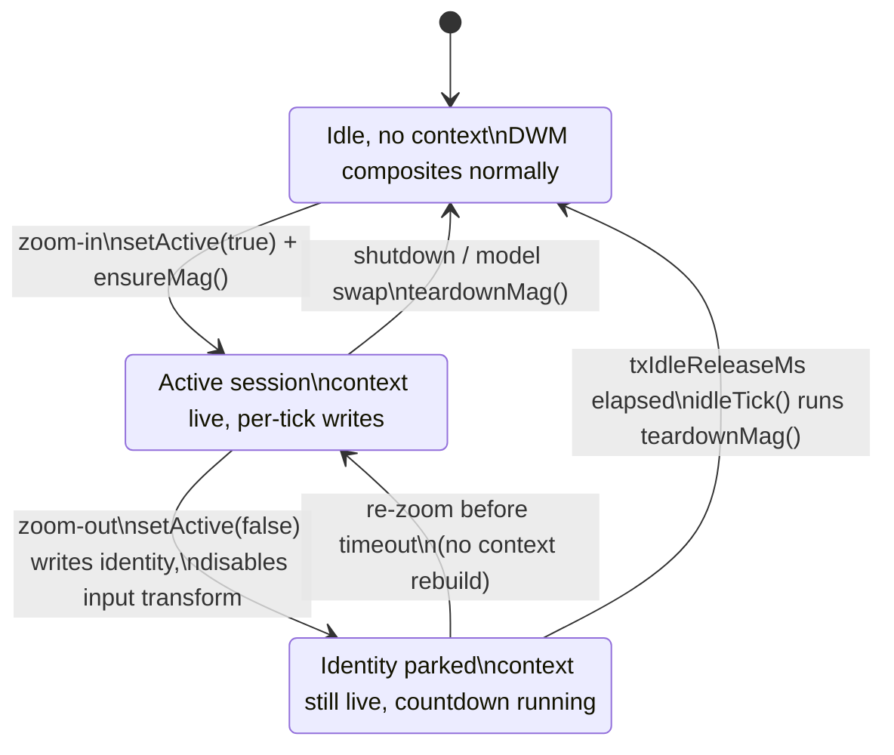

# 05. The transform engine

The transform engine (`src/transform_model.*`) zooms by telling DWM itself to magnify the
desktop: one fullscreen scale-and-translate applied inside the compositor, the same mechanism
native Windows Magnifier uses. There is no capture, no swapchain, and no window of ours in the
composition path, which is why it is the only engine that stays smooth over a heavy game: the
game keeps its independent-flip presentation and Wind's entire per-frame cost is a sub-millisecond
API write. The price is that everything is shared, global, and half-documented, and most of this
chapter is about the guardrails that make the shared machinery safe.

## Why magnify inside DWM

The render engine ([chapter 04](04-render-engine.md)) captures the desktop and re-presents it,
which means a fullscreen layered window sits over the game and every frame flows through an extra
capture-scale-present pipeline. Over a demanding game that pipeline competes with the game for the
GPU and the compositor. The transform engine sidesteps all of it: `MagSetFullscreenTransform` (or
its private sibling, below) mutates a value DWM consults when it composites, so the magnification
is applied during work DWM was doing anyway. Field measurements against native Magnifier over
games repeatedly put the two in the same class, and after the #219 cadence work Wind measures
better than native on every protocol tried (`../PERF-ACRYLIC-PARITY-2026-08-21.md`).

The hybrid model ([chapter 03](03-engines.md)) therefore picks the transform for game sessions
(borderless fullscreen cover on the primary), and optionally for the desktop too
(`desktopTransform=1`, gated on the input transform being available, see below).

## The shared-runtime law

The Magnification runtime is process scoped and both models use it: the transform for its
fullscreen writes, the render engine for `MagShowSystemCursor`. Two independent
`MagInitialize`/`MagUninitialize` pairs silently break each other, and both failure modes were
hit in the field (comment in `src/mag_host.h`):

- **Two cursors**: the transform's idle release ran `MagUninitialize` while the render engine
  still needed the runtime for cursor hiding, so the real pointer reappeared beside the drawn one.
- **Writes return FALSE**: the render engine's teardown killed the transform's context, so every
  subsequent transform write failed while the tick loop stayed healthy. The symptom is a
  magnifier that "stops zooming" while the cursor still moves.

The law: never call `MagInitialize`/`MagUninitialize` directly. Everything goes through
`wind::MagApiAcquire()`/`MagApiRelease()` (`src/mag_host.cpp`), a process-wide refcount that keeps
the runtime alive while any holder needs it and releases it exactly when the last one lets go.

Two further properties of the runtime shape the whole engine:

- **Thread affinity.** The thread that calls `MagInitialize` is the only thread whose
  Magnification calls do anything; a foreign-thread write returns FALSE and changes nothing
  (measured, `src/mag_thread.h`). All entry points marshal to the owning thread via
  `MagThreadInvoke`, which runs inline when the caller already owns the runtime or when no owner
  was claimed. Ownership normally stays on the tick thread; it moves to the input hook thread only
  when `txHookWrite=1` asks for hook writes (see the last section).
- **The live-context tax.** While a magnification context exists, DWM composites
  magnification-aware and every cursor visibility or shape change any app makes costs a
  re-composite. A game that toggles its pointer on middle-click hitches even at 1x (Foundation:
  measured 17 spike frames per 14 clicks with a live context, 0 without). Writing level 1.0 does
  not leave the mode; only releasing the runtime does. This is why the context lives only around
  real zoom sessions and why there is no warm-up write at launch. Note: the CLAUDE.md transform
  block still mentions a "launch warm-up 1.001"; the code removed it
  (`TransformModel::initialize` comment, harness-measured: 24 spike frames with the warm-up, 0
  without), and the code wins.

## Write channels

`MagHost::setTransformOwned` (`src/mag_host.cpp`) knows two channels for the same DWM state:

- **Private**: `SetMagnificationDesktopMagnification` (user32, resolved by name at init). It takes
  a screen-space translation `(zoom, tx, ty)` where `tx = -srcLeft * level`, so it pans level
  times more finely than the public API. At high zoom this is the difference between sub-pixel
  drift moving the view ~1px per frame and stalling entirely. `fastPan=1` (the default) uses it.
- **Public**: `MagSetFullscreenTransform(zoom, offX, offY)` with whole source pixels, the
  documented fallback.

If a private write ever fails, `privateBroken_` latches and the session falls back to the public
channel permanently; the flag is re-probed on every re-init. A 16-bit-translation theory that the
public channel might be safer for large `|tx|` was tested and disproven: both channels crash
identically over the MPO bug below, so there is no channel guard.

Both forms are computed together by the pure `ComputeMagTransform` (`src/transform.h/.cpp`) so
they always describe the same rect.

## Write cadence

The level is applied straight, per tick, continuously. Big discrete level jumps are the expensive
pattern for DWM (each level change re-scales its cached surfaces, and the cost grows with the
level), while small continuous deltas are cheap; the old quantization and ramp-divisor machinery
created exactly the costly jumps and was removed after A/B (comments in
`TransformModel::present`). Two measured-negative experiments survive as diagnostic knobs and
must stay 0: `txGrid` (geometric level ladder, much worse) and `txLevelStep` (minimum relative
change, no better).

The one cadence lever that shipped is **`txMaxStepPct`** (default 25, i.e. 2.5% per tick,
`src/config.h`): a cap on the per-tick relative level change actually applied. The #219
investigation (`../PERF-ACRYLIC-PARITY-2026-08-21.md`) found that ~15% of uncapped 15x zoom-ins
over acrylic stalled 35-43ms inside DWM and then snapped 1.2-1.9 levels at once; capped, 20/20
ramps ran even with uniform 0.36-level steps and zero over-25ms compositor gaps, for ~35ms of
extra ramp time. Normal ramp ticks are 0.8-2.2% relative, so the cap only ever bites the
post-stall catch-up snap. Two hard-won details:

- **Up-steps only.** Zoom-out measured clean uncapped, and a DOWN clamp anchored on `lastLevel_`
  caused the round-2 session-start bounce: the zoom-out trailed the controller under the cap, the
  identity park wrote 1.0 without updating the cache, and the next quick re-zoom's first writes
  were dragged backward toward the stale anchor (rig-reproduced 4/4).
- **The park syncs the cache.** `setActive(false)` writes identity outside `writeTransform`, so it
  explicitly sets `lastLevel_ = 1.0`; forgetting that is the same bounce from the other side.

When the applied level trails the requested one, the source rect is recomputed for what is
actually applied (`ComputeOffsetF` on `applyLevel`), so geometry and level never disagree.

Around the level logic sits `ShouldWriteTransform` (`src/tx_cadence.h`, pure and unit-tested in
`tests/test_tx_cadence.cpp`), built from a trace of native Magnifier's write pattern (issue #204:
native writes ~50-60/s in ~2.24px steps; Wind wrote ~92-120/s in 1.41px steps because it wrote
every tick on a 144Hz panel). Its gates, an optional write-rate cap (`txWriteHz`) and a minimum
destination-space pan step (`txMinOffsetPx`), coalesce writes without ever dropping a destination
state: a 100ms settle escape flushes any held residual, and a stopped ramp's final level always
lands exactly. Both knobs ship 0 though, because the field verdict on throttling was
unambiguous: Wind welds the cursor per tick, so throttling the view while the pointer moves at
full rate desynchronizes the two ("super jumpy, not centering"). Per-tick writing is load-bearing
for the welded design; native can afford ~50Hz precisely because it does not weld. The pure gate
stays because the measurement was sound even though the throttle conclusion was not.

Two smaller cadence mechanisms:

- **Keep-alive jitter.** DWM discards its magnification resources when the transform value sits
  still and pays a rebuild spike on the next real change. The keep-alive alternates the private
  channel translation by 1px on alternating ticks, only within 700ms of the last real change and
  only at or below `txKeepAliveMaxLevel`. Jittering the level instead (v1) forced a full re-scale
  per tick and was the cure being the disease. The config default is 8 (`src/config.h`); a stale
  comment in `TransformModel::present` claims it ships 0, and the config header is the truth.
- **Same-value hygiene.** Once the keep-alive window lapses, a zoomed-idle tick writes nothing at
  all; DWM parks on static values anyway, and 144 identical writes per second bought nothing.

Finally, `ex.pauseWrites` skips the whole write block for ~3 ticks around an Inspect-mode
injected click: a transform write racing an injected cursor-position update is a proven TDR
trigger (issue #148). State is untouched, so the next unpaused tick lands the same values.

## Session lifecycle

The context is created lazily at zoom-in and torn down in two phases after zoom-out, balancing
the ~36ms context build against the live-context tax.

**Transform session lifecycle: context creation, identity park, and delayed release.**

The details that matter, all in `src/transform_model.cpp`:

- `setActive(true)` pre-blanks the system cursor set BEFORE creating the context (the blanker
  swaps 14 cursors, and under a live context each swap pays the re-composite tax; running the
  burst inside the fresh context stacked ~14 taxed swaps onto the ~36ms build). It also stands
  the sprite up on the pointer with two `DwmFlush` passes so the blank-to-sprite handoff overlaps
  instead of blinking (issue #221).
- `setActive(false)` parks DWM at exact identity immediately, at the end of the zoom-out.
  Returning to identity costs a ~150ms compositor stall whenever it happens (measured), so it is
  paid while the user is still in zoom motion and expects movement, not 1.2s later mid-game. The
  input transform is disabled in the same breath, and the stomp-guard expectation is kept valid
  across the idle (see below).
- `idleTick()` releases the context (`teardownMag`, 1-2ms) once `txIdleReleaseMs` (default
  1200ms, hot-reloadable) has passed with no new session. The window is long enough that
  zoom-out/zoom-in flicks skip the rebuild, short enough that going back to playing is clean
  almost at once.
- `teardownMag` undoes cursor state FIRST: `MagShowSystemCursor(TRUE)` needs a live context, so
  doing it after `MagUninitialize` would silently strand the pointer hidden.
  `resetTransformState()` then forgets every cached write value; comparing against values DWM no
  longer holds would make the next session skip the writes that re-apply them.

## Clamping: the TDR class

`ComputeMagTransform` clamps both channel forms strictly inside the desktop with a 2px
right/bottom margin. This is not tidiness: the mapper clamps the FLOAT source to
`maxX = w - w/level`, fractional at any mid-ramp level, and naive rounding can push the integer
offset (or the private translation) past it so the magnified source rect samples outside the
desktop texture. Field-confirmed GPU driver reset (TDR), always at the right or bottom edge. The
margin specifically covers the exact-level-cap case where a bare floor still lets the rect end
exactly at the texture edge and the driver's filter neighborhood walks off it. Do not simplify
the clamp or the margin away; the comment block in `src/transform.h` is the contract.

## The MPO 16-bit overflow, pan walls, and the ghost

The final root cause of issue #148's crashes over real games: when a game surface rides an NVIDIA
hardware overlay plane (MPO), the driver packs DWM's magnification translation into a 16-bit
field. `|srcX * level| > 32767` (the far-right strip above ~9.3x on a 3840 panel) wraps and TDRs,
through both API channels, only over real games. With MPO disabled
(`HKLM\SOFTWARE\Microsoft\Windows\Dwm\OverlayTestMode=5`, reboot) the identical writes are clean
at full range.

Wind layers three defenses (boot-state read and wall arming in `src/main.cpp`, write-site clamp
in `TransformModel::present`):

1. **Pan wall.** With MPO enabled, the mapper's `setMaxSourceLeft` bounds transform GAME sessions
   to `srcX * level <= 32000`. Keyed to the session type (transform plus borderless cover), never
   to cursor state. The registry is read once at startup and the BOOT state governs until reboot,
   because DWM itself reads the key only at boot.
2. **MpoGhost buster** (`mpoBuster=1`, issue #191). A fullscreen alpha-1 click-through ghost
   window shown during MPO-exposed transform sessions demotes the covered surface off its
   hardware overlay plane; off the plane there is no 16-bit field to overflow, so the walls LIFT
   and full zoom range works without a registry edit. Fail-closed: the walls lift only while
   `MpoGhost::settled()` verifiably holds.
3. **Write-site backstop.** When the session is MPO-exposed and the ghost is not settled, the
   write path clamps `|tx| <= 32000` structurally and recomputes the offsets to match, because
   the mapper walls divide by the controller level while the write uses the step-capped
   `applyLevel`, and that drift would otherwise spend the headroom on faith.

## Bitmap smoothing

DWM magnifies with nearest neighbor unless something calls
`MagSetFullscreenUseBitmapSmoothing`, Magnification.dll ordinal 1, undocumented, resolved by
ordinal in `MagHost::initialize`. Turning it on looks dramatically better and crashes dwm.exe in
dwmcore.dll over complex Mica/acrylic geometry at high zoom (two first-try reproductions,
issue #197). The extra kernel-accepted modes 2-4 were field-tested and render identically to
nearest, so there is no cheaper middle filter; and the raw user32
`SetMagnificationDesktopSamplingMode` takes a DWORD POINTER, a by-value call access-violates
(field crash 2026-08-13). `txSamplingMode` ships 0 (nearest): a slightly blocky image is the
correct trade against a compositor that dies. The flag is DWM-global and survives our process
until DWM restarts, which is why smoothing appeared to come and go between builds; the model
re-applies the configured mode once per context (`samplingApplied_`).

## The input transform

Pointer-input frameworks (XAML/DirectUI: Explorer, Settings, the shell, Chromium) hit-test mouse
input through the system input transform under a fullscreen magnification. Without a correct
publish, the welded cursor has hard hover dead zones; MSDN's "pen/touch only" scoping is wrong
(`../POINTER-HITTEST-FINDINGS.md`). So every transform change publishes
`MagSetInputTransform(TRUE, srcRect, monitorRect)`, both rects in virtual-screen coordinates
(`ComputeInputTransformRects`, `src/transform.h`), exactly what native Magnifier does
continuously. Identity or no publish equals dead zones, measured; `magInputTransform=1` is the
shipped default and modes 0/2 are diagnostics that reproduce the bug.

The publish needs UIAccess. Availability is probed at `initialize` by reading the process
token's `TokenUIAccess` bit directly, zero Magnification calls; the CLAUDE.md description of a
"teardown-shaped acquire/release" probe is outdated, and the code comment explicitly bans that
shape (a startup acquire/release runs an identity WRITE, violating the no-warm-up law and
resetting a running native Magnifier). A verified-failed enabled publish self-heals by clearing
`inputTransformAvailable_`, which stops the hybrid desktop pick from choosing the transform.

Cost control: `ixDecimate` (default 4) publishes every Nth changed tick during motion, with a
guaranteed publish the moment motion rests, so a stationary aim is always exact. Hover
hit-testing does not need the 144Hz motion rate; clicks ride the welded cursor and never consult
the transform.

**The stomp guard (issue #217, `../WOBBLE-CAPTURE-2026-08-21.md`).** The input transform is ONE
system-wide slot, and native Magnifier republishes an enabled IDENTITY into it continuously
while it runs, even sitting unzoomed at 100%; a dirty Magnifier exit strands its last rect there,
surviving Wind restarts and even a DWM restart. Wind's response, in `TransformModel::present`:

- Every zoomed tick reads the slot back (`MagGetInputTransform`, ~0.1ms) and compares it against
  what Wind last verifiably published (`InputTransformStomped`, pure, exact integer compare). A
  mismatch forces a republish past the decimation and re-asserts `MagShowSystemCursor(FALSE)`,
  because the same foreign writer owns that shared global too (the two-cursors gotcha).
- The expectation is kept valid across sessions on purpose: a fresh session's first tick catches
  a rect stranded by a dead Magnifier and overwrites it immediately. One republish wins against a
  corpse.
- Publish success is judged by read-back, never by the return value: on this rig
  `MagSetInputTransform` can return FALSE while the publish demonstrably lands. The first few
  publishes per run log full ground truth (`ixdiag`: set return, GetLastError, immediate
  read-back).

The war conclusions, so nobody re-fights them: against a LIVE native Magnifier the publish war
is unwinnable (wm rewrites the slot faster than once per tick; the guard measured 144 lost races
per second), and the wobble Max reported turned out to be sprite move latency under wm's second
magnification context anyway, not the input transform itself. The guard earns its keep as
stale-corpse healing and reliable foreign-writer DETECTION; the recommended (parked) follow-up is
auto-picking the render engine while a foreign magnifier is detected, since render is immune to
all shared-state stomps by construction.

## Launch quiesce

A freshly launched game building its presentation surfaces while DWM services magnification
mutations is a dwmcore APPCRASH (RDR2 at 20x, issue #199). When a young process
(younger than 60s) newly covers the monitor borderless, Wind holds transform writes, the weld,
and the zoom ramp for ~1.5s (`TrackLaunchCover`/`QuiesceHoldActive` in `src/main.cpp`; the ramp
freeze matters because a silently-ramping level would snap the view when the hold lifts).

The arm decision is the pure `ShouldArmLaunchQuiesce` (`src/launch_quiesce.h`), and its veto is
the interesting part: a window that is layered, click-through, tool, non-activating, or opted out
of a redirection bitmap is a composition-only overlay, not something that presents its own
frames, so it never has the churn the hold sits out. Without the veto, the Snipping Tool capture
overlay (`ScreenClippingHost.exe`: fullscreen, borderless, `WS_EX_NOREDIRECTIONBITMAP`) armed
the full hold on every snip while zoomed, freezing the view and deadening the zoom keys for 1.5s
(log-proven). `WS_EX_TOPMOST` is deliberately not in the veto set: fullscreen games set it.

## Hook writes: the single-writer design that shipped off

Issue #206 attacked cursor-to-view latency: tick-paced writes measured 4.36ms median (a uniform
spread across exactly one 144Hz tick) against native's 0.58ms, because native writes from inside
its `WH_MOUSE_LL` callback. Stage 1 made runtime ownership movable to the hook thread
(`src/mag_thread.h`); stage 2 (`src/hook_transform.*`) lets `MouseProc` write the transform
inline from the event's own coordinates, under a strict SINGLE WRITER contract: while armed, the
hook owns position writes completely and the tick thread routes its writes (level ramps, idle
motion) through the same function, one formula, one code path. Two writers sampling the cursor at
different instants is exactly the wobble class issue #205 eliminated, and the hook path is only
safe at all because #205 made the view a pure function of the cursor (`txFreeCursor=1`), with no
mapper state to race.

It hit its metric (0.37ms median, better than native) and still shipped OFF (`txHookWrite=0`).
The field verdict and its explanation are preserved in `src/config.h`: writing per mouse event,
434-685/s against a 144Hz compositor, rewrote the view 4-5 times per displayed frame, so content
and the DWM-sampled cursor came from different instants and the cursor swam. The lesson worth
keeping: time-to-write is not the metric, frame coherence is. Do not re-enable without bounding
writes to one per composited frame with content and cursor sampled at the same instant. With the
knob off, ownership stays on the tick thread and every call runs inline, exactly the pre-#206
behavior; the choice is made at startup and cannot move afterward (thread affinity).

## Pointers

- `src/transform_model.h/.cpp`: the engine; session lifecycle, write path, sprite, stomp guard.
- `src/transform.h/.cpp`: pure math; `ComputeMagTransform` clamping, input-transform rects,
  `InputTransformStomped`.
- `src/tx_cadence.h` + `tests/test_tx_cadence.cpp`: the pure write-cadence gate.
- `src/mag_host.h/.cpp`, `src/mag_thread.h`: the shared runtime refcount, channels, marshalling.
- `src/hook_transform.h/.cpp`: the parked hook-write path.
- `src/launch_quiesce.h`: the quiesce arm predicate; use sites in `src/main.cpp`.
- Evidence: [PERF-ACRYLIC-PARITY-2026-08-21](../PERF-ACRYLIC-PARITY-2026-08-21.md),
  [WOBBLE-CAPTURE-2026-08-21](../WOBBLE-CAPTURE-2026-08-21.md),
  [POINTER-HITTEST-FINDINGS](../POINTER-HITTEST-FINDINGS.md),
  [HITCH-FINDINGS](../HITCH-FINDINGS.md).
- Related chapters: [Engines and the hybrid pick](03-engines.md),
  [The render engine](04-render-engine.md), [The cursor system](07-cursor.md),
  [Instrumentation and field method](12-instrumentation.md).
