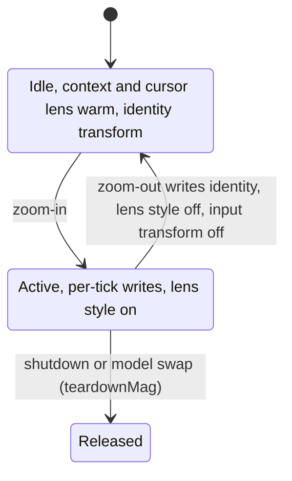

# 05. The transform engine

The transform engine (`src/transform_model.*`) asks DWM to magnify the desktop: one fullscreen
scale-and-translate applied inside the compositor, the mechanism the built-in Magnifier uses.
There is no capture, no swapchain and no Wind window in the composition path, so a game keeps its
independent-flip presentation and Wind's per-frame cost is a sub-millisecond API write. Measured
against the built-in Magnifier over acrylic windows, Wind is at least as smooth on every protocol
tried ([../PERF-ACRYLIC-PARITY-2026-08-21.md](../PERF-ACRYLIC-PARITY-2026-08-21.md)).

Auto picks it for games and protected video, and on the desktop when `desktopTransform=1` (the
default) and the input transform is available ([03](03-engines.md)). The cost is that the
machinery is shared, global and partly undocumented; most of this chapter is the guardrails.

## The Magnification runtime

**Never call `MagInitialize`/`MagUninitialize` directly.** The runtime is process-scoped and both
engines use it (transform: the fullscreen transform; render: `MagShowSystemCursor`). Use
`wind::MagApiAcquire()`/`MagApiRelease()` (`src/mag_host.cpp`), a process-wide refcount. Two
independent pairs break each other:

- The transform's idle release killed render's cursor hiding: two cursors.
- Render's teardown killed the transform context: every write returns FALSE and the view stops
  zooming while the cursor still moves.

Holds must be symmetric: take one when you need it, drop it the moment you stop.

**The composed pointer taxes every cursor change any app makes.** While DWM draws the pointer into
the magnified frame (a show-magnified-cursor lens: Magnification.dll's own after a public write
above 1x, or Wind's cursor lens with its style on), each cursor visibility or shape change costs a
re-composite. Measured in a game that toggles its pointer on middle-click: 17 spike frames per 14
clicks with that state live, 0 without; and on 2026-10-07 with a full-screen app blinking its
pointer: 19 spikes of 20-42 ms in 6 s with the composed pointer at 1x, 0 with a context alone, a
context after a private-channel zoom, or a context plus the cursor lens with its style off (all
three kept Independent Flip). So there is no warm-up write at launch, and Wind keeps the context and
the cursor lens warm with the lens style off at 1x ([07](07-cursor.md#native-cursor)). Colour
filters hold the runtime at 1x ([04](04-render-engine.md)).

**Calls are thread-affine.** Only the thread that called `MagInitialize` can drive the transform;
a write from another thread returns FALSE and changes nothing. That is the tick thread, and every
Magnification call is made on it; nothing marshals (the owner-thread scheme that existed for hook
writes is gone, see [Hook writes](#hook-writes-removed)).

## Write channels

`MagHost::setTransform` knows two channels for the same DWM state:

| Channel | Call | Notes |
|---|---|---|
| Private (`fastPan=1`, default) | `SetMagnificationDesktopMagnification(zoom, tx, ty)`, resolved by name | Screen-space translation, `level` times finer than the public offset. At high zoom it is the difference between smooth drift and a stalled view. |
| Public (fallback) | `MagSetFullscreenTransform(zoom, offX, offY)` | Whole source pixels. |

A failed private write latches `privateBroken_` and the session falls back to public until the next
init. Both forms come from the pure `ComputeMagTransform` (`src/transform.h`), so they always
describe the same rect.

## Write cadence

**Apply the level every tick, continuously.** Large discrete level jumps are what cost DWM (each
re-scales its cached surfaces); small continuous deltas are cheap. Do not re-quantize ramps. Snapping
the level to a geometric grid (to reuse DWM's per-scale surface cache) measured much worse (0 spikes
against 7-8 spike-seconds and 550-580 ms worst frames), and skipping small level steps measured no
better than continuous; both knobs are gone.

**`txMaxStepPct`** (default 25, i.e. 2.5% per tick) caps the per-tick relative level change.
Uncapped, ~15% of 15x zoom-ins over acrylic stalled 35–43 ms in DWM and then snapped 1.2–1.9
levels; capped, 20 of 20 ran even. Normal ramp ticks are 0.8–2.2%, so the cap only bites the
catch-up snap.

- It caps up-steps only. A down clamp made a quick re-zoom start backwards (the session-start
  bounce).
- `setActive(false)` writes the rest level (identity, 1.0 as shipped; `txRestLevel`) outside
  `writeTransform`, so it sets `lastLevel_ = restLevel_` explicitly. Forgetting that is the same
  bounce.
- When the applied level trails the requested one, the source rect is recomputed for the applied
  level, so geometry and level never disagree.

**Do not throttle the view.** Every changed tick is written. The built-in Magnifier paces itself at
~50–60 writes/s, and a write-rate cap plus a minimum pan step were tried to match it (issue #204),
then reverted the same day: a throttled view desynchronizes from the pointer (2 px steps wobble at
low zoom; 60 Hz looks like low fps at high zoom). Do not bring a write gate back without a test
that watches the view under a SLOW hand, not just stall counts.

**Warm-keeping** (`txWarmMode=1`, pure gate in `src/tx_warm.h`). DWM's magnification re-render goes
cold when the source rect sits still, and the first real pan after a pause pays ~25 ms (the
pan-start hitch). A 1 px translation displacement and return is a real source change and keeps it
warm. Re-sending the same transform, republishing the input transform and a sub-pixel level nudge
were tried (they were warm modes 2-4) and do not work: the level nudge passes every
composition-rate metric and still hitches, so do not trust composition-rate metrics here. Only
views Wind writes itself with the pointer not free are warmed (locked, Inspect); while DWM centres
there is nothing to warm. A free pointer's detached view (caret, focus, keyboard pan) is not warmed
either: following a Discord caret, each pulse showed as a 1 px shake (field video 2026-10-08), and
the hitch it guards is a game one (`ex.warmAllowed`).

- Every warm write is a full DWM re-render. Per-tick warming cost 16% dwm.exe GPU with the mouse
  still (the built-in Magnifier: 0.2%). So `txWarmHz` (default 12) makes it a pulse: one
  displacement plus return per period, 4.6% at rest. 0 means every tick.
- An open pulse always closes before the cadence gate applies, so the view is never left 1 px off.
- The hitch reproduces only in games; `tools/warm_cadence_sweep.ps1` and `tools/gpu_ab.ps1` measure
  the cadence trade-off. Details: [../HITCH-FINDINGS.md](../HITCH-FINDINGS.md).

Once warming lapses, a zoomed idle tick writes nothing. `ex.pauseWrites` skips writes for ~3 ticks
around an Inspect injected click; a write racing an injected cursor move is a TDR trigger.

## Session lifecycle

```mermaid
stateDiagram-v2
    [*] --> Idle
    Idle: Idle, context and cursor lens warm, identity transform
    Active: Active, per-tick writes, lens style on
    Idle --> Active: zoom-in
    Active --> Idle: zoom-out writes identity, lens style off, input transform off
    Active --> Released: shutdown or model swap (teardownMag)
```

- `idleTick()` builds the context and the cursor lens at 1x after launch (60-125 ms, once) and keeps
  them, lens style off. A failed build is not retried every tick (`lensFailed_`); zoom-in then falls
  back to one public write that makes DWM build its own lens.
- `setActive(true)` turns the lens style on and nudges the pointer a pixel and back so the composed
  pointer appears at once. Nothing is blanked and no sprite is stood up; only Inspect and the
  hide-cursor hotkey touch the cursor set ([07](07-cursor.md)).
- `setActive(false)` parks DWM at identity at once. Returning to identity costs a ~150 ms
  compositor stall, so it is paid during the zoom-out motion, not seconds later in a game. It then
  switches the lens style off and nudges the pointer so the hardware plane repaints.
- `teardownMag` (shutdown and model swaps only) restores cursor state **first**
  (`MagShowSystemCursor(TRUE)` needs a live context), then `resetTransformState()` forgets every
  cached value, so the next session does not skip writes DWM no longer holds.

## DWM centring (native cursor)

`MagHost::setDwmCentring` wraps `SetFullscreenMagnifierOffsetsDWMUpdated` (user32, undocumented,
resolved by name): TRUE,0,0 hands the pan to DWM, which re-centres on every cursor update; FALSE,0.8,0.8
gives it back. Rules (`src/native_cursor.h`, tested):

- On only where the view is a pure function of the pointer and no armed MPO wall is within a tick
  of the view (`NearWall`, a 64 source px margin: DWM's own pan is unclamped and could cross a wall
  before Wind's next tick; above ~9.3x on a 3840 wide monitor, 15.8x on 2160 high).
- While on, Wind still writes every changed tick (win32k's copy feeds pointer-framework
  hit-testing) and each write is followed by a pixel-and-back nudge (`NudgeAfterWrite`); warm
  pulses stop. DWM keeps the factor of the write that follows a TRUE call, so every switch forces
  one write (`forceWrite_`, survives paused ticks).
- `MagGetFullscreenTransform` does not see DWM's own moves: win32k's copy keeps Wind's last write.
  Judge centring on screen, not by read-back.
- When the export is missing or refuses the call, `dwmCentreBroken_` latches (one Warn) and
  `WantDwmCentreSwitch` stops asking, so a build without it keeps the pan without a forced write
  and a log line on every tick.

## Clamping

**Right and bottom: a 2 px margin, or TDR.** The mapper clamps the float source to
`w - w/level`, fractional mid-ramp, and rounding can push the integer offset or private translation
past it, so the rect samples outside the desktop texture: a GPU driver reset, always at the right
or bottom edge. `ComputeMagTransform` clamps both forms with a 2 px margin. The comment block in
`src/transform.h` is the contract.

**Left and top: one texel inside.** DWM's nearest path samples around a half-texel offset, so at
source 0 the first columns read outside the texture and show a light-grey line about `level/2` px
wide along the left (and top) edge once the view rests there. `SrcEdgeFloor` keeps the rect
`txEdgeMargin` texels inside (default 1; 0 for A/B). One formula feeds `ComputeMagTransform` and the
input-transform publish, so they never describe different rects. It resolves
to 0 where there is no headroom, so identity stays identity.

**Both margins are nearest-only** (`EdgeMarginsFor`). Each keeps desktop texels out of the view,
and the pointer-framework hit-test ignores a pointer outside it: zoomed, a click on the
bottom-left corner pixel did not open Start, while native Magnifier opens it at every level
(field probe 2026-10-09; either margin alone kills the corner, both at 0 fix it). Smooth sampling
clamps to edge and survives the far corner, as native does, so it uses native's exact rect: 0 and 0.
Nearest keeps 1 and 2, and with them the dead corner pixel.

## The MPO 16-bit overflow

With MPO enabled, the NVIDIA driver packs DWM's magnification translation into a 16-bit field on
the **nearest-sampling** path. `|srcX * level| > 32767` (the far-right strip above ~9.3x at 3840
wide; the bottom strip above ~16.2x at 2160 high) wraps and resets the driver, through both
channels and on the plain desktop too. With MPO disabled
(`HKLM\SOFTWARE\Microsoft\Windows\Dwm\OverlayTestMode=5`, reboot) the same writes are clean.
Smooth sampling takes a float path and survives the same corner, as does the built-in Magnifier,
which samples smooth.

Defences (wall arming in `RunTick`, write clamp in `TransformModel::present`):

| MPO at boot | Sampling | Pan walls (`setMaxSourceLeft/Top`, `|src*level| <= 32000`) |
|---|---|---|
| On | Nearest | Always |
| On | Smooth | Lifted while the MPO ghost (`mpoBuster=1`) is shown and settled; fail-closed |
| Off | Either | None |

- The registry is read once at startup; the recorded state governs until dwm.exe restarts, because
  DWM reads it only when it starts. The record (`src/mpo_boot.h`, pure half `mpo_boot_logic.h`) is
  keyed on dwm.exe's creation time, read without opening the process; OS boot time is the fallback.
- The ghost is a fullscreen alpha-1 click-through window that demotes surfaces off the overlay
  plane.
- A write-site clamp backs the walls up when the session is exposed and the ghost is not settled,
  because the walls divide by the controller level while the write uses the step-capped level.
- Since #369 the **High resolution cursor** option only switches sampling, live: smooth (resample
  layer) and nearest with the MPO guard (colour layer) are both plane-free while zoomed, so the page
  no longer stages MPO or asks for a restart. `mpoNearestGuard=0` restores the old rule
  (`EffectiveSamplingMode` then keeps the boot state's mode until a reboot).
- Plane-free sessions (`mpoGuardLiftWall=1`, default) also drop the pan walls, the write clamp and
  the MPO ghost. Field-tested 2026-10-07 on an MPO boot (RTX 5090): nearest with the guard, panned
  into the far-right and bottom-right corner above 10x, no driver reset; daily use up to 31x.
- `tdrTest` is the field harness: 2 probes the clamp, 4 lifts the wall.
- **MPO nearest guard** (`src/mpo_guard.h`, issue #369). Zoomed at nearest on an MPO boot, Wind
  applies an invisible colour effect (0.998 on R, G, B). A colour transform, like the resample
  property, makes the scaled desktop visual require an external layer, and nothing under such a
  visual is recorded as a plane candidate, so no plane can carry the overflowing translation.
  `mpoNearestGuard=1` (default, field-tested 2026-10-07) lets nearest run on MPO boots with the guard;
  `mpoGuardTest=1` forces the effect on an MPO-off boot to check its look. The pan walls stay
  armed for nearest either way until an MPO-on boot proves the guard (fail-closed).

## Bitmap smoothing

DWM magnifies with nearest neighbour unless something calls
`MagSetFullscreenUseBitmapSmoothing` (Magnification.dll, undocumented, resolved BY NAME).
`txSamplingMode`: 0 nearest (default), 1 smooth.

- Until 0.24.0 it was resolved by ordinal 1, which does not exist (the export ordinals start at
  100), so Wind never set the filter: the image showed whatever state another process had left.
  Measured 2026-10-07: from a smooth DWM state Wind at nearest stayed smooth; by name it switches.

- The flag is the whole quality gap to the built-in Magnifier, image and cursor alike.
- The raw user32 `SetMagnificationDesktopSamplingMode` takes a DWORD **pointer**; a by-value call
  access-violates.
- Modes 2–4, which the kernel accepts, render as nearest. There is no middle filter.
- The flag is DWM-global and outlives the process that set it until DWM restarts, so a stale
  smooth state can make a build look smooth that is not. The model re-applies its mode per context
  with up to 3 retries.
- A DWM restart resets it to nearest while win32k still reads back smooth, so a read-back cannot
  tell. `src/dwm_watch.*` watches this session's dwm.exe process id once a second (no handle to
  dwm.exe) and the model re-applies its mode when the generation changes (#396).
- Smooth renders the magnified subtree into a scratch target at source resolution and scales it
  with Lanczos (`CResampleLayer::RenderLanczos`; the DWM registry value `ResampleModeOverride=1`
  would force xBR instead, any other value is an error). Zoom "shake", measured 2026-10-07: cursor
  tip jitter 8-10 px p95, jumps up to 18-26 px, 33-39 direction reversals per zoom-in at smooth;
  2 px and 3-7 at nearest; the same for the native pointer (and for the old sprite). Pans are clean. Suspected
  cause (untested): the scratch target snaps to whole source pixels while the private channel
  positions the view in screen pixels, so the image can jump up to one source pixel times the zoom.
- **Smooth-zoom ladder** (`txSmoothLadder=1`, `src/zoom_ladder.h`): the smooth path's scratch image
  has its size and origin rounded to whole pixels every frame, and two closed terms predict the
  resulting shift per level. While smooth, the applied level snaps to the nearest level predicting
  under 1 px (never backwards in a ramp; held once the zoom settles). Measured standalone at
  3840x2160: 10-25x jitter 11 px -> 0.7 px p95, worst jump 42 px -> 2 px; 2-10x 4.7 px -> 0.8 px.
- The ladder's cost is uneven speed: above ~6x clean levels are ~0.9 % apart while a tick moves ~3 %,
  so single ticks run 15-40 % fast or slow (measured 2026-10-10: tick-to-tick rate change 8-21 %
  median above 6x, 1-5 % with the ladder off or nearest). Above 12x, where the tolerance relaxes, a
  slow held zoom shows small image jumps (predicted 3.6-4.2 px p95 at 12-20x). Capped, rate-keeping
  and stricter snaps were all simulated against the trace and the ladder's own model: each traded
  the shake for uneven speed or lurches, so the ladder stays as it is.
- No release glide with the high resolution cursor (#427): the ladder could only cut a glide short
  or let its slow tail cross rounding steps (which shook the image and showed it doubled, closed
  #426), so `zoomEaseOutMs` is not applied while `txSamplingMode=1`; the zoom stops on release.
- Nearest while the level moves and smooth at rest was tried: steady, but the switch from pixel to
  smooth is plainly visible, so it was rejected (2026-10-07). The older "swap shifted the image
  1-2 px" verdict predates the working setter and is void.
- Smoothing once crashed dwm.exe over Mica and acrylic at high zoom; it did not reproduce on a
  newer driver. If dwm.exe crashes return, set `txSamplingMode=0` first.
  It returned on 2026-10-09 (RTX 5090, dwm.exe 10.0.26100.9549): an app window with its
  see-through acrylic setting on, smooth sampling, zoom in to about 11x, then zoom out.
  dwmcore.dll faulted with 0x80070057 at offset 0x87565 during the zoom-out; Wind's next write
  blocked 4.8 s while DWM restarted, and Wind itself kept running.
  **Root cause (crash dumps, 2026-10-09): a DWM bug, not Wind's.** Stack:
  `CCachedVisualImage::EnsureRenderTargetBitmap` -> `CResampleLayer::Create` ->
  `CD3DDevice::CreateScratchRenderTargetBitmap` -> `CreateTexture` -> E_INVALIDARG -> fail-fast.
  Redrawing the cached backdrop that acrylic blurs, DWM pushes the smoothing layer and asks for
  a scratch render target of the whole screen at zoomed size: 45168 x 24138 (R16G16B16A16_FLOAT),
  past the 16384 texture limit. Native Magnifier crashes DWM the same way (12x, same stack,
  Wind closed), so this is native parity; the only full avoidance is nearest sampling.
  Repro: smooth sampling, an acrylic window, zoom in (11x-31x), zoom out; it dies mid zoom-out.
  A slower zoom-out, no edge margins, the public write channel, no ladder and no warm pulses
  all still crash (field A/B the same evening).

## The input transform

**Every transform change publishes `MagSetInputTransform(TRUE, srcRect, monitorRect)`**, both in
virtual-screen coordinates (`ComputeInputTransformRects`). Pointer frameworks (XAML/DirectUI:
Explorer, Settings, the shell, Chromium) hit-test mouse input through it; without the publish the
welded cursor has hover dead zones. Identity or no publish both produce dead zones.
`magInputTransform=1` is the default; 0 and 2 are diagnostics. Evidence:
[../POINTER-HITTEST-FINDINGS.md](../POINTER-HITTEST-FINDINGS.md).

- **It needs UIAccess.** Availability is read from the process token's `TokenUIAccess` bit at
  `initialize`, with zero Magnification calls; an acquire/release probe would run an identity
  write. A verified-failed publish clears `inputTransformAvailable_`, which stops Auto picking
  Transform for the desktop. Only `ERROR_ACCESS_DENIED` is permanent; any other failure is re-armed
  from the token probe when the session ends.
- `ixDecimate` (default 4) publishes every Nth changed tick during motion, and always when motion
  rests. Clicks ride the real pointer and never consult the transform.

**Stomp guard.** The input transform is one system-wide slot. A running Magnify.exe republishes an
enabled identity into it continuously, and a dirty Magnifier exit leaves its last rect there,
surviving Wind restarts and DWM restarts.

- Every zoomed tick reads the slot back (`MagGetInputTransform`, ~0.1 ms) and compares it with
  what Wind last published (`InputTransformStomped`, exact). A mismatch forces a republish and
  re-asserts `MagShowSystemCursor(FALSE)`, which the same foreign writer resets.
- The expectation survives across sessions, so a fresh session overwrites a stranded rect at once.
- Success is judged by read-back, not the return value, which can be FALSE when the publish landed.
- Against a running Magnify.exe the guard loses every race; it detects and heals, it cannot win.
  Picking Render while a foreign magnifier runs is parked work. See
  [../NATIVE-MAGNIFIER-STOMP.md](../NATIVE-MAGNIFIER-STOMP.md).

## Launch quiesce

A newly launched game building its surfaces while DWM services magnification writes crashes
dwmcore (RDR2 at 20x, issue #199). When a process younger than 60 s newly covers the monitor
borderless, Wind holds transform writes, the weld and the zoom ramp for ~1.5 s
(`TrackLaunchCover`/`QuiesceHoldActive`).

The pure `ShouldArmLaunchQuiesce` (`src/launch_quiesce.h`) vetoes composition-only overlays:
layered, click-through, tool, non-activating or no-redirection-bitmap windows. Without the veto the
Snipping Tool overlay froze the view for 1.5 s on every snip. `WS_EX_TOPMOST` is not in the veto
set, because games set it. `launchQuiesce=0` disables the hold; it is a test knob only.

## Hook writes (removed)

A removed experiment moved runtime ownership to the mouse-hook thread and
let `MouseProc` write the transform from each mouse event under a single-writer contract. It
reached 0.37 ms cursor-to-write latency but never shipped on: writing 434–685 times a second
against a 144 Hz compositor rewrote the view 4–5 times per frame and the cursor swam. Frame
coherence, not time-to-write, is the metric. A revival would need one write per composited frame;
it is also incompatible with DWM centring, which makes it moot. Details:
[../HITCH-FINDINGS.md](../HITCH-FINDINGS.md).
