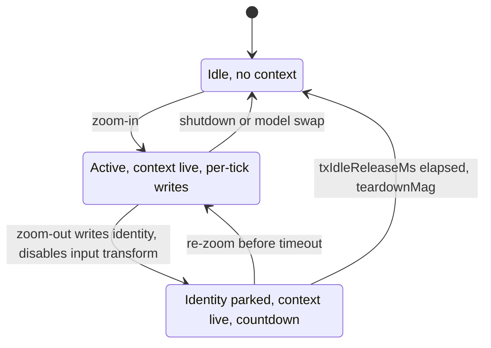

# 05. The transform engine

The transform engine (`src/transform_model.*`) asks DWM to magnify the desktop: one fullscreen
scale-and-translate applied inside the compositor, the mechanism the built-in Magnifier uses.
There is no capture, no swapchain and no Wind window in the composition path, so a game keeps its
independent-flip presentation and Wind's per-frame cost is a sub-millisecond API write. Measured
against the built-in Magnifier over acrylic windows, Wind is at least as smooth on every protocol
tried ([../PERF-ACRYLIC-PARITY-2026-08-21.md](../PERF-ACRYLIC-PARITY-2026-08-21.md)).

Auto picks it for games and protected video, and on the desktop when `desktopTransform=1` (the
default) and the input transform is available ([03](03-engines.md)). The cost is that the
machinery is shared, global and partly undocumented; most of this chapter is the guardrails.

## The Magnification runtime

**Never call `MagInitialize`/`MagUninitialize` directly.** The runtime is process-scoped and both
engines use it (transform: the fullscreen transform; render: `MagShowSystemCursor`). Use
`wind::MagApiAcquire()`/`MagApiRelease()` (`src/mag_host.cpp`), a process-wide refcount. Two
independent pairs break each other:

- The transform's idle release killed render's cursor hiding: two cursors.
- Render's teardown killed the transform context: every write returns FALSE and the view stops
  zooming while the cursor still moves.

Holds must be symmetric: take one when you need it, drop it the moment you stop.

**The composed pointer taxes every cursor change any app makes.** While DWM draws the pointer into
the magnified frame (a show-magnified-cursor lens: Magnification.dll's own after a public write
above 1x, or Wind's cursor lens with its style on), each cursor visibility or shape change costs a
re-composite. Measured in a game that toggles its pointer on middle-click: 17 spike frames per 14
clicks with that state live, 0 without; and on 2026-10-07 with a full-screen app blinking its
pointer: 19 spikes of 20-42 ms in 6 s with the composed pointer at 1x, 0 with a context alone, a
context after a private-channel zoom, or a context plus the cursor lens with its style off (all
three kept Independent Flip). So the sprite path keeps the context only around real sessions, and
there is no warm-up write at launch; the native cursor keeps context and lens warm with the style
off at 1x ([07](07-cursor.md#native-cursor-high-resolution-cursor-on)). Colour filters hold the
runtime at 1x ([04](04-render-engine.md)).

**Calls are thread-affine.** Only the thread that called `MagInitialize` can drive the transform;
a write from another thread returns FALSE and changes nothing (`src/mag_thread.h`). Every entry
point goes through `MagThreadInvoke`, which runs inline when the caller owns the runtime or when no
owner was claimed. Ownership is decided once at startup and stays on the tick thread unless
`txHookWrite=1` (see [Hook writes](#hook-writes-not-shipped)).

## Write channels

`MagHost::setTransformOwned` knows two channels for the same DWM state:

| Channel | Call | Notes |
|---|---|---|
| Private (`fastPan=1`, default) | `SetMagnificationDesktopMagnification(zoom, tx, ty)`, resolved by name | Screen-space translation, `level` times finer than the public offset. At high zoom it is the difference between smooth drift and a stalled view. |
| Public (fallback) | `MagSetFullscreenTransform(zoom, offX, offY)` | Whole source pixels. |

A failed private write latches `privateBroken_` and the session falls back to public until the next
init. Both forms come from the pure `ComputeMagTransform` (`src/transform.h`), so they always
describe the same rect.

## Write cadence

**Apply the level every tick, continuously.** Large discrete level jumps are what cost DWM (each
re-scales its cached surfaces); small continuous deltas are cheap. Do not re-quantize ramps.
`txGrid` and `txLevelStep` remain as diagnostic knobs and must stay 0.

**`txMaxStepPct`** (default 25, i.e. 2.5% per tick) caps the per-tick relative level change.
Uncapped, ~15% of 15x zoom-ins over acrylic stalled 35–43 ms in DWM and then snapped 1.2–1.9
levels; capped, 20 of 20 ran even. Normal ramp ticks are 0.8–2.2%, so the cap only bites the
catch-up snap.

- It caps up-steps only. A down clamp made a quick re-zoom start backwards (the session-start
  bounce).
- `setActive(false)` writes identity outside `writeTransform`, so it sets `lastLevel_ = 1.0`
  explicitly. Forgetting that is the same bounce.
- When the applied level trails the requested one, the source rect is recomputed for the applied
  level, so geometry and level never disagree.

**Do not throttle the view.** `ShouldWriteTransform` (`src/tx_cadence.h`, unit-tested) can cap the
write rate (`txWriteHz`) and the minimum pan step (`txMinOffsetPx`) the way the built-in Magnifier
paces itself (~50–60 writes/s). Both ship 0: Wind welds the cursor every tick, so a throttled view
desynchronizes from the pointer (2 px steps wobble at low zoom; 60 Hz looks like low fps at high
zoom). Gating the cursor sprite on "the view moved" froze the cursor in the edge zones.

**Warm-keeping** (`txWarmMode=1`, pure gate in `src/tx_warm.h`). DWM's magnification re-render goes
cold when the source rect sits still, and the first real pan after a pause pays ~25 ms (the
pan-start hitch). A 1 px translation displacement and return is a real source change and keeps it
warm. A sub-pixel level nudge passes every composition-rate metric and still hitches, so do not
trust composition-rate metrics here.

- Every warm write is a full DWM re-render. Per-tick warming cost 16% dwm.exe GPU with the mouse
  still (the built-in Magnifier: 0.2%). So `txWarmHz` (default 12) makes it a pulse: one
  displacement plus return per period, 4.6% at rest. 0 means every tick.
- An open pulse always closes before any other gate applies, so the view is never left 1 px off.
- The hitch reproduces only in games; `tools/warm_cadence_sweep.ps1` and `tools/gpu_ab.ps1` measure
  the cadence trade-off. Details: [../HITCH-FINDINGS.md](../HITCH-FINDINGS.md).

Once warming lapses, a zoomed idle tick writes nothing. `ex.pauseWrites` skips writes for ~3 ticks
around an Inspect injected click; a write racing an injected cursor move is a TDR trigger.

## Session lifecycle

```mermaid
stateDiagram-v2
    [*] --> Idle
    Idle: Idle, no context
    Active: Active, context live, per-tick writes
    Parked: Identity parked, context live, countdown
    Idle --> Active: zoom-in
    Active --> Parked: zoom-out writes identity, disables input transform
    Parked --> Active: re-zoom before timeout
    Parked --> Idle: txIdleReleaseMs elapsed, teardownMag
    Active --> Idle: shutdown or model swap
```

- `setActive(true)` blanks the system cursors **before** creating the context: each of the 14
  swaps pays the live-context tax otherwise. It stands the sprite up with two `DwmFlush` passes so
  blank-to-sprite does not blink.
- `setActive(false)` parks DWM at identity at once. Returning to identity costs a ~150 ms
  compositor stall, so it is paid during the zoom-out motion, not seconds later in a game.
- `idleTick()` releases the context once `txIdleReleaseMs` (default 1200, hot) passes, long enough
  that quick zoom flicks skip the ~36 ms rebuild. Native-cursor mode never releases at idle: it
  builds the context and the cursor lens at 1x after launch and keeps them, style off.
- Native-cursor sessions skip the blanker and the sprite stand-up at zoom-in (no cursor swaps) and
  only switch the cursor lens style; zoom-out switches it off after the identity park and nudges
  the pointer so the hardware plane repaints.
- `teardownMag` restores cursor state **first** (`MagShowSystemCursor(TRUE)` needs a live context),
  then `resetTransformState()` forgets every cached value, so the next session does not skip writes
  DWM no longer holds.

## DWM centring (native cursor)

`MagHost::setDwmCentring` wraps `SetFullscreenMagnifierOffsetsDWMUpdated` (user32, undocumented,
resolved by name): TRUE,0,0 hands the pan to DWM, which re-centres on every cursor update; FALSE,0.8,0.8
gives it back. Rules (`src/native_cursor.h`, tested):

- On only where the view is a pure function of the pointer and no MPO wall is in reach
  (`WallBinding`: above ~9.3x on a 3840 wide monitor, 15.8x on 2160 high, when armed).
- While on, only level changes are written; warm pulses stop. DWM keeps the factor of the write
  that follows a TRUE call, so every switch forces one write (`forceWrite_`, survives paused ticks).
- `MagGetFullscreenTransform` does not see DWM's own moves: win32k's copy keeps Wind's last write.
  Judge centring on screen, not by read-back.

## Clamping

**Right and bottom: a 2 px margin, or TDR.** The mapper clamps the float source to
`w - w/level`, fractional mid-ramp, and rounding can push the integer offset or private translation
past it, so the rect samples outside the desktop texture: a GPU driver reset, always at the right
or bottom edge. `ComputeMagTransform` clamps both forms with a 2 px margin. The comment block in
`src/transform.h` is the contract.

**Left and top: one texel inside.** DWM's nearest path samples around a half-texel offset, so at
source 0 the first columns read outside the texture and show a light-grey line about `level/2` px
wide along the left (and top) edge once the view rests there. `SrcEdgeFloor` keeps the rect
`txEdgeMargin` texels inside (default 1; 0 for A/B). One formula feeds `ComputeMagTransform`, the
input-transform publish and the hook writer, so they never describe different rects. It resolves
to 0 where there is no headroom, so identity stays identity.

## The MPO 16-bit overflow

With MPO enabled, the NVIDIA driver packs DWM's magnification translation into a 16-bit field on
the **nearest-sampling** path. `|srcX * level| > 32767` (the far-right strip above ~9.3x at 3840
wide; the bottom strip above ~16.2x at 2160 high) wraps and resets the driver, through both
channels and on the plain desktop too. With MPO disabled
(`HKLM\SOFTWARE\Microsoft\Windows\Dwm\OverlayTestMode=5`, reboot) the same writes are clean.
Smooth sampling takes a float path and survives the same corner, as does the built-in Magnifier,
which samples smooth.

Defences (wall arming in `RunTick`, write clamp in `TransformModel::present`):

| MPO at boot | Sampling | Pan walls (`setMaxSourceLeft/Top`, `|src*level| <= 32000`) |
|---|---|---|
| On | Nearest | Always |
| On | Smooth | Lifted while the MPO ghost (`mpoBuster=1`) is shown and settled; fail-closed |
| Off | Either | None |

- The registry is read once at startup; the boot state governs until reboot, because DWM reads it
  only at boot (`src/mpo_boot.h`).
- The ghost is a fullscreen alpha-1 click-through window that demotes surfaces off the overlay
  plane.
- A write-site clamp backs the walls up when the session is exposed and the ghost is not settled,
  because the walls divide by the controller level while the write uses the step-capped level.
- Settings couples the two: the **High resolution cursor** option sets smooth sampling and stages
  MPO re-enable; turning it off sets nearest and stages MPO-disable, both applied at the restart.
  Nearest with MPO on is never offered (`EffectiveSamplingMode` keeps the boot state's mode until
  the reboot lands).
- `tdrTest` is the field harness: 2 probes the clamp, 4 lifts the wall.

## Bitmap smoothing

DWM magnifies with nearest neighbour unless something calls
`MagSetFullscreenUseBitmapSmoothing` (Magnification.dll ordinal 1, undocumented, resolved by
ordinal). `txSamplingMode`: 0 nearest (default), 1 smooth.

- The flag is the whole quality gap to the built-in Magnifier, image and cursor alike.
- The raw user32 `SetMagnificationDesktopSamplingMode` takes a DWORD **pointer**; a by-value call
  access-violates.
- Modes 2–4, which the kernel accepts, render as nearest. There is no middle filter.
- The flag is DWM-global and outlives the process that set it until DWM restarts, so a stale
  smooth state can make a build look smooth that is not. The model re-applies its mode per context
  with up to 3 retries; the setter's return value is unreliable.
- Under smooth, level ramps shimmer slightly (the filter re-interpolates each scale step); pans are
  clean. Swapping to nearest during ramps shifted the image 1–2 px per swap and was rejected.
- Smoothing once crashed dwm.exe over Mica and acrylic at high zoom; it did not reproduce on a
  newer driver. If dwm.exe crashes return, set `txSamplingMode=0` first.

## The input transform

**Every transform change publishes `MagSetInputTransform(TRUE, srcRect, monitorRect)`**, both in
virtual-screen coordinates (`ComputeInputTransformRects`). Pointer frameworks (XAML/DirectUI:
Explorer, Settings, the shell, Chromium) hit-test mouse input through it; without the publish the
welded cursor has hover dead zones. Identity or no publish both produce dead zones.
`magInputTransform=1` is the default; 0 and 2 are diagnostics. Evidence:
[../POINTER-HITTEST-FINDINGS.md](../POINTER-HITTEST-FINDINGS.md).

- **It needs UIAccess.** Availability is read from the process token's `TokenUIAccess` bit at
  `initialize`, with zero Magnification calls; an acquire/release probe would run an identity
  write. A verified-failed publish clears `inputTransformAvailable_`, which stops Auto picking
  Transform for the desktop.
- `ixDecimate` (default 4) publishes every Nth changed tick during motion, and always when motion
  rests. Clicks ride the welded cursor and never consult the transform.

**Stomp guard.** The input transform is one system-wide slot. A running Magnify.exe republishes an
enabled identity into it continuously, and a dirty Magnifier exit leaves its last rect there,
surviving Wind restarts and DWM restarts.

- Every zoomed tick reads the slot back (`MagGetInputTransform`, ~0.1 ms) and compares it with
  what Wind last published (`InputTransformStomped`, exact). A mismatch forces a republish and
  re-asserts `MagShowSystemCursor(FALSE)`, which the same foreign writer resets.
- The expectation survives across sessions, so a fresh session overwrites a stranded rect at once.
- Success is judged by read-back, not the return value, which can be FALSE when the publish landed.
- Against a running Magnify.exe the guard loses every race; it detects and heals, it cannot win.
  Picking Render while a foreign magnifier runs is parked work. See
  [../NATIVE-MAGNIFIER-STOMP.md](../NATIVE-MAGNIFIER-STOMP.md).

## Launch quiesce

A newly launched game building its surfaces while DWM services magnification writes crashes
dwmcore (RDR2 at 20x, issue #199). When a process younger than 60 s newly covers the monitor
borderless, Wind holds transform writes, the weld and the zoom ramp for ~1.5 s
(`TrackLaunchCover`/`QuiesceHoldActive`).

The pure `ShouldArmLaunchQuiesce` (`src/launch_quiesce.h`) vetoes composition-only overlays:
layered, click-through, tool, non-activating or no-redirection-bitmap windows. Without the veto the
Snipping Tool overlay froze the view for 1.5 s on every snip. `WS_EX_TOPMOST` is not in the veto
set, because games set it. `launchQuiesce=0` disables the hold; it is a test knob only.

## Hook writes (not shipped)

`txHookWrite=1` (restart) moves runtime ownership to the hook thread and lets `MouseProc` write the
transform from each mouse event (`src/hook_transform.*`), under a single-writer contract: while
armed the hook owns position writes and the tick routes ramps through the same function. It
reached 0.37 ms cursor-to-write latency but ships off: writing 434–685 times a second against a
144 Hz compositor rewrote the view 4–5 times per frame and the cursor swam. Frame coherence, not
time-to-write, is the metric. Do not enable it without one write per composited frame.
