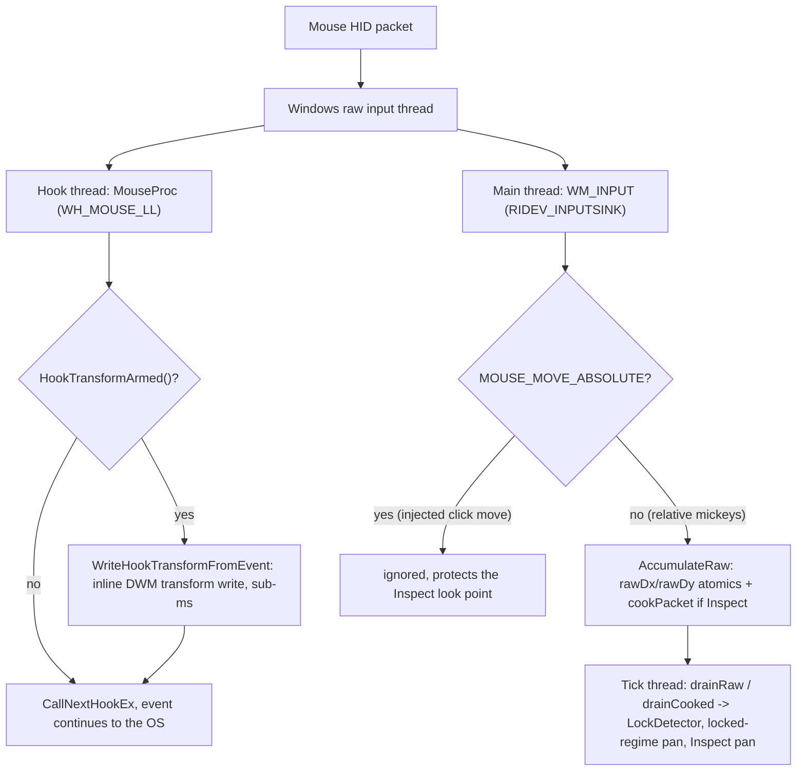
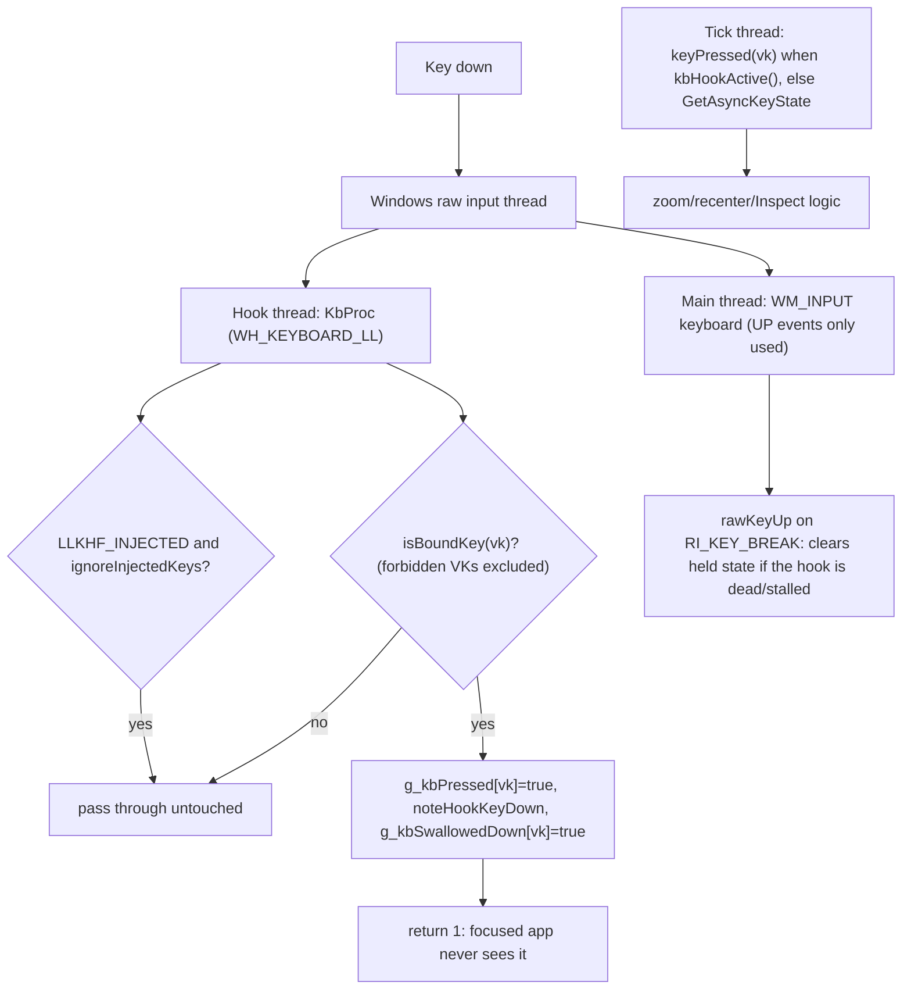

# 06. The input pipeline

Wind never has keyboard focus and never owns a visible interactive window, yet it must see every
zoom button press, every bound key, and every mouse movement, system-wide, at microsecond latency,
without breaking input for any other program. This chapter walks through the three channels input
arrives on (low-level hooks, Raw Input, and `RegisterHotKey`), the dedicated thread that services
the hooks, the swallowing rules that keep bound keys out of other apps without ever stranding a
key, and the layered safety nets that recover from Windows silently killing a hook. The code is
`src/input_router.h/.cpp`, the `WM_INPUT` handling in `src/main.cpp`, and the pure ballistics in
`src/mouse_ballistics.h/.cpp`.

## Three channels, three reasons

Windows offers several ways to observe global input, and Wind uses three of them because no single
one covers all the requirements:

| Channel | What Wind uses it for | Why this channel |
|---|---|---|
| `WH_MOUSE_LL` hook (`MouseProc`, src/input_router.cpp) | Zoom side-buttons (XBUTTON1/2), Inspect-mode click interception, and the issue #206 inline transform write | The only user-mode way to *swallow* a mouse button so other apps never see it, and the earliest point a mouse event is observable (native Magnifier writes its transform from the same place) |
| `WH_KEYBOARD_LL` hook (`KbProc`, src/input_router.cpp) | Keyboard zoom/recenter/cursorLock binds: tracking their physical down-state and swallowing them | Same swallowing property for keys; also the *authority* for bound-key state, because a swallowed key never appears in `GetAsyncKeyState` |
| Raw Input (`RIDEV_INPUTSINK` registration in `wWinMain`, `WM_INPUT` decode in `WndProc`, both src/main.cpp) | HID mouse deltas ("mickeys") for panning under a game lock and in Inspect mode, plus UP-event safety nets for both hooks | Delivered at HID level, so it is unaffected by `ClipCursor`, `SetCursorPos`, or `ShowCursor`, and it is not subject to the hook timeout that Windows uses to evict slow hooks |
| `RegisterHotKey` (RegisterHideCursorHotkey / RegisterQuickZoomHotkey, src/main.cpp) | The hide-cursor toggle, hotkey-mode quick zoom, and the global Ctrl+Alt+Q quit | The OS suppresses a registered hotkey from other apps for free, no hook logic needed; these are edge-triggered toggles, not held keys, so hotkey semantics fit exactly |

The Raw Input channel deserves emphasis because a core product behavior hangs on it: **the lens
must keep moving when a game locks the cursor**. A mouselook game confines the pointer with
`ClipCursor` or recenters it with `SetCursorPos` every frame, so `GetCursorPos` deltas read as
zero. HID mickeys keep arriving regardless, so `LockDetector` (src/lock_detector.h) uses the
raw stream both to *detect* the lock (raw activity while the cursor is frozen, or a confining
clip per `ClipRectConfines`) and to *pan* through it. Do not simplify this away; it is the
lens-must-move-when-locked dependency called out in CLAUDE.md. The recent additions ride the same
detector: `lockApps` (issue #221, `Config::lockApps` in src/config.h) forces the locked regime
outright for listed exes with no heuristics, and `warpLock` (`Config::warpLock`,
`LockDetector::warpLocked`) adds the warp-anchor tells for pointer-warping engines.

## The dedicated hook thread

Both LL hooks are installed by `HookThreadProc` (src/input_router.cpp), a thread that does nothing
except pump messages. This is not an optimization, it is a correctness requirement twice over:

1. **Windows services a low-level hook on the thread that installed it**, holding each input
   event until that thread's message loop responds. On the main thread the hook was starved
   behind the per-frame render/pacing block, batching all *system* mouse input by a frame and
   producing in-game microstutter for every process. The dedicated thread's `GetMessage` loop
   services every event instantly.
2. **A callback that misses `LowLevelHooksTimeout` gets the hook silently evicted** (see the
   watchdog section below). The callbacks are atomics-only, but they cannot run at all while the
   thread is descheduled, so `HookThreadProc` raises itself to `THREAD_PRIORITY_TIME_CRITICAL`.
   That is safe precisely because the thread does no other work: it can never starve anything,
   and a late hook thread delays input for the whole machine, not just Wind.

Since issue #206 this thread also owns the Magnification runtime (`MagThreadClaim` in
`HookThreadProc`; the API is thread-affine, writes from any other thread return FALSE). That
ownership is what enables the inline transform write: `MouseProc` checks
`wind::HookTransformArmed()` first thing on every `WM_MOUSEMOVE` and, for a free-cursor transform
session, calls `wind::WriteHookTransformFromEvent` with the position the event itself carries
(src/hook_transform.h). Measured motivation: cursor-to-view latency was 4.36 ms median waiting for
the next tick versus native Magnifier's 0.58 ms, and the private write channel costs 0.09-0.24 ms,
cheap enough for a hook callback. The public channel at 3-9 ms must never be routed there. The
hook is the *single writer* while armed; the tick thread triggers writes through the same function
(two writers sampling the cursor at different instants was exactly the wobble issue #205 removed,
captured in [WOBBLE-CAPTURE-2026-08-21](../WOBBLE-CAPTURE-2026-08-21.md)). This claim is gated on
`txHookWrite` (`SetMagThreadClaimEnabled` in `wWinMain`): with nothing writing from the hook,
owning the runtime there would only marshal ~288 tick-thread calls per second across threads for
no benefit.

Everything the hook callbacks touch is atomics on `InputState` / `InputRouter` (src/input_router.h),
never I/O and never allocation. State flows one way: hooks and `WM_INPUT` write atomics, the tick
thread drains them (`drainRaw`, `drainCooked`, `keyPressed`, the held flags).

## One mouse move, one keypress

**One mouse movement through the system (transform session, free cursor).**

Note that a single physical movement fans out to *both* paths. The hook path is latency-critical
and stateless; the Raw Input path feeds the accumulators the tick drains. In the normal free-cursor
render case neither path pans the view directly, the tick's `GetCursorPos` oracle does (see the
cursor chapter); the raw stream matters when the oracle is unusable (game lock, Inspect freeze).

**One bound keypress through the system.**

The tick reads `keyPressed()` as the authority whenever `kbHookActive()`, because a swallowed key
by definition never shows up in `GetAsyncKeyState`. When the hook is absent (install failure,
`WIND_NOHOOK`, suspension, eviction) nothing swallows, so polling is correct again; the fallback
is automatic.

## Swallowing: rules and guarantees

Bound inputs are eaten so they never double-fire into the focused app (a zoom side-button that
also navigates the browser back is a bug). The rules, all in src/input_router.cpp:

- **Side buttons** (`MouseProc`): a DOWN of a configured zoom button is swallowed and recorded in
  `g_swallowedDown[id]`; an UP is swallowed *iff* that record is set (`exchange(false)`).
- **Keyboard binds** (`KbProc`): identical shape via `g_kbSwallowedDown[vk]`, covering zoom
  in/out (primary and alternate), recenter, and the Inspect `cursorLockVk`.
- **Hide-cursor and hotkey-mode quick zoom**: not hook-swallowed at all; `RegisterHotKey`
  suppresses them (see `RegisterHideCursorHotkey` / `RegisterQuickZoomHotkey` in src/main.cpp).

The *balanced down/up* invariant is the load-bearing part: only an UP whose DOWN we swallowed may
be swallowed. Swallowing an UP the system saw the DOWN for leaves the key or button believed held
system-wide, which is exactly the historical stuck-side-button bug (issue #113, the diagnostic
counters in `InputState` date from it). The records are cleared on every remap (`setButtons`,
`setKeys`), because keybind capture rebinds mid-press, and teardown runs
`ReleaseSwallowedButtons` / `ReleaseSwallowedKeys`, which *synthesize* the missing UP via
`SendInput` for anything still recorded, so no exit path can strand an input.

**Forbidden binds.** `IsForbiddenBindVk` (src/config.cpp) blocklists keys that would be
catastrophic to swallow system-wide: left/right click (VK 0x01/0x02), Backspace (0x08), and both
Windows keys (0x5B/0x5C). It is enforced at three independent sites, deliberately redundant so no
single path can leak one through:

1. `ParseConfig` sanitizes forbidden VKs out of the ini (src/config.cpp, the `sanitizeVk` lambda),
2. `InputRouter::isBoundKey` refuses to track or swallow them even if one is stored,
3. the config UI's keybind capture refuses to record them in the first place.

## Raw Input as the safety net

Both hooks have a Raw Input backstop for lost UP events, and both live in the `WM_INPUT` handler
in src/main.cpp:

- **Keyboard** (issue #167): a `RI_KEY_BREAK` calls `InputRouter::rawKeyUp`. Raw Input is not
  subject to `LowLevelHooksTimeout`, so it still delivers the UP that an evicted hook missed, the
  case that otherwise strands a keyboard zoom bind as held forever (and, worse, hides the dead
  hook from the watchdog, since the stale held bit masks the divergence tell).
- **Mouse** (issue #113): `RI_MOUSE_BUTTON_4/5_UP` calls `rawButtonUp`. UP only, so the net can
  only ever *clear* held state, never set it, which makes it idempotent with the hook's own clear
  and incapable of falsely holding a button.

Both nets carry a reordering guard: `WM_INPUT` is drained up to a tick late, so a raw UP from a
fast release-press can arrive *after* the live hook already recorded the next press's DOWN.
`rawKeyUp`/`rawButtonUp` therefore skip the clear when the hook stamped a DOWN for that key or
button within the last ~30 ms (`noteHookKeyDown` / `noteHookButtonDown` recency stamps). Auto-repeat
keeps a real keyboard hold's stamp fresh; an evicted hook stops stamping, so the net still fires
when it is actually needed.

DOWN edges stay hook-authoritative while the hook is active: `WM_INPUT` writes button-down state
only in the `!hookActive()` fallback, because both writing would race and double-count (the hook
swallows the legacy message but Raw Input still sees the transition).

## Eviction, the watchdog, and noSwallowApps

Windows **silently evicts** a low-level hook whose callback misses `LowLevelHooksTimeout` (300 ms
on the reporting machine). No error, no notification; the handle stays non-null and the callback
simply never fires again. A game's launch load spike deschedules even a time-critical hook thread
long enough to trigger this, which produced the issue #156 field signature: launch a heavily
modded game with Wind running and every keyboard bind goes dead while the mouse binds survive,
and rebinding looks like a broken ini hot-reload (the reload applied; the dead hook just never
reported the key).

The watchdog lives in `RunTick` (src/main.cpp) and needs no extra bookkeeping because the live
hook's own swallowing *is* the tell: while the hook is alive, a bound key can never appear in
`GetAsyncKeyState`. So `GetAsyncKeyState` seeing a bound key held while `keyPressed()` says up,
sustained for a 250 ms dwell (`kKbHookDeadMs`, filtering the ordinary press-before-callback race),
means the hook is gone. Recovery is `InputRouter::requestKbHookReinstall`: it drops the authority
claim immediately (so the very next tick polls and the binds work again at once), releases any
swallowed-key records the dead hook can never release itself, and posts `kMsgSetKbHook` to the
hook thread, because a hook must be installed by the thread that pumps it. The magnify model is
excluded from the divergence test outright, since its deliberately unswallowed injected chords
would false-positive it.

**noSwallowApps** (`Config::noSwallowApps`, applied in `RunTick`) exists because the keyboard
hook's *existence* taxes the system input pipeline: the raw input thread dispatches every
keystroke to the hooking thread and waits before delivering any further input, including mouse
movement to the foreground game. Holding a key in a game (auto-repeat, ~30/s) punches a stall
into the mouse stream on every repeat, the "panning is smooth until I hold a key" stutter. It is
not our callback (atomics-only) and not swallowing; an unbound key stalls identically, the stutter
vanished whenever Windows had evicted the hook, and native Magnifier exhibits the same stutter.
Since an LL hook cannot block the raw input a game reads anyway (next section), the hook is pure
cost there. When the user lists an exe in `noSwallowApps`, a ~10 Hz foreground probe calls
`InputRouter::setKeyboardHookWanted(false)` while that app is in front, which uninstalls the
keyboard hook on the hook thread and releases swallowed keys; binds keep working through the
polling fallback. Off by default: unconfigured, the hook stays installed everywhere and the check
is one string test per tick. Note the CLAUDE.md summary compresses this as "suspension over
fullscreen games"; the code honors the listed app whenever it is foreground, windowed or not
(the comment above `IsNoSwallowApp` in main.cpp is explicit).

## What swallowing cannot do: raw-input games

LL hooks intercept only the legacy/cooked input path (`WM_*` messages, `GetAsyncKeyState`) that
desktop apps and browsers consume. They **cannot block Raw Input**, and Raw Input is what most
games read, so a bound key or side-button still reaches a raw-input game no matter what the hook
returns. There is no user-mode API to suppress raw input to another process; the only reliable
fix is a kernel filter driver (Interception-class), which Wind deliberately does not use, both
for the no-driver design stance and the anti-cheat ban risk. This is confirmed behavior, not a
theory: swallowing works in normal apps and does not in raw-input games. The practical guidance
is to bind game keys/buttons you do not otherwise use. Game-Inspect (issue #144,
`ShouldGameInspect` in src/inspect_focus.h) sidesteps the limitation for Inspect mode only, by
stealing foreground so the game stops receiving raw input at all; that machinery is covered in
the Inspect discussion of the cursor chapter.

## Injected input: keeping our own output out of our input

Wind injects input in several places (magnify-model zoom chords, Inspect click commits, the
teardown UP synthesis), and every injection path is marked so it cannot feed back:

- **Magnify model**: `setIgnoreInjectedKeys(true)` makes `KbProc` skip `LLKHF_INJECTED` events
  entirely. The model drives Windows Magnifier by injecting Ctrl+Alt+wheel and chord keys, and
  NumPad +/- are bindable zoom keys, so without the skip Wind would swallow its own injection
  (starving Magnifier) *and* register it as a phantom zoom press, a feedback loop. It is off by
  default so tools that inject keys, like AutoHotkey remaps, keep working under the other models.
- **Inspect clicks**: the tick's synthesized absolute click carries `LLMHF_INJECTED`, so
  `MouseProc` passes it through, and its absolute move is dropped by the raw accumulator
  (`WM_INPUT` ignores `MOUSE_MOVE_ABSOLUTE`), so the look point is not disturbed.

## Inspect mode: click routing and ballistics cooking

While Inspect is on, the real OS cursor is frozen elsewhere (a 1 px `ClipCursor`), so two special
input behaviors engage.

**Click-to-look-point.** A real left/right press would land at the frozen pixel, not where the
crosshair aims. `MouseProc` swallows the press when `InputState::inspectActive` is set, records
the per-button DOWN in `g_commitDown` (per-button so a left+right chord cannot strand a stray UP),
and increments `commitLeft`/`commitRight`, counts rather than flags, so a fast double-click before
the tick drains is not lost. The tick fires a clean absolute click at the look point per pending
press. In game-inspect the counts are drained but discarded, since a click would re-activate the
backgrounded game.

**Ballistics cooking** (src/mouse_ballistics.h/.cpp). The frozen cursor makes the normal
pan oracle (OS cursor movement, Windows acceleration already applied) read ~0, so the look point
must pan from raw mickeys, which are pre-acceleration and pre-pointer-speed and would feel wrong.
`CookMickeyPacket` converts each packet into the cooked pixel delta Windows' own pipeline would
produce: the exact pointer-speed slider multiplier (`PointerSpeedMultiplier`, the standard 1..20
table) plus, when "Enhance pointer precision" is on, the piecewise-linear SmoothMouse curve,
**normalized** so the low-speed gain equals the slider multiplier exactly. That normalization is
the clever part: it cancels the undocumented absolute DPI/refresh scaling constants, so the match
depends only on the curve's shape, and slow precise movement is guaranteed 1:1 with the desktop.
The curve is blended at a reduced `accelStrength` (default 0.3) because `WM_INPUT` can coalesce
HID reports, inflating per-packet magnitude, and Windows accelerates per packet on magnitude, so
the full curve over-accelerates fast moves. `InputRouter::cookPacket` runs per `WM_INPUT` packet
(matching Windows' per-packet keying), only while `inspectActive`, accumulating sub-pixel results
that the tick drains via `drainCooked`. It is pure logic, no `<windows.h>`, and unit-tested.

## Pointers

- src/input_router.h / src/input_router.cpp: hooks, hook thread, swallowing, watchdog plumbing,
  suspension, safety-net entry points.
- src/main.cpp: Raw Input registration and `WM_INPUT` decode, the watchdog and noSwallowApps
  logic in `RunTick`, `RegisterHotKey` sites, teardown restore (`RestoreInputState`).
- src/mouse_ballistics.h / src/mouse_ballistics.cpp: pure Inspect-mode speed matching.
- src/hook_transform.h: the issue #206 inline transform write the mouse hook performs.
- src/config.cpp: `IsForbiddenBindVk`, `IsExeInList`, keybind sanitizing;
  src/lock_detector.h: the raw-stream lock detection this pipeline feeds.
- Related chapters: [Engines](03-engines.md) for what the drained input drives.
- History: [WOBBLE-CAPTURE-2026-08-21](../WOBBLE-CAPTURE-2026-08-21.md) (single-writer transform
  path), [HITCH-FINDINGS](../HITCH-FINDINGS.md) (the perf context that shaped the hook thread),
  [POINTER-HITTEST-FINDINGS](../POINTER-HITTEST-FINDINGS.md) (input transform on the desktop).
