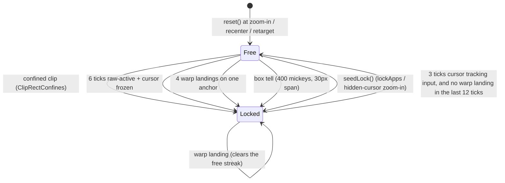
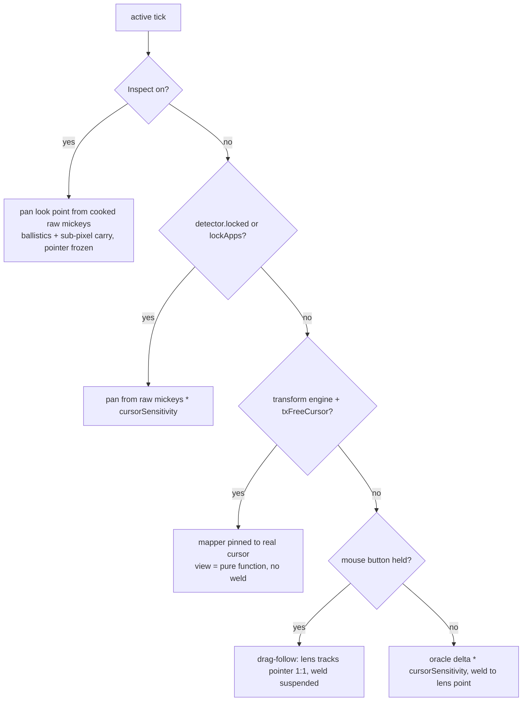

# 07. The cursor system

The cursor is Wind's deepest subsystem because a fullscreen magnifier has two positions that must
never disagree: where the pointer *is* (the thing Windows hit-tests, hovers, drags, and clicks
with) and where the pointer *appears* (a point inside a magnified view). Every design in this
chapter exists to keep those two welded together, or to make one of them a pure function of the
other so there is nothing left to disagree. This chapter covers the mapper, the free-cursor view
model, the weld and its measured-baseline law, drag-follow, the sprite/blanker pair, lock
detection, and Inspect mode.

## The mapper: one lens center for everything

`src/cursor_mapper.h` / `.cpp` is pure logic (no `<windows.h>`, unit-tested). `CursorMapper`
integrates per-tick pixel deltas into a float lens center `(cx_, cy_)` in local monitor pixels,
optionally eased by `cursorSmoothing`, and each tick `CursorMapper::update` returns one
`MapResult` that the whole frame derives from:

| Field | Meaning | Consumer |
|---|---|---|
| `srcLeft/srcTop` | float top-left of the source rect (`ComputeOffsetF`, src/transform.cpp) | both engines' view position |
| `cursorScreenX/Y` | where the lens center *displays* on screen | sprite/crosshair draw point |
| `clickDesktopX/Y` | the center rounded to a pixel | `SetCursorPos` weld target |
| `centerX/Y` | the un-rounded center | transform model's fixed-point anchor |

The click point *is* the lens center, so a click through the transparent overlay lands exactly on
the content under the drawn cursor. Do not "fix" the click point to the unsmoothed target: the
drawn cursor and the view come from the smoothed center, so that would misalign clicks
(CLAUDE.md's standing warning, borne out by the code).

The mapper also enforces the MPO pan walls (`setMaxSourceLeft` / `setMaxSourceTop`, issues #148
and #191): on MPO-enabled machines the NVIDIA driver packs DWM's magnification translation into a
16-bit field per axis, so `|src*level| > 32767` wraps and TDRs. The wall bounds the *center* so
lens, sprite, and click point all stop together, and it bounds the eased center too, because
during a zoom ramp at the right edge the wall moves inward with the level. `main.cpp` feeds the
walls per tick and lifts them only when the MPO-buster ghost is verifiably settled
(`TransformModel::mpoGhostSettled`, fail-closed).

## The free-cursor view model (issue #205)

This is the most important recent change, and the reason the transform engine no longer wobbles.
Native Magnifier's geometry was **measured, not assumed**: `tools/mag_formula_probe.ps1` and
`tools/mag_trackmode_probe.ps1` drove the real Magnifier and read back what it wrote via
`MagGetFullscreenTransform`. The result:

```
offset = clamp(cursor - screen/(2*level), 0, screen - screen/level)
```

and it tracks the pointer continuously, 1:1 (45/45 twelve-pixel steps moved the view by exactly
twelve). Native's view position is a **pure function of the current cursor position**, with no
integration, no smoothing, no state.

Wind's older model was structurally different: integrate per-tick deltas into a smoothed center,
then weld the pointer back to that center with `SetCursorPos`. The cursor position then depended
on the center and the center depended on cursor deltas: a feedback loop. That loop is what issue
#169 chased and what the long-standing wobble was; native has no loop to oscillate. See
[../WOBBLE-CAPTURE-2026-08-21.md](../WOBBLE-CAPTURE-2026-08-21.md) for the companion capture work
(it also exposed a *second* wobble source: native Magnifier stomping the shared input-transform
slot, guarded in `TransformModel::present`).

The fix (`txFreeCursor`, ships 1, hot): in `main.cpp` `RunTick`, when a **transform** session is
free (not Inspect, not detector-locked), the mapper is pinned to the real cursor every tick,
`t.mapper.reset(cursorPos)` followed by `update(0, 0, lvl)`, which reproduces native's formula
exactly (the mapper already clamps the same way), and the weld is suppressed
(`ex.suppressCursorSync = dragFollow || freeCursor`). The pointer is the input; there is no delta
to scale and no target to ease, so `cursorSensitivity` and `cursorSmoothing` deliberately do not
apply while it is on. The formula also lives in one shared pure header,
`wind::ComputeFreeCursorSrc` (src/hook_geometry.h), because issue #206 briefly added a second
writer (the mouse hook writing the transform inline, `src/hook_transform.*`); `txHookWrite` ships
0, parked, after the field showed that writing 4-5 times per composited frame makes the cursor
swim against the content. The lesson recorded in `src/config.h` is worth internalizing: latency
is not the metric that matters, frame coherence is.

The free-cursor gate is transform-only (`dynamic_cast<TransformModel*>` in `main.cpp`). Render
sessions still run the delta-integration + weld model, because the render engine hides the real
pointer and draws its own centered cursor, so there is no visible pointer for the view to be a
function of.

## The weld and the measured-baseline law (issue #169)

Where the weld still runs (render sessions always, transform sessions with `txFreeCursor=0`),
both engines park the real pointer at the lens point each tick: `RenderEngine::renderFrame`
(src/render_engine.cpp) and the weld block in `TransformModel::present`
(src/transform_model.cpp). Both are **deduped**, `SetCursorPos` fires only when the target pixel
changed, so an idle tick injects no synthetic mouse move, and both **report** whether the call
really ran this frame: `RenderEngine::parkedLastFrame()` and
`TransformModel::weldedLastFrame()`.

That report exists because of the #169 law, spelled out at the baseline bookkeeping in
`main.cpp` `RunTick`: **the oracle baseline is measured, never assumed.** The park can be deduped
(unchanged center pixel), suppressed (drag-follow, free cursor, quiesce hold), or skipped
(`gatePresent` / fps-cap skip ticks). If the code assumes the park landed anyway and baselines on
the lens center, the next delta measures hand motion *plus* the pointer-to-center gap; the mapper
integrates the gap, the center overshoots the pointer, the sign flips, and the loop oscillates
with amplitude proportional to hand speed. That unstable servo was the #169 window-drag flicker
and, before the transform weld was recognized at this site, the #181 corner drift. So the
baseline is: the park point when the engine says it parked, otherwise this tick's start-of-tick
`GetCursorPos` read. Never a fresh post-present read: `Present` blocks about a frame at vsync,
and a read taken after it swallows the hand motion that happened during the block, so the lens
pans slower than the hand (the first shipped version of the fix had exactly that bug).

## Drag-follow (src/drag_follow.h)

While a mouse button is physically held in a free welded session, the pointer *is* the
interaction: a window drag or a text selection consumes its position directly. A per-tick weld
then fights the hand, and the dragged content flickers between the two positions
(probe-measured, ~85 px square wave). `wind::ShouldDragFollow` (pure, unit-tested) suspends the
weld for exactly the button-hold, and the lens follows the pointer 1:1 **unscaled**; scaling
would desync the lens from the pointer that owns the drag. Click alignment is correct by
construction: the press landed under the welded cursor (the weld was live until the button went
down), and the release lands where pointer and content both are. On release,
`RenderEngine::renderFrame` invalidates its park dedupe (`suppressCursorSync` resets
`lastClickX/Y`) so the first post-release frame re-parks even onto an unchanged pixel. Locked and
Inspect regimes never drag-follow; they have their own cursor policy.

## The oracle and cursorSensitivity

In welded free sessions, panning speed auto-matches the real OS cursor without reimplementing
ballistics: each tick reads the OS cursor's own movement since the last place *we* put it
(`cur - t.lastSetVirtual` in `RunTick`), which already has Windows' pointer acceleration applied,
then scales by `cursorSensitivity` (default 1.0 = exact match). `GetCursorPos` works as this
oracle only because it is read *before* the pointer is re-set each tick. Raw mickeys are still
collected in parallel to feed the `LockDetector`, to drive panning while locked (also scaled by
`cursorSensitivity`; game input is relative, so OS acceleration does not apply), and to drive
Inspect's ballistics cooking. Both regimes integrate a delta into the same accumulator, so a
free/locked switch never snaps position (the old issue #3 Tracker flicker).

## Hiding the real pointer: blanker + sprite

When a transform session is zoomed, the real pointer must vanish (it would draw unmagnified at
its raw desktop position) and a stand-in must appear on the content it addresses. Two pieces:

**`CursorBlanker`** (src/cursor_blanker.*) swaps the 14 standard system cursors for fully
transparent ones via `SetSystemCursor`, keeping copies of the originals. Its constructor first
reloads the user's scheme (`SPI_SETCURSORS`): if a previous Wind was hard-killed while blanked,
the desktop still has blank shared cursors, and capturing those as "originals" would make the
blank state permanent. `MagShowSystemCursor(FALSE)` covers the whole plane wholesale for
app-custom cursors. The blank runs in `TransformModel::setActive(true)` *before* the
magnification context exists (issue #189): under a live context every cursor change any process
makes costs a DWM re-composite, so running 14 swaps inside the fresh context stacked visible
hitch onto the ~36 ms context build.

**`CursorSprite`** (src/cursor_sprite.*) is a small layered window that repaints the current
cursor shape (or the Inspect crosshair) into its bitmap (`refreshShape`; shapes it cannot render
faithfully report `Unsupported` and the code falls back to the system pointer). It is created
through `wind::CreateBandedWindow` (src/band_window.h) and exposes `usedBand()` so a refused band
request is never silent. Field-measured on this Windows build: DWM's fullscreen transform *does*
magnify layered windows, so the sprite lives in **desktop coordinates at the lens point**
(`clickDesktop`); the transform displays it at screen center, and it grows with zoom exactly like
native Magnifier's pointer. That growth contradicts the constant-size product rule; the
`spriteBand16` experiment (band 16 + screen-space positioning, `TransformModel::present`) exists
to get one field verdict on whether high-band windows escape the transform, because two
historical measurements contradict each other. `keepOnTop()` re-asserts `HWND_TOPMOST` only when
actually displaced, throttled, since the sprite competes in real z-order with menus and flyouts.

Two handoff subtleties, both field-verified (issue #221 round of polish):

- **Zoom-in**: the blank hides the pointer instantly, but the sprite's first composite is a
  context build plus a reveal away, a visible cursor-less blink. So `setActive(true)` stands the
  sprite up at the pointer's position *before* blanking (at ~1x the transform is identity, so it
  lands exactly on the pointer), verifies the shape rendered, and runs **two** `DwmFlush` passes:
  the first can latch a composite that began before the `ShowWindow` reached DWM, the second is
  guaranteed to include the sprite. One flush measurably still blinked on a still pointer. The
  bridge is skipped when the app is hiding its own cursor (mouselook); flashing a sprite there
  would be its own blink.
- **Zoom-out**: after `blanker_->restore()`, Windows repaints the pointer plane only on the next
  cursor *event*, so a restored-but-still pointer stays invisible until the hand moves. A 1px
  `SetCursorPos` nudge and back generates that event invisibly (`TransformModel::setActive(false)`).

The render engine has its own, simpler policy: it draws the cursor into its D3D scene
(`cursor_decode`/`crosshair` textures) and hides the OS cursor with `MagShowSystemCursor` through
the refcounted `wind::MagApiAcquire` host, see [Engines](03-engines.md) and the shared-runtime
gotcha in CLAUDE.md.

## Lock detection (src/lock_detector.*)

A mouselook game owns the pointer (clips it, freezes it, or warps it back to a recenter point),
so `GetCursorPos` stops being the truth and panning must come from raw mickeys instead.
`LockDetector` is the pure, hysteresis-protected arbiter of that switch, fed per-tick Win32
signals by `RunTick`. Its tells, in order of reliability:

1. **Confined clip.** A `ClipCursor` rect meaningfully smaller than the monitor is a direct lock
   signal. "Meaningfully" is `ClipRectConfines` (lock_detector.h): smaller than 90% of the
   monitor in either dimension. The threshold exists because of a trap on the dev rig: a
   machine-wide *work-area* clip (desktop minus taskbar, ~95%, set by an external utility) meant
   `GetClipCursor` never returned the full desktop, and the old any-clip test ran every zoomed
   desktop session on the locked path, which is what masked the #169 defects.
2. **Raw-active-but-frozen.** Mouse moving at the HID level while the OS cursor does not move:
   6 consecutive ticks lock (`kLockTicks`); 3 consecutive ticks of the cursor tracking input
   unlock (`kFreeTicks`). The hysteresis means a single contrary tick never flips the state.
3. **The #221 tells**, gated behind `warpLock` because engaging mid-fight reads as "the magnifier
   hitches then gets good", so the smart tells are opt-in:
   - **Warp-anchor**: field-traced on DOOM The Dark Ages, which *warps* the pointer back to one
     pixel every frame (58 returns to one pixel at apparent speeds of 13k-80k px/s). That defeats
     both classic tells at once: the clip is the full monitor, and the warp keeps the cursor
     moving, which the frozen tell reads as free. So a big jump (>= 100 px) landing within 6 px
     of the same anchor repeatedly is lock evidence, and a recent warp landing suppresses the
     free streak (a 30 fps game warps only every ~5 ticks at 144 Hz; the genuine hand motion in
     between must not unlock).
   - **Confinement box**: gentle mouselook warps too softly for the anchor tell, but the
     signature holds: lots of raw mickeys (>= 400 in a ~170 ms window) while every cursor
     position stays inside a 30 px box. Precise desktop work never trips it, because ballistics
     map slow careful motion roughly 1:1, producing proportionally few mickeys.
   - **Hidden-cursor zoom-in seeding**: any motion tell needs a wiggle as evidence, so a
     motionless zoom-in over mouselook would start free. Zooming in over a covering foreground
     whose cursor is already hidden *by the app* (the same signal game-inspect trusts, valid at
     that instant because the session has hidden nothing yet) calls `seedLock()`: start locked so
     raw-mickey panning works from the first tick. A wrong seed over fullscreen video self-heals
     in ~100 ms once the pointer reappears and tracks the hand.

**`lockApps`** (config.h, hot) is the deterministic per-app answer: comma-separated exe names
whose sessions run locked outright while foreground, no heuristics. The list *is* the feature
(empty = off); `warpLock=1` additionally enables the smart tells globally for unlisted games.
Critically, the force is **routed through the detector** (`t.detector.seedLock()` in `RunTick`),
not a tick-local boolean: the free-cursor gate reads `t.detector.locked()`, and a local-only
force left the transform view pinned to the warped pointer, a real field regression where the
list "did nothing". `lockForce=1` is the diagnostic that locks everywhere; its config comment
documents why locked can never be the default (no ballistics, no drag-follow, weaker click
guarantee).

**LockDetector state machine (simplified; warp tells active only under warpLock).**



## The three regimes

Every active tick, `RunTick` resolves one pan delta and one cursor policy from three mutually
exclusive regimes. Note the free regime itself forks: transform sessions ride the free-cursor
pure function, render sessions ride the oracle + weld.

**Per-tick pan and cursor-policy resolution in RunTick.**



## Inspect mode end to end

Inspect (`cursorLockVk`) is a freeze-cursor + free-look reticle, driven entirely in `RunTick`;
the mouse hook's only involvement is swallowing clicks.

**Entry** (`inspectEnter` in `RunTick`): the real cursor is frozen where it is with a 1px
`ClipCursor` at `t.frozenCursor` and hidden, so any hover or tooltip under it stays alive. The
look point (which *is* the mapper center) starts there. Because the frozen pointer makes the
oracle read ~0, the look point pans from raw mickeys cooked through Windows pointer ballistics
per `WM_INPUT` packet (`src/mouse_ballistics`, pure + tested): exact pointer-speed multiplier
plus the SmoothMouse curve, normalized so slow motion is 1:1, at reduced acceleration strength
because coalesced HID reports over-accelerate. `RunTick` drains the cooked delta with a sub-pixel
carry, still scaled by `cursorSensitivity`, so the reticle moves at desktop-cursor speed. The
crosshair is drawn at `cursorScreen`: the render engine draws it when
`RenderFrameParams.cursorLocked`; the transform repaints the sprite via
`CursorSprite::showCrosshair` and parks it on the look point (the sprite used to keep drawing
the arrow at the frozen point, with no crosshair at all, before that branch existed). The
overlay stays active while Inspect is on (`active = zoomed || inspect`), so the reticle persists
and roams the full screen at 1x and never snaps across the zoom boundary.

**Clicks** are routed to the look point, not the frozen pointer: the `WH_MOUSE_LL` hook swallows
the real left/right press and its matching up (per-button *counts*, so a fast double-click is not
lost), and `RunTick` fires clean absolute injected clicks at the look point via `SendInput`. The
1px freeze is released for `clickReleaseTicks` around the click so the injection is not clamped
back to the frozen pixel, then re-asserted, deduped through a `GetClipCursor` read because
`ClipCursor` is a win32k cursor-subsystem write, the #148 TDR class under a live transform. The
injected click carries `LLMHF_INJECTED` (the hook skips it) and its absolute move is ignored by
the raw accumulator, so the look point is undisturbed. Transform sessions additionally pause
transform writes for ~3 ticks around the injection (`ex.pauseWrites`), serializing the two
proven-racy channels. Inspect stays on after a click; auto-exit was a prior regression.

**Game-inspect** (issue #144): a raw-input game's camera cannot be blocked by any user-mode hook,
so when `wind::ShouldGameInspect` (src/inspect_focus.h, pure) says a mouselook game holds the
mouse, `RunTick` steals foreground to an invisible 1x1 helper window; a backgrounded game stops
receiving raw input, so its camera freezes while Wind's `RIDEV_INPUTSINK` pan keeps working. The
tell is an app-hidden cursor, trustworthy only when Wind has not hidden it too, which is why the
predicate takes `magnifierHidCursor`; a detector lock also engages on its own, and the zoomed
path must *not* be detector-only (issue #158: a raw-input game like RDR2 never clips or recenters
the pointer, so the detector reads free right through mouselook). The steal is deferred one step
so the reveal logic still sees the game as foreground, re-asserted if the game re-grabs
foreground (an alt-tab to a third app is respected), and clicks are drained but discarded (a
synthesized click would re-activate the game mid-inspect). A failed steal (unsigned dev build)
logs and falls back to normal inspect rather than leaving inconsistent state.

**Every exit path releases the clip.** Toggle-off-while-zoomed and teardown-to-idle both run
`EndGameInspect`, `ClipCursor(nullptr)`, drain swallowed-click counts (a stale count would fire a
phantom injected click at the lens center on some future activation), and warp the cursor to the
look point, because the crosshair is the aim the user just spent the mode establishing; snapping
back to the pre-Inspect position throws it away. Beyond `RunTick`, the clip is also released on
device-lost recovery, `shutdown()`, the crash filter, and the `atexit` input-state restore, so
the pointer is never stranded pinned to one pixel (the render-engine teardown gotchas in
CLAUDE.md enumerate the same paths for cursor visibility).

## Pointers

Key sources:

- `src/cursor_mapper.h` / `.cpp`: the lens-center mapper and pan walls
- `src/hook_geometry.h`: the measured free-cursor formula (`ComputeFreeCursorSrc`)
- `src/hook_transform.h` / `.cpp`: the parked #206 hook write path
- `src/drag_follow.h`: `ShouldDragFollow`
- `src/lock_detector.h` / `.cpp`: `ClipRectConfines`, hysteresis, the #221 tells, `seedLock`
- `src/cursor_sprite.h` / `.cpp` and `src/cursor_blanker.h` / `.cpp`: the stand-in pointer
- `src/inspect_focus.h`: `ShouldGameInspect`
- `src/mouse_ballistics.h` / `.cpp`: Inspect's speed matching
- `src/main.cpp` (`RunTick`): regime resolution, oracle baseline, Inspect lifecycle
- `src/transform_model.cpp` / `src/render_engine.cpp`: the weld sites and `weldedLastFrame` /
  `parkedLastFrame`

History and evidence: [../WOBBLE-CAPTURE-2026-08-21.md](../WOBBLE-CAPTURE-2026-08-21.md) (the
wobble capture that closed #205/#217), [../POINTER-HITTEST-FINDINGS.md](../POINTER-HITTEST-FINDINGS.md)
(the input-transform hover fix), [../HITCH-FINDINGS.md](../HITCH-FINDINGS.md) (the original weld-TDR
bisect). Related chapters: [Engines](03-engines.md) for the render/transform split this chapter's
cursor policies attach to.
