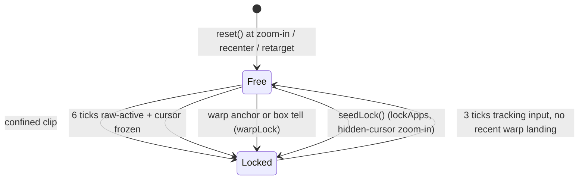
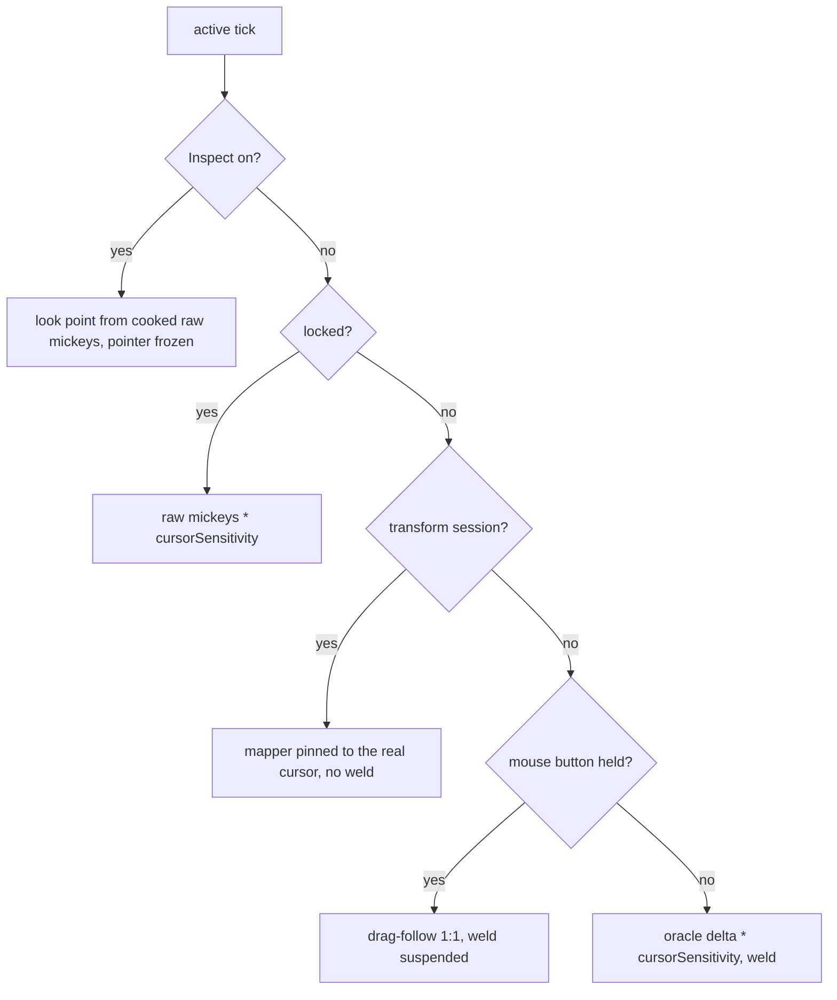

# 07. The cursor system

A fullscreen magnifier has two cursor positions that must never disagree: where the pointer is
(what Windows hit-tests and clicks with) and where it appears inside the magnified view. Every
design here either welds the two together or makes one a pure function of the other. The transform
engine draws Windows' own pointer (the native cursor) and makes the view a function of it; the
render engine hides the pointer, draws its own and welds the real one to the lens. This chapter
covers the mapper, the free-cursor model, the weld, drag-follow, the native cursor, the blanker and
Inspect crosshair, lock detection, Inspect, tracking and keyboard panning.

## The mapper

`CursorMapper` (`src/cursor_mapper.*`, pure, tested) integrates per-tick deltas into a float lens
centre `(cx_, cy_)` in monitor-local pixels (no easing: `cursorSmoothing` was removed in #430). Each tick `update` returns
one `MapResult`:

| Field | Meaning | Used by |
|---|---|---|
| `srcLeft/srcTop` | Float top-left of the source rect (`ComputeOffsetF`) | Both engines' view |
| `cursorScreenX/Y` | Where the lens centre displays | Render engine's cursor and crosshair |
| `clickDesktopX/Y` | The centre rounded to a pixel | `SetCursorPos` weld target |
| `centerX/Y` | The unrounded centre | Transform anchor |

**The click point is the smoothed lens centre.** The drawn cursor and the view come from it, so a
click lands on what the user sees. Do not move the click point to the unsmoothed target.

The mapper also holds the MPO pan walls (`setMaxSourceLeft/Top`); it bounds the centre, so lens,
cursor and click point stop together. See [05](05-transform-engine.md).

## Free cursor (transform sessions)

The built-in Magnifier's view is a pure function of the cursor, measured by reading back its
transform:

```
offset = clamp(cursor - screen/(2*level), 0, screen - screen/level)
```

Wind's older model integrated deltas into a smoothed centre and welded the pointer back to it: a
feedback loop, and the source of the transform wobble. A free transform session (not Inspect, not
locked) pins the mapper to the real cursor every tick (`reset(cursorPos)` then `update(0, 0, lvl)`)
and never welds. `cursorSensitivity` does not apply there; the mapper clamps the
source rect exactly as the formula above does.

Render sessions keep delta integration plus the weld, because the render engine hides the real
pointer and draws its own. Locked and Inspect transform sessions integrate too (raw mickeys) and
weld, since the pointer is not the truth there.

## The weld and the measured baseline

Where the weld runs (render sessions; the locked and Inspect regimes of a transform session), the
engine parks the real pointer at the lens point each tick. Both weld sites are deduped (no `SetCursorPos` when the pixel
is unchanged) and report whether the park really ran: `parkedLastFrame()`, `weldedLastFrame()`.

**The oracle baseline is measured, never assumed.** The park can be deduped, suppressed
(drag-follow, free cursor, quiesce) or skipped (gated or fps-capped ticks). Baselining on the lens
centre anyway makes the next delta include the pointer-to-centre gap; the mapper integrates it and
the loop oscillates with hand speed (issue #169). So the baseline is the park point when the engine
parked, otherwise the start-of-tick `GetCursorPos`. Never a post-present read, which swallows the
hand motion made during the blocking `Present`.

## The oracle and cursorSensitivity

In welded free render sessions, panning matches the OS cursor without reimplementing ballistics: each tick
reads the cursor's own movement since Wind last placed it (`cur - t.lastSetVirtual`), with Windows'
acceleration already applied, times `cursorSensitivity` (1.0 = exact). This works only because the
read comes before the pointer is re-set. Raw mickeys are collected in parallel for the lock
detector, locked panning and Inspect. Free and locked both integrate into the same accumulator, so
a regime switch never snaps.

## Drag-follow

While a mouse button is held, the pointer is the interaction (window drag, text selection), and a
per-tick weld fights the hand: the dragged content flickered ~85 px between two positions.
`ShouldDragFollow` (`src/drag_follow.h`) suspends the weld for exactly the button-hold, and the
lens follows the pointer 1:1, unscaled. Only the render engine welds a free session; a free
transform session never welds, so the rule decides nothing there. The press landed under the welded cursor; the release lands
where pointer and content are. On release `renderFrame` invalidates its park dedupe so the next
frame re-parks. Locked and Inspect sessions never drag-follow.

## The cursor grows with the zoom

**The cursor grows with the zoom in every engine** (issue #253). DWM magnifies the transform
engine's pointer with the content; the render engine scales its drawn cursor to match. A render
cursor kept at desktop size read as tiny next to the transform. `cursorConstantSize=1` is the
render-only opt-in for the old constant size. `cursorScaleWithZoom` is retired and ignored.

## Native cursor

Transform sessions use the pointer Windows Magnifier uses: the real pointer, drawn by DWM into the
magnified frame. It is the transform engine's only cursor. It works at either sampling mode, because DWM
samples it like the content: High resolution cursor (smooth) makes it sharp but it shimmers
slightly during zoom ramps, nearest keeps it pixelated and steady. Pure rules:
`src/native_cursor.h` (tested).

- **The cursor lens.** `MagHost::createCursorLens` makes a hidden window of the documented
  magnifier control class (`WC_MAGNIFIER`) on the tick thread (the thread that owns the runtime). With
  `MS_SHOWMAGNIFIEDCURSOR` set, win32k hands the pointer to DWM: magnified, sampled like the content
  (smooth = sharp), drawn above every band (thumbnails, Start, the emoji panel, menus, UAC, the
  Snipping Tool), latched in the same composition pass as the view. The style is ON only while
  zoomed (`setActive`), 0.2 ms per toggle.
- **Built at idle, kept warm.** The lens build costs 60-125 ms, so `idleTick` builds it at 1x right
  after launch and the context is never released at idle.
  Measured: context + lens with the style OFF costs a pointer-toggling full-screen app nothing
  (Independent Flip, 0 spike frames); the style ON at 1x costs it 19 spikes of 20-42 ms in 6 s. So
  the cursor-change tax belongs to the composed pointer, not to the context.
- **No public prime.** Magnification.dll builds the same lens itself on the first public
  `MagSetFullscreenTransform` above 1x, which blocks 200-260 ms. Owning the lens avoids that write;
  it stays only as a fallback when the lens cannot be built.
- **DWM centring.** Where the view is a pure function of the pointer (free cursor, mouse owns the
  view, no reachable MPO wall, no launch quiesce: `WantDwmCentring`), the model calls
  `SetFullscreenMagnifierOffsetsDWMUpdated(TRUE, 0, 0)` and DWM re-centres the view on every cursor
  update. Measured per displayed frame at 3x: the pointer stays on one screen point at every speed,
  where a tick-paced write drifts 18-24 px at medium speed and up to 96 px fast. While DWM centres,
  Wind still writes every changed tick (win32k's copy of the view, which pointer-framework
  hit-testing reads, only changes on a client write) and sends no warm pulses. Each write is followed
  by a pixel-and-back cursor nudge (`NudgeAfterWrite`) so DWM re-centres by its own rule in the same
  frame; a pan write is held while a click is in progress (`HoldWriteForClick`, #381). Caret, focus, keyboard pan, edge mode, Inspect and locked games switch
  it off and Wind writes the view as before; each switch forces one write.
- **Cursor events, not style flips, switch DWM.** win32k sends the new cursor mode to DWM only on
  the next pointer update, so zoom-in nudges the pointer a pixel and back right after turning the
  lens style on (otherwise the small hardware pointer stayed for the whole zoom while the hand was
  still). A `MagSetInputTransform` publish that changes the scale also stops DWM drawing the
  pointer until the next cursor event, so native sessions hold the publish while the level ramps
  (Windows Magnifier does the same) and nudge after a scale-changing publish (`HoldInputPublish`,
  `NudgeAfterPublish`). These pixel-and-back nudges are the one place Wind injects cursor events
  next to a transform write: sequential after it, never racing it (a write racing a cursor-position
  update is the proven TDR class), and skipped while a click is in progress. A skipped nudge is
  owed, not dropped: the first tick after the click window ends delivers it (`NudgeDue`), including
  at 1x (`idleTick`), so a zoom bound to a mouse button never leaves a still pointer invisible. The
  session-end reset of `ixPubLevel_` keeps a quick zoom back to the same level from skipping the
  publish nudge, and the hide-cursor hotkey's show-again transition nudges after the blanker
  restore like the zoom-out does.
- **Pan glide (#430, `panGlideMaxPx`, experimental, 0 = off).** A soft stop: when a mouse movement
  stops, the POINTER eases on at the hand's speed and slows to rest within `panGlideMaxPx` SCREEN px
  at any zoom (`src/pan_glide.h`); `panGlideMs` is the ease's time constant, shortened for a fast hand
  so the cap holds. The view follows by DWM centring. Any hand movement, a mouse button, a game,
  Inspect, a detached view or 1x ends it. Wind's own steps move the tick baseline (`lastSetVirtual`),
  so the lock detector and the gain learner only ever see hand motion. A first, uncapped version
  (momentum = speed x time) could throw the pointer across the screen and was replaced. It replaces
  Pan smoothing (`cursorSmoothing`), which eased the view toward the pointer: lag, never momentum.
- **One centre during zoom.** DWM centres on its cursor point plus a learned hotspot offset that can
  sit 1-2 desktop px off Wind's exact centre; a level write puts the view on Wind's centre, the next
  cursor event back on DWM's (a 5-10 px shift at ~5x that snapped back when the zoom stopped). While
  DWM centres, every write is followed by a pixel-and-back nudge, so DWM re-centres by its own
  rule in the same frame (`NudgeAfterWrite`). Field-verified: shift gone, pans steady.
- **No write without its nudge (#381).** The nudge is skipped while a mouse button is held (it made
  some clicks fail), so a pan write during a held click would leave Wind's centre on screen until the
  next cursor event: drag-selects and held clicks shook. Pan-only writes are held for the click
  window instead (`HoldWriteForClick`); level changes and forced writes still go out.
- **A held press is a drag.** Those level writes had no nudge either, so zooming during a drag-select
  flipped the view about 90 px every frame (field video 2026-10-08). A button held for the whole
  250 ms click window counts as a drag and is nudged as usual (`NudgeBlockedByClick`); short clicks
  and the window after a release still are not.
- **DWM's learned offset.** DWM learns the gap between `GetCursorPos` and its own cursor point and
  relearns it only when the cursor HANDLE changes, so a learn taken mid-jump can sit a few px off
  until the next shape change. Windows Magnifier has the same behaviour.
- No cursor sprite, no blanking and no shell-panel handling in a normal zoom. The hide-cursor hotkey
  and `cursorVisibility=never` blank the pointer the way Inspect does (below). Inspect keeps its
  crosshair window. Games pay nothing extra for the native cursor: a zoomed full-screen window is
  composed anyway, and at 1x the lens style is off.

## Hiding the real pointer: blanker and crosshair

Inspect and the hide-cursor hotkey (`cursorVisibility=never`) hide DWM's pointer in a transform
session; the Inspect crosshair is then a window of Wind's.

- **`CursorBlanker`** (`src/cursor_blanker.*`) swaps the 14 system cursors for transparent ones and
  restores them by reloading the user's scheme (no cached originals). The constructor reloads it
  first, so a previously killed Wind's blanks never outlive it. `MagShowSystemCursor(FALSE)` covers
  app-custom cursors. The swaps run in order on the `Wind cursor swaps` worker thread (#363): the restore is a full
  `SPI_SETCURSORS` scheme reload (8 ms median, up to 90 ms under load) and the blank 14
  `SetSystemCursor` calls, which froze the 1x landing frame on the tick thread. The zoom-out repaint
  nudge rides on the worker after the restore. `restoreSync()` waits (shutdown); the crash filter
  restores directly. The blanker and the crosshair window are always created, whatever the config.
- **`CursorSprite`** (`src/cursor_sprite.*`) is a small layered window that only ever carries the
  Inspect crosshair (`showCrosshair`; it renders no cursor shape any more). It sits at the look point
  in desktop coordinates, so DWM shows it at the view's centre, magnified. `keepOnTop()` re-asserts
  topmost only when displaced.
- **Zoom-out handoff.** Windows repaints a restored pointer only on the next cursor event, so a
  1 px `SetCursorPos` nudge and back makes it appear without moving the hand.

**Bands.** A UIAccess crosshair lands in band 2; Start, taskbar thumbnails and tray flyouts are band
16; the Snipping Tool overlay is band 17. `cursorBandAuto=1` (default) keeps twin windows: the
band-16 one shows unless the foreground window's band is above 16, when the low one shows instead
(pure rule: `src/sprite_layer.h`; checked only while the crosshair is drawn). `zorderBand` places the
low window. The window is excluded from capture (otherwise it is frozen into snip screenshots) and
from Aero Peek. The native pointer needs none of this: DWM draws it above every band.

The render engine draws its cursor into the D3D scene and hides the OS cursor through the shared
Magnification runtime ([04](04-render-engine.md)).

## Lock detection

A mouselook game owns the pointer (clips, freezes or warps it), so panning must come from raw
mickeys. `LockDetector` (`src/lock_detector.*`, pure) decides, with hysteresis.

| Tell | Rule | When |
|---|---|---|
| Confined clip | `ClipCursor` rect under 90% of the monitor in either dimension (`ClipRectConfines`) | Always |
| Raw active, cursor frozen | 42 ms lock (`kLockMs`, 6 ticks at 144 Hz); 21 ms of the cursor tracking input unlock (`kFreeMs`, 3 ticks) | Always |
| Warp anchor | Jumps of 100 px or more landing within 6 px of one anchor, repeatedly; a recent landing blocks unlocking | `warpLock=1` |
| Confinement box | 400+ mickeys in ~170 ms while every cursor position stays in a 30 px box | `warpLock=1` |
| Hidden-cursor seed | Zoom-in over a covering foreground whose app already hid the cursor calls `seedLock()` | `warpLock=1` |
| `lockApps` | Listed exes run locked outright while foreground | Always |

- **A clip is a lock signal only when meaningfully smaller than the monitor.** A machine-wide
  work-area clip (desktop minus taskbar, ~95%) is common; any-clip ran every desktop session locked.
- Tick counts derive from the refresh rate (`setTickRate`).
- **Forced locks go through the detector** (`seedLock()`), so the lock persists across ticks; a
  tick-local flag once left the view pinned to the warped pointer.
- **`t.lockEff` has no memory across sessions.** It is recomputed only in the free zoomed branch, so
  outside it (1x, Inspect) the tick clears it (and `lockFreed`); `panArmed` reads it before that
  recompute and would otherwise act on the previous session's value for a tick.
- **A shown pointer is a free pointer in a transform session** (`LockApplies`,
  `src/native_cursor.h`; the tick's result is `t.lockEff`, which every gate reads). The locked path
  pans from raw mickeys and re-parks the real pointer once per tick; the native cursor IS the real
  pointer, so DWM drew it wherever the hand had moved it between ticks.
  Field case: DOOM: The Dark Ages menus under `lockApps` (2026-10-07), measured at 4.7x as 22 px
  spread slow and 74 px medium with jumps to 118 px, against 0-2 px free. Games show the pointer
  in menus and hide it for mouselook, so the lock applies only while `GetCursorInfo` reports it
  hidden. The render engine keeps the plain rule. The log line is `lock  pointer shown: free`.
- `lockForce=1` locks everywhere, for diagnosis only: locked mode has no ballistics or drag-follow.


```mermaid
stateDiagram-v2
    [*] --> Free: reset() at zoom-in / recenter / retarget
    Free --> Locked: confined clip
    Free --> Locked: 6 ticks raw-active + cursor frozen
    Free --> Locked: warp anchor or box tell (warpLock)
    Free --> Locked: seedLock() (lockApps, hidden-cursor zoom-in)
    Locked --> Free: 3 ticks tracking input, no recent warp landing
```

## The regimes


```mermaid
flowchart TD
    T[active tick] --> I{Inspect on?}
    I -- yes --> IN[look point from cooked raw mickeys, pointer frozen]
    I -- no --> L{locked?}
    L -- yes --> LK[raw mickeys * cursorSensitivity]
    L -- no --> F{transform session?}
    F -- yes --> FC[mapper pinned to the real cursor, no weld]
    F -- no --> D{mouse button held?}
    D -- yes --> DF[drag-follow 1:1, weld suspended]
    D -- no --> OR[oracle delta * cursorSensitivity, weld]
```

Tracking (below) can then detach the view from all of these.

## Inspect mode

Inspect (`cursorLockVk`) freezes the cursor and adds a free-look crosshair. It runs in `RunTick`;
the mouse hook only swallows clicks.

- **Entry.** The real cursor is frozen in place with a 1 px `ClipCursor` (`t.frozenCursor`) and
  hidden, so a hover or tooltip under it stays alive. The look point is the mapper centre and pans
  from ballistics-cooked raw mickeys ([06](06-input.md)).
- **Crosshair.** Render draws it when `cursorLocked`; the transform shows its crosshair window
  (`showCrosshair`). The overlay stays active while Inspect is on, so the crosshair roams the whole
  screen at 1x.
- **Clicks** go to the look point: the hook swallows the real press, `RunTick` injects an absolute
  click there. The freeze clip is released for `clickReleaseTicks` around it, and re-asserts are
  deduped through `GetClipCursor` (a clip write under a live transform is in the TDR class).
  Transform writes pause ~3 ticks around the click. Inspect stays on after a click.
- **Game-inspect.** A raw-input game's camera cannot be blocked by a hook, so when
  `ShouldGameInspect` (`src/inspect_focus.h`) sees a mouselook game, Wind moves foreground to an
  invisible 1x1 helper window: the backgrounded game stops receiving raw input and its camera
  freezes, while Wind's `RIDEV_INPUTSINK` pan keeps working. The tell is a cursor hidden by the app
  while Wind is not hiding it; a detector lock also engages it. Do not make the zoomed path
  detector-only: a raw-input game may never clip or recentre the pointer (issue #158). Clicks are
  discarded, and foreground is handed back on every exit.
- **Every exit releases the clip**: toggle-off, teardown to idle, device-lost recovery, `shutdown`,
  the crash filter and the `atexit` restore. Exits warp the cursor to the look point and drain
  pending click counts.

## Tracking: caret, focus and mouse edge mode

The view can follow the text caret (`trackCaret`, default on) and keyboard focus (`trackFocus`,
default off). `FocusTracker` (`src/focus_track.*`) runs on its own thread with WinEvents,
`GetGUIThreadInfo` and UI Automation, and publishes a snapshot; the tick never calls UIA.

- **Tracking never moves the pointer.** While caret or focus owns the view, the view is detached
  (`t.viewDetached`, weld off): `DetachedMap` (`src/detached_view.h`) maps the glided centre while
  the cursor fields report the real pointer. On a mouse-move takeover the pointer is placed into the
  view; the view does not jump to the pointer.
- `StepViewOwner` (`src/view_target.h`) picks one owner per tick: the latest caret or focus change
  wins; real mouse motion or a button takes it back.
- **Only keyboard-driven caret moves are followed.** The first caret after a focus change is a
  baseline. After a click there is a 1 s quiet period, ended early by a fresh non-modifier key down
  (`src/typing_key.h`), never by key-ups, auto-repeat or Ctrl/Shift.
- **A focus event for the same control is not a focus change** (`src/focus_identity.h`). Notepad
  and VS Code fire them while typing, about three per app switch, and each used to re-baseline, so
  the first second of typing after a switch was not followed. Same foreground window, same focus
  window and same element bounds keep the caret followed (`focus repeat` in trackLog). Zoom-in
  clears the key, so it still only baselines.
- **Each zoom session starts with the mouse in charge.** `StepViewOwner` runs only while zoomed, so
  the enter tick calls `ResetViewOwnerForSession` (owner, latched target, `wasTracking`), clears
  `viewDetached`, the spring velocity and the pan keys; otherwise the next zoom-in opened on the
  previous session's caret.
- Caret rects are corrected in `src/caret_rect.h` (tall Chromium rects trimmed to the line, a
  whole-line rect recognised).
- **VS Code (EditContext).** Its editor element (`native-edit-context`, also Monaco elsewhere)
  reports the UIA caret at the start of the line wherever the caret is on it. For that class only,
  Chromium's MSAA system caret (`OBJID_CARET`) on the same line wins (`msaa-editcontext`). Not for
  other Chromium text: Edge textareas have a correct UIA caret and an MSAA one that lags ~100 ms.
  The class is cached per focus and window; the poll reuses the MSAA answer for 100 ms.
- **A blocking app stalls all tracking.** UIA calls are capped at 500 ms
  (`IUIAutomation2` timeouts). `GetFocusedElement` ignores them (3 s at Notepad's activation), so
  it runs on the `Wind focus lookup` thread (`FocusLookup`): the tracker waits 150 ms, then resolves
  without UIA; no new lookup starts while one is stuck; a late answer is used if under 250 ms old
  and for the same window. With focus-following off, an app with a Win32 caret skips the lookup.
  Calls over 200 ms log `slow resolve` with the phase.
- The glide is a critically damped spring (`SpringToward`, `src/view_glide.h`, `trackGlideMs`).
- **Java apps** (IntelliJ, PyCharm) expose the caret only through the Java Access Bridge
  (`src/java_bridge.*`). UIPI drops the JVM's handshake to a UIAccess process, so the bridge's
  hidden windows get a narrow `ChangeWindowMessageFilterEx` allowance. Never poll the bridge (each
  read runs on the Java app's UI thread); read only after bridge callbacks. Load only
  Authenticode-signed bridge DLLs. Read the caret with `getCaretLocation`, scaled by the monitor
  DPI (Java answers in its user space, device px / scale). The older character bounds
  (`getAccessibleTextRect`) gave x=2 for every Swing caret and stay only as a fallback, scaled the
  same way (`JavaSpanRectPx`). A bridge probe that fails backs off per process (2 s doubling to
  60 s), and the retry after a failed read backs off 250 ms doubling to 4 s; a bridge event or a
  window switch resets it. The MSAA caret (`MsaaCaret`) skips windows Windows reports as hung and
  sits out 2 s after a call over 250 ms.
- **Mouse edge mode** (`mouseAlign=1`, free-pointer sessions only): the pointer is unwelded and
  `EdgePanCenter` (`src/edge_pan.h`) moves the view only when the cursor's visible body leaves the
  margin band (`mouseMarginPct`). Edge-pinned motion is hidden from the lock detector
  (`PointerPinnedAtEdge`), or corners fling the pointer. `trackAlign` does the same for the caret.

Field notes: [../TRACKING-FINDINGS.md](../TRACKING-FINDINGS.md).

## Keyboard panning

`ViewOwner::Keys` is a detached owner next to caret and focus. `KeyPan` (`src/keyboard_pan.h`, pure)
turns held pan keys into a view delta in screen space, so the feel does not change with zoom:

- A hold pans at `panSpeed x 1.25` screen widths per second at high zoom, scaled down at low zoom
  by `ZoomRateScale`, with a ~150 ms ease-in and a ~120 ms glide out.
- A press released within 250 ms is a tap: it moves exactly 1/8 of the screen.
- While panning, KeyPan owns the view ahead of caret events. The delta is clamped to the monitor
  and the MPO wall. The pointer does not move; the next mouse move places it in the view.

## Shell input panels

The emoji picker, clipboard history and touch keyboard are composed above every window band. The
transform engine needs nothing for them: DWM draws the native pointer above the panels and keeps it
centred, so the hand moves the pointer directly. The earlier workaround for the sprite cursor (a
frozen real pointer moved by Wind after each view write, driven by `TextInputHost` cloak events)
was removed with the sprite. The render engine's pointer sits under the panels, as before.
Evidence and the rejected hook-write variant:
[../SHELL-PANEL-CURSOR-FINDINGS.md](../SHELL-PANEL-CURSOR-FINDINGS.md).
