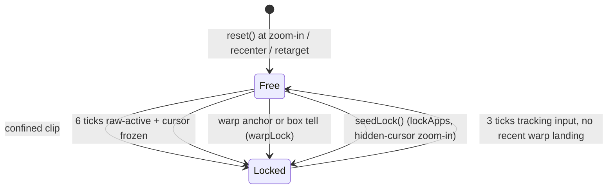
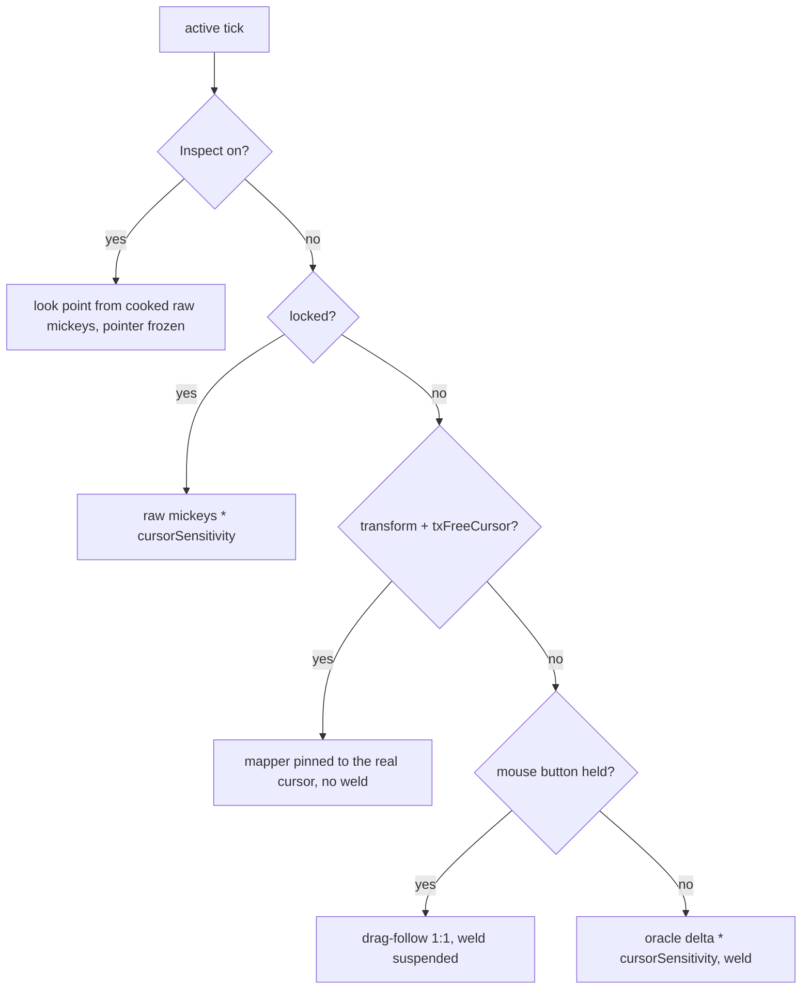

# 07. The cursor system

A fullscreen magnifier has two cursor positions that must never disagree: where the pointer is
(what Windows hit-tests and clicks with) and where it appears inside the magnified view. Every
design here either welds the two together or makes one a pure function of the other. This chapter
covers the mapper, the free-cursor model, the weld, drag-follow, the sprite, lock detection,
Inspect, tracking, keyboard panning and shell panels.

## The mapper

`CursorMapper` (`src/cursor_mapper.*`, pure, tested) integrates per-tick deltas into a float lens
centre `(cx_, cy_)` in monitor-local pixels, eased by `cursorSmoothing`. Each tick `update` returns
one `MapResult`:

| Field | Meaning | Used by |
|---|---|---|
| `srcLeft/srcTop` | Float top-left of the source rect (`ComputeOffsetF`) | Both engines' view |
| `cursorScreenX/Y` | Where the lens centre displays | Sprite and crosshair |
| `clickDesktopX/Y` | The centre rounded to a pixel | `SetCursorPos` weld target |
| `centerX/Y` | The unrounded centre | Transform anchor |

**The click point is the smoothed lens centre.** The drawn cursor and the view come from it, so a
click lands on what the user sees. Do not move the click point to the unsmoothed target.

The mapper also holds the MPO pan walls (`setMaxSourceLeft/Top`); it bounds the centre, so lens,
sprite and click point stop together. See [05](05-transform-engine.md).

## Free cursor (transform sessions)

The built-in Magnifier's view is a pure function of the cursor, measured by reading back its
transform:

```
offset = clamp(cursor - screen/(2*level), 0, screen - screen/level)
```

Wind's older model integrated deltas into a smoothed centre and welded the pointer back to it: a
feedback loop, and the source of the transform wobble. With `txFreeCursor=1` (default, hot), a free
transform session pins the mapper to the real cursor every tick (`reset(cursorPos)` then
`update(0, 0, lvl)`) and suppresses the weld. `cursorSensitivity` and `cursorSmoothing` do not apply
there. The formula lives in `ComputeFreeCursorSrc` (`src/hook_geometry.h`).

Render sessions keep delta integration plus the weld, because the render engine hides the real
pointer and draws its own.

## The weld and the measured baseline

Where the weld runs (render sessions; transform with `txFreeCursor=0`), the engine parks the real
pointer at the lens point each tick. Both weld sites are deduped (no `SetCursorPos` when the pixel
is unchanged) and report whether the park really ran: `parkedLastFrame()`, `weldedLastFrame()`.

**The oracle baseline is measured, never assumed.** The park can be deduped, suppressed
(drag-follow, free cursor, quiesce) or skipped (gated or fps-capped ticks). Baselining on the lens
centre anyway makes the next delta include the pointer-to-centre gap; the mapper integrates it and
the loop oscillates with hand speed (issue #169). So the baseline is the park point when the engine
parked, otherwise the start-of-tick `GetCursorPos`. Never a post-present read, which swallows the
hand motion made during the blocking `Present`.

## The oracle and cursorSensitivity

In welded free sessions, panning matches the OS cursor without reimplementing ballistics: each tick
reads the cursor's own movement since Wind last placed it (`cur - t.lastSetVirtual`), with Windows'
acceleration already applied, times `cursorSensitivity` (1.0 = exact). This works only because the
read comes before the pointer is re-set. Raw mickeys are collected in parallel for the lock
detector, locked panning and Inspect. Free and locked both integrate into the same accumulator, so
a regime switch never snaps.

## Drag-follow

While a mouse button is held, the pointer is the interaction (window drag, text selection), and a
per-tick weld fights the hand: the dragged content flickered ~85 px between two positions.
`ShouldDragFollow` (`src/drag_follow.h`) suspends the weld for exactly the button-hold, and the
lens follows the pointer 1:1, unscaled. The press landed under the welded cursor; the release lands
where pointer and content are. On release `renderFrame` invalidates its park dedupe so the next
frame re-parks. Locked and Inspect sessions never drag-follow.

## The cursor grows with the zoom

**The cursor grows with the zoom in every engine** (issue #253). The transform sprite lives in
desktop space and DWM magnifies it; the render engine scales its drawn cursor to match. A render
cursor kept at desktop size read as tiny next to the transform. `cursorConstantSize=1` is the
render-only opt-in for the old constant size. `cursorScaleWithZoom` is retired and ignored.

## Hiding the real pointer: blanker and sprite

In a zoomed transform session the real pointer would draw unmagnified at its raw position, so it
is hidden and a stand-in drawn.

- **`CursorBlanker`** (`src/cursor_blanker.*`) swaps the 14 system cursors for transparent ones and
  keeps the originals. It first reloads the user's scheme, so a previously killed Wind's blanks are
  never captured as originals. `MagShowSystemCursor(FALSE)` covers app-custom cursors. The blank
  runs before the magnification context exists, because each swap under a live context costs a
  re-composite. The swaps run in order on the `Wind cursor swaps` worker thread (#363): the restore
  is a full `SPI_SETCURSORS` scheme reload (8 ms median, up to 90 ms under load) and the blank 14
  `SetSystemCursor` calls, which froze the zoom-in and the 1x landing frame on the tick thread.
  The zoom-out repaint nudge rides on the worker after the restore. `restoreSync()` waits (the
  input-panel clip nudge, shutdown); the crash filter restores directly.
- **`CursorSprite`** (`src/cursor_sprite.*`) is a small layered window painting the current shape,
  or the Inspect crosshair. It sits at the lens point in desktop coordinates, so DWM shows it at the
  view's centre, magnified. `keepOnTop()` re-asserts topmost only when displaced.
- **Zoom-in handoff.** `setActive(true)` stands the sprite up on the pointer before blanking and
  runs two `DwmFlush` passes; one flush still blinked. Skipped when the app hides its own cursor.
- **Zoom-out handoff.** Windows repaints the restored pointer only on the next cursor event, so a
  1 px `SetCursorPos` nudge and back makes it appear without moving the hand.

**Bands.** A UIAccess sprite lands in band 2; Start, taskbar thumbnails and tray flyouts are band
16; the Snipping Tool overlay is band 17. `cursorBandAuto=1` (default) keeps twin sprites: the
band-16 one shows unless the foreground window's band is above 16, when the low one shows instead
(pure rule: `src/sprite_layer.h`). The sprite is excluded from capture (otherwise it is frozen into
snip screenshots) and from Aero Peek. `spriteBand16=1` (restart) is an experiment, off by default:
a band-16 screen-space sprite for a constant-size cursor. Its field test was negative (band-16
windows are magnified too, [../NATIVE-MAGNIFIER-STOMP.md](../NATIVE-MAGNIFIER-STOMP.md)).
`tools/testenv/dualcursor.ps1` turns on
the hidden `spriteCapturable=1` because it measures the sprite from captures.

The render engine draws its cursor into the D3D scene and hides the OS cursor through the shared
Magnification runtime ([04](04-render-engine.md)).

## Lock detection

A mouselook game owns the pointer (clips, freezes or warps it), so panning must come from raw
mickeys. `LockDetector` (`src/lock_detector.*`, pure) decides, with hysteresis.

| Tell | Rule | When |
|---|---|---|
| Confined clip | `ClipCursor` rect under 90% of the monitor in either dimension (`ClipRectConfines`) | Always |
| Raw active, cursor frozen | 6 ticks lock (`kLockTicks`); 3 ticks of the cursor tracking input unlock (`kFreeTicks`) | Always |
| Warp anchor | Jumps of 100 px or more landing within 6 px of one anchor, repeatedly; a recent landing blocks unlocking | `warpLock=1` |
| Confinement box | 400+ mickeys in ~170 ms while every cursor position stays in a 30 px box | `warpLock=1` |
| Hidden-cursor seed | Zoom-in over a covering foreground whose app already hid the cursor calls `seedLock()` | `warpLock=1` |
| `lockApps` | Listed exes run locked outright while foreground | Always |

- **A clip is a lock signal only when meaningfully smaller than the monitor.** A machine-wide
  work-area clip (desktop minus taskbar, ~95%) is common; any-clip ran every desktop session locked.
- Tick counts derive from the refresh rate (`setTickRate`).
- **Forced locks go through the detector** (`seedLock()`), because the free-cursor gate reads
  `t.detector.locked()`; a tick-local flag once left the view pinned to the warped pointer.
- `lockForce=1` locks everywhere, for diagnosis only: locked mode has no ballistics or drag-follow.


```mermaid
stateDiagram-v2
    [*] --> Free: reset() at zoom-in / recenter / retarget
    Free --> Locked: confined clip
    Free --> Locked: 6 ticks raw-active + cursor frozen
    Free --> Locked: warp anchor or box tell (warpLock)
    Free --> Locked: seedLock() (lockApps, hidden-cursor zoom-in)
    Locked --> Free: 3 ticks tracking input, no recent warp landing
```

## The regimes


```mermaid
flowchart TD
    T[active tick] --> I{Inspect on?}
    I -- yes --> IN[look point from cooked raw mickeys, pointer frozen]
    I -- no --> L{locked?}
    L -- yes --> LK[raw mickeys * cursorSensitivity]
    L -- no --> F{transform + txFreeCursor?}
    F -- yes --> FC[mapper pinned to the real cursor, no weld]
    F -- no --> D{mouse button held?}
    D -- yes --> DF[drag-follow 1:1, weld suspended]
    D -- no --> OR[oracle delta * cursorSensitivity, weld]
```

Tracking (below) can then detach the view from all of these.

## Inspect mode

Inspect (`cursorLockVk`) freezes the cursor and adds a free-look crosshair. It runs in `RunTick`;
the mouse hook only swallows clicks.

- **Entry.** The real cursor is frozen in place with a 1 px `ClipCursor` (`t.frozenCursor`) and
  hidden, so a hover or tooltip under it stays alive. The look point is the mapper centre and pans
  from ballistics-cooked raw mickeys ([06](06-input.md)).
- **Crosshair.** Render draws it when `cursorLocked`; the transform repaints the sprite
  (`showCrosshair`). The overlay stays active while Inspect is on, so the crosshair roams the whole
  screen at 1x.
- **Clicks** go to the look point: the hook swallows the real press, `RunTick` injects an absolute
  click there. The freeze clip is released for `clickReleaseTicks` around it, and re-asserts are
  deduped through `GetClipCursor` (a clip write under a live transform is in the TDR class).
  Transform writes pause ~3 ticks around the click. Inspect stays on after a click.
- **Game-inspect.** A raw-input game's camera cannot be blocked by a hook, so when
  `ShouldGameInspect` (`src/inspect_focus.h`) sees a mouselook game, Wind moves foreground to an
  invisible 1x1 helper window: the backgrounded game stops receiving raw input and its camera
  freezes, while Wind's `RIDEV_INPUTSINK` pan keeps working. The tell is a cursor hidden by the app
  while Wind is not hiding it; a detector lock also engages it. Do not make the zoomed path
  detector-only: a raw-input game may never clip or recentre the pointer (issue #158). Clicks are
  discarded, and foreground is handed back on every exit.
- **Every exit releases the clip**: toggle-off, teardown to idle, device-lost recovery, `shutdown`,
  the crash filter and the `atexit` restore. Exits warp the cursor to the look point and drain
  pending click counts.

## Tracking: caret, focus and mouse edge mode

The view can follow the text caret (`trackCaret`, default on) and keyboard focus (`trackFocus`,
default off). `FocusTracker` (`src/focus_track.*`) runs on its own thread with WinEvents,
`GetGUIThreadInfo` and UI Automation, and publishes a snapshot; the tick never calls UIA.

- **Tracking never moves the pointer.** While caret or focus owns the view, the view is detached
  (`t.viewDetached`, weld off): `DetachedMap` (`src/detached_view.h`) maps the glided centre while
  the cursor fields report the real pointer. On a mouse-move takeover the pointer is placed into the
  view; the view does not jump to the pointer.
- `StepViewOwner` (`src/view_target.h`) picks one owner per tick: the latest caret or focus change
  wins; real mouse motion or a button takes it back.
- **Only keyboard-driven caret moves are followed.** The first caret after a focus change is a
  baseline. After a click there is a 1 s quiet period, ended early by a fresh non-modifier key down
  (`src/typing_key.h`), never by key-ups, auto-repeat or Ctrl/Shift.
- Caret rects are corrected in `src/caret_rect.h` (tall Chromium rects trimmed to the line, a
  whole-line rect recognised).
- The glide is a critically damped spring (`SpringToward`, `src/view_glide.h`, `trackGlideMs`).
- **Java apps** (IntelliJ, PyCharm) expose the caret only through the Java Access Bridge
  (`src/java_bridge.*`). UIPI drops the JVM's handshake to a UIAccess process, so the bridge's
  hidden windows get a narrow `ChangeWindowMessageFilterEx` allowance. Never poll the bridge (each
  read runs on the Java app's UI thread); read only after bridge callbacks. Load only
  Authenticode-signed bridge DLLs.
- **Mouse edge mode** (`mouseAlign=1`, free-pointer sessions only): the pointer is unwelded and
  `EdgePanCenter` (`src/edge_pan.h`) moves the view only when the cursor's visible body leaves the
  margin band (`mouseMarginPct`). Edge-pinned motion is hidden from the lock detector
  (`PointerPinnedAtEdge`), or corners fling the pointer. `trackAlign` does the same for the caret.

Field notes: [../TRACKING-FINDINGS.md](../TRACKING-FINDINGS.md).

## Keyboard panning

`ViewOwner::Keys` is a detached owner next to caret and focus. `KeyPan` (`src/keyboard_pan.h`, pure)
turns held pan keys into a view delta in screen space, so the feel does not change with zoom:

- A hold pans at `panSpeed x 1.25` screen widths per second at high zoom, scaled down at low zoom
  by `ZoomRateScale`, with a ~150 ms ease-in and a ~120 ms glide out.
- A press released within 250 ms is a tap: it moves exactly 1/8 of the screen.
- While panning, KeyPan owns the view ahead of caret events. The delta is clamped to the monitor
  and the MPO wall. The pointer does not move; the next mouse move places it in the view.

## Shell input panels

The emoji picker, clipboard history and touch keyboard are composed above every window band, so
the sprite goes under them. While one is open (`FocusTracker::shellPanelOpen`, from TextInputHost
cloak events) and `panelPointer=1` (default), the transform hides the sprite, restores the real
pointer and makes one public `MagSetFullscreenTransform` write, after which DWM draws the pointer
magnified. The pointer is frozen with a 1 px clip and moved only by Wind, right after each view
write, so the two never drift.

- Do not write from the hook thread for this: runtime ownership marshals every write onto the input
  thread and hitches.
- The freeze is hidden from the lock detector (a flapping lock flickers); tracking and edge mode
  pause; the saved clip is restored on close.

Evidence and the rejected hook-write variant:
[../SHELL-PANEL-CURSOR-FINDINGS.md](../SHELL-PANEL-CURSOR-FINDINGS.md).
