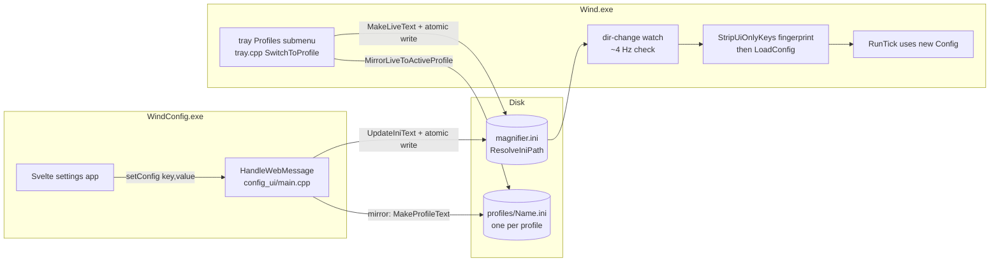
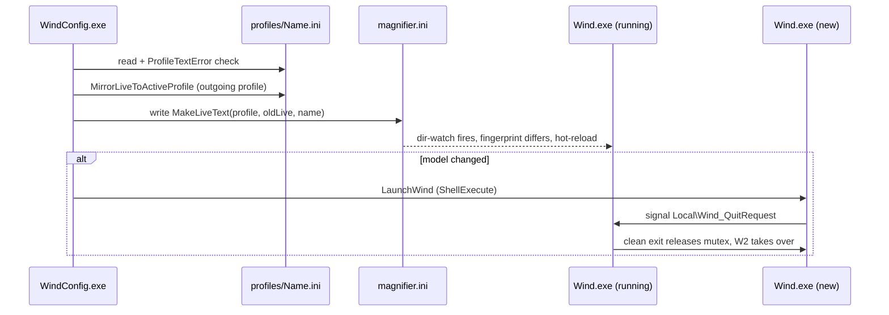

# 08. Config and profiles

Wind's entire configuration is one INI file, `magnifier.ini`, and that file is also the only
IPC between the two binaries: `WindConfig.exe` writes it, `Wind.exe` dir-watches it and
hot-reloads. There is no pipe, no shared memory, no window messages for settings, which keeps the
settings app at zero performance coupling to the magnifier loop. Profiles (issue #178) sit on top
as full-snapshot copies of that same file, one `.ini` per profile, with a handful of global keys
that never travel. This chapter covers where the file lives, how it is parsed and sanitized, what
hot-reloads versus what needs a restart, and the complete profile machinery.

## One file, two processes

The contract is deliberately primitive: `WindConfig.exe` (the WebView2 host in
`src/config_ui/main.cpp`) handles every `setConfig` bridge message by rewriting one key in the
ini text (`wind::UpdateIniText`) and writing the file atomically. `Wind.exe` never receives a
message about it; its tick loop notices the file changed and reloads. The two processes cannot
disagree about state because there is only one state, on disk, and both resolve it through the
same function (`wind::ResolveIniPath`, `src/config_path.h`).

Atomicity matters because both processes write the same file: the tray's profile switch in
`Wind.exe` and every `setConfig` in `WindConfig.exe` go through
`wind::WriteTextFileAtomic` (`src/profiles_io.h`), which writes a temp file and
`MoveFileExW(MOVEFILE_REPLACE_EXISTING)`s it into place. The temp name embeds the writer's
process id, because a shared `<ini>.tmp` would let the two processes clobber each other's
in-flight writes.

**The full write/read flow: settings and profiles all funnel through one file on disk.**

## Where the file lives: `ResolveIniPath`

`wind::ResolveIniPath()` (`src/config_path.h`) is the single answer to "which magnifier.ini",
used by both exes so they always touch the same file. It probes whether the exe's own directory
is writable by creating a sentinel file with `FILE_FLAG_DELETE_ON_CLOSE` (so the probe leaves no
trace). If the write succeeds, the ini lives next to the exe: the dev and portable layout, where
editing the file in the repo directory is convenient. If it fails, we are in a read-only install
(in practice `C:\Program Files\Wind`), and the path falls back to
`%LOCALAPPDATA%\Wind\magnifier.ini`, creating the directory if needed. On the first fall-back
run, if a template ini exists next to the exe it is copied over as a seed, so deploy-time
defaults carry to the writable location; the current deploy ships no template, so
`LoadConfig` (`src/config.cpp`) simply creates the file from built-in defaults, with a long
commented header so the user has something readable to hand-edit.

The reason this helper exists, and the reason it must always be used instead of a hardcoded
`L"magnifier.ini"`, is the Program-Files-read-only law: the deployed UIAccess build lives in
Program Files, `WindConfig.exe` runs as a normal user, and a write next to the exe there fails
silently. Historically that single mistake broke Apply, live keybind capture, and WebView2
initialization on the deployed build, each time as a "works in dev, dead in Program Files" bug.
`wind::ResolveLogDir` in the same header applies the identical probe for logs and crash dumps,
and the WebView2 user-data folder is likewise explicitly pointed at `%LOCALAPPDATA%\Wind\WebView2`
for the same reason. The rule generalizes: anything the runtime writes goes to a per-user
location, never next to the exe.

## Parsing: defaults, clamps, forbidden binds

`wind::ParseConfig` (`src/config.cpp`, declared in `src/config.h`) is pure, windows.h-free, and
unit-tested. Every field of `wind::Config` carries its default as a struct initializer, so a
missing or malformed key silently keeps the default; parsing never fails. After reading the
key=value lines it sanitizes:

- Numeric ranges are clamped (`maxLevel`, speeds, `magnifyStep` to Windows' own 5..400, the
  transform diagnostics knobs, and so on), so a hand-edited ini cannot push a value into a range
  the runtime was never tested at.
- `model` must be one of `render`, `magnify`, `transform`, `hybrid`; anything else becomes
  `hybrid`, the product default ("Auto" in the UI). Note: a comment in
  `src/config_ui/main.cpp` (`DoSwitchProfile`) still describes an older fallback; the code in
  `ParseConfig` is the truth.
- Every keybind VK is passed through `sanitizeVk`, which unbinds any key
  `wind::IsForbiddenBindVk` rejects: left/right mouse button (VK 1/2), Backspace (8), and both
  Windows keys (0x5B/0x5C). A bound key is swallowed system-wide by the LL hooks
  (see [The input pipeline](06-input.md)), so binding one of these would cost the user a key
  they cannot live without. The ban is enforced in three independent places, deliberately:
  the hook never swallows these keys, `ParseConfig` strips them from the ini, and the settings
  UI's keybind capture refuses them. Defense in depth, because the failure mode is "the user
  cannot click anymore".

`LoadConfig` is the thin I/O wrapper (read file, `ParseConfig`, or create the commented default
file when absent), excluded from the test build via `WIND_TESTS` so the pure half stays
desktop-free.

## Hot-reload and the `StripUiOnlyKeys` fingerprint

The reload mechanism itself lives in `RunTick` (`src/main.cpp`) and is described in
[The tick loop](02-tick-loop.md): a `FindFirstChangeNotification` watch on the ini's directory,
checked non-blockingly about four times a second, with an mtime compare before anything is
re-read. What matters here is the guard behind it.

Not every write to the ini should reload the core. The settings app owns three keys the core
never consumes (`uiTheme`, `showAdvanced`, `onboarded`), and a real reload is not free: it
resets the `ZoomController` and rebuilds the `CursorMapper`, so it collapses an active zoom to
1x. Before the fingerprint existed, toggling the app theme while zoomed did exactly that (Max
field report). So on every mtime change the core computes
`wind::StripUiOnlyKeys(iniText)` (`src/config.cpp`): the ini text with the UI-only lines
removed, everything else verbatim. It compares that stripped form against the one it stored at
the last reload (`t.lastCoreIni`), and skips the reload entirely when they match. `profile`
deliberately stays IN the fingerprint: the core mirrors settings into the active profile, so a
profile switch must reload even though `profile` itself is a global key.

When the fingerprint does differ, the reload path re-binds anything captured outside the
`Config` struct: the mouse hook's button mapping (`g_input.setButtons`), the keyboard hook's
swallowed-key set (`g_input.setKeys`), the `RegisterHotKey` registrations for hide-cursor and
quick zoom, and the transform model's idle-release timeout (`TransformModel::setIdleReleaseMs`).
Then `t.cfg = nc` and the per-tick consumers just see new values.

## Hot versus restart knobs

There is no formal registry of which keys are hot; the rule falls out of how a value is
consumed, and the comment on each `Config` field states it. The heuristic for reading the code:

- **Hot**: anything read from `t.cfg` per tick or per zoom-in. The reload swaps `t.cfg`, so the
  next consumer sees the new value. Examples: `dwmFlush`, `cursorSensitivity`, `outline*`,
  `desktopTransform`, `txMaxStepPct` (the per-tick relative level-step cap, shipped 25 per
  mille after the issue #219 ramp-stall soaks), `lockApps` and `warpLock` (the issue #221
  pointer-warping-game lock tells), `multiMonitor` (applies at the next zoom-in),
  `txIdleReleaseMs` (pushed into the live model by the reload path), and `magnifyStep`
  (live-written to the Magnifier registry).
- **Restart**: anything read once during initialization and baked into constructed state.
  `model` is the canonical case: the model object is built at launch, so switching it requires
  a process restart (see the eviction handshake below). `gpuPriority` applies at D3D device
  build; `spriteBand16` at sprite-window creation; `zorderBand` at overlay creation.

The settings UI encodes the same split: keybind rows live-apply, most rows stage behind
Apply/Discard, and a `model` change goes through an explicit restart
(see [The settings UI](09-settings-ui.md)).

## Profiles

Profiles (issue #178, spec
[2026-08-12-profiles-design.md](../superpowers/specs/2026-08-12-profiles-design.md)) are named,
switchable, full snapshots of the settings, keybinds included. The design principle is that the
live `magnifier.ini` stays the single config both exes use; a profile is just a saved copy of
its profile-scoped content, stored as `profiles\<Name>.ini` next to the resolved ini
(`wind::ProfilesDirFromIni`, `src/profiles_io.h`), plus a `profile=<name>` pointer in the live
ini saying which one is active.

The logic/I-O split mirrors the rest of the codebase: `src/profiles.h`/`.cpp` is pure
(no windows.h, doctested), `src/profiles_io.h` is the thin Win32 layer shared by both exes.

### Global keys never travel

`wind::IsGlobalProfileKey` (`src/profiles.cpp`) names the four keys that are machine/app state,
not settings: `profile` (the active-profile pointer itself), `onboarded`, `uiTheme`, and
`showAdvanced`. Switching profiles must not replay someone's onboarding or flip the app theme,
so these lines are stripped from every profile file (`MakeProfileText`) and carried over from
the old live text on every switch (`MakeLiveText`). Both transforms work line-by-line and keep
everything else verbatim, comments and ordering included, so profile files stay hand-editable
exactly like the live ini.

### Switching: `MakeLiveText` and the model restart

A switch, whether from the tray (`SwitchToProfile`, `src/tray.cpp`) or the settings-UI titlebar
dropdown (`DoSwitchProfile`, `src/config_ui/main.cpp`), is the same sequence:

1. Validate the profile file. `wind::ProfileTextError` rejects binary content, absurd size, and
   text that has non-comment lines yet parses to zero keys, so a corrupt or locked file can
   never be silently applied. Crucially, a read FAILURE is distinguished from an EMPTY file,
   because empty is legitimate (see below).
2. `wind::MirrorLiveToActiveProfile` captures the current live settings into the outgoing
   profile's file first. The per-write mirror (next section) covers everything done through the
   settings app, but hand edits via the "Edit config file" button touch only the live ini;
   without this capture a switch would silently discard them.
3. `wind::MakeLiveText(profileText, oldLiveText, name)` builds the new live ini: the profile's
   text with any smuggled global-key lines stripped, plus the globals carried from the old live
   text, plus `profile=<name>`. Written atomically over `magnifier.ini`.
4. The core's dir-watch hot-reloads everything except `model`. Both switch surfaces compare
   `ParseConfig(oldLive).model` against `ParseConfig(newLive).model` (parsed, not raw text, so
   canonicalization is shared) and, when they differ, relaunch `Wind.exe`. If the relaunch
   fails, both surfaces write the OLD model back into the new live ini, preserving the
   invariant "ini model == running model" while keeping the rest of the switch.

The relaunch works through the **eviction handshake** rather than any kill: the new instance's
`AcquireSingleInstance` (`src/main.cpp`) finds the single-instance mutex held, signals the named
event `Local\Wind_QuitRequest`, and waits for the incumbent to exit cleanly before taking over.
Only the clean exit restores the OS cursor, releases `ClipCursor`, and restores the native
Magnifier registry backup, which is also why the installer uses the same event instead of
`taskkill`. A kernel event is used instead of a window message because the deployed `Wind.exe`
is UIAccess and UIPI silently drops `PostMessage` from the normal-IL config host.

**Profile switch, end to end (settings-UI surface; the tray path is the same shape).**

### Live-bound mirroring

The active profile IS the settings, not a snapshot you must remember to save. Every `setConfig`
the host handles (`HandleWebMessage`, `src/config_ui/main.cpp`) writes the live ini and then
immediately mirrors `MakeProfileText(live)` into the active profile's file, so the profile file
tracks the live state write-for-write. Global keys never land there because `MakeProfileText`
strips them. A missing profile file or directory means a pre-migration state and the mirror
skips silently; the core seeds on next launch.

### Empty file = factory defaults

An empty (or comment-only) profile file is the legitimate representation of factory defaults:
`MakeLiveText` of empty text yields a live ini holding only the globals, and every
profile-scoped key then falls back to its `ParseConfig` struct default. That is literally how
"create new profile" works: the host writes a near-empty file (one comment plus `model=hybrid`,
seeded explicitly so every surface agrees on the product default) and switches to it. This is
also why the read-versus-empty distinction in step 1 above is load-bearing: treating a locked
file as empty would wipe the user's settings to defaults.

### Seeding: `EnsureProfilesSeeded`

`wind::EnsureProfilesSeeded` (`src/profiles_io.h`) runs at `Wind.exe` startup, before the tick
loop records the ini mtime (so the seed write never triggers a spurious hot-reload). On the
first launch after the profiles update there is no `profiles\` directory; the seed creates it,
captures the user's CURRENT settings as `Default.ini`, and writes `profile=Default` into the
live ini, so existing installs get a Default profile with zero user action. The directory's
existence is the idempotency latch, which is why a failed `Default.ini` write rolls the
still-empty directory back: otherwise a half-migrated state would persist forever. The config
host calls the same function defensively before creating a profile, so creating one on a
pre-migration install cannot trip the latch without capturing Default first.

### Validation and naming

Profile names become NTFS file names, so `wind::ProfileNameError` rejects path characters,
control characters, leading/trailing dots and spaces, Windows reserved device names, and
anything over 40 characters; the bridge refuses any name that fails it before it can reach
`ProfilePath`. Identity is case-insensitive everywhere (`SameProfileName`,
`ProfileNameTaken`), matching NTFS, and the filesystem itself is the final authority on
collisions since its Unicode case folding is broader than the pure ASCII check. `NextCopyName`
generates "Name copy", "Name copy 2", ... for duplication, truncating to fit the cap.

## Pointers

- `src/config.h` / `src/config.cpp`: the `Config` struct with per-key defaults and hot/restart
  comments, `ParseConfig`, `IsForbiddenBindVk`, `StripUiOnlyKeys`, `LoadConfig`.
- `src/config_path.h`: `ResolveIniPath`, `ResolveLogDir`, the writability probe.
- `src/profiles.h` / `src/profiles.cpp`: pure profile logic (global keys, name validation,
  `MakeProfileText` / `MakeLiveText`, `ProfileTextError`).
- `src/profiles_io.h`: profile file I/O, `WriteTextFileAtomic`, `MirrorLiveToActiveProfile`,
  `EnsureProfilesSeeded`.
- `src/config_ui/main.cpp`: the bridge (`HandleWebMessage`), `DoSwitchProfile`, the setConfig
  mirror; `src/tray.cpp`: the tray switch surface.
- Spec: [2026-08-12-profiles-design.md](../superpowers/specs/2026-08-12-profiles-design.md).
- Related chapters: [The tick loop](02-tick-loop.md) (the watch/reload mechanics),
  [The settings UI](09-settings-ui.md) (the other side of the bridge),
  [The input pipeline](06-input.md) (why forbidden binds exist),
  [Build, test, release](11-build-test-release.md) (the installer's use of the quit event).
