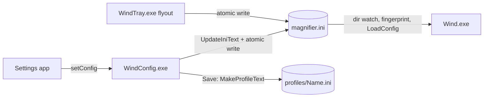

# 08. Config and profiles

All configuration is one file, `magnifier.ini`. It is also the only settings channel between the
processes: `WindConfig.exe` and `WindTray.exe` write it, `Wind.exe` watches and hot-reloads it.
Profiles are full copies of the same file, one per profile. This chapter covers where the file
lives, parsing, hot versus restart keys, profiles, and the key reference.

## The ini as IPC

**Settings travel only through `magnifier.ini`.** `Wind.exe` runs a paced loop where one stalled
millisecond shows as a pan hitch, so the settings GUI (a whole browser engine) lives in a separate
process. The two never message each other about settings: there is one state, on disk, and both
resolve it through `wind::ResolveIniPath()`. The settings app can crash or restart without touching
the magnifier, and the processes run at different integrity levels (`Wind.exe` is UIAccess, the
others are not).

- Every writer uses `wind::WriteTextFileAtomic` (`src/profiles_io.h`): write a temp file, then
  `MoveFileExW(MOVEFILE_REPLACE_EXISTING)`. The temp name embeds the process id, so two writers
  never clobber each other's temp file.
- The only cross-process kernel objects are the single-instance mutexes and the
  `Local\Wind_QuitRequest` event (quit, restart handshake, installer). A window message would not
  work: UIPI drops `PostMessage` from a normal process to a UIAccess one.
- The tray's status block (`Local\Wind_TrayState_v1`) carries status, not settings
  ([01](01-overview.md)).

```mermaid
flowchart LR
  SV[Settings app] -->|setConfig| HOST[WindConfig.exe]
  TRAY[WindTray.exe flyout] -->|atomic write| INI
  HOST -->|UpdateIniText + atomic write| INI[(magnifier.ini)]
  HOST -->|Save: MakeProfileText| PROF[(profiles/Name.ini)]
  INI -->|dir watch, fingerprint, LoadConfig| CORE[Wind.exe]
```

## Where the file lives

`wind::ResolveIniPath()` (`src/config_path.h`) probes whether the exe's directory is writable
(a sentinel file opened with `FILE_FLAG_DELETE_ON_CLOSE`).

- Writable (dev build): the ini sits next to the exe.
- Read-only (`C:\Program Files\Wind`): `%LOCALAPPDATA%\Wind\magnifier.ini`, seeded from a template
  next to the exe if one exists, otherwise created by `LoadConfig` with a commented header.
- **Never hardcode `L"magnifier.ini"`.** Program Files is read-only for the non-admin runtime, and a
  write next to the exe fails silently. The same applies to logs (`ResolveLogDir`) and the WebView2
  user-data folder (`%LOCALAPPDATA%\Wind\WebView2`).

## Parsing

`wind::ParseConfig` (`src/config.cpp`) is pure and tested. Every `Config` field carries its default
as an initializer, so a missing or malformed key keeps the default; parsing never fails.

- Numeric values are clamped to tested ranges.
- `model` must be `render`, `transform` or `hybrid`; anything else becomes `hybrid`.
- Unsafe binds read as unbound (`src/keybind_rules.h`, [06](06-input.md)).
- `LoadConfig` is the I/O wrapper, excluded from the test build by `WIND_TESTS`.

## Hot-reload and the UI-only fingerprint

The reload mechanics are in [02](02-tick-loop.md). A reload rebuilds `ZoomController`, so it
collapses an active zoom; therefore `StripUiOnlyKeys` removes the four keys the core never reads
(`uiTheme`, `uiPalette`, `showAdvanced`, `onboarded`) and the reload is skipped when the stripped
text is unchanged. `profile` stays in the fingerprint, so a profile switch reloads.

**Hot or restart follows from how a value is read.** A key read from `t.cfg` per tick or per
zoom-in is hot. A key baked into state at initialization needs a restart: `model` (which engines
exist), `txHookWrite` (runtime thread ownership), `gpuPriority` (device build), `spriteBand16`
(sprite creation), `zorderBand` (overlay creation). The comment on each `Config` field says which.

## Profiles

A profile is a named full snapshot of the settings, keybinds included, stored as
`profiles\<Name>.ini` next to the resolved ini, with `profile=<name>` in the live ini. Pure logic is
in `src/profiles.*` (tested); I/O in `src/profiles_io.h`.

**Global keys never travel with a profile.** `IsGlobalProfileKey` covers `profile`, `onboarded`,
`uiTheme`, `uiPalette`, `showAdvanced` and the five tray layout keys (`trayPerf`, `traySliders`,
`traySliderOrder`, `trayToggles`, `trayToggleOrder`). `MakeProfileText` strips them from profile
files; `MakeLiveText` carries them over from the old live text. Both work line by line and keep
comments and order.

**Session model: the live ini is the session, the profile file is the saved state.**

- Every settings change writes only the live ini, and the core hot-reloads it.
- The profile file changes on Save (`saveSession`) or when a keybind is captured
  (`setConfigPersist`, which writes that key to both).
- Unsaved means `SessionDiffers(live, profile)`: a profile-scoped key differs; globals ignored.
- At start the core runs `ResetSessionToProfile`, so unsaved changes never survive a restart,
  unless `%LOCALAPPDATA%\Wind\session.keep` marks a restart Wind triggered itself (engine change,
  profile switch with a model change). It is consumed once.
- Tray Quit compares the files and prompts Save, Discard or Cancel.

**Switching** (Settings or the tray flyout, the same sequence):

1. Read and check the profile with `ProfileTextError`, which rejects binary, oversized or
   unparseable text. A read failure is distinct from an empty file; treating a locked file as empty
   would reset the user to defaults.
2. Settings asks Save, Discard or Cancel when the session has unsaved changes. The tray does not
   prompt.
3. Write `MakeLiveText(profile, oldLive, name)` over the live ini.
4. The core hot-reloads everything except `model`. When the parsed `model` differs, the surface
   relaunches `Wind.exe`. If the relaunch fails, it writes the old `model` back, so the ini always
   matches the running engine.

**The relaunch uses the eviction handshake, never a kill.** The new instance finds the
single-instance mutex held, sets `Local\Wind_QuitRequest` and waits for the old one to exit. Only a
clean exit restores the OS cursor and releases `ClipCursor`.

**An empty profile file means factory defaults**: every profile key falls back to its `ParseConfig`
default. "New profile" writes a near-empty file (a comment plus `model=hybrid`) and switches to it.

**Seeding.** `EnsureProfilesSeeded` runs at startup before the ini mtime is recorded. With no
`profiles\` directory it creates one, saves the current settings as `Default.ini` and writes
`profile=Default`. The directory is the latch, so a failed `Default.ini` write removes it again.

**Names** become file names: `ProfileNameError` rejects path and control characters, leading or
trailing dots and spaces, reserved device names and names over 40 characters. Matching is
case-insensitive (`SameProfileName`). `NextCopyName` produces "Name copy", "Name copy 2".

## Key reference

Every key works in the ini whether or not Settings shows it. Keys hot-reload unless marked.

**Binds.** All ship unbound until the first-run setup.

| Keys | Meaning |
|---|---|
| `zoomInVk`/`zoomInMods`, `zoomInButton`/`zoomInButtonMods`, and the `*2` alternates; same for `zoomOut*` | Hold to zoom. Buttons: 1/2 side buttons, 3/4/5 left/right/middle click (with modifiers), 6/7 wheel up/down |
| `panLeftVk`, `panRightVk`, `panUpVk`, `panDownVk` + `*Mods`, `panKeysOn` | Keyboard panning while zoomed |
| `hideCursorVk`/`hideCursorMods`, `hideCursorOn` | Toggle the pointer while zoomed |
| `cursorLockVk`/`cursorLockMods`, `cursorLockOn` | Inspect mode |
| `recenterVk` | Recentre the view on the cursor |
| `quickZoomHotkeyMode`, `quickZoomModifier` (default Ctrl), `quickZoomVk`/`quickZoomMods`, `quickZoomDefault` (4.0) | Quick zoom: modifier + a zoom key (mode 0) or a dedicated hotkey (mode 1) toggles between 1x and the remembered level |
| `noSwallowApps` | Exes where the keyboard hook is dropped |

**Zoom and view.**

| Keys | Meaning |
|---|---|
| `maxLevel` (12), `zoomInSpeed`, `zoomOutSpeed`, `zoomEaseOutMs`, `smoothZoom*` | Range and feel of the zoom |
| `cursorSensitivity` (1.0), `cursorSmoothing`, `panSpeed` (1.0) | Mouse and arrow-key pan speed and inertia |
| `mouseAlign` (0 centred, 1 within the edges), `mouseMarginPct` | Where the pointer sits while the view moves |
| `trackCaret` (1), `trackFocus` (0), `trackAlign`, `trackGlideMs` (200) | Follow the text caret and keyboard focus |
| `lockApps`, `warpLock` (0) | Games whose sessions pan from raw mouse motion; heuristics for unlisted games |
| `multiMonitor` (0) | 1 follows the cursor's monitor at each zoom-in |

**Image and cursor.**

| Keys | Meaning |
|---|---|
| `txSamplingMode` (0) | Transform sampling: 0 nearest, 1 smooth ("High resolution cursor", coupled to MPO, [05](05-transform-engine.md)) |
| `bilinear`, `sharpness`, `brightness`, `hdrTonemap` (1) | Render engine image |
| `cursorConstantSize` (0), `cursorVisibility` (`auto`) | Render cursor size and when it is drawn |
| `colorWarmPct` (0), `colorDimPct` (100) | Warmth and brightness filter |
| `outline*` | Zoom outline |

**Engine.** `model` needs a restart.

| Keys | Meaning |
|---|---|
| `model` | `hybrid` (Auto, default), `render` or `transform`; anything else reads as `hybrid` |
| `engineGame`, `engineAcrylic`, `engineDesktop`, `engineOther` | `auto`, `transform` or `render` per window category, Auto only |
| `desktopTransform` (1) | Let Auto use the transform on the desktop when UIAccess is available |
| `transformExclude`, `renderExclude` | Exes that never get Transform, or never get Render |
| `vsync` (1), `dwmFlush` (0), `gameFpsCap`, `gpuPriority` (restart) | Render pacing and game coexistence |
| `zorderBand` (0, restart) | 16 covers the shell in the UIAccess build, at the cost of the Snipping Tool ([04](04-render-engine.md)) |

**Global and UI.** `profile`, `onboarded`, `uiPalette` (`grey`, `ember`, `ocean`, `hicon`),
`showAdvanced`, `trayPerf`, `traySliders`, `traySliderOrder`, `trayToggles`, `trayToggleOrder`.
`uiTheme` is a legacy key, ignored.

**Diagnostics.** `diagnostics=1` writes the frame-pacing log; the rest is in
[12](12-instrumentation.md). Transform tuning keys (`tx*`, `ixDecimate`, `mpoBuster`, `tdrTest`)
are documented on their `Config` fields in `src/config.h`.
