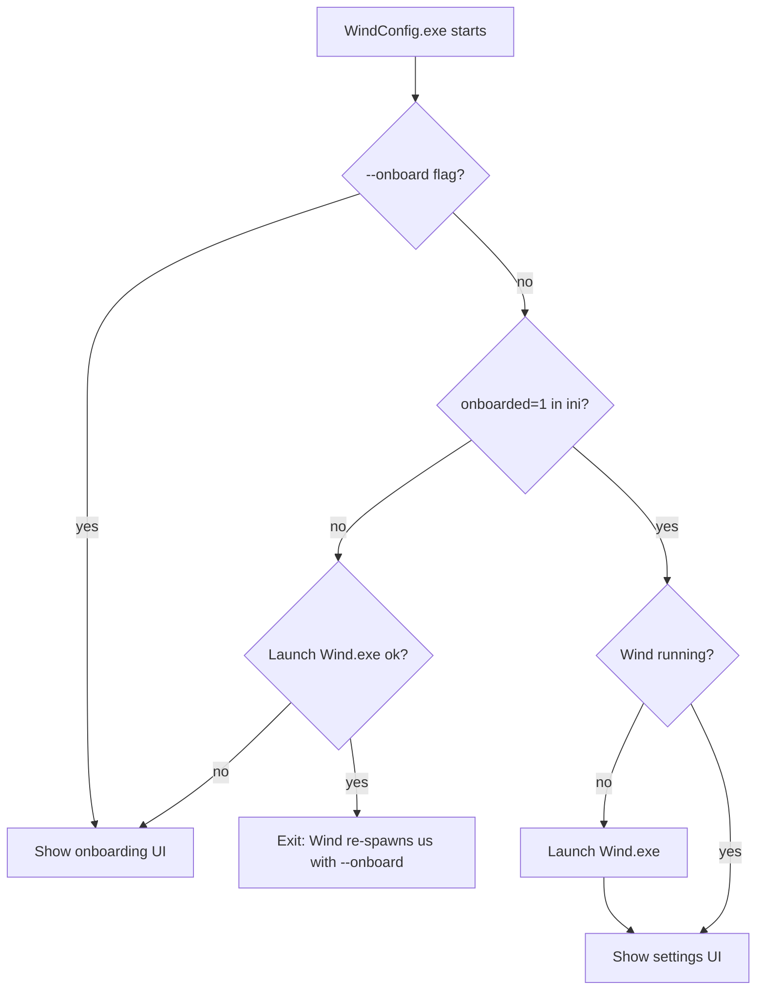
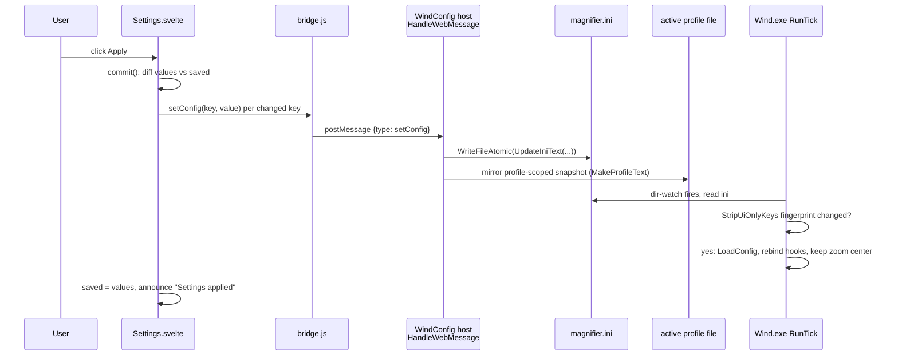

# 09. The settings UI

Wind's settings live in a second, entirely separate process: `WindConfig.exe`, a thin C++
WebView2 host (`src/config_ui/main.cpp`) that loads a built Svelte app from `ui/dist/`. It talks
to the magnifier core only by writing `magnifier.ini`, which the core dir-watches and
hot-reloads, so the settings window has zero performance coupling to the tick loop and needs no
IPC channel of its own. This chapter covers the host, the bridge message set, the schema-driven
Svelte app, the staged-Apply model, profiles, theming, onboarding, accessibility, and how the UI
is tested headlessly with a Playwright mock of the WebView2 bridge.

## Why a second process

The core (`Wind.exe`) runs a paced tick loop where a single stalled millisecond is visible as a
pan hitch, so nothing interactive or heavyweight is allowed to live in that process. The settings
GUI is the opposite kind of program: rarely open, UI-rich, and best written in web tech. Splitting
them means the config app can embed a whole browser engine without the magnifier ever paying for
it, and it means the two can run at different integrity levels (the deployed `Wind.exe` is
UIAccess, `WindConfig.exe` is a normal-IL process). See [Overview](01-overview.md) for the
two-binaries product framing.

The price of the split is that the two processes must agree on state without talking to each
other. The design answer is radical: they do not talk. `magnifier.ini` is the single shared
artifact. The UI writes it (`WriteFileAtomic` in `src/config_ui/main.cpp`, delegating to
`wind::WriteTextFileAtomic` so both processes use the same per-process temp naming and cannot
clobber each other's in-flight writes), and the core's directory watch picks the change up within
a tick (see [The tick loop](02-tick-loop.md) and [Config and profiles](08-config-profiles.md)).
The only exceptions are two kernel objects: the `Local\Wind_QuitRequest` event (used by
`quitWind` and by the model-restart handshake) and the single-instance mutexes. A window message
would not work here, and the comment in `HandleWebMessage`'s `quitWind` branch says why: UIPI
silently drops `PostMessage` from a normal-IL process to a UIAccess one, while a named kernel
event is not gated by UIPI.

One consequence of the ini-as-IPC design is that the core must not overreact to writes it does
not care about. The core keeps a fingerprint of the ini with UI-owned keys stripped
(`wind::StripUiOnlyKeys`, `src/config.cpp`, applied in `RunTick`'s reload path in
`src/main.cpp`) and skips the hot-reload when the stripped text is unchanged. Before that guard,
toggling the app theme wrote `uiTheme`, the core reloaded, the reload reset the `ZoomController`,
and a theme flip mid-zoom collapsed the zoom to 1x (a Max field report; the fingerprint is also
seeded at startup so the first write of a session gets the same treatment). `profile` stays in
the fingerprint on purpose: profile switches must still reload.

## The host: a frameless window around WebView2

`wWinMain` in `src/config_ui/main.cpp` is deliberately small. It enforces a single instance
(`WindConfig_SingleInstance` mutex; a second launch focuses the existing `WindConfigWnd`
window), decides between settings mode and onboarding mode, creates a frameless `WS_POPUP`
window with its own hit-testing (`WM_NCCALCSIZE` / `WM_NCHITTEST` in `WndProc`, with WebView2's
non-client region support so the web page's `app-region: drag` CSS drives window dragging), and
spins up WebView2.

Two host details are traps a contributor will hit if they touch this code:

- **The WebView2 user-data folder is explicit.** The default location is next to the exe
  (`<exeDir>\WindConfig.exe.WebView2`), which works in dev and silently fails under
  `C:\Program Files\Wind`, where non-admin processes cannot write: environment creation fails
  and the window paints as an empty shell. The host therefore always passes
  `%LOCALAPPDATA%\Wind\WebView2` to `CreateCoreWebView2EnvironmentWithOptions`. This is one
  instance of the general Program-Files-is-read-only rule in
  [Config and profiles](08-config-profiles.md); the ini path itself goes through
  `wind::ResolveIniPath()` (`src/config_path.h`) for the same reason.
- **The UI is served from a virtual host, not `file://`.** `SetVirtualHostNameToFolderMapping`
  maps `https://wind.config/` onto `<exeDir>\ui\dist`, and the host navigates to
  `https://wind.config/index.html` (with `?mode=onboard` appended for onboarding). A failed
  environment creation (missing WebView2 Runtime) is caught, logged, explained in a message box,
  and the process exits rather than leaving a dead shell.

The host also owns a one-second **watchdog timer** (`kWindWatchTimerId` in `WndProc`): the
settings window should not exist when the magnifier is gone (quit from the tray, Ctrl+Alt+Q, or
a crash), because there would be nothing left to apply settings to. The decision logic is pure
and unit-testable: `wind::ShouldCloseOnWindGone` (`src/config_ui/wind_watchdog.h`) requires Wind
to have been *observed running first* (so the onboarding-after-failed-launch window is never
closed by its own watchdog) and requires **two** consecutive misses (so one transient
`CreateToolhelp32Snapshot` failure inside `WindRunning()` never closes the user's window). The
liveness probe itself is a Toolhelp process-name scan rather than a mutex open or a process
handle wait, because both of those can be access-denied against a higher-integrity UIAccess
process. The same timer also polls the ini for an externally switched profile (the tray can
rewrite `profile=` under us) and pushes a refreshed profile list to the web side with
`push:true`.

**Launch routing: how one exe serves both onboarding and settings.**

The rule encoded here: settings never runs without the magnifier, and the config page is never
shown against a not-yet-onboarded config. The `--onboard` guard on the first branch prevents a
launch loop.

## The bridge

The web side posts JSON messages via `window.chrome.webview.postMessage`; the host handles them
in `HandleWebMessage` (`src/config_ui/main.cpp`), which is the **authoritative list** of the
message set. `ui/src/bridge.js` is the JS mirror: it wraps each message in a small helper, and
request/reply pairs become promises that resolve on the matching reply type. The host parses the
JSON with hand-rolled `JsonField`/`JsonEscape`/`JsonUnescape` helpers rather than a JSON library;
the escaping is complete over the control-character set because one unescaped newline in an
ini value would make the reply invalid JSON, `PostWebMessageAsJson` would reject it, and the UI
would hang waiting for a config that never arrives (the comment on `JsonEscape` records exactly
this failure mode).

| Message | Direction | What it does |
|---|---|---|
| `getConfig` | request/reply `config` | Dump every ini key/value to the UI |
| `setConfig` | fire-and-forget | Atomic ini write of one key, then mirror the profile-scoped snapshot into the active profile's file |
| `window` | fire-and-forget | `minimize` / `close` (with `force` for Discard) / `quitWind` / `restartWind` |
| `dirty` | fire-and-forget | Mirror the staged/unsaved flag into the host so `WM_CLOSE` (Alt+F4, system menu) can raise the confirm dialog |
| `openIni` | fire-and-forget | Open `magnifier.ini` with the registered `.ini` handler, Notepad fallback |
| `exportDiagnostics` | fire-and-forget | Zip `%LOCALAPPDATA%\Wind\logs` to the Desktop and reveal it |
| `pickExe` | request/reply `exePicked` | Native file picker; replies with the bare exe **name**, never a path, because the core matches app lists by file name (`IsExeInList`) |
| `mpoState` | request/reply `mpoState` | Read-only HKLM probe: registry value, plus what DWM actually loaded at boot (`wind::MpoStateAtBoot`) |
| `setMpoDisabled` | request/reply `mpoApplied` | Elevated registry write (UAC); replies with the re-read state so a cancelled prompt reverts the toggle |
| `rebootNow` | fire-and-forget | `shutdown.exe /r /t 0` (no `/f`, so other apps can object) |
| `listProfiles` / `switchProfile` / `createProfile` / `renameProfile` / `duplicateProfile` / `deleteProfile` | request/reply `profiles` | Profile file ops; every mutation replies with the refreshed list so the UI never guesses |

Two protocol details matter. First, every profile reply carries the full refreshed
`{names, active}` state; the host can also send the same `profiles` message *unsolicited* when
the watchdog timer notices a tray-side profile switch, marked `push:true` so
`bridge.js`'s `profileRequest` helper never mistakes it for the reply to an in-flight request.
Second, profile names arriving over the bridge become file paths, so the host validates every
one through the pure `wind::ProfileNameError` before `ProfilePath` ever sees it (traversal
characters, reserved names, and dots are rejected; see
[Config and profiles](08-config-profiles.md) for the profile machinery itself).

## The Svelte app: schema-driven rows

The entire settings page is generated from one data structure: `sections` in
`ui/src/settings-schema.js`. Each section has an id, label, icon, and a list of rows; each row
is a plain object naming its ini key, row type, label, description, and default.
`ui/src/Settings.svelte` iterates the schema and renders each row through
`ui/src/lib/Row.svelte`, which switches on `row.type`:

| Row type | Widget | Notes |
|---|---|---|
| `keybind` | `ui/src/lib/KeybindCapture.svelte` | Stores state under `buttonKey`/`vkKey`/`modsKey` sibling ini keys, not `row.key` (which is a `__`-prefixed placeholder) |
| `toggle` | animated SVG checkbox | Writes `1`/`0` |
| `slider` | `input type=range` | `min`/`max`/`step`/`unit`; `unit` also feeds `aria-valuetext` |
| `select` | `ui/src/lib/CustomSelect.svelte` | `options` + `optionLabels` (e.g. `hybrid` shown as "Auto") |
| `segmented` | ARIA radiogroup with roving tabindex | No live rows use it after the 2026-08-21 cleanup, but the widget remains |
| `applist` | summary + "Manage list" dialog (`ui/src/lib/AppListModal.svelte`) | One comma-separated ini string; the host's `pickExe` feeds it bare exe names |
| `mpo` | checkbox bound to `extra`, not `values` | Reflects a registry value; keeping it out of `values` prevents Apply from writing a junk key into the ini |
| `about` | logo hero | Label-less; also gives the last section enough height for the scrollspy |
| `color`, `button` | supported by `Row.svelte` | Currently unused by the schema |

Row *visibility and gating* are schema flags, all evaluated in the render condition in
`Settings.svelte`:

- `advanced: true` hides the row unless the `showAdvanced` toggle is on (driven by the live
  staged `values`, so flipping it reveals rows before Apply).
- `requires: 'key'` shows the row only while another value is `1` (the alternate-keybind rows
  require `altKeybinds`); `requiresNot` is the inverse.
- `showIf: {key, eq}` shows the row only when another value equals a literal (historically used
  for model-specific display rows; the cleanup removed the last users, the mechanism remains).
- `dependsOn: 'key'` renders the row but disables it when the dependency is off.

This is why adding a setting is normally a one-line schema edit plus a core-side `ParseConfig`
entry: no new Svelte is involved unless the row needs a new widget type.

### The 2026-08-21 cleanup

The schema's header comment is the changelog of record: the settings page was pruned with Max
deciding every row (issue #221 branch). Removed outright from the UI: quick zoom
(mode/modifier/hotkey), the smooth-zoom toggle (always on now; its two shape sliders survive as
advanced), scale-cursor-with-zoom, `magnifyStep`, `desktopTransform`, bilinear, sharpness,
brightness, `hdrTonemap`, `multiMonitor`, the whole outline family, and `cursorVisibility`
(broken in the transform model: `main.cpp` collapses it to `drawCursor = mode != 2`, so only
"never" did anything, and the hide-cursor hotkey already covers that). The crucial rule:
**removed from the UI does not mean removed from the product**. Every one of those ini keys is
still parsed by the core; the UI just stopped advertising them. The same is true in the other
direction: keys like `txMaxStepPct` (default 25, pinned in `tests/test_config.cpp`) and the
`warpLock` lock-tell experiments never had rows at all. The "Edit config file" path (`openIni`)
is the escape hatch for all of them. The same pass rewrote the copy: plain language, no toggle
labels starting with "Enable", no description that restates its label.

Two rows the cleanup *added* are worth knowing: `noSwallowApps` (Keybinds, advanced) suspends
the keyboard hook per app, trading key interception for smooth panning (issue #156), and
`lockApps` (Cursor, advanced) is the issue #221 zoom-lock-detection list for games like DOOM
that pin the mouse to the screen center, which would otherwise pin the zoomed view there too;
listed apps get the view unlocked from the pointer and panned from raw mouse motion (see
[The cursor system](07-cursor.md)).

## Staged Apply, live keybinds

Settings state is two dictionaries in `Settings.svelte`: `values` (what the page shows) and
`saved` (what the ini holds). `dirty` is a derived comparison of the two (plus the separately
staged MPO flag), and it is mirrored to the host via `setDirty` so the host's `WM_CLOSE` guard
covers Alt+F4 and the system menu, not just the page's own close button. `apply()` diffs and
writes only the changed keys (`commit()`); `discard()` restores `values` from `saved`.

Keybinds are the deliberate exception: `KeybindCapture` rows call the `live()` setter, which
writes `setConfig` immediately **and** updates both `values` and `saved`. The rebind takes
effect at once (the core hot-reloads, the hook stops swallowing the old binding, the user can
try the new one immediately), and because `saved` moved too, keybind changes never show as
dirty in the Apply footer. Everything else stages.

Two settings need extra machinery inside `apply()`:

- **`model`** is read once at Wind's launch, so a hot-reload cannot switch it. Apply writes the
  ini first (the relaunched Wind reads it at startup), then sends `restartWind`; the host just
  launches `Wind.exe` again and the new instance evicts the incumbent through the
  `Local\Wind_QuitRequest` handshake in `src/main.cpp`. If the launch fails the host replies
  `restartFailed`, and the UI reverts both the dropdown and the ini to the still-running model
  (`runningModel`, captured before `commit()` moved `saved.model` forward), preserving the
  invariant that the ini's model always matches the running process.
- **MPO** is a registry value, not an ini key, and `Settings.svelte` tracks *three* booleans
  whose conflation is a documented bug class: `mpoLive` (what the registry says, decides whether
  Apply must write), `mpoStaged` (what the toggle shows), and `mpoBoot` (what DWM actually
  loaded at boot, the only honest basis for "requires restart"). Apply awaits the elevated
  write first; a cancelled UAC prompt comes back as the re-read unchanged state and reverts the
  toggle instead of showing a change that never happened.

**Sequence of a normal Apply (one changed slider), from click to core reload.**

Note what is *absent*: no acknowledgment flows back for `setConfig`. The write is atomic, the
UI optimistically advances `saved`, and the core's hot-reload is the delivery mechanism. The
profile mirror in the host is what makes profiles live-bound: the active profile's file always
equals the current settings (globals stripped), so switching away and back loses nothing.

## Profiles in the titlebar

`ui/src/lib/ProfileMenu.svelte` renders the active profile as a titlebar dropdown with
switch/create/rename/duplicate/delete. The interesting logic is in `Settings.svelte`'s
`profileAction`: operations that replace the staged settings wholesale (switch, create, delete
of the *active* profile) route through the same unsaved-changes guard as closing, while rename,
duplicate, and deleting an inactive profile skip it. After a mutating operation the UI reloads
the whole config (`loadValues`), deliberately *before* checking the reply's `ok`, because a
failed operation can still have rewritten the live ini (a switch that landed but whose model
restart failed) and stale staged values would then Apply the old profile's settings on top of
the new one. A `push:true` profiles message (tray switch under an open window) refreshes the
titlebar immediately; if edits are staged it raises a notice and arms `pendingReload` so
Discard reloads the new profile's values instead of restoring a snapshot of the old one.
Creating a profile lands the user on the Keybinds section, because a factory-defaults profile
has no zoom keys bound and fixing that is the first thing to do.

## Theme, onboarding, accessibility

**Theme.** `uiTheme` is `auto | dark | light`, persisted in the ini as a UI-only key (the core
ignores it, and `StripUiOnlyKeys` keeps it from triggering reloads). `ui/src/theme.js` applies
it as a `force-dark`/`force-light` class overriding the `prefers-color-scheme` media query in
`ui/src/theme.css`. The sun/moon toggle flips the *effective* theme: `nextTheme` first resolves
`auto` against the system preference, so one click always visibly changes something (the old
auto to dark to light cycle needed two clicks to reach light on a dark system, the first being
invisible).

**Onboarding.** `ui/src/App.svelte` routes on `getMode()` (the `?mode=onboard` query the host
appends). `ui/src/Onboarding.svelte` is a three-step wizard: the wind-trails-into-logo intro,
zoom-key capture (the same `KeybindCapture` component, writing live), and done. On mount it
*actually clears* the keybind keys in the ini rather than just displaying "Unbound", because a
previously halted onboarding may have written real keys and showing blank over live bindings
lies. Finishing or skipping writes `onboarded=1` (a global key that never travels with
profiles) and switches to Settings in place; closing the window with X instead sends
`quitWind`, ending the whole app, since a user who abandons setup has not opted into a
magnifier running in the tray.

**Accessibility (issue #201).** The A11y work is best read through its living spec,
`ui/tests/a11y.spec.js`, whose header tells the origin story: every control in the settings
list was anonymous, because labels and descriptions are sibling `
`s of their controls, so
a screen reader announced "checkbox, checked" with no clue which of ~24 settings it had
reached. The fix concentrates in `Row.svelte`, which the whole schema flows through, so wiring
ids there named every row at once: controls whose text is not their name get
`aria-labelledby` pointing at the row label; controls whose text is their *value* (select
trigger, keycap, "Manage list") get labelledby listing both label and value ids. On top of
that: a single polite `aria-live` region in `Settings.svelte` announces everything that changes
the page without moving focus (advanced rows toggling, model swaps, Apply/Discard, profile
switches), with a zero-width-space trick so repeating the same message still re-announces; rail
navigation moves focus to the target section's `tabindex="-1"` heading; every modal uses the
`ui/src/lib/dialog.js` action (focus trap, Escape, restore); and the segmented widget is a real
radiogroup with roving tabindex. The a11y suite asserts directly against the accessibility tree
(the "no unnamed controls" test enumerates every control under `.scroll`), which is the right
altitude: none of it is visible in a screenshot.

## Testing: Playwright against a mocked bridge

The UI tests (`ui/tests/settings.spec.js`, `a11y.spec.js`, `onboarding.spec.js`) run the real
Svelte app in a real Chromium via Playwright, with the one Windows-specific piece replaced: an
`addInitScript` installs a fake `window.chrome.webview` whose `postMessage` implements the
host's half of the bridge in-page. The mock answers `getConfig` with a canned config
(`showAdvanced: '1'` and `model: 'render'` on purpose, so advanced and conditional rows render
and can be asserted on), records every `setConfig` into `window.__sets` for assertions like
"changes stage until Apply", and simulates the failure modes the C++ host can produce:
`__restartFail` for a failed model relaunch, `__mpoOk = false` for a dismissed UAC prompt,
`__profileFail` for any profile op, and `__pick` for what the "file picker" returns.
`bridge.js` itself needs no test shim beyond this because it touches nothing but
`window.chrome.webview` (plus a `window.__windMock` hook for ad-hoc harnesses). This is the
project's verification-loop rule applied to the UI: the staged-Apply logic, the MPO three-state
dance, the profile guard, and the a11y contract are all asserted headlessly by `npm test` in
`ui/` (Playwright starts the Vite dev server itself), with no magnifier and no WebView2
involved. CI currently runs only the doctest suite; the UI suite is a local pre-commit gate. What the mock cannot
cover is the host itself; its only pure logic (`ShouldCloseOnWindGone`) is a header compiled
into the doctest build instead.

## Pointers

- `src/config_ui/main.cpp`: the WebView2 host, `HandleWebMessage` (the authoritative bridge
  message set), the watchdog timer, launch routing.
- `src/config_ui/wind_watchdog.h`: pure close-on-Wind-gone decision, unit-tested.
- `src/config_ui/mpo.h`, `src/mpo_boot.h`: MPO registry read/write and the boot-state record.
- `ui/src/settings-schema.js`: every row on the page, plus the 2026-08-21 cleanup changelog.
- `ui/src/Settings.svelte`: staged Apply, dirty tracking, profiles, announcements, dialogs.
- `ui/src/lib/Row.svelte`: the row-type switch and the accessible-naming rules.
- `ui/src/bridge.js`, `ui/src/theme.js`, `ui/src/Onboarding.svelte`.
- `ui/tests/a11y.spec.js`: the living a11y spec; `ui/tests/settings.spec.js`: the bridge mock.
- Specs: [config UI polish + onboarding](../superpowers/specs/2026-05-27-config-ui-polish-onboarding-design.md),
  [profiles](../superpowers/specs/2026-08-12-profiles-design.md).
- Related chapters: [Overview](01-overview.md), [The tick loop](02-tick-loop.md) (hot reload),
  [Config and profiles](08-config-profiles.md) (ini resolution, profile file machinery),
  [Build, test, release](11-build-test-release.md) (`build.bat config`, the npm build).
