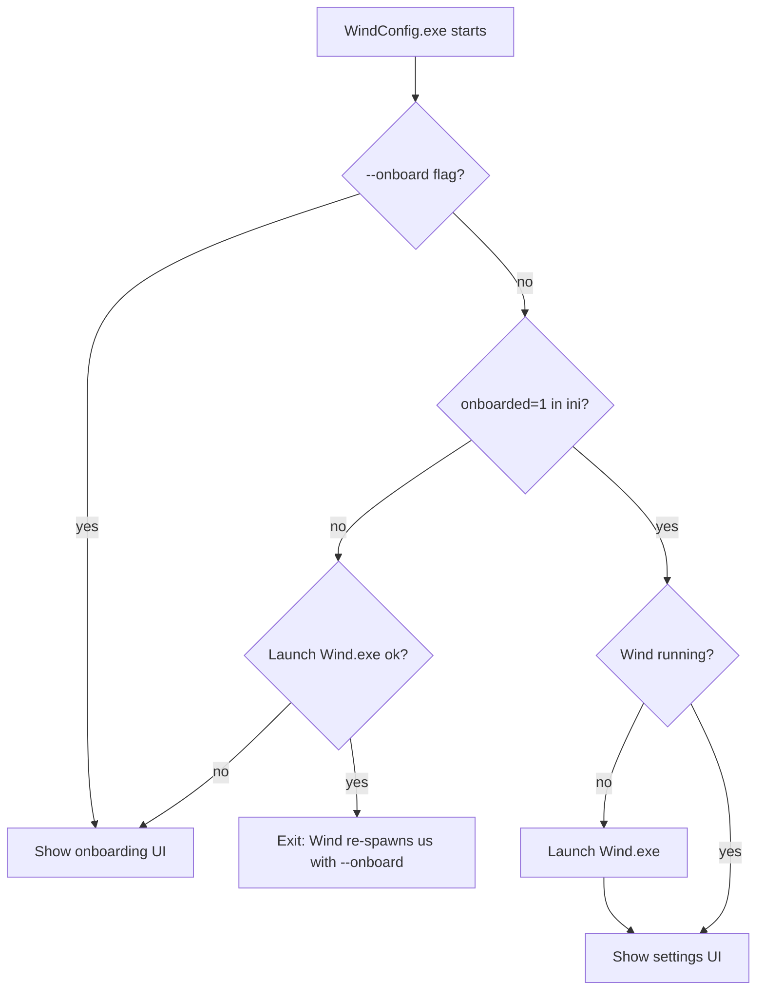
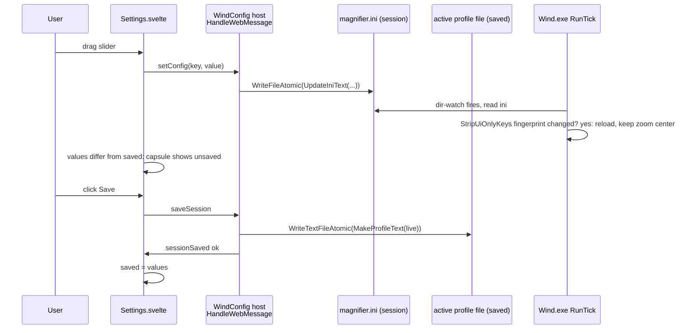

# 09. The settings UI

Wind's settings live in a second, entirely separate process: `WindConfig.exe`, a thin C++
WebView2 host (`src/config_ui/main.cpp`) that loads a built Svelte app from `ui/dist/`. It talks
to the magnifier core only by writing `magnifier.ini`, which the core dir-watches and
hot-reloads, so the settings window has zero performance coupling to the tick loop and needs no
IPC channel of its own. This chapter covers the host, the bridge message set, the schema-driven
Svelte app, the session model (instant apply, explicit Save), profiles, theming, onboarding, accessibility, and how the UI
is tested headlessly with a Playwright mock of the WebView2 bridge.

## Why a second process

The core (`Wind.exe`) runs a paced tick loop where a single stalled millisecond is visible as a
pan hitch, so nothing interactive or heavyweight is allowed to live in that process. The settings
GUI is the opposite kind of program: rarely open, UI-rich, and best written in web tech. Splitting
them means the config app can embed a whole browser engine without the magnifier ever paying for
it, and it means the two can run at different integrity levels (the deployed `Wind.exe` is
UIAccess, `WindConfig.exe` is a normal-IL process). See [Overview](01-overview.md) for the
two-binaries product framing.

The price of the split is that the two processes must agree on state without talking to each
other. The design answer is radical: they do not talk. `magnifier.ini` is the single shared
artifact. The UI writes it (`WriteFileAtomic` in `src/config_ui/main.cpp`, delegating to
`wind::WriteTextFileAtomic` so both processes use the same per-process temp naming and cannot
clobber each other's in-flight writes), and the core's directory watch picks the change up within
a tick (see [The tick loop](02-tick-loop.md) and [Config and profiles](08-config-profiles.md)).
The only exceptions are two kernel objects: the `Local\Wind_QuitRequest` event (used by
`quitWind` and by the model-restart handshake) and the single-instance mutexes. A window message
would not work here, and the comment in `HandleWebMessage`'s `quitWind` branch says why: UIPI
silently drops `PostMessage` from a normal-IL process to a UIAccess one, while a named kernel
event is not gated by UIPI.

One consequence of the ini-as-IPC design is that the core must not overreact to writes it does
not care about. The core keeps a fingerprint of the ini with UI-owned keys stripped
(`wind::StripUiOnlyKeys`, `src/config.cpp`, applied in `RunTick`'s reload path in
`src/main.cpp`) and skips the hot-reload when the stripped text is unchanged. Before that guard,
toggling the app theme wrote `uiTheme`, the core reloaded, the reload reset the `ZoomController`,
and a theme flip mid-zoom collapsed the zoom to 1x (a Max field report; the fingerprint is also
seeded at startup so the first write of a session gets the same treatment). `profile` stays in
the fingerprint on purpose: profile switches must still reload.

## The host: a frameless window around WebView2

`wWinMain` in `src/config_ui/main.cpp` is deliberately small. It enforces a single instance
(`WindConfig_SingleInstance` mutex; a second launch focuses the existing `WindConfigWnd`
window), decides between settings mode and onboarding mode, creates a frameless `WS_POPUP`
window with its own hit-testing (`WM_NCCALCSIZE` / `WM_NCHITTEST` in `WndProc`, with WebView2's
non-client region support so the web page's `app-region: drag` CSS drives window dragging), and
spins up WebView2.

Two host details are traps a contributor will hit if they touch this code:

- **The WebView2 user-data folder is explicit.** The default location is next to the exe
  (`<exeDir>\WindConfig.exe.WebView2`), which works in dev and silently fails under
  `C:\Program Files\Wind`, where non-admin processes cannot write: environment creation fails
  and the window paints as an empty shell. The host therefore always passes
  `%LOCALAPPDATA%\Wind\WebView2` to `CreateCoreWebView2EnvironmentWithOptions`. This is one
  instance of the general Program-Files-is-read-only rule in
  [Config and profiles](08-config-profiles.md); the ini path itself goes through
  `wind::ResolveIniPath()` (`src/config_path.h`) for the same reason.
- **The UI is served from a virtual host, not `file://`.** `SetVirtualHostNameToFolderMapping`
  maps `https://wind.config/` onto `<exeDir>\ui\dist`, and the host navigates to
  `https://wind.config/index.html` (with `?mode=onboard` appended for onboarding). A failed
  environment creation (missing WebView2 Runtime) is caught, logged, explained in a message box,
  and the process exits rather than leaving a dead shell.

The host also owns a one-second **watchdog timer** (`kWindWatchTimerId` in `WndProc`): the
settings window should not exist when the magnifier is gone (quit from the tray, Ctrl+Alt+Q, or
a crash), because there would be nothing left to apply settings to. The decision logic is pure
and unit-testable: `wind::ShouldCloseOnWindGone` (`src/config_ui/wind_watchdog.h`) requires Wind
to have been *observed running first* (so the onboarding-after-failed-launch window is never
closed by its own watchdog) and requires **two** consecutive misses (so one transient
`CreateToolhelp32Snapshot` failure inside `WindRunning()` never closes the user's window). The
liveness probe itself is a Toolhelp process-name scan rather than a mutex open or a process
handle wait, because both of those can be access-denied against a higher-integrity UIAccess
process. The same timer also polls the ini for an externally switched profile (the tray can
rewrite `profile=` under us) and pushes a refreshed profile list to the web side with
`push:true`.

**Launch routing: how one exe serves both onboarding and settings.**

```mermaid
flowchart TD
  A[WindConfig.exe starts] --> B{--onboard flag?}
  B -->|yes| O[Show onboarding UI]
  B -->|no| C{onboarded=1 in ini?}
  C -->|no| D{Launch Wind.exe ok?}
  D -->|yes| E[Exit: Wind re-spawns us with --onboard]
  D -->|no| O
  C -->|yes| F{Wind running?}
  F -->|no| G[Launch Wind.exe] --> S[Show settings UI]
  F -->|yes| S
```

The rule encoded here: settings never runs without the magnifier, and the config page is never
shown against a not-yet-onboarded config. The `--onboard` guard on the first branch prevents a
launch loop.

## The bridge

The web side posts JSON messages via `window.chrome.webview.postMessage`; the host handles them
in `HandleWebMessage` (`src/config_ui/main.cpp`), which is the **authoritative list** of the
message set. `ui/src/bridge.js` is the JS mirror: it wraps each message in a small helper, and
request/reply pairs become promises that resolve on the matching reply type. The host parses the
JSON with hand-rolled `JsonField`/`JsonEscape`/`JsonUnescape` helpers rather than a JSON library;
the escaping is complete over the control-character set because one unescaped newline in an
ini value would make the reply invalid JSON, `PostWebMessageAsJson` would reject it, and the UI
would hang waiting for a config that never arrives (the comment on `JsonEscape` records exactly
this failure mode).

| Message | Direction | What it does |
|---|---|---|
| `getConfig` | request/reply `config` | Dump every ini key/value to the UI |
| `setConfig` | fire-and-forget | Atomic write of one key into the live ini (the session). Never touches the profile file |
| `setConfigPersist` | fire-and-forget | Same, and also writes that single key into the active profile file (`UpdateProfileKey`). Used by keybind captures |
| `saveSession` | request/reply `sessionSaved` | Save: write `MakeProfileText(live)` over the active profile file |
| `discardSession` | request/reply `config` | Discard: rewrite the live ini from the profile (`MakeLiveText`) and reply with fresh `values`+`saved` |
| `ready` | fire-and-forget | Posted two animation frames after App mounts; the host logs launch-to-first-paint |
| `window` | fire-and-forget | `minimize` / `close` (with `force`) / `quitWind` / `restartWind` (writes `session.keep` first, see below) |
| `dirty` | fire-and-forget | Mirror the unsaved flag into the host so `WM_CLOSE` (Alt+F4, system menu) can raise the Save / Discard / Keep prompt |
| `openIni` | fire-and-forget | Open `magnifier.ini` with the registered `.ini` handler, Notepad fallback |
| `exportDiagnostics` | fire-and-forget | Zip `%LOCALAPPDATA%\Wind\logs` to the Desktop and reveal it |
| `pickExe` | request/reply `exePicked` | Native file picker; replies with the bare exe **name**, never a path, because the core matches app lists by file name (`IsExeInList`) |
| `mpoState` | request/reply `mpoState` | Read-only HKLM probe: registry value, plus what DWM actually loaded at boot (`wind::MpoStateAtBoot`) |
| `setMpoDisabled` | request/reply `mpoApplied` | Elevated registry write (UAC); replies with the re-read state so a cancelled prompt reverts the toggle |
| `rebootNow` | fire-and-forget | `shutdown.exe /r /t 0` (no `/f`, so other apps can object) |
| `listProfiles` / `switchProfile` / `createProfile` / `renameProfile` / `duplicateProfile` / `deleteProfile` | request/reply `profiles` | Profile file ops; every mutation replies with the refreshed list so the UI never guesses |

Two protocol details matter. First, every profile reply carries the full refreshed
`{names, active}` state; the host can also send the same `profiles` message *unsolicited* when
the watchdog timer notices a tray-side profile switch, marked `push:true` so
`bridge.js`'s `profileRequest` helper never mistakes it for the reply to an in-flight request.
Second, profile names arriving over the bridge become file paths, so the host validates every
one through the pure `wind::ProfileNameError` before `ProfilePath` ever sees it (traversal
characters, reserved names, and dots are rejected; see
[Config and profiles](08-config-profiles.md) for the profile machinery itself).

## The Svelte app: schema-driven rows

The entire settings page is generated from one data structure: `groups` in
`ui/src/settings-schema.js` (redesign #303). There are eight task-based groups, each with a label,
sidebar icon, banner description and a list of cards; each card holds rows, and each row is a plain
object naming its ini key, row type, label, description, and default. `ui/src/Settings.svelte` is
the shell: it renders the `shell/` pieces (title bar, sidebar, banner, save capsule, cards), routes
search through `search/`, and renders every row through `controls/SettingRow.svelte`, which
switches on `row.type`:

| Row type | Widget | Notes |
|---|---|---|
| `keybind` | `lib/KeybindCapture.svelte` + `controls/Keycaps.svelte` | State lives under `buttonKey`/`vkKey`/`modsKey` sibling ini keys, not `row.key` (a `__`-prefixed placeholder); zoom in/out carry a second slot (`*2` keys) that the core OR-combines |
| `toggle` | `controls/Toggle.svelte` | Writes `1`/`0` |
| `slider` | `controls/Slider.svelte` | `min`/`max`/`step`/`unit`; `unit` also feeds `aria-valuetext` |
| `select` | `controls/Select.svelte` | `options` + `optionLabels` (e.g. `hybrid` shown as "Auto") |
| `applist` | `controls/AppList.svelte` | One comma-separated ini string; the host's `pickExe` feeds it bare exe names |
| `highres` | `controls/HighRes.svelte` | The combined high-resolution-cursor/MPO toggle (issue #242); keeps its confirm step (UAC plus restart prompt) as an inline action |
| `engine` | `controls/EngineRow.svelte` | The Magnifier engine select; `model` is read once at launch, so it applies on an inline "Restart Wind" button, not on selection |
| `palette` | `prefs/ThemePicker.svelte` | The Theme row: one row of four mini window preview cards (name under each, selected one outlined, no scrolling or arrows), right-aligned like the other controls, writes `uiPalette`, a global key |
| `profiles` | `prefs/ProfilePicker.svelte` | A dropdown of the profiles plus New; a trash per profile in the open list (none when one is left, none on Default). Dialogs: `prefs/NewProfileDialog.svelte`, delete confirm via `Prompt` |
| `button`, `about` | `SettingRow`, `controls/About.svelte` | Actions (open ini, export diagnostics) and the logo hero |

**Search** (#317, `ui/src/search/`): `search.js` is a pure, unit-tested ranker. Every labelled row is
scored best field first (label exact > word-prefix > substring/fuzzy, then the row's `keywords`, then
its description, then card caption and tab name); each query word must match something, fuzzy (one typo
for 4-7 letters, two for 8+, same first letter, a few spelling folds like ight/ite), and the scores add.
The result is ONE ranked list, not grouped by tab. `Results.svelte` renders each hit with the page's own
`SettingRow` (tab name beside the label), so a result is edited in place with the same session/persist
behaviour and clicking it goes nowhere; advanced rows always show there, a row gated by `showIf` shows
dimmed. Every labelled schema row carries `keywords` (synonyms, never displayed; a test enforces it). The
Tray menu's item lists are not schema rows, so they are never searchable; its Performance switch is.

Visual tokens (colours, radii, the aurora banner) live in `ui/src/design/tokens.css`, taken from
`docs/design/settings-2026-10/FINAL-v10-grey.html`; the reference render is `FINAL-reference.png`
in the same folder.

Row *visibility and gating* are schema flags, all evaluated in the render condition in
`Settings.svelte`:

- Advanced rows live in the Advanced group, which is always present. The old "Show advanced
  settings" row is gone; `showAdvanced` stays a parsed-and-ignored global key. Search reaches
  Advanced rows too.
- `requires: 'key'` shows the row only while another value is `1` (the alternate-keybind rows
  require `altKeybinds`); `requiresNot` is the inverse.
- `showIf: {key, eq}` shows the row only when another value equals a literal: the per-window-
  engine rows (`engineGame`, `engineAcrylic`, `engineDesktop`, `engineOther`, `renderExclude`)
  use it to hide themselves unless `model` is `hybrid`, where a pinned single engine would make
  them no-ops.
- `dependsOn: 'key'` renders the row but disables it when the dependency is off.

This is why adding a setting is normally a one-line schema edit plus a core-side `ParseConfig`
entry: no new Svelte is involved unless the row needs a new widget type.

### The 2026-08-21 cleanup

The schema's header comment is the changelog of record: the settings page was pruned with Max
deciding every row (issue #221 branch). Removed outright from the UI: quick zoom
(mode/modifier/hotkey), the smooth-zoom toggle (always on now; its two shape sliders survive as
advanced), scale-cursor-with-zoom, `magnifyStep`, `desktopTransform`, bilinear, sharpness,
brightness, `hdrTonemap`, `multiMonitor`, the whole outline family, and `cursorVisibility`
(broken in the transform model: `main.cpp` collapses it to `drawCursor = mode != 2`, so only
"never" did anything, and the hide-cursor hotkey already covers that). The crucial rule:
**removed from the UI does not mean removed from the product**. Every one of those ini keys is
still parsed by the core; the UI just stopped advertising them. The same is true in the other
direction: keys like `txMaxStepPct` (default 25, pinned in `tests/test_config.cpp`) and the
`warpLock` lock-tell experiments never had rows at all. The "Edit config file" path (`openIni`)
is the escape hatch for all of them. The same pass rewrote the copy: plain language, no toggle
labels starting with "Enable", no description that restates its label.

Two rows the cleanup *added* are worth knowing: `noSwallowApps` (Keybinds, advanced) suspends
the keyboard hook per app, trading key interception for smooth panning (issue #156), and
`lockApps` (Cursor, advanced) is the issue #221 zoom-lock-detection list for games like DOOM
that pin the mouse to the screen center, which would otherwise pin the zoomed view there too;
listed apps get the view unlocked from the pointer and panned from raw mouse motion (see
[The cursor system](07-cursor.md)).

### Tracking (issue #276/#277)

A Tracking section, sitting between Cursor and Display, was added after the 2026-08-21 cleanup:
`trackCaret` (on by default), `trackFocus` (off by default), `trackAlign`/`mouseAlign` (Centred
vs Within the edges selects), and `mouseMarginPct` (the edge-mode margin slider). None of these
rows carry an `advanced` flag, so they show unconditionally. The caret/focus/edge-mode
mechanics they drive are covered in [The cursor system](07-cursor.md).

## Session model: instant apply, explicit Save

Before 0.16.0 every row staged behind an Apply/Discard footer and the active profile was
live-bound (each write mirrored into its profile file). The redesign (#303, spec
`docs/superpowers/specs/2026-10-01-settings-redesign-design.md`) replaced that with a session:

- **The live ini is the session.** Every change writes `magnifier.ini` at once (`setConfig`) and
  the core hot-reloads it, so a slider takes effect as it moves. It is not mirrored into the
  profile file.
- **The profile file is the saved state.** Save (`saveSession`) writes `MakeProfileText(live)`
  over the active profile file; Discard (`discardSession`) rewrites the live ini from it
  (`MakeLiveText`, globals kept).
- **Unsaved = the live ini differs from the profile** in profile-scoped keys. The host computes
  `values` (live) and `saved` (profile) in `SessionPayload` and sends both; the page derives the
  save capsule from `changedKeys(values, saved)` in `ui/src/session.js` (pure, defaults filled in
  on both sides so an absent key never counts as a change). The C++ twin is
  `wind::SessionDiffers` in `src/profiles.*`, which the tray and the core use.
- **Reset when Wind closes.** At start the core calls `ResetSessionToProfile`
  (`src/profiles_io.h`), rewriting the live ini from the active profile before parsing it, so
  unsaved changes never survive a restart or a crash (Windows shutdown and logoff have no
  prompt; the next start resets). A restart Wind triggers itself (engine change, profile switch
  with a model change) writes `%LOCALAPPDATA%\Wind\session.keep` first; the starting core
  consumes it, skips the reset once and the session survives.
- **Keybinds persist at once.** `KeybindCapture` writes `setConfigPersist`, which updates the live
  ini and the single key in the profile file, so a capture survives Discard and a later Save
  loses nothing while other changes stay unsaved. Global keys (`profile`, `onboarded`, `uiTheme`,
  `showAdvanced`) are written directly and never count as unsaved.
- **Three prompts** (`ui/src/prompts/Prompt.svelte`, focus-trapped via `lib/dialog.js`):
  closing Settings with unsaved changes offers Save / Discard / Keep for this session (the
  window closes, the changes stay live until Wind quits; Esc cancels); switching profile offers
  Save / Discard / Cancel. Quitting Wind from the tray decides from the files, not from the UI:
  `ConfirmQuit` in `src/tray_app/tray_menu.cpp` compares live against the profile with
  `SessionDiffers` and shows a TaskDialog (Save / Discard / Cancel) even when Settings is closed.

The `model` engine switch and the MPO registry value keep their special handling. `model` is read
once at launch, so the engine row writes the ini, then `restartWind` makes the host write
`session.keep` and launch `Wind.exe` again; the new instance evicts the incumbent through the
`Local\Wind_QuitRequest` handshake in `src/main.cpp`. On `restartFailed` the UI reverts the
dropdown and the ini to the running model, preserving the invariant that the ini's model matches
the running process. MPO is a registry value, not an ini key, and `highres` tracks three booleans
whose conflation is a documented bug class: `mpoLive` (what the registry says), `mpoStaged` (what
the toggle shows) and `mpoBoot` (what DWM loaded at boot, the only honest basis for "requires
restart"). The elevated write is awaited; a cancelled UAC prompt comes back as the re-read
unchanged state and reverts the toggle.

**Sequence of one slider change, then Save.**

```mermaid
sequenceDiagram
  participant U as User
  participant S as Settings.svelte
  participant H as WindConfig host<br/>HandleWebMessage
  participant I as magnifier.ini (session)
  participant P as active profile file (saved)
  participant W as Wind.exe RunTick
  U->>S: drag slider
  S->>H: setConfig(key, value)
  H->>I: WriteFileAtomic(UpdateIniText(...))
  W->>I: dir-watch fires, read ini
  W->>W: StripUiOnlyKeys fingerprint changed? yes: reload, keep zoom center
  S->>S: values differ from saved: capsule shows unsaved
  U->>S: click Save
  S->>H: saveSession
  H->>P: WriteTextFileAtomic(MakeProfileText(live))
  H->>S: sessionSaved ok
  S->>S: saved = values
```

No acknowledgment flows back for `setConfig` itself (a failed write posts `configWriteFailed`,
which the page surfaces). The core's hot-reload is the delivery mechanism.

## Tray menu tab (issue #313)
A TRAY sidebar section holds one page, `ui/src/tray/TrayMenuPage.svelte` (pure list logic in
`trayModel.js`, mirroring `src/tray_items.*`). A toggle row turns the Performance header on; two
cards, "Sliders" (N of 4) and "Toggles", list the eligible items with a drag handle, the line icon
(no background box), name, description and a checkmark button. Rows reorder only inside their card
(pointer drag with a ~150 ms glide, or Space, arrows, Space on the keyboard). The keys are global,
not profile, so `IsGlobalProfileKey` lists them. Changes are ordinary session changes. Item list
and limits: `docs/superpowers/specs/2026-10-01-tray-flyout-design.md`. Playwright: `ui/tests/tray.spec.js`.

## Profiles

The Profile row on the Preferences page (`ui/src/prefs/ProfilePicker.svelte`) is a dropdown of the profiles plus one
New button. Each profile in the open list has a trash icon (hidden when one profile is left, and on Default, which the
host protects); the trash opens a confirm prompt ("Delete profile", Cancel / Delete). New opens
`prefs/NewProfileDialog.svelte`: a name (checked by `prefs/profileName.js`, the host's file-name rules) and three buttons,
Cancel, New (the defaults) and Duplicate current (a copy of the current settings); Enter in the name field duplicates. Rename and duplicate have no UI (the bridge messages remain).
The interesting logic is in `Settings.svelte`'s `profileAction`: operations that replace the live settings wholesale
(switch, create from the defaults, delete of the *active* profile) route through the unsaved-changes prompt
(Save / Discard / Cancel), while deleting an inactive profile skips it. A new profile that starts from the CURRENT
settings skips it too: the host creates every profile from the defaults (`createProfile`), so the page then writes the
keys that differ with `setConfigPersist` (live ini and profile file), which carries unsaved changes into the new
profile and leaves nothing unsaved.
After a mutating operation the UI reloads the whole config (`load`), deliberately *before*
checking the reply's `ok`, because a failed operation can still have rewritten the live ini (a
switch that landed but whose model restart failed) and stale values would then be compared
against the wrong profile. A `push:true` profiles message (tray switch under an open window)
reloads `values`/`saved`; a tray switch rewrites the live ini from the
new profile, so unsaved edits are gone by then and the capsule resets.

## Theme, onboarding, accessibility

**Theme.** The UI is dark only since 0.20.0 (#324). There is no Mode row and no `theme.js`; the legacy
`ui/src/theme.css` holds one dark palette, and `uiTheme` is an ignored legacy key (still a global, UI-only
key, so `StripUiOnlyKeys` and the profile code keep treating it that way and old inis load; the UI never
writes it, and `uiTheme=light` still renders dark). The window title bar carries no theme button.

**Built-in themes (#318).** `uiPalette` is a second global UI-only key: `grey ember ocean hicon`
(Wind grey, Ember, Deep ocean, High contrast, always last; the core's `kUiPalettes`; anything else, including the
removed cyber/mono/slate/carbon, reads as `grey`). `Settings.svelte` puts it on the root as `data-palette`, and `ui/src/design/themes.css` has one dark token block per theme
(`.wnd[data-palette]`) over the defaults in `design/tokens.css`. themes.css and `design/themes.js` are
GENERATED by `ui/tools/gen-themes.cjs` from Max's mockup palettes (`wind-settings-mockups/ia/palettes08/-b1/-b2.cjs`);
edit the generator, not the output. Wind grey takes tokens.css's own values, so its look is exactly
today's. High contrast uses the sharp
radii (`--rc --rad --srad --rp --rsw --rkn`). Components use the tokens (`--sel`/`--selfg` for selections, `--onfill`,
`--focus`, `--danger*`, `--scrim`, the radii), never fixed colours. The Theme row is `prefs/ThemePicker.svelte` (mockup option A, Max 2026-10-02):
four cards in one row, each a tiny `.wnd` carrying its own palette so it shows the theme's real tokens; Left/Right
(also Up/Down, Home, End) moves and applies, the focus ring shows for the keyboard only. The tray flyout reads the same
ids from `src/tray_app/flyout_palettes.h` (generated by `ui/tools/gen-flyout-palettes.cjs`), and WindConfig's pre-paint
window colour follows `uiPalette` and is always dark (`ThemeBackground` in `src/config_ui/main.cpp`, a small table of the
themes' `--bg`; keep it in step when a theme is added).

**Onboarding.** `ui/src/App.svelte` routes on `getMode()` (the `?mode=onboard` query the host
appends). `ui/src/Onboarding.svelte` is a three-step wizard: the wind-trails-into-logo intro,
zoom-key capture (the same `KeybindCapture` component, writing live), and done. On mount it
*actually clears* the keybind keys in the ini rather than just displaying "Unbound", because a
previously halted onboarding may have written real keys and showing blank over live bindings
lies. Finishing or skipping writes `onboarded=1` (a global key that never travels with
profiles) and switches to Settings in place; closing the window with X instead sends
`quitWind`, ending the whole app, since a user who abandons setup has not opted into a
magnifier running in the tray.

**Accessibility (issue #201).** The A11y work is best read through its living spec,
`ui/tests/a11y.spec.js`, whose header tells the origin story: every control in the settings
list was anonymous, because labels and descriptions are sibling `
`s of their controls, so
a screen reader announced "checkbox, checked" with no clue which of ~24 settings it had
reached. The fix concentrates in `controls/SettingRow.svelte`, which the whole schema flows through, so wiring
ids there named every row at once: controls whose text is not their name get
`aria-labelledby` pointing at the row label; controls whose text is their *value* (select
trigger, keycap, "Manage list") get labelledby listing both label and value ids. On top of
that: a single polite `aria-live` region in `Settings.svelte` announces everything that changes
the page without moving focus (model swaps, Save/Discard, profile
switches), with a zero-width-space trick so repeating the same message still re-announces; rail
navigation moves focus to the target section's `tabindex="-1"` heading; every modal uses the
`ui/src/lib/dialog.js` action (focus trap, Escape, restore); and the segmented widget is a real
radiogroup with roving tabindex. The a11y suite asserts directly against the accessibility tree
(the "no unnamed controls" test enumerates every control under `.scroll`), which is the right
altitude: none of it is visible in a screenshot.

## Testing: Playwright against a mocked bridge

The UI tests (`ui/tests/*.spec.js`: settings, session, shell, search, schema, a11y, onboarding, keybind-rules) run the real
Svelte app in a real Chromium via Playwright, with the one Windows-specific piece replaced: an
`addInitScript` installs a fake `window.chrome.webview` whose `postMessage` implements the
host's half of the bridge in-page. The mock answers `getConfig` with a canned config
(a live and a saved snapshot, so unsaved states can be set up), records every message into
`window.__msgs` for assertions like "a slider writes the live ini at once", and simulates the failure modes the C++ host can produce:
`__restartFail` for a failed model relaunch, `__mpoOk = false` for a dismissed UAC prompt,
`__profileFail` for any profile op, and `__pick` for what the "file picker" returns.
`bridge.js` itself needs no test shim beyond this because it touches nothing but
`window.chrome.webview` (plus a `window.__windMock` hook for ad-hoc harnesses). This is the
project's verification-loop rule applied to the UI: the session model, the MPO three-state
dance, the profile guard, and the a11y contract are all asserted headlessly by `npm test` in
`ui/` (Playwright starts the Vite dev server itself), with no magnifier and no WebView2
involved. CI currently runs only the doctest suite; the UI suite is a local pre-commit gate. What the mock cannot
cover is the host itself; its only pure logic (`ShouldCloseOnWindGone`) is a header compiled
into the doctest build instead.

## Pointers

- `src/config_ui/main.cpp`: the WebView2 host, `HandleWebMessage` (the authoritative bridge
  message set), the watchdog timer, launch routing.
- `src/config_ui/wind_watchdog.h`: pure close-on-Wind-gone decision, unit-tested.
- `src/config_ui/mpo.h`, `src/mpo_boot.h`: MPO registry read/write and the boot-state record.
- `ui/src/settings-schema.js`: every row on the page, plus the 2026-08-21 cleanup changelog.
- `ui/src/Settings.svelte`: the shell, save/discard, profiles, announcements, prompts.
- `ui/src/session.js`: pure unsaved-change comparison (`changedKeys`).
- `ui/src/controls/SettingRow.svelte`: the row-type switch and the accessible-naming rules.
- `ui/src/design/tokens.css`: the visual tokens from the design reference.
- `ui/src/bridge.js`, `ui/src/theme.js`, `ui/src/Onboarding.svelte`.
- `ui/tests/a11y.spec.js`: the living a11y spec; `ui/tests/settings.spec.js`: the bridge mock.
- Specs: [config UI polish + onboarding](../superpowers/specs/2026-05-27-config-ui-polish-onboarding-design.md),
  [profiles](../superpowers/specs/2026-08-12-profiles-design.md),
  [settings redesign and session model](../superpowers/specs/2026-10-01-settings-redesign-design.md).
- Related chapters: [Overview](01-overview.md), [The tick loop](02-tick-loop.md) (hot reload),
  [Config and profiles](08-config-profiles.md) (ini resolution, profile file machinery),
  [Build, test, release](11-build-test-release.md) (`build.bat config`, the npm build).
