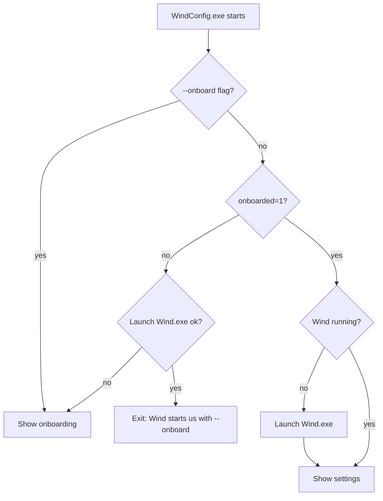
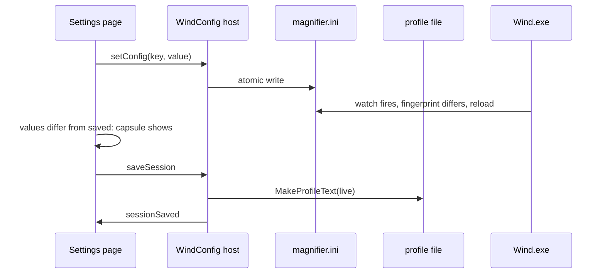

# 09. The settings UI

Settings run in `WindConfig.exe`, a thin C++ WebView2 host (`src/config_ui/main.cpp`) that loads
a built Svelte app from `ui/dist/`. It talks to the core only through `magnifier.ini`
([08](08-config-profiles.md) explains why). This chapter covers the host, the bridge, the
schema-driven app, the session model, the tray menu page, profiles, themes, onboarding,
accessibility and testing.

## The host

`wWinMain` enforces one instance (`WindConfig_SingleInstance`; a second launch focuses the
window), picks settings or onboarding mode, creates a frameless `WS_POPUP` with its own hit-testing
(the page's `app-region: drag` CSS drives dragging) and starts WebView2.

- **The WebView2 user-data folder is explicit**: `%LOCALAPPDATA%\Wind\WebView2`. The default, next
  to the exe, is read-only in Program Files; environment creation then fails and the window paints
  empty.
- **The UI is served from a virtual host**: `https://wind.config/` maps onto `<exeDir>\ui\dist`
  (`?mode=onboard` for onboarding). A missing WebView2 Runtime is logged, explained in a message
  box, and the process exits.
- **Crash recovery.** RTSS's global hook can crash the WebView2 browser process at start (it reads
  a `dxgi.dll` that WebView2 already unloaded). On `ProcessFailed` the host recreates the engine,
  at most 3 times a minute (`src/config_ui/webview_recover.h`), and hands back the page's unapplied
  edits.
- **Watchdog.** A 1 s timer closes Settings when Wind is gone. `ShouldCloseOnWindGone`
  (`src/config_ui/wind_watchdog.h`, pure) requires Wind to have been seen running first and two
  consecutive misses. The probe is a Toolhelp process-name scan, because a mutex open or process
  wait can be access-denied against a UIAccess process. The same timer notices a profile switched
  from the tray and pushes the new list.

```mermaid
flowchart TD
  A[WindConfig.exe starts] --> B{--onboard flag?}
  B -->|yes| O[Show onboarding]
  B -->|no| C{onboarded=1?}
  C -->|no| D{Launch Wind.exe ok?}
  D -->|yes| E[Exit: Wind starts us with --onboard]
  D -->|no| O
  C -->|yes| F{Wind running?}
  F -->|no| G[Launch Wind.exe] --> S[Show settings]
  F -->|yes| S
```

Settings never runs without the magnifier and never shows over a config that has not been
onboarded.

## The bridge

The page posts JSON with `window.chrome.webview.postMessage`; `HandleWebMessage` is the
authoritative message list, and `ui/src/bridge.js` mirrors it (request/reply pairs become
promises). The host's JSON escaping covers every control character: one unescaped newline makes
the reply invalid and the page waits forever.

| Message | Kind | Effect |
|---|---|---|
| `getConfig` | reply `config` | Every live key and value, plus the saved profile values, and `runningModel` (the engine the live Wind loaded, from `%LOCALAPPDATA%\Wind\running.model`; absent when Wind is not running, then the page uses the ini). An ini that exists but cannot be read gets `configUnreadable` instead, and the page asks again (never an empty ini shown as all defaults) |
| `setConfig` | fire | Atomic write of one key to the live ini |
| `setConfigPersist` | fire | Same, and the key in the active profile file (keybind captures) |
| `saveSession` | reply `sessionSaved` | Write `MakeProfileText(live)` over the profile |
| `discardSession` | reply `config` | Rewrite the live ini from the profile |
| `ready` | fire | Two frames after mount; the host logs launch-to-paint |
| `window` | fire | `minimize`, `maximize` (toggles restore), `close`, `quitWind`, `restartWind` (writes `session.keep` first) |
| `dirty` | fire | Unsaved flag, so `WM_CLOSE` can prompt |
| `openIni` | fire | Open `magnifier.ini` in the `.ini` handler or Notepad |
| `exportDiagnostics` | fire | Zip `%LOCALAPPDATA%\Wind\logs` to the Desktop on a worker thread (the window stays responsive; a repeat click while it runs is ignored), then reveal it in Explorer |
| `pickExe` | reply `exePicked` | File picker; replies with the bare exe name, because app lists match by name |
| `switchProfile`, `createProfile`, `deleteProfile` | reply `profiles` | Every reply carries the full `{names, active}` |

- An unsolicited `profiles` message (tray switch) is marked `push:true`, so it is never taken for a
  pending reply.
- Profile names from the bridge become file paths, so the host validates each with
  `ProfileNameError` first.

## The schema-driven app

The page is generated from `groups` in `ui/src/settings-schema.js`. A row may carry `showIf` (hidden
unless another setting has a value), `offIf` (kept in place but dimmed and inert while another
setting has a value: Release glide while the high resolution cursor is on) and `tag` (a small label
after the name: High resolution cursor is tagged Experimental). Six groups: Hotkeys, Zoom,
View, then below a divider Preferences (with the Screen light card), Tray menu and About. Each group has a label, an
icon, a banner description and cards of rows; each row names its ini key, type, label, description
and default. `Settings.svelte` is the shell (title bar, sidebar, banner, save capsule, search), and
`controls/SettingRow.svelte` renders every row by type:

| Type | Widget | Notes |
|---|---|---|
| `keybind` | `controls/Bindings.svelte` (onboarding uses `lib/KeybindCapture.svelte`) | State lives in sibling keys (`buttonKey`, `vkKey`, `modsKey`); zoom rows take two slots |
| `toggle` | `controls/Toggle.svelte` | `1`/`0` |
| `slider` | `controls/Slider.svelte` | `min`, `max`, `step`, `unit` (also `aria-valuetext`) |
| `select` | `controls/Select.svelte` | `options` + `optionLabels` |
| `applist` | `controls/AppList.svelte` | One comma-separated string of exe names |
| `highres` | `controls/HighRes.svelte` | High resolution cursor + MPO, with its UAC and restart step |
| `engine` | `controls/EngineRow.svelte` | `model`; applies on an inline Restart Wind button |
| `palette` | `prefs/ThemePicker.svelte` | Four mini window cards; writes `uiPalette` |
| `profiles` | `prefs/ProfilePicker.svelte` | Dropdown plus New |
| `button`, `about` | `SettingRow`, `controls/About.svelte` | Actions and the logo |

- **Advanced rows** (`adv: true`) show inline while the global `showAdvanced` key is on
  (Preferences > Show advanced settings). Search always finds them.
- **`showIf: {key, eq}`** hides a row unless another key has that value; the per-category engine
  rows show only while `model` is `hybrid`.
- **Removed from the UI is not removed from the product.** Many keys have no row (quick zoom
  setup, outline, `bilinear`, `sharpness`, `multiMonitor`, the `tx*` knobs). The core still parses
  them, and Open settings file is the way to edit them.
- Adding a setting is normally a schema row plus a `ParseConfig` entry.
- Copy rules (in the schema header): plain language, no toggle label starting with "Enable", no
  description that restates its label.

**Search** (`ui/src/search/`). `search.js` is a pure ranker: label exact, word prefix, substring
or fuzzy (one typo for 4–7 letters, two for 8+), then the row's `keywords`, description, card and
group. Every query word must match. The result is one ranked list; each hit renders with the real
`SettingRow`, so it is edited in place. Every labelled row carries `keywords`, and a test enforces
it. The tray item lists are not schema rows and are not searchable.

**Visual tokens** live in `ui/src/design/tokens.css`, taken from
`docs/design/settings-2026-10/FINAL-v10-grey.html` (reference render `FINAL-reference.png`).

## Session model

The live ini is the session and the profile file is the saved state ([08](08-config-profiles.md)).

- Every change writes the live ini at once (`setConfig`) and the core hot-reloads it.
- Save writes the session into the profile; Discard rewrites the live ini from it.
- The page derives the Save capsule from `changedKeys(values, saved)` (`ui/src/session.js`, pure,
  defaults filled on both sides). The C++ twin is `SessionDiffers`.
- Keybind captures use `setConfigPersist`, so a capture survives Discard. Onboarding's keys use it
  too: the core seeds `Default.ini` before onboarding, so a live-only write would open Settings
  dirty and be dropped by the next plain start.
- The ini is shared with the tray flyout and hand edits, so the page re-reads it when the window
  regains focus and after a `configWriteFailed`, and reloads only if something differs.
- Global keys are written directly and never count as unsaved.
- **Prompts** (`ui/src/prompts/Prompt.svelte`, focus-trapped by `lib/dialog.js`): closing with
  unsaved changes offers Save, Discard or Keep for this session; switching profile offers Save,
  Discard or Cancel. Tray Quit decides from the files (`ConfirmQuit` in
  `src/tray_app/tray_menu.cpp`), even with Settings closed.

**Engine and MPO keep special handling.** `model` is read once at launch, so the engine row writes
the ini, then `restartWind` writes `session.keep` and starts `Wind.exe`, which evicts the old
instance. On `restartFailed` the page reverts the row and the ini. MPO is a registry value, and
`highres` tracks three states that must not be conflated: `mpoLive` (registry), `mpoStaged` (what
the toggle shows) and `mpoBoot` (what DWM loaded, the only honest basis for "restart required").

```mermaid
sequenceDiagram
  participant S as Settings page
  participant H as WindConfig host
  participant I as magnifier.ini
  participant P as profile file
  participant W as Wind.exe
  S->>H: setConfig(key, value)
  H->>I: atomic write
  W->>I: watch fires, fingerprint differs, reload
  S->>S: values differ from saved: capsule shows
  S->>H: saveSession
  H->>P: MakeProfileText(live)
  H->>S: sessionSaved
```

## Tray menu page

`ui/src/tray/TrayMenuPage.svelte` (list logic in `trayModel.js`, mirroring `src/tray_items.*`). A
toggle turns the Performance header on; two cards, Sliders (up to 4) and Toggles, list the eligible
items with a drag handle, icon, name, description and a check button. Rows reorder inside their
card by pointer drag, or with the keyboard: Space to pick up and drop, arrows to move. The keys are
global, not profile keys. Spec:
[../specs/2026-10-01-tray-flyout-design.md](../specs/2026-10-01-tray-flyout-design.md).

## Pin to taskbar

The Preferences row `trayPinned` (General card, default on) keeps WindTray's icon on the taskbar
next to the clock instead of in the hidden-icons overflow. The page only writes the ini key; it is
global and UI-only (`StripUiOnlyKeys`, `IsGlobalProfileKey`), so it never reloads the core and never
travels with a profile. WindTray applies it (`src/tray_app/main.cpp`, `tray_pin.*`):

- At startup right after `AddIcon`, after an Explorer restart (`TaskbarCreated`), and whenever the
  ini changes. The tray watches the ini folder with `FindFirstChangeNotificationW` as a second wait
  handle of its message loop; a 300 ms debounce timer then re-reads `trayPinned` and applies only
  when the value changed.
- Windows keeps one registry key per icon: `HKCU\Control Panel\NotifyIconSettings\<id>` with
  `ExecutablePath` (plain, or `{known-folder GUID}\rest` such as `{6D809377-...}` =
  FOLDERID_ProgramFilesX64), `UID` (the `NOTIFYICONDATA` uID, Wind uses 1), `InitialTooltip` and
  `IsPromoted` (DWORD, 1 = taskbar, 0 or absent = overflow). WindTray touches only the entry whose
  expanded `ExecutablePath` equals its own module path (case-insensitive) and whose `UID` is 1;
  entries of other builds stay as they are. The matching is pure and tested
  (`tray_pin_logic.cpp`, `tests/test_tray_pin.cpp`).
- Explorer creates the entry only after the icon is first added, so on a first run the write retries
  once a second for up to 12 s. Explorer applies a changed `IsPromoted` within about a second.
- Wind re-applies the value at each tray start, so it overrides an unpin made in Windows Settings while
  the row is on.

Source: tested on this machine (Windows 11 26200), 2026-10-10: toggled `IsPromoted` 0 and 1 and
checked the icon position through UI Automation. The key is undocumented by Microsoft.

## Profiles

The Profile row (`prefs/ProfilePicker.svelte`) is a dropdown plus New. Each profile except the last
one and Default has a delete button with a confirm prompt. New
(`prefs/NewProfileDialog.svelte`) takes a name (checked by `prefs/profileName.js`, the host's rules)
and offers New (defaults) or Duplicate current; Enter duplicates. Rename and duplicate have no UI.

- Operations that replace the live settings (switch, new from defaults, deleting the active
  profile) go through the unsaved-changes prompt.
- Duplicate current sends `createProfile` with `fromCurrent: '1'`; the host builds the profile from
  the live text, so nothing is written back by the page and nothing is left unsaved.
- After a mutation the page reloads the config before checking `ok`: a failed operation can still
  have rewritten the live ini.

## Themes

- **Always dark.** There is no light mode or Mode row; `uiTheme` is an ignored legacy key, still
  global and UI-only so old inis load.
- **`uiPalette`** (global, UI-only): `grey`, `ember`, `ocean`, `hicon` (High contrast, always
  last). Unknown ids read as `grey`. `Settings.svelte` sets `data-palette` on the root, and
  `ui/src/design/themes.css` holds one token block per theme over `tokens.css`.
- `themes.css` and `design/themes.js` are generated by `ui/tools/gen-themes.cjs`, and the tray's
  `src/tray_app/flyout_palettes.h` by `ui/tools/gen-flyout-palettes.cjs`. Edit the generators, not
  the output.
- Components use tokens (`--sel`, `--onfill`, `--focus`, `--danger*`, `--scrim`, the radii), never
  fixed colours.
- WindConfig's pre-paint window colour follows `uiPalette` (`ThemeBackground` in
  `src/config_ui/main.cpp`); update it when a theme is added.

## Onboarding

`App.svelte` routes on `?mode=onboard`. `Onboarding.svelte` has three steps: the intro animation,
zoom-key capture (the same `KeybindCapture`, writing live) and done.

- On mount it clears the zoom keys in the ini, because an earlier abandoned onboarding may have
  written real ones.
- Finishing or skipping writes `onboarded=1` and switches to Settings in place. Closing the window
  sends `quitWind`: a user who abandons setup has not opted into a magnifier in the tray.

## Accessibility

Labels and descriptions are sibling elements of their controls, so naming is wired once in
`SettingRow.svelte`: controls get `aria-labelledby` pointing at the row label, and controls whose
text is their value (select, keycap, app list) list both label and value.

- One polite `aria-live` region announces changes that do not move focus (engine restarts,
  Save/Discard, profile switches).
- Sidebar navigation moves focus to the section heading.
- Every modal uses `lib/dialog.js` (focus trap, Escape, focus restore).
- `ui/tests/a11y.spec.js` asserts against the accessibility tree, including "no unnamed controls".

## Testing

`ui/tests/` holds 12 Playwright specs that run the real app in Chromium with a fake
`window.chrome.webview` installed by `addInitScript`. The mock answers `getConfig` with a live and
a saved snapshot, records every message in `window.__msgs`, and simulates host failures:
`__restartFail`, `__mpoOk = false`, `__profileFail`, `__pick`. Run `npx playwright test` in `ui/`
(Playwright starts the Vite server). CI runs only the doctest suite; the UI suite is the local gate
for UI changes. The host's own pure logic is compiled into the doctest build instead.

Specs: [../specs/2026-05-27-config-ui-polish-onboarding-design.md](../specs/2026-05-27-config-ui-polish-onboarding-design.md),
[../specs/2026-08-12-profiles-design.md](../specs/2026-08-12-profiles-design.md),
[../specs/2026-10-01-settings-redesign-design.md](../specs/2026-10-01-settings-redesign-design.md).
