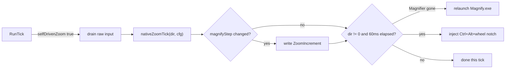
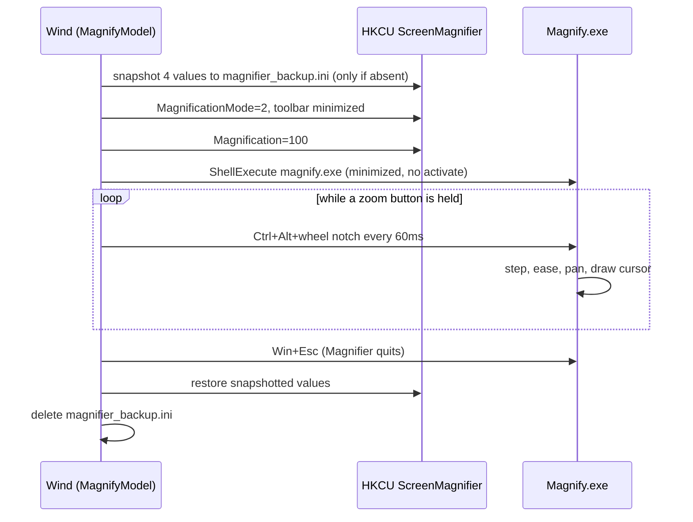
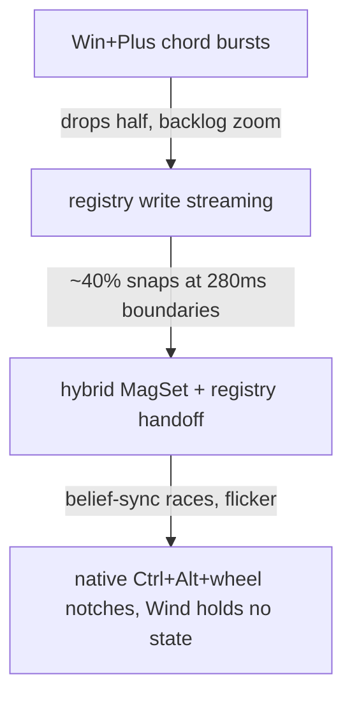

# 10. The magnify model

`model=magnify` is Wind's DRM-safe fallback: instead of magnifying pixels itself, Wind launches
the native Windows Magnifier (Magnify.exe) and drives it the way a user would, by injecting its
own keyboard shortcut. DRM-protected video (Netflix and friends) blanks under the render model's
Desktop Duplication capture, but Magnifier's DWM-internal fullscreen transform magnifies it fine.
The model's defining trait is maximum simplicity, arrived at the hard way: three smarter designs
were implemented, measured, and deleted in a single day (issue #146), and the survivor is the one
where Wind holds no zoom state at all.

## Why this model exists

The render model (chapter [Engines](03-engines.md)) captures the desktop with DXGI Desktop
Duplication and re-presents it magnified. Protected-content surfaces are excluded from that
capture by the OS, so a magnified Netflix window is a black rectangle. Windows Magnifier does not
capture anything: it asks DWM to scale its own composition output, which includes protected
surfaces. Wind's transform model uses the same DWM channel, but it is Wind's own machinery with
Wind's own trade-offs; the magnify model instead delegates everything, view, panning, easing,
cursor drawing, to the OS implementation, and keeps Wind's job down to "press the buttons".

The result is a model with almost no code. `src/magnify_model.h` stubs out nearly the entire
`IMagnifierModel` surface: `hideSystemCursor`, `setActive`, `onActivate`, and `present` are empty
bodies, because Magnifier owns the view and the cursor and Wind's overlay never activates.
`supportsInspect()` returns false (there is no frozen-cursor reticle to draw when another process
owns the magnified view; `RunTick` in `src/main.cpp` logs "Inspect not available in the magnify
model" and ignores the toggle). `coversShell()` returns true, since Magnifier magnifies the Start
menu and taskbar natively, something Wind's own overlay only manages in the banded UIAccess
configuration.

## selfDrivenZoom: bypassing the whole level pipeline

The one non-trivial hook is `selfDrivenZoom()` on `IMagnifierModel` (`src/magnifier_model.h`).
When it returns true, `RunTick` (`src/main.cpp`) takes an early exit before any of the level
machinery runs: the `ZoomController` stays pinned at 1x, the overlay never activates, quick zoom,
recenter, the `CursorMapper`, and Inspect never execute. Instead, every tick, `RunTick` drains the
raw-input accumulator (so mickeys never pile up) and calls
`nativeZoomTick(dir, cfg)` with the held direction: `+1` while a zoom-in button is held, `-1` for
zoom-out, `0` when idle. That single signed integer is the entire interface between Wind's input
system and the magnify model.

This is a deliberate inversion of how the other models work. Render and transform receive a
smooth, ramped level from the `ZoomController` and are told exactly what to show. The magnify
model receives only intent, because Magnifier cannot be told a level, it can only be nudged, and
every attempt to keep Wind's idea of the level synchronized with Magnifier's lost a race (see the
dead-end ledger below).

**Per-tick flow: RunTick hands raw intent to the model, Magnifier does the rest**

## nativeZoomTick: the wheel-notch drive

`MagnifyModel::nativeZoomTick` (`src/magnify_model.cpp`) does three things:

1. **Live-apply `magnifyStep`.** The ini key `magnifyStep` (parsed and clamped to 5..400 in
   `src/config.cpp`, matching Windows Settings' own range; default 50) maps directly to
   Magnifier's `ZoomIncrement` registry value under
   `HKCU\Software\Microsoft\ScreenMagnifier`. It is written only on change (`lastStepPct_`
   dedupes), so adjusting the step in the settings UI takes effect on the next notch without a
   restart. Note a comment-versus-code drift inside `magnify_model.cpp` itself: the comment above
   `kSnapshotValues` says the model "deliberately does NOT touch ZoomIncrement", which described
   an earlier revision; the code both writes it here and snapshots it for restore, and the code is
   the truth.
2. **Gate the cadence.** Notches are injected at most every 60 ms (`kNotchIntervalMs`). This
   number is measured, not guessed: at 60 ms spacing, Magnifier registers notches 1:1 with no
   backlog and the view settles about 150 ms after the last one (probe 7 in the spec's amendment
   trail). Faster is unmeasured territory; slower feels sluggish.
3. **Inject one notch.** `InjectZoomNotch` sends a single `SendInput` batch: Ctrl down, Alt down,
   one wheel event (`WHEEL_DELTA` signed by direction), Alt up, Ctrl up. Ctrl+Alt+wheel is
   Magnifier's own wheel-zoom shortcut and the only injection channel that works: injected
   Win+wheel is completely inert (measured), and Win+Plus chord bursts drop about half their
   events. The modifiers are held only for the microseconds around the wheel event so they can
   never leak onto the user's concurrent clicks or keystrokes.

Magnifier does everything downstream of the notch natively: it steps by `ZoomIncrement`, eases
each step with its own animation, pans to follow the mouse, and draws the cursor. Wind never
reads the resulting level and never needs to.

If the user manually closed Magnifier mid-session, `nativeZoomTick` detects it (the `MagUIClass`
window vanishes, checked by `MagnifierWindowPresent`) and relaunches it instead of injecting into
nothing, with a 2-second backoff (`lastLaunchMs_`) so the launch has time to appear.

## The keyboard hook must skip injected events

Wind's own low-level keyboard hook (chapter [Input](06-input.md), `src/input_router.cpp`)
swallows bound keys so they never double-fire into the focused app. In magnify mode that would be
self-defeating: NumPad +/- and other keys Wind injects as part of its chords are bindable zoom
keys, so the hook could swallow Wind's own Ctrl/Alt/Esc injections before they reach Magnifier.
`main.cpp` therefore calls `g_input.setIgnoreInjectedKeys(true)` right where the `MagnifyModel`
is constructed; the hook then passes through any event carrying `LLKHF_INJECTED`. The mouse hook
never inspects wheel events, so the injected wheel notch needs no such exemption.

## Lifecycle: initialize, run, shutdown

**Session lifecycle: snapshot first, restore last, survive crashes in between**

`MagnifyModel::initialize` first writes a one-shot snapshot of the user's Magnifier settings to
`%LOCALAPPDATA%\Wind\magnifier_backup.ini` (`ResolveBackupPath`; the same per-user directory the
ini fallback and logs use, never next to the exe, since Program Files is read-only for the
non-admin runtime). The snapshot covers exactly the values the model modifies: `Magnification`,
`MagnificationMode`, `MagnifierUIWindowMinimized`, and `ZoomIncrement` (`kSnapshotValues`). Two
details make it crash-safe:

- **It is written only if the file does not already exist.** If a previous Wind crashed before
  restoring, the old snapshot still holds the user's real values; re-snapshotting now would
  capture Wind's own writes as if they were the user's, and the eventual restore would "restore"
  Wind's values. Keeping the stale file means the next clean shutdown restores correctly no
  matter how many crashes happened in between.
- **Absent values are recorded as -1** and skipped on restore rather than invented.

After the snapshot, initialize preps Magnifier's startup-read settings, fullscreen mode
(`MagnificationMode=2`) and toolbar minimized, then launches Magnify.exe via `launchMagnifier`,
which writes `Magnification=100` first so Magnifier never launches into a leftover zoom level
from a previous native session. The launch uses `SW_SHOWMINNOACTIVE` so it does not steal focus.

`MagnifyModel::shutdown` (called on Wind quit and on a model swap) injects Win+Esc, Magnifier's
own quit shortcut, via `InjectWinChord` (the vk press inside the chord keeps the Win tap from
opening the Start menu), then replays the snapshot into the registry and deletes the backup file.
Only after a successful restore is the crash insurance consumed. This restore path is also why
the installer's upgrade flow must let Wind exit cleanly rather than `taskkill` it (see the
installer notes in the project `CLAUDE.md`): a killed process never runs this restore.

## The dead-end ledger: do not re-attempt

The shipped design is amendment 3 of the spec
([2026-07-22-magnify-model-design.md](../superpowers/specs/2026-07-22-magnify-model-design.md)),
and the spec preserves the full measurement trail. The conclusions, all field-measured on this
rig, are load-bearing enough to restate here, because each earlier design looks obviously better
on paper:

| Attempt | What happened (measured) |
| --- | --- |
| Injected Win+Plus/Minus chord bursts | Magnifier drops roughly half of a rapid burst (10 chords at 5 ms -> ~5 applied) and animates each survivor: the zoom lagged Wind's ramp 4-5x and kept zooming for seconds after release from the queued backlog. |
| Streaming `Magnification` registry writes per tick | Magnifier consumes registry changes at ~280 ms animation-window boundaries; writes arriving faster degenerate into instant ~40% snaps at each boundary. ONE write eases beautifully over ~280 ms, that part is real, but a stream cannot ride it. |
| Hybrid: Wind drives `MagSetFullscreenTransform` during ramps, hands off to one registry write at settle | Glass smooth mid-ramp and the transform sticks while Magnify.exe runs, but Magnifier stomps its stale belief within ~7 ms of any wake with queued mouse moves, and its registry handler animates from a stale cached actual for writes queued while suspended. Every resume/sync ordering tried still flickered or released at a racy level. Suspending Magnify.exe mid-ramp is latency-safe but did not fix the belief races. |

Two standalone registry traps from the same probes, encoded so no future code path relies on the
opposite:

- `Magnification` writes above 1600 are **silently ignored**, not clamped. Any writer must clamp
  itself.
- A same-value `Magnification` write **fires no change notification**. No design may depend on a
  redundant write making Magnifier act. (This is also why `nativeZoomTick`'s
  write-`ZoomIncrement`-on-change-only dedupe is safe rather than merely tidy.)

The evolution, compressed:

**Design evolution: each smarter drive was measured dead before the dumb one shipped**

If you are tempted to make the magnify model smoother, the burden of proof is a new measurement
that invalidates one of the rows above, not a cleaner-looking implementation of the same idea.

## What the model deliberately does not do

Because Magnifier owns everything visual, most Wind features are documented no-ops here: no
cursor hide or drawn cursor, no cursor-sensitivity scaling, no Inspect mode, no zoom outline, no
quick zoom, no multi-monitor retarget (`main.cpp` gives the model the primary monitor and notes
the targeting is a no-op), and no participation in the hybrid model's engine picking, `magnify`
is only ever an explicit `model=` choice, never auto-selected. The settings UI shows only the
rows relevant to the active model, so `magnifyStep` is the model's one user-facing knob. Recent
transform/render work (the `txMaxStepPct` write cap, `lockApps`, the `warpLock` lock tells)
likewise never touches a magnify session; the model's isolation from the level pipeline is what
keeps it immune to churn in the other engines.

One historical note to avoid confusion when reading old issues: the magnify model originally
**replaced** the transform model (the spec above is titled accordingly), and the transform model
was later revived as a first-class engine for issue #148. There is no aliasing between them: a
`model=transform` ini value runs the real transform model, and missing or unknown values fall
back to `hybrid`.

## Pointers

- `src/magnify_model.h` / `src/magnify_model.cpp`, the entire model.
- `src/magnifier_model.h`, the `IMagnifierModel` interface, including `selfDrivenZoom` and
  `nativeZoomTick`.
- `src/main.cpp`, the `selfDrivenZoom` early exit in `RunTick` and the
  `setIgnoreInjectedKeys(true)` call at model construction.
- `src/input_router.h`, `setIgnoreInjectedKeys` and the injected-event skip.
- `src/config.cpp` / `src/config.h`, `magnifyStep` parsing and clamping.
- Spec with the full measurement trail:
  [2026-07-22-magnify-model-design.md](../superpowers/specs/2026-07-22-magnify-model-design.md).
- Related chapters: [Engines](03-engines.md) for the render/transform/hybrid models this one
  falls back from, [Input](06-input.md) for the hook architecture the injected events must pass
  through.
