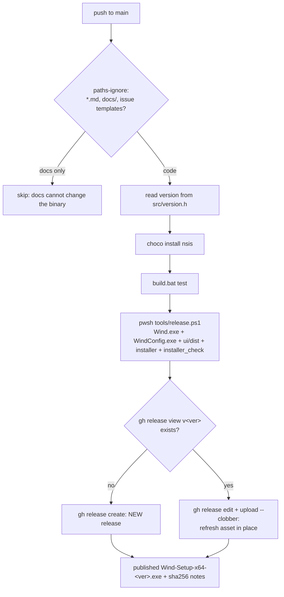

# 11. Build, test, release

Wind builds with a single batch script, tests with a desktop-free doctest binary plus a Playwright suite for the settings UI, and ships through an NSIS installer that GitHub Actions rebuilds and republishes on every push to `main`. This chapter covers the build targets, the test philosophy (what is pure and why), the signing and UIAccess deploy flow for local testing, the installer's elevation traps, and the release automation and the incident that made it mechanical.

## build.bat targets

Everything native goes through `build.bat` at the repo root. It locates MSVC via vswhere, calls `vcvars64.bat`, then dispatches on its first argument:

| target | output | what it is |
|---|---|---|
| (none) | `Wind.exe` | the normal app: `uiAccess=false` manifest (`Wind.manifest`), runs from anywhere |
| `test` | `wind_tests.exe` | the doctest binary over the pure-logic sources; runs it and returns its exit code |
| `check` | (none) | compile-only pass over `src\*.cpp`, no link; catches type errors fast |
| `uiaccess` | `Wind.exe` | same app with `Wind.uiaccess.manifest` (`uiAccess=true`) and `/DWIND_UIACCESS`; only useful signed and in Program Files |
| `config` | `WindConfig.exe` | npm-builds the Svelte app under `ui/` to `ui/dist/`, then compiles `src/config_ui/main.cpp` against the vendored WebView2 SDK (`third_party/webview2`) |
| `installer` | `dist\Wind-Setup-x64-<ver>.exe` | compiles `installer\wind.nsi` with makensis `/WX` and runs `tools\installer_check.ps1` |

One toolchain wrinkle worth knowing before it costs you an hour: this machine runs VS 2026 Community on a prerelease channel, and `vswhere -latest` does not find prerelease installs. `build.bat` therefore calls vswhere with `-all -prerelease` and captures the path via a temp file rather than a `for /f` loop (a quoted path containing `(x86)` breaks cmd's parser). If you ever rewrite the locator, keep both workarounds.

The installer target treats NSIS warnings as failures (`/WX`). The compiler already aborts on a missing `File` source, but it only warns about an unreferenced define or a shadowed function, and in an installer built from generated rectangle data those warnings are exactly how a page ends up wired to nothing.

## The test philosophy: pure vs Win32

Wind's core rule is that anything with real logic in it compiles without `<windows.h>`. The `test` target builds `tests\*.cpp` plus only the pure sources, with `/DWIND_TESTS` and `/I third_party` for the vendored `third_party/doctest.h` (`tests/test_main.cpp` is nothing but `DOCTEST_CONFIG_IMPLEMENT_WITH_MAIN`). The current pure set, straight from `build.bat`:

`src/transform.cpp`, `src/zoom_controller.cpp`, `src/config.cpp`, `src/profiles.cpp`, `src/cursor_mapper.cpp`, `src/lock_detector.cpp`, `src/cursor_lock.cpp`, `src/mouse_ballistics.cpp`, `src/crosshair.cpp`, `src/config_ui/ini_edit.cpp`, `src/logging.cpp`.

On top of those, a number of pure header-only modules ride into the tests through their test files: `src/engine_pick.h` (the hybrid model's engine decision), `src/drag_follow.h`, `src/hdr_scale.h`, `src/inspect_focus.h`, `src/config_ui/wind_watchdog.h`, and others. The `tests/` directory has one file per module (`test_transform.cpp`, `test_engine_pick.cpp`, `test_profiles.cpp`, ...), so when you add a pure module you add its test file and, if it is a `.cpp`, append it to the `:test` source list in `build.bat`.

Why this split matters: the magnifier itself cannot be driven headlessly (it needs a desktop, a GPU, and a real cursor), so the unit tests are the only verification loop that runs everywhere, including CI. Anything testable therefore has to live on the pure side. The Win32 half (`src/render_engine.cpp`, `src/input_router.cpp`, `src/transform_model.cpp`, `src/tray.cpp`, `src/main.cpp`) is kept as thin as the OS allows and is verified by deploying and using it (see the deploy section below).

Some files straddle the line, and the pattern for those is an `#ifndef WIND_TESTS` block. `src/config.cpp` is the canonical example: the parsing half (`ParseConfig`, `IsForbiddenBindVk`, `StripUiOnlyKeys`) is pure and fully tested in `tests/test_config.cpp`, while `LoadConfig` and the default-ini writer live below `#ifndef WIND_TESTS`, which is where the file's only `#include <windows.h>` sits. `src/logging.cpp` uses the same split (pure formatting helpers above, the Win32 file backend below, both halves labeled in `src/logging.h`). If you add file or OS access to a pure file, put it under the guard or the test build stops compiling desktop-free, which is the point of the guard.

A recent example of logic deliberately pushed to the pure side: `StripUiOnlyKeys` (src/config.cpp) removes `uiTheme`, `showAdvanced`, and `onboarded` from ini text so `main.cpp`'s hot-reload can fingerprint whether a change is core-relevant. Before it existed, flipping the settings UI theme rewrote the ini, the core saw "config changed", and a live zoom session collapsed. The fingerprint is string-in string-out, so it got tests instead of a field regression the second time around.

### The UI suite: Playwright with a webview mock

The Svelte settings app has its own suite under `ui/tests/` (`settings.spec.js`, `onboarding.spec.js`, `a11y.spec.js`), run with `npm test` inside `ui/` (`ui/playwright.config.js` starts the Vite dev server on port 5173 itself, so it is one command).

The app's only channel to the C++ host is `window.chrome.webview.postMessage` plus a message listener, so the tests do not need WebView2 or the host at all: a `page.addInitScript` in each spec's `beforeEach` installs a fake `window.chrome.webview` that answers `getConfig`, records `setConfig` calls into `window.__sets`, and stands in for the host's native surfaces (the `pickExe` file picker, the `mpoState`/`setMpoDisabled` registry bridge, the six profile file operations). Test knobs like `window.__profileFail` and `window.__restartFail` force the failure replies the real host can produce. When you add a bridge message to `HandleWebMessage` in `src/config_ui/main.cpp`, extend the mock in the same change, otherwise the new UI path is untestable and the suite drifts from the host contract.

One trap documented in the mock itself: rows marked `advanced: true` or carrying a `showIf` condition never render unless the mock config enables them (`showAdvanced: '1'`, `model: 'render'`), and a test asserting on a hidden row times out with no useful error. Set the gating keys in the mock config, not in the test body.

## Signing, UIAccess, and the deploy loop

The `uiaccess` build exists because a few features need the UIAccess privilege: the opt-in band-16 overlay z-order (issue #162), keybinds over elevated windows, and the transform model's `MagSetInputTransform` publish that fixes desktop hover dead zones (see [Engines](03-engines.md) and ../POINTER-HITTEST-FINDINGS.md). Windows only grants UIAccess to a binary that is Authenticode-signed with a locally trusted certificate AND runs from a secure location, in practice `C:\Program Files\Wind`. An unsigned `uiaccess` build, or a signed one launched from the repo, silently gets no privilege, and `transform_model.cpp` then probes `TokenUIAccess` at init and disables the desktop-transform pick, so the app degrades rather than breaks.

`tools/uiaccess_setup.ps1` is the whole local flow in one elevated script: it stops any running Wind/WindConfig, runs `build.bat uiaccess` and `build.bat config`, finds or creates a self-signed "Wind Dev Test Cert" in `Cert:\LocalMachine\My`, trusts it (Root + TrustedPublisher), signs both exes (WindConfig.exe needs no UIAccess but an unsigned fresh build trips a Defender Wacatac false positive and gets quarantined, issue #86), and copies `Wind.exe`, `WindConfig.exe`, and `ui\dist` to Program Files. It deliberately does NOT deploy a `magnifier.ini`: the app resolves its ini to `%LOCALAPPDATA%\Wind\magnifier.ini` via `wind::ResolveIniPath` (src/config_path.h) because Program Files is read-only for the non-admin processes, and the script removes any stale Program Files copy. It transcript-logs to `tools\uiaccess_setup.log`; verify a deploy by checking that log for `status=Valid` and `DONE`.

Two rules around the script:

- Run it elevated with an ABSOLUTE `-File` path. The elevated process starts in System32, so a relative `tools\...` path silently launches nothing.
- Launch the deployed copy from a NORMAL, non-elevated shell (`Start-Process "C:\Program Files\Wind\Wind.exe"`). UIAccess is an integrity-level elevation that the loader applies at process start; launching from an elevated shell gives you an admin token instead, which changes which `%LOCALAPPDATA%` the app resolves and does not test what users run.

Project standing rule (CLAUDE.md, "Deploy for testing"): any change with a runtime surface gets deployed this way so it can actually be verified. The magnifier has no headless mode; deploying IS the verification loop for the Win32 half.

## The installer

The installer is NSIS with a fully custom-drawn UI: a looping video background decoded frame-by-frame through GDI+ with alpha-blended overlay screens on top, modeled on Prism's installer. `installer/README.md` explains the piece-by-piece layout (`wind.nsi` entry point, `app.nsh` for the Wind-specific logic, `over.html` as the single source of copy, the `make-over.mjs`/`make-loop.mjs` generators); the design spec is [2026-08-20-installer-design.md](../superpowers/specs/2026-08-20-installer-design.md). There is intentionally no install-location chooser: UIAccess is only granted in a secure location, so an install to `D:\Apps\Wind` would silently disable the features the per-machine install exists for.

Three elevation traps live in `installer/app.nsh` and are worth internalizing, because each one was measured the hard way:

1. **HKCU and `%LOCALAPPDATA%` belong to the wrong user under elevation.** The installer runs elevated, and an elevated process's HKCU is whichever hive the elevated TOKEN owns, an admin account's whenever a standard user elevated with different credentials. Autostart therefore goes in HKLM `...\CurrentVersion\Run`, never HKCU.
2. **Launch through explorer.exe, not `Exec`.** A plain `Exec` at the end of setup hands Wind the ADMIN token, and `ResolveIniPath()` then puts the ini, profiles, and logs in the administrator's profile where the user never finds them. `Exec '"$WINDIR\explorer.exe" "$INSTDIR\Wind.exe"'` hands the launch to the running shell, which owns the user's token (rig-probed both ways: plain launch = elevated, via explorer = not).
3. **Upgrades stop Wind by asking, not killing.** The `WIND_QUIT_RUNNING` macro sets Wind's auto-reset quit event (`Local\Wind_QuitRequest`, opened in `src/main.cpp`) so Wind exits CLEANLY: only the clean path restores the OS cursor, releases any ClipCursor, releases the shared Magnification runtime, and restores the native-Magnifier registry backup. The macro then waits on the single-instance mutex (`Local\Wind_Magnifier_SingleInstance`) as a fast first signal, but the mutex comes free ~3 ms into teardown, well before the process is gone, so it also polls tasklist for the PROCESS before falling back to `taskkill` for a Wind that ignored the request. Killing between "mutex released" and "shutdown finished" is exactly the damage the event exists to avoid.

`build.bat installer` finishes by running `tools/installer_check.ps1`, a gate for what a compile cannot see: every `File` source exists (including `/nonfatal` ones NSIS skips silently), every control rectangle the screens hit-test was actually generated into `over.nsh` (renaming a `data-a` attribute in `over.html` compiles fine and then clicks against nothing), and a silent install/uninstall round-trips. The round-trip check needs elevation and skips itself from an ordinary shell; CI's runner is administrator, so there it really executes.

## Release automation

Releases are owned by `.github/workflows/release.yml` and are mechanical on purpose. The reason is the v0.1.0 staleness incident, written into the workflow's own header comment: v0.1.0 shipped, the #209 fix landed on `main`, and the release kept serving the old installer. That stale build was then installed over the dev box and silently removed a working fix whose branch was unmerged. The lesson became two standing rules: every push to `main` that can change the binary republishes the installer, and nothing deployed locally is safe until it is on `main`.

**CI pipeline, push to published installer:**

The moving parts:

- **`src/version.h` is the only version declaration.** The workflow regex-reads `WIND_VER_MAJOR/MINOR/PATCH` from it. Bumping it is what cuts a NEW release (a new tag `v<ver>`); a push that leaves it alone refreshes the existing release's asset in place with `gh release upload --clobber`, which is what keeps the download matching `main` without a version per commit. As of this writing the tree is at 0.2.0.
- **Docs never trigger it.** `paths-ignore` skips `**.md`, `docs/**`, and issue templates, since they cannot change the installer.
- **Tests gate the build.** `build.bat test` runs before the installer is built; a red doctest suite blocks the release.
- **`tools/release.ps1` is the shared build driver**, used identically by CI and by a local release. Signing is environment-driven (`WIND_SIGN_THUMBPRINT` or `WIND_SIGN_PFX`/`WIND_SIGN_PASSWORD`) so no certificate detail enters the repo. With a cert it builds and signs the `uiaccess` variant, and it signs the PAYLOAD before makensis packs it, because signing the installer does not sign what is inside it and UIAccess is granted on Wind.exe's own signature. Without a cert it builds the ordinary `uiAccess=false` variant, on the reasoning in its header: shipping a manifest that asks for a privilege Windows will refuse is noise in a public artifact, and the app already degrades correctly.
- **CI ships unsigned `uiAccess=false`, and that is correct**, not a gap. No certificate is configured in CI, and the self-signed dev cert must never go there: it is trusted by nobody and would look worse than no signature.
- **A concurrency group serializes runs** (`group: release`, no cancel-in-progress) so two quick pushes cannot race to upload the same asset, and the publish step hand-checks `gh` exit codes because Actions' pwsh turns the normal "tag does not exist yet" exit 1 from `gh release view` into a thrown error otherwise.

The corollary standing rule: never hand-upload a release artifact. The workflow owns the assets, and a manual upload is precisely how the public download drifts from `main` again.

## Pointers

- `build.bat` - all native build targets; the vswhere `-all -prerelease` note lives in its header comments
- `tests/` - one doctest file per pure module; `tests/test_main.cpp` is the doctest main
- `src/config.cpp` - the `#ifndef WIND_TESTS` pure/IO split; `StripUiOnlyKeys` and `IsForbiddenBindVk` on the pure side
- `ui/tests/` + `ui/playwright.config.js` - the settings-UI Playwright suite and the `window.chrome.webview` mock
- `tools/uiaccess_setup.ps1` - the elevated build-sign-deploy script; log at `tools/uiaccess_setup.log`
- `installer/wind.nsi`, `installer/app.nsh`, `installer/README.md` - the installer; spec at [2026-08-20-installer-design.md](../superpowers/specs/2026-08-20-installer-design.md)
- `tools/installer_check.ps1` - the post-compile installer gate
- `.github/workflows/release.yml` + `tools/release.ps1` + `src/version.h` - the release pipeline
- Related chapters: [Engines](03-engines.md) for what UIAccess actually unlocks, [Config and profiles](08-config-profiles.md) for `ResolveIniPath` and the hot-reload fingerprint, [The settings UI](09-settings-ui.md) for the bridge messages the Playwright mock stands in for
