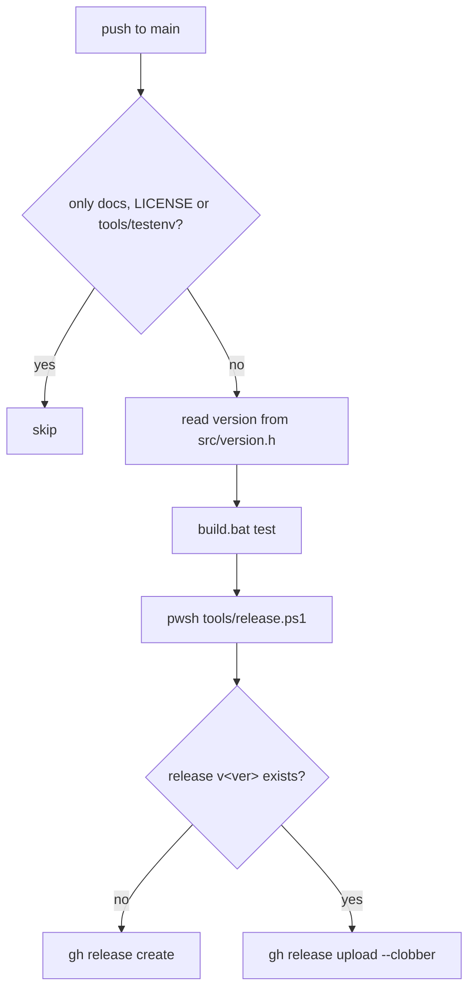

# 11. Build, test, release

Wind builds with one batch script, tests with a desktop-free doctest binary plus a Playwright
suite for the settings UI, and ships an NSIS installer that GitHub Actions rebuilds on every push
to `main`. This chapter covers the build targets, the pure/Win32 test split, the local UIAccess
deploy, the installer's elevation rules and the release workflows.

## build.bat targets

`build.bat` locates MSVC with vswhere, runs `vcvars64.bat` and dispatches on its first argument:

| Target | Output | What it is |
|---|---|---|
| (none) | `Wind.exe` + `WindTray.exe` | The app with the `uiAccess=false` manifest; runs from anywhere |
| `test` | `wind_tests.exe` | The doctest binary over the pure sources; runs it and returns its exit code |
| `check` | – | Compile-only pass over `src\*.cpp` |
| `uiaccess` | `Wind.exe` + `WindTray.exe` | `Wind.uiaccess.manifest` and `/DWIND_UIACCESS`; useful only signed and in Program Files. `WindTray.exe` always keeps the plain manifest |
| `tray` | `WindTray.exe` | The tray helper alone, objects in `src\tray_app\` |
| `config` | `WindConfig.exe` | Builds the Svelte app to `ui/dist/`, then the WebView2 host against `third_party/webview2` |
| `installer` | `dist\Wind-Setup-x64-<ver>.exe` | `makensis /WX installer\wind.nsi`, then `tools\installer_check.ps1` |

The installer treats NSIS warnings as errors: an unreferenced define in generated layout data is
how a page ends up wired to nothing.

## Pure versus Win32

**Anything with real logic compiles without `<windows.h>`.** The magnifier cannot be driven
headlessly, so the unit tests are the only verification loop that runs everywhere, including CI.

- The `test` target compiles `tests\*.cpp` with `/DWIND_TESTS` against only the pure sources. The
  authoritative list is the `:test` target in `build.bat`; today it is `transform`,
  `zoom_controller`, `config`, `profiles`, `cursor_mapper`, `lock_detector`, `cursor_lock`,
  `crosshair`, `config_ui/ini_edit`, `logging`, `tray_items` and `hitch_record`.
- Header-only pure modules (`engine_pick.h`, `drag_follow.h`, `hdr_scale.h`, `keybind_rules.h`,
  `config_ui/wind_watchdog.h` and others) ride in through their test files.
- One test file per module (`tests/test_<module>.cpp`). A new pure `.cpp` also goes into the
  `:test` list.
- Files that straddle the line put their OS half under `#ifndef WIND_TESTS`. `src/config.cpp` is
  the example: `ParseConfig` and `StripUiOnlyKeys` above, `LoadConfig` and the only
  `#include <windows.h>` below.
- `tests/fixtures/keybind_cases.txt` is shared by the C++ and the JavaScript bind rules. The JS half
  is `ui/tests/keybind-rules.nodetest.mjs`, run by `npm run test:rules` in `ui/` (`node --test`, no
  browser) and by CI.

**UI suite.** `ui/tests/` holds 11 Playwright specs, run with `npx playwright test` in `ui/` (the
config starts the Vite server). A fake `window.chrome.webview` answers the host's messages and
records them in `window.__msgs`. When you add a bridge message to `HandleWebMessage`, extend the
mock in the same change. Details in [09](09-settings-ui.md).

**CI** (`.github/workflows/build.yml`, on pull requests and pushes to `main`) builds the app and
runs the doctest suite. It also runs the JS keybind-rule test. The Playwright UI suite is a local gate for UI changes.

## Local UIAccess deploy

UIAccess is needed for the input-transform publish (transform on the desktop), binds over
elevated windows and the opt-in band-16 overlay. Windows grants it only to a binary signed with a
locally trusted certificate and run from a secure location, in practice `C:\Program Files\Wind`.
Without it, Wind reads `TokenUIAccess` at init and Auto keeps the desktop on Render.

`tools/uiaccess_setup.ps1` (elevated) stops Wind, builds `uiaccess` and `config`, creates or reuses
a self-signed "Wind Dev Test Cert", trusts it, signs all three exes (unsigned fresh builds trip a
Defender false positive) and copies them with `ui\dist` to Program Files. It does not deploy an
ini. It logs to `tools\uiaccess_setup.log`; a good deploy ends with `status=Valid` and `DONE`.

- Pass an **absolute** `-File` path: the elevated process starts in System32.
- Launch the deployed copy from a **non-elevated** shell. An elevated launch gives an admin token,
  which changes which `%LOCALAPPDATA%` the app uses.

## The installer

NSIS with a custom-drawn UI (a looping video background with overlay screens). Layout, generators
and local signing are described in `installer/README.md`; the design spec is
[../specs/2026-08-20-installer-design.md](../specs/2026-08-20-installer-design.md). There is no
install-location chooser, because UIAccess is granted only in a secure location.

**Elevation rules** (`installer/app.nsh`):

1. **HKCU and `%LOCALAPPDATA%` belong to the wrong user under elevation.** An elevated process's
   HKCU is the elevated token's, which is an admin's whenever a standard user elevated with other
   credentials. Autostart goes in HKLM `...\CurrentVersion\Run`.
2. **Launch Wind through explorer.exe, not `Exec`.** `Exec` hands Wind the admin token, and
   `ResolveIniPath()` then puts the ini, profiles and logs in the admin's profile.
3. **Stop Wind by asking, not killing.** `WIND_QUIT_RUNNING` sets `Local\Wind_QuitRequest` and waits
   for the process to exit; only a clean exit restores the OS cursor and releases `ClipCursor`. The
   single-instance mutex frees ~3 ms into teardown, long before the process is gone, so the macro
   polls for the process before falling back to `taskkill`.

`tools/installer_check.ps1` checks what a compile cannot: every `File` source exists, every
hit-tested rectangle was generated into `over.nsh`, and a silent install/uninstall round-trips
(needs elevation; skipped from a normal shell, runs in CI).

## Release automation

**Every push to `main` that can change the binary rebuilds and republishes the installer**
(`.github/workflows/release.yml`). v0.1.0 kept serving an old installer after a fix landed, and
that stale build later overwrote a working fix on the dev machine; the rule is therefore
mechanical.

```mermaid
flowchart TD
    P[push to main] --> F{only docs, LICENSE or tools/testenv?}
    F -- yes --> S[skip]
    F -- no --> V[read version from src/version.h]
    V --> T[build.bat test]
    T --> B[pwsh tools/release.ps1]
    B --> R{release v&lt;ver&gt; exists?}
    R -- no --> C[gh release create]
    R -- yes --> U[gh release upload --clobber]
```

- **`src/version.h` is the only version declaration.** Bumping it cuts a new release `v<ver>`; a
  push that leaves it alone refreshes the current release's assets in place with `--clobber`, in
  this repo.
- Each release carries the installer twice: `Wind-Setup-x64-<ver>.exe` and the stable name
  `Wind-Setup-x64.exe`, so `releases/latest/download/Wind-Setup-x64.exe` always serves the newest.
- Release notes come from `.github/release-notes.md`; the workflow fills `__VERSION__`,
  `__SHA256__` and `__COMMIT__`.
- Tests gate the build. A concurrency group serializes runs.
- **Never hand-upload a release asset.** The workflow owns them.

**Signing.** `tools/release.ps1` is the shared build driver for CI and local releases. Signing is
environment-driven: `WIND_SIGN_THUMBPRINT`, or `WIND_SIGN_PFX` plus `WIND_SIGN_PASSWORD`.

- With a certificate it signs the three exes and the installer, signing the payload
  before makensis packs it (UIAccess is granted on `Wind.exe`'s own signature).
- Without one (CI today) it packs both variants: the ordinary build and the UIAccess build as
  `WindUA.exe`. Setup signs `WindUA.exe` on each PC with a per-machine certificate whose private key
  it deletes at once (`installer/local-sign.ps1`); if that fails, setup installs the ordinary build.
- **Never put the self-signed dev certificate in CI**: it is trusted by nobody and looks worse than
  no signature.

**Alpha channel** (`.github/workflows/alpha.yml`, run by hand from Actions). It builds an installer
from any branch and publishes a pre-release `v<version>-alpha.<short-sha>`, which GitHub's Latest
pointer ignores, so the stable download is unaffected. It does not bump `src/version.h` and keeps
the newest 5 alphas. Its build steps mirror `release.yml`; change both together.
