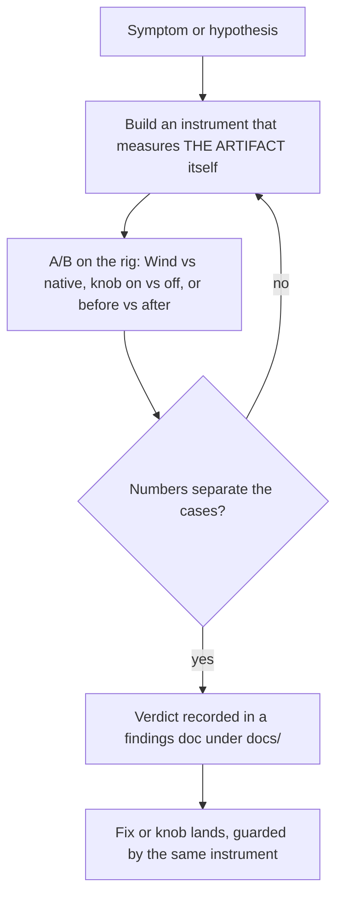
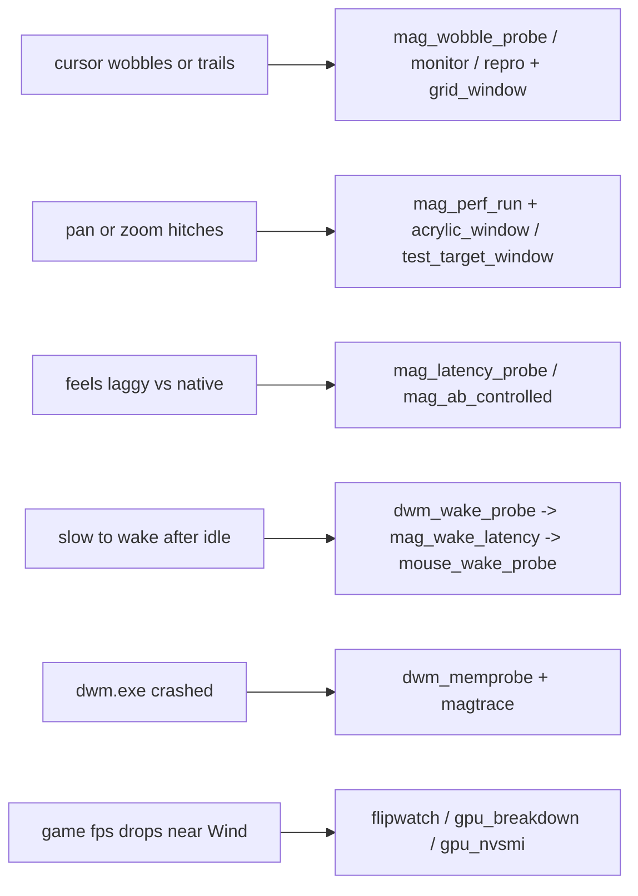

# 12. Instrumentation and field method

Wind's engineering culture is one sentence: measure, never assume. Every major bug in this
codebase, the transform TDRs, the hover dead zones, the cursor wobble, the acrylic zoom-in
freezes, the "magnifier has to wake up" feel, was settled by building an instrument, not by
reasoning about the code. This chapter documents the three layers of that practice: the
always-on logging built into the binaries (`src/logging.*`), the diagnostic knobs compiled into
Wind itself, and the standalone PowerShell harness under `tools/` that drives and measures the
magnifier from outside.

## The field-verdict method

A magnifier cannot be verified headlessly: its output is compositor state on a real display,
its input is a real mouse, and its worst bugs involve DWM, the GPU driver, and other processes.
So the loop that settles a question is always the same, and it always ends with a run on the
rig (4K at 225% DPI, RTX 5090, VRR panel, MPO disabled):

**The field-verdict loop: every hypothesis gets an instrument before it gets a fix.**

Two rules inside that loop have earned their capital letters:

1. **Measure the artifact, not a proxy.** `tools/mag_wobble_probe.ps1` opens with the war
   story: three builds measured write latency and write rate, looked great, and still felt
   wrong, because the wobble is the cursor's deviation from screen center during a pan, not
   either of those numbers. The probe that finally caught it samples pointer position and
   transform offset together and reports the deviation directly.
2. **Verify the experiment engaged.** [HITCH-FINDINGS](../HITCH-FINDINGS.md) calls a dead
   keybind silently faking a clean result "the single biggest source of false positives in
   this work"; every zoom test there checks the `txsession ... maxLevel=` log line before
   trusting the run. Similarly `tools/zen_backdrop.ps1` exists because an "acrylic off" control
   run was once still acrylic, the setting had not taken effect. Verify, then test.

The verdicts live in findings docs (listed at the end of this chapter) so a conclusion is
never re-litigated from memory. The pattern to follow when you hit a new mystery: write the
hypothesis down, write a script under `tools/` that would falsify it, run both arms on the
rig, and commit the numbers.

## The logging system (src/logging.*)

Both binaries log through one small backend in `src/logging.cpp`. The pure half (line
formatting, rotation policy, the system-snapshot renderer) has no `<windows.h>` and is unit
tested; the Win32 half is excluded from the `WIND_TESTS` build.

- **Files.** `wind::LogInit` (src/logging.cpp) resolves the log directory via
  `wind::ResolveLogDir` (src/config_path.h), which is `%LOCALAPPDATA%\Wind\logs\`. Wind.exe
  writes `wind-core.log`, WindConfig.exe writes `wind-config.log`. Files rotate at 1 MiB
  (`kLogMaxBytes`) through three generations (`wind-core.log`, `.1.log`, `.2.log`,
  `kLogGenerations` in src/logging.h). If a second instance cannot open the shared log during
  the brief single-instance-refusal overlap, it falls back to a per-PID file
  (`wind-core-<pid>.log`) so its startup trail is still captured; strays and old crash dumps
  are pruned to `kCrashKeep` at the next `LogInit`.
- **Lines.** `wind::Log(level, category, fmt, ...)` produces
  `2026-05-31T08:14:22.137Z  WARN  render  <msg>` (`FormatLogLine`). It is thread safe,
  flushes on Warn/Error, and must NEVER be called from the per-frame path; the per-second
  aggregators below exist precisely so hot paths log summaries, not events.
- **Startup snapshot.** `LogSystemSnapshot` writes a labelled block: Wind version and build
  flavor (normal/uiaccess), true OS build via `RtlGetVersion`, CPU, RAM, every DXGI adapter
  with driver version, every monitor with resolution/refresh/DPI/rotation, and a full dump of
  the live config as `key=value` lines. When a field log arrives, the environment and settings
  it ran under are in the first screenful.
- **Crash dumps.** `WriteCrashReport` runs inside the `SetUnhandledExceptionFilter` handler:
  it builds paths heap-free from a directory pre-resolved at `LogInit`, writes a minidump
  (`wind-crash-<ts>.dmp`) plus a text summary with the exception code, address, and faulting
  module name (`wind-crash-<ts>.txt`).
- **Export diagnostics.** `ExportDiagnosticsToDesktop` zips the whole log directory to
  `Wind-diagnostics-<ts>.zip` on the Desktop; the tray menu and the settings UI both expose
  it, so "send me your diagnostics" is a one-click ask. `ZipLogDir` stage-copies the files to
  a temp dir first (the live log handles use `FILE_SHARE_READ`, so `CopyFileW` can read them
  while both processes run) and only then runs `Compress-Archive`, so the export never touches
  a live handle.

### The per-second stat lines

The interesting runtime telemetry is aggregated per second and logged only when something is
worth reading, so an idle log stays quiet and a field log points straight at the anomaly:

| category | source | what it says |
|---|---|---|
| `txwrite` | `TransformModel::noteWrite` (src/transform_model.cpp) | transform write count, avg/max ms, writes over 5 ms, failures; emitted only when max > 5 ms or a write failed. A `fails` streak is the classic shared-runtime tell (see the MagInitialize gotcha in [Engines](03-engines.md)). |
| `ixwrite` | `TransformModel::noteIxWrite` | input-transform publish cadence and timing (issue #189), plus `stomps`; same only-when-interesting gate. |
| `cursor` | RunTick in src/main.cpp, behind `diagnostics=1` | `divergence max=..px dragFollowTicks=.. lvl=..`, how far the pointer sat from the lens center at the weld instant. Note the caveat proven in [WOBBLE-CAPTURE-2026-08-21](../WOBBLE-CAPTURE-2026-08-21.md): this samples AT the weld, so it is blind to the between-tick staleness the eye sees; the wobble probes exist because this number can read 0-9 px while the on-screen lag is ~276 px. |
| `lock` | RunTick in src/main.cpp | lock-state edges, not per-tick spam: `detector LOCKED/free`, with a `(warp-anchor)` suffix when the warp tell produced the lock, and `seeded LOCKED at zoom-in ...` when the `warpLock` zoom-in seed fired. These edges are how a field log shows which regime a bad pan ran in. |
| `hybrid` | RunTick | engine-pick decisions per session (`transform session (welded cursor)` etc.). |
| `snapshot` | `LogSystemSnapshot` | the startup block above, one line per event so it never truncates. |

Separately from the unified log, the `diagnostics=1` ini knob also enables the frame-pacing
trace to `%TEMP%\wind_diag.log` (`Config::diagnostics`, src/config.h), a much chattier
per-frame record used for pacing investigations only.

One logging-adjacent piece of instrumentation discipline worth knowing: the hot-reload path
fingerprints the ini through `wind::StripUiOnlyKeys` (src/config.cpp) before deciding whether
the core must react, so UI-only churn (theme, onboarding flags) can never fake a core config
change; a field report of a zoom collapsing on an unrelated Settings save is what forced that
(comment at the `lastCoreIni` seed in src/main.cpp).

## Diagnostics compiled into Wind

These are env vars and ini knobs that ship in the binary, zero-cost when off, and exist so a
field question can be answered without a special build:

- **`WIND_SELFTEST=1`** (src/main.cpp): drives the real integrated render path headlessly and
  dumps `wind_selftest.png`. This is the ONLY way to screenshot the render overlay, it is
  capture-excluded (`WDA_EXCLUDEFROMCAPTURE`), so external screenshots cannot see it.
- **`WIND_PACINGTEST=1`** (src/main.cpp): runs the real present-paced render path at a forced
  cadence; it is how the blt microstutter was proven to be DWM phase mismatch and not our loop.
- **`WIND_NOPARK=1`** (src/render_engine.cpp): disables overlay parking for A/B; parking is
  the fix for the idle overlay demoting fullscreen games off independent flip, and this knob
  reproduces the bad case on demand.
- **`WIND_NOHOOK`**: skips the low-level hook install so the polling fallback path can be
  exercised (src/input_router.cpp / src/main.cpp).
- **`tdrTest`** (ini, hot; `Config::tdrTest`, src/config.h): the issue #148 field harness.
  Nonzero forces the transform engine past the churny-app list; mode 2 probes the |tx| clamp,
  mode 4 disables the MPO pan wall. Modes 1 and 3 are retired. This knob is how the NVIDIA
  16-bit-overflow TDR was bisected on a live game.
- **`probeClicks`** (ini; src/main.cpp RunTick): the dead-zone annotator from the
  pointer-hit-test hunt. Mode 1: each click logs every coordinate space in the chain (pointer,
  weld target, applied DWM transform, `WindowFromPoint` hit-test target); plain click means
  "hover works here", Ctrl+click means "dead here", so the field annotates the map and the
  divergent space names itself. Mode 2 adds a continuous ~36 Hz `ptrace` of the physical
  pre-weld cursor vs the weld target, the stream pointer-framework apps actually perceive.
  See [POINTER-HITTEST-FINDINGS](../POINTER-HITTEST-FINDINGS.md) for the hunt it decided.
- **`lockForce=1`** (ini, hot; `Config::lockForce`): forces the LOCKED pan regime
  (raw-mickey panning) regardless of what `LockDetector` thinks, isolating "is the detector
  wrong" from "is the locked path wrong" in one toggle.
- **`warpLock`** (ini; `Config::warpLock`) gates the issue #221 lock tells for
  pointer-warping mouselook engines, and each tell logs its own edge: the warp-anchor tell
  (`LockDetector::update` warp variant, src/lock_detector.h: a big jump repeatedly LANDING on
  one anchor pixel is lock evidence, field-traced as 58 returns to one pixel at apparent
  13k-80k px/s), and the zoom-in seed (`LockDetector::seedLock`, logged as
  `seeded LOCKED at zoom-in`). The `lockApps` list (`Config::lockApps`) is the no-heuristics
  escape hatch: a listed foreground exe runs LOCKED outright, and the `lock` log shows which
  mechanism engaged. `LockDetector::warpLocked()` exists purely so diagnostics can attribute
  the state.
- **`txMaxStepPct`** (ini; default 25, `Config::txMaxStepPct`; applied in
  `TransformModel`, src/transform_model.cpp): caps the per-tick relative level change the
  transform applies. This default is itself a field verdict: the issue #219 cycle soak
  ([PERF-ACRYLIC-PARITY-2026-08-21](../PERF-ACRYLIC-PARITY-2026-08-21.md)) measured uncapped
  ramps freezing 35-43 ms mid-zoom then snapping 1.2-1.9 levels at once.

## The tools/ harness

Everything in `tools/` is a standalone PowerShell script (plus one vendored binary) that
P/Invokes the same public APIs Wind uses, `MagGetFullscreenTransform` in particular reads the
ONE desktop magnification state whoever wrote it, which is what makes Wind and native
Magnifier directly comparable. A recurring caveat, stated in `mag_wobble_monitor.ps1`:
reading the transform requires `MagInitialize`, so a monitor itself holds a magnification
context and pays the cursor-change tax while it runs.

**Which instrument to reach for, by symptom.**

### The wobble family (issue #206 and after)

- **`mag_wobble_probe.ps1`**: the active measurement. Pans at a known CONSTANT speed
  (deviation scales with speed, so a constant makes runs comparable), samples pointer and
  transform offset together at high rate, and reports how far the cursor strays from screen
  center, the staleness sawtooth that IS the visible wobble. `-Driver wind|native`, and it
  forces both drivers to the SAME level because deviation also scales with level.
- **`mag_wobble_monitor.ps1`**: the passive counterpart. Injects nothing; the user drives
  Wind with the real mouse while it logs one CSV line per second: level, pointer speed,
  cursor-deviation median/p95, `staleMs` (deviation normalized by speed and level, so
  freehand pans become comparable), transform writes per second and how many moved
  BACKWARDS against the pan, sprite-center deviation, the `MagGetInputTransform` state, and
  the foreground process, so the second a session degenerates is visible in the series and
  correlatable with what the user was doing.
- **`mag_wobble_repro.ps1`**: scripted repro arms for the stale-input-transform hypothesis:
  a control run (zoom Wind and pan), `-PoisonWm` (open native Magnifier, zoom it, kill it
  mid-zoom dirty, then run Wind), and `-WmOpen` (native merely running unzoomed alongside).
  It pans with RELATIVE mickeys, an earlier probe's 1 kHz absolute moves fought the weld and
  measured something else, and prints the input-transform state at each stage.
- **`grid_window.ps1`**: a maximized 50 px grid window (heavier line every 250 px). Over a
  solid background there is no reference to see cursor-vs-content motion; the grid makes
  wobble obvious. Title bar kept deliberately so the hybrid pick treats it as desktop.

### Performance and cadence

- **`mag_perf_run.ps1`**: the controlled perf run built for issue #219. Modes: `pan`,
  `ramp` (zoom in/out), `cycle` (the focus-swap repro), `rezoom` (session-start bounce),
  and `zigzag` (Max's protocol: zoom at the bottom, zig-zag climb to the top, zoom out).
  It measures compositor pacing via a `DwmFlush` loop because
  `DwmGetCompositionTimingInfo` fails on this VRR panel (0x88980090 at every struct size),
  plus per-process GPU 3D-engine utilization (via the child sampler), CPU/working set, write
  cadence, and cursor-vs-center deviation. The `native` driver backs up and restores the
  Magnifier registry and expects Wind quit first.
- **`gpu_sampler.ps1`**: `mag_perf_run`'s child; appends `pid,value` GPU-engine counter
  samples so the parent can aggregate per process after the pan.
- **`mag_ab_controlled.ps1`**: Wind vs native against an IDENTICAL solid full-screen target,
  with the environment verified before each run and recorded with the numbers, built after
  A/Bs against "whatever was on screen" (acrylic for one arm, Mica for the other) turned out
  to measure the content, not the magnifier. Reports both latency and cadence.
- **`mag_latency_probe.ps1`**: cursor-move to transform-write latency: inject one absolute
  move, spin-poll the transform at ~4 kHz until the offset changes, randomize rests so
  sampling is not phase-locked. Its header states the honest caveat: this is time-to-write,
  not time-to-photons, but compositing is downstream of both magnifiers equally.
- **`wind_cadence_ab.ps1`**: automated A/B of Wind's write behavior across ini configs: hot
  writes the ini, scripts a whole zoom-and-pan session via injected side buttons, and reports
  the observed cadence plus Wind's own `txwrite` timings from wind-core.log.
- **`wind_drive_probe.ps1`**: the prerequisite probe that proved injected `SendInput`
  XBUTTON2 IS delivered through Raw Input to Wind's zoom binding (level rose above 1.0 while
  held), which is what makes every scripted session above possible.

### The "wake" chain (one report, three instruments, each ruling out a layer)

- **`dwm_wake_probe.ps1`**: samples DWM's real composition cadence via `DwmFlush` returns
  across an idle-then-pan; verdict: the compositor never stalls (median 6.94 ms, zero missed
  frames).
- **`mag_wake_latency.ps1`**: warm vs cold move-to-write through Wind's own path; verdict:
  0.59 ms difference, a tenth of a frame, not the bug.
- **`mouse_wake_probe.ps1`**: the layer the other two CANNOT see, both inject via
  `SendInput`, which enters above the device, so a wireless mouse dropping its report rate
  while idle would be invisible to them and would look exactly like the report (coarse first
  steps, multiplied by the zoom).

### DWM, flip state, and GPU

- **`dwm_memprobe.ps1`**: detached watcher for the dwmcore `STATUS_FATAL_MEMORY_EXHAUSTION`
  crash (0xc00001ad): samples DWM's memory from outside, survives the compositor dying,
  records the respawn moment, and plays an alarm. It measured DWM's VRAM doubling to
  ~5.27 GB inside ~145 ms during a zoom ramp over acrylic.
- **`magtrace.ps1`**: records what the ACTIVE magnifier is writing, level, offsets, cadence,
  since there is exactly one desktop magnification state; point it at native, then at Wind,
  and diff. This is how native's ~64 writes/s coarse stepping was established.
- **`flipwatch.ps1`**: PresentMon-based presentation-mode recorder (Hardware Independent
  Flip vs Composed: Flip) for the transform-model stickiness question: does a magnification
  session demote a game's swapchain, and does the demotion outlive the context. Uses the
  vendored **`PresentMon.exe`**.
- **`gpu_breakdown.ps1`**: per-process GPU counters for Wind (redraw) vs dwm.exe (overlay
  composite), at 1x vs zoomed-and-panning, isolating blt's cost from background noise.
- **`flip_breakdown.ps1`**: sets `flipPresent=1`, relaunches Wind, and reruns the breakdown,
  the A/B for whether flip present removes the DWM overlay-composite cost.
- **`gpu_nvsmi.ps1`**: whole-GPU utilization via nvidia-smi (matches the on-screen overlay)
  for idle / zoomed-still / zoomed-panning.

### Reverse-engineering native Magnifier (issue #205)

- **`mag_formula_probe.ps1`**: derives native's offset formula EMPIRICALLY, drive the real
  Magnifier, move the cursor to a grid of known points, read back what it wrote, fit the
  formula, because the remembered disassembly note it replaced was "a claim, not a
  measurement, and building on it unverified is how the last three days went".
- **`mag_trackmode_probe.ps1`**: distinguishes native's centered vs within-edges tracking
  modes with SMALL steps inside the view (the grid probe's big jumps forced a recenter in
  both modes and could not tell them apart).

### Visual test targets and controls

- **`acrylic_window.ps1`**: a borderless screen-covering window with a real DWM acrylic
  backdrop, the expensive-geometry case for magnified compositing, so "zoom over acrylic"
  tests do not depend on which app happens to be themed that way.
- **`test_target_window.ps1`**: the deliberately boring control: solid color, backdrop
  explicitly set to none (not left at "auto"), so an A/B measures the magnifier and not the
  content.
- **`zen_backdrop.ps1`**: reads `DWMWA_SYSTEMBACKDROP_TYPE` for a process's windows to verify
  a control's backdrop state before trusting the run; its header is careful about what the
  attribute proves (`none` is solid proof of off; `ACRYLIC` alone is not proof DWM is doing
  the blur work).

### Build and deploy scripts (not instruments, listed for completeness)

- **`uiaccess_setup.ps1`**: elevated build+sign+deploy of the UIAccess pair to Program Files;
  logs to `tools/uiaccess_setup.log`.
- **`installer_check.ps1`**: post-build sanity checks on the NSIS installer.
- **`release.ps1`**: builds the release installer artifact into `dist/`.
- **`make_icon.mjs`**: generates the app icon assets.

## The findings docs

Each doc under `docs/` is a closed (or explicitly open) verdict. Read the doc before
re-opening its question; the conclusions below are the load-bearing part, the docs hold the
evidence.

| doc | what it settled |
|---|---|
| [HITCH-FINDINGS](../HITCH-FINDINGS.md) | Issue #148 hitching: a LIVE magnification context taxes every cursor visibility/shape change any app makes (13-24 spike frames per 14 wheel-clicks with Wind merely idle, 0 without a context); writing level 1.0 does not leave the mode, only releasing the runtime does. Also the weld/rounding/MPO TDR bisect. |
| [POINTER-HITTEST-FINDINGS](../POINTER-HITTEST-FINDINGS.md) | The transform-desktop hover dead zones: pointer-input frameworks consume `MagSetInputTransform` for MOUSE hit-testing (MSDN's pen/touch scoping is wrong); publishing the source-rect input transform per change fixes hover at every level, and requires UIAccess. Includes the wrong intermediate verdict, kept on purpose. |
| [WOBBLE-CAPTURE-2026-08-21](../WOBBLE-CAPTURE-2026-08-21.md) | Live capture of the degenerate wobble state: a constant-velocity sprite lag of ~276 screen px (~36 ms at 900 px/s), constant during the pan and collapsing at rest, exactly the reported "inertia" feel; and proof that Wind's own `cursor divergence` line is blind to it because it samples at the weld instant. |
| [PERF-ACRYLIC-PARITY-2026-08-21](../PERF-ACRYLIC-PARITY-2026-08-21.md) | Issue #219: steady-state Wind vs native over acrylic is IDENTICAL; the real artifact is sporadic DWM-internal 35-46 ms ramp freezes caught only by a 20-cycle soak, native's tail is worse but its coarse ease masks it. Produced the `txMaxStepPct` cap. |
| [PERFORMANCE-FINDINGS](../PERFORMANCE-FINDINGS.md) | Historical (marked SUPERSEDED for the desktop case): the Magnification-API ceiling analysis and the PresentMon methodology; its "own renderer won't help" conclusion was later proven wrong by shipping one. |
| [PERFORMANCE-AUDIT-2026-05-26](../PERFORMANCE-AUDIT-2026-05-26.md) / [THREADING](../PERFORMANCE-AUDIT-THREADING-2026-05-26.md) | Early loop and threading audits of the tick pipeline. |
| [KNOWN-ISSUES](../KNOWN-ISSUES.md) | The living list of accepted limitations and open anomalies. |
| [VERIFICATION](../VERIFICATION.md) | How to verify a build hands-on (what to click, what to look for). |

Deeper war-story records live in the specs directory (`docs/superpowers/specs/`), and the
scratchpad-era harnesses referenced by HITCH-FINDINGS (`bench.ps1`, `cursorwatch.exe`,
`rtssread.exe`, `maglab.exe`) were deliberately not vendored; `tools/` holds only the
instruments worth keeping.

## Pointers

- `src/logging.h` / `src/logging.cpp`, the logging backend, rotation, snapshot, crash dumps,
  diagnostics export
- `src/transform_model.cpp`, `noteWrite` / `noteIxWrite` (the `txwrite` / `ixwrite` lines)
- `src/main.cpp` RunTick, the `cursor`, `lock`, `hybrid`, and `ptrace` log sites;
  `WIND_SELFTEST` / `WIND_PACINGTEST` entry points
- `src/lock_detector.h`, the lock tells the `lock` lines attribute
- `src/config.h`, every diagnostic knob (`diagnostics`, `tdrTest`, `probeClicks`,
  `lockForce`, `warpLock`, `lockApps`, `txMaxStepPct`)
- `tools/`, the harness inventory above
- Related chapters: [Engines](03-engines.md) for the mechanisms these instruments measure
