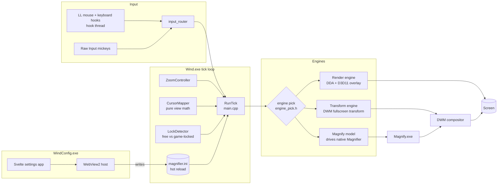

# Wind Architecture

The developer book for Wind, a lightweight standalone fullscreen magnifier for Windows. These
chapters are the canonical description of how Wind works, end to end: read them in order for a
guided tour, or jump straight to the subsystem you are touching. Historical design specs and
field investigations are linked from each chapter as evidence; when this book and an old spec
disagree, the book (and above it, the code) wins.

Current as of v0.2.0.

## The system at a glance

**One paced tick loop drives two processes worth of machinery: input flows in through hooks and
Raw Input, a pure mapper turns it into a view, and one of four engines puts that view on screen.**

## Chapters

| # | Chapter | One line |
|---|---------|----------|
| 01 | [Overview](01-overview.md) | What Wind is, its product rules, the two binaries, the repo map |
| 02 | [The tick loop](02-tick-loop.md) | RunTick's phases, pacing, and config hot-reload |
| 03 | [Engines and the hybrid pick](03-engines.md) | The four engines and the pure predicate that chooses between them |
| 04 | [The render engine](04-render-engine.md) | Own capture + GPU scale, and the compositor rules learned the hard way |
| 05 | [The transform engine](05-transform-engine.md) | Magnifying inside DWM: channels, cadence, MPO, the input transform |
| 06 | [The input pipeline](06-input.md) | Hooks, Raw Input, key swallowing and its limits |
| 07 | [The cursor system](07-cursor.md) | Free cursor, the weld, the sprite, lock detection, Inspect mode |
| 08 | [Config and profiles](08-config-profiles.md) | The ini as the single source of truth, and profiles on top |
| 09 | [The settings UI](09-settings-ui.md) | The WebView2 host, the schema-driven Svelte app, the bridge |
| 10 | [The magnify model](10-magnify-model.md) | Driving the native Magnifier, and the measured dead ends |
| 11 | [Build, test, release](11-build-test-release.md) | build.bat, the pure-test split, signing, the release pipeline |
| 12 | [Instrumentation and field method](12-instrumentation.md) | The measurement harnesses and the measure-don't-assume culture |

## How this book relates to the other docs

- **`CLAUDE.md`** (repo root) is the compressed working-notes version of the same knowledge,
  optimized for density. This book is the readable version, optimized for understanding.
- **`docs/superpowers/specs/`** hold the original design documents per feature. They are
  historical: amendments live in the code and here.
- **`docs/*.md` findings files** (WOBBLE-CAPTURE, POINTER-HITTEST-FINDINGS, HITCH-FINDINGS,
  PERF-ACRYLIC-PARITY, ...) are field investigations: the raw evidence behind conclusions this
  book states in one sentence.
