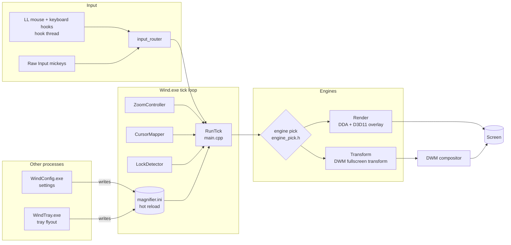

# Wind architecture

Developer documentation for Wind. The code is authoritative; specs and findings files are history.

## The system at a glance

One paced tick loop in `Wind.exe` reads input from hooks and Raw Input, turns it into a view with
pure mapper logic, and hands the view to one of two engines. Auto picks the engine per session.

```mermaid
flowchart LR
  subgraph input [Input]
    HK[LL mouse + keyboard hooks\nhook thread] --> IR[input_router]
    RI[Raw Input mickeys] --> IR
  end
  subgraph core [Wind.exe tick loop]
    IR --> RT[RunTick\nmain.cpp]
    ZC[ZoomController] --> RT
    CM[CursorMapper] --> RT
    LD[LockDetector] --> RT
    CFG[(magnifier.ini\nhot reload)] --> RT
  end
  subgraph engines [Engines]
    RT --> PICK{engine pick\nengine_pick.h}
    PICK --> REN[Render\nDDA + D3D11 overlay]
    PICK --> TX[Transform\nDWM fullscreen transform]
  end
  subgraph apps [Other processes]
    SV[WindConfig.exe\nsettings] -->|writes| CFG
    TR[WindTray.exe\ntray flyout] -->|writes| CFG
  end
  REN --> SCREEN[(Screen)]
  TX --> DWM[DWM compositor] --> SCREEN
```

There are three engines (Auto, Render, Transform); Auto is the default and switches between the
other two.

## Chapters

| # | Chapter | Covers |
|---|---------|--------|
| 01 | [Overview](01-overview.md) | Product rules, the three binaries, the pure/Win32 split, source map |
| 02 | [The tick loop](02-tick-loop.md) | `RunTick` phases, pacing, idle sleep, config hot-reload, threads |
| 03 | [Engines and the hybrid pick](03-engines.md) | The engine interface, the pick, handover, why Wind does not drive the built-in Magnifier |
| 04 | [The render engine](04-render-engine.md) | Capture, overlay, reveal gating, HDR, colour filters |
| 05 | [The transform engine](05-transform-engine.md) | The Magnification runtime, write channels and cadence, MPO, the input transform |
| 06 | [The input pipeline](06-input.md) | Hooks, swallowing, bind rules, safety nets, Raw Input limits |
| 07 | [The cursor system](07-cursor.md) | Mapper, weld, native cursor, lock detection, Inspect, tracking, keyboard panning |
| 08 | [Config and profiles](08-config-profiles.md) | The ini as IPC, parsing, hot vs restart, profiles, key reference |
| 09 | [The settings UI](09-settings-ui.md) | WebView2 host, bridge, schema, session model, themes, tests |
| 11 | [Build, test, release](11-build-test-release.md) | `build.bat`, the test split, deploy, installer, release and alpha workflows |
| 12 | [Instrumentation](12-instrumentation.md) | Logging, diagnostic knobs, measurement scripts |

`CLAUDE.md` at the repo root holds the rules for coding agents and points here.

## Docs index

| File | What it is | State |
|---|---|---|
| [../VERIFICATION.md](../VERIFICATION.md) | Hands-on release checklist | Live |
| [../HITCH-FINDINGS.md](../HITCH-FINDINGS.md) | Transform hitching: the live-context tax, the pan-start hitch, vetted configs, zoom response | Open (#310) |
| [../NATIVE-MAGNIFIER-STOMP.md](../NATIVE-MAGNIFIER-STOMP.md) | A running built-in Magnifier fights the transform engine; the stomp guard | Closed, follow-up parked |
| [../POINTER-HITTEST-FINDINGS.md](../POINTER-HITTEST-FINDINGS.md) | Hover dead zones on the transform desktop; the source-rect input transform | Closed |
| [../PERF-ACRYLIC-PARITY-2026-08-21.md](../PERF-ACRYLIC-PARITY-2026-08-21.md) | Zoom-in stalls over acrylic; the `txMaxStepPct` cap | Closed |
| [../TRACKING-FINDINGS.md](../TRACKING-FINDINGS.md) | Caret, focus and edge tracking per app | Live |
| [../SHELL-PANEL-CURSOR-FINDINGS.md](../SHELL-PANEL-CURSOR-FINDINGS.md) | The cursor over the emoji picker and other shell panels | Closed |
| [../COLOUR-FILTER-FINDINGS.md](../COLOUR-FILTER-FINDINGS.md) | Warmth and brightness: mechanism, HDR maths, rejected filters | Live |
| [../specs/](../specs/) | Original design specs of shipped features | History |
| `../../tools/testenv/README.md` | The automated proving ground | Live |
| `../../installer/README.md` | The installer layout and build | Live |

Plans and open work are tracked in GitHub issues.
